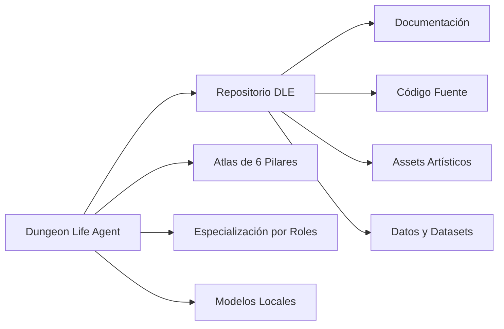

# 🎭 Concepto y Visión del Dungeon Life Agent

## 🌟 Visión General

El **Dungeon Life Agent** representa una evolución fundamental en cómo los equipos de desarrollo interactúan con sus ecosistemas de conocimiento. Más que una herramienta tradicional, es un **compañero de equipo especializado** que vive dentro del repositorio y entiende profundamente tanto la estructura técnica como la filosofía del proyecto Dungeon Life.

## 🎯 ¿Qué Problema Resuelve?

### El Desafío Actual del Ecosistema DLE

El proyecto Dungeon Life ha alcanzado una complejidad tal que ningún miembro individual del equipo puede mantener un conocimiento completo de:

- **6 Pilares del Atlas**: Cada uno con su propia lógica y convenciones
- **Especialización por Roles**: Cinco tipos diferentes de colaboradores con necesidades únicas
- **Estructura Material Compleja**: Desde documentación hasta assets de producción
- **Integración Multi-Tecnología**: Python, Unreal Engine, Blender, React, bases de datos

### La Solución: Agente Especializado

El Dungeon Life Agent resuelve esta complejidad mediante:

1. **Comprensión Profunda**: Entiende el Atlas como un miembro nativo del equipo
2. **Adaptación Automática**: Se especializa según el rol del usuario
3. **Navegación Experta**: Opera fluidamente entre documentación, código y assets
4. **Operación Segura**: Mantiene integridad del ecosistema con trazabilidad completa

## 🏗️ Concepto Fundamental

### El Agente "Vive" Dentro del Repositorio



**Características del Concepto:**

- **🤖 Ubicación Física**: `A:\07_Tools\DungeonLifeAgent\` como miembro del ecosistema
- **🧠 Conocimiento Nativo**: Comprensión profunda del Atlas como lenguaje materno
- **👥 Adaptación Social**: Se especializa automáticamente según el rol del colaborador
- **🔒 Seguridad Integrada**: Opera dentro de los límites seguros del ecosistema

### Integración con Especialización DLE

Siguiendo la filosofía establecida en el README principal del proyecto, el agente reconoce automáticamente:

#### 🎭 Guionistas y Diseñadores Narrativos
- **Centro de Operaciones**: `02_Entidades/` y narrativa
- **Modo de Pensar**: Creativo, centrado en personajes y relaciones
- **Respuestas Adaptadas**: Ejemplos narrativos, sugerencias creativas

#### 💻 Desarrolladores Backend e Ingenieros de IA
- **Dominio Principal**: `03_Data/` y `01_SourceCode/`
- **Modo de Pensar**: Técnico, estructural, basado en datos
- **Respuestas Adaptadas**: Código, configuraciones, especificaciones técnicas

#### 🎮 Desarrolladores Unreal Engine
- **Integración**: `05_Builds/` y motor de juego
- **Modo de Pensar**: Técnico-artístico, enfocado en implementación
- **Respuestas Adaptadas**: Assets, Blueprints, DataTables, optimización

#### ⚙️ Diseñadores de Juego y Sistemas
- **Hogar**: `04_Game_Design/` y mecánicas
- **Modo de Pensar**: Analítico, balanceado, sistémico
- **Respuestas Adaptadas**: Comparaciones, métricas, propuestas de balance

#### 📋 Productores y Líderes de Proyecto
- **Carpetas Clave**: `06_ProjectManagement/` y roadmap
- **Modo de Pensar**: Estratégico, coordinador, resultado-orientado
- **Respuestas Adaptadas**: Reportes, dependencias, planificación

## 🎪 Características Únicas

### 🔗 Integración Total con Atlas del Proyecto

El agente no solo lee el Atlas - lo **comprende como estructura cognitiva**:

```yaml
atlas_understanding:
  jerarquia_autoridad:
    pilar_000: "principios > taxonomías > arquitectura > plantillas"
    pilar_100: "mecanismos_tecnicos > especificaciones > implementacion"
    pilar_200: "indice_atomico > tipos > relaciones > propiedades"
    pilar_300: "nomenclatura_base > patrones > validacion"
    pilar_400: "narrativa_base > craft_integration > generacion"
    pilar_500: "fes_base > entidades > semantica > aplicacion"

  navegacion_cognitiva:
    flujo_abstracto_concreto: "filosofia → fundamentos → medios → construccion → herramientas → refinamiento"
    metodologia_indice_atomico: "hub_principal → documentos_spoke → enlaces_explicitos"
    principios_ssot: "fuente_unica_verdad → referencias → atomicidad"
```

### 🧠 Modelos Locales Completamente Offline

**Por Qué Modelos Locales:**
- **🔒 Privacidad Total**: Todo el conocimiento del proyecto permanece local
- **⚡ Velocidad Máxima**: Sin latencia de servicios externos
- **🎯 Especialización**: Modelos fine-tuneados específicamente para DLE
- **💰 Costo Cero**: Sin dependencias de APIs pagas

**Arquitectura de Modelos:**
```yaml
model_architecture:
  primary_model:
    name: "llama-3-8b-dle-specialized-q4.gguf"
    context_window: 8192
    specialization: "atlas_navigation + role_adaptation"
    training_data: "corpus_completo_dle + interacciones_equipo"

  embeddings_model:
    name: "all-minilm-l6-v2-dle-tuned-q4.gguf"
    dimension: 384
    specialization: "semantic_search + entity_resolution"
    training_data: "taxonomia_dle + relaciones_entidades"

  multimodal_model:
    name: "llava-7b-dle-assets-q4.gguf"
    capabilities: "asset_analysis + structure_recognition"
    specialization: "blender_unreal_react_analysis"
```

### 🎭 Tres Modos Operativos Especializados

#### **MODO 1: Consultor (Por Defecto)**
**Estado**: Solo lectura, máximo conocimiento
- ✅ Navegación experta del Atlas de 6 Pilares
- ✅ Búsqueda semántica usando vectores DMTE
- ✅ Resolución de entidades FES complejas
- ✅ Consulta de documentación técnica profunda
- ✅ Navegación de estructura material completa

#### **MODO 2: Asistente Taxonómico**
**Estado**: Sugerencias y análisis, sin modificaciones
- ✅ Análisis de estructura usando taxonomía propia
- ✅ Sugerencias basadas en `Repository_Taxonomy.yaml`
- ✅ Validación de compliance con Atlas
- ✅ Organización automática de assets
- ✅ Detección de inconsistencias estructurales

#### **MODO 3: Colaborador Activo**
**Estado**: Modificaciones controladas con validación
- ✅ Modificaciones controladas con confirmación estricta
- ✅ Creación de documentación usando plantillas
- ✅ Operaciones seguras sobre archivos materiales
- ✅ Integración con herramientas de desarrollo
- ✅ Generación automática de reportes

## 🌟 Filosofía de Diseño

### Extensión Natural del Equipo DLE

El agente está diseñado como **extensión natural del flujo de trabajo** establecido en el README principal del proyecto:

```yaml
filosofia_diseno:
  respeto_especializacion:
    principio: "Cada rol tiene su forma única de trabajar"
    implementacion: "El agente adapta su comportamiento al detectar el rol"
    beneficio: "Se siente como un compañero que entiende tu perspectiva"

  integracion_ecosistema:
    principio: "El agente es parte del ecosistema, no externo a él"
    implementacion: "Vive en A:\07_Tools\ como miembro del equipo"
    beneficio: "Acceso completo y comprensión nativa del proyecto"

  amplificacion_capacidades:
    principio: "No reemplaza - amplifica las capacidades existentes"
    implementacion: "Automatiza tareas repetitivas, acelera consultas complejas"
    beneficio: "El equipo se enfoca en creación, agente maneja complejidad"
```

### Diseño Centrado en el Usuario Especializado

**Para Guionistas:**
```yaml
guionista_centered:
  consultas_tipicas: ["personajes", "relaciones", "arcos_narrativos"]
  respuestas_esperadas: ["ejemplos_narrativos", "sugerencias_creativas"]
  flujo_trabajo: ["inspiracion → creacion → validacion → integracion"]
```

**Para Desarrolladores:**
```yaml
desarrollador_centered:
  consultas_tipicas: ["sistemas", "codigo", "bases_datos", "apis"]
  respuestas_esperadas: ["especificaciones_tecnicas", "ejemplos_codigo"]
  flujo_trabajo: ["analisis → implementacion → testing → despliegue"]
```

**Para Diseñadores:**
```yaml
disenador_centered:
  consultas_tipicas: ["mecanicas", "balance", "progresion", "sistemas"]
  respuestas_esperadas: ["comparaciones", "metricas", "propuestas_balance"]
  flujo_trabajo: ["concepto → prototipo → balance → integracion"]
```

**Para Conceptualistas:**

```yaml
conceptualista_centered:
  consultas_tipicas: ["vision del producto", "pilares de diseño", "referencias", "core loop"]
  respuestas_esperadas: ["resumenes de alto nivel", "analisis de mercado", "documentos de concepto"]
  flujo_trabajo: ["investigacion → ideacion → pitching → documentacion → supervision"]
```

**Para Productores y Project Managers:**

```yaml
productor_pm_centered:
  consultas_tipicas: ["roadmap", "dependencias", "estado de tareas", "riesgos", "planificacion"]
  respuestas_esperadas: ["reportes de progreso", "diagramas de Gantt", "alertas de bloqueo"]
  flujo_trabajo: ["planificacion → ejecucion → seguimiento → reporte → entrega"]
```

**Para Directores:**

```yaml
director_centered:
  consultas_tipicas: ["alineacion con la vision", "revision de calidad", "decisiones clave", "estado general del proyecto"]
  respuestas_esperadas: ["direccion estrategica", "feedback critico", "aprobaciones finales (sign-off)"]
  flujo_trabajo: ["definir vision → alinear equipo → revisar y dar feedback → tomar decisiones"]
```
**Para el Guardián del Concepto (Willow):**

```yaml
guardian_concepto_centered:
  consultas_tipicas: ["consistencia conceptual", "alineacion con el Atlas", "integridad de la vision", "prevencion de 'scope creep'"]
  respuestas_esperadas: ["analisis de coherencia", "reportes de desviacion conceptual", "validacion contra pilares fundacionales"]
  flujo_trabajo: ["supervision continua → validacion filosofica → correccion de rumbo → preservacion de la integridad"]
```
## 🚀 Objetivos a Largo Plazo

### Evolución hacia Agente Autónomo

#### Fase 1.1.0: Especialización Avanzada por Sub-Roles
- **Objetivo**: Detectar automáticamente sub-especializaciones dentro de cada rol
- **Ejemplo**: Distinguir entre "Guionista de Personajes" vs "Guionista de Misiones"
- **Beneficio**: Respuestas aún más precisas y contextualizadas

#### Fase 1.2.0: Integración con Herramientas Externas
- **Objetivo**: Conexión vía MCP (Model Context Protocol) con herramientas especializadas
- **Ejemplo**: Integración directa con Blender para automatización de tareas

**Específicamente para Blender:**
```yaml
mcp_blender_integration:
  objetivo: "Automatización de procesos de optimización y validación 3D"

  capacidades_planeadas:
    scripts_optimizaion:
      - "Chequeo automático de polycount según estándares del proyecto"
      - "Validación de materiales y texturas para Unreal compatibility"
      - "Conteo y validación de animaciones requeridas"
      - "Verificación de estructura de huesos y rigs"

    estandarizacion_automatica:
      - "Aplicación automática de naming conventions del pilar 300"
      - "Validación de export settings para diferentes targets (Unreal, Unity)"
      - "Chequeo de LODs (Levels of Detail) según especificaciones técnicas"
      - "Validación de materiales PBR según estándares del proyecto"

    integracion_pipeline:
      - "Detección automática de archivos .blend modificados"
      - "Ejecución automática de scripts de validación al guardar"
      - "Generación de reportes de calidad con recomendaciones específicas"
      - "Integración con sistema de versiones para trazabilidad de cambios"

  beneficios_esperados:
    calidad_consistente: "Todos los assets 3D siguen estándares técnicos automáticamente"
    tiempo_ahorrado: "Los artistas se enfocan en creación, no en validación técnica"
    deteccion_temprana: "Errores técnicos detectados antes de llegar a Unreal"
    trazabilidad_completa: "Cada asset tiene historial completo de validaciones"
```

#### Fase 2.0.0: Comunidad de Agentes Especializados

**Visión Final:**
```yaml
agente_autonomo_vision:
  agentes_especializados:
    agente_narrativo:
      especialidad: "Creación y desarrollo de entidades narrativas"
      integracion: "Colabora automáticamente con guionistas"

    agente_tecnico:
      especialidad: "Optimización y validación técnica de código"
      integracion: "Opera automáticamente en pipelines de desarrollo"

    agente_assets:
      especialidad: "Gestión y optimización de assets artísticos"
      integracion: "Mantiene calidad automática de producción artística"

    agente_sistemas:
      especialidad: "Balance y diseño de sistemas de juego"
      integracion: "Colabora en tiempo real con diseñadores"

  interaccion_agentes:
    colaboracion_autonoma: "Los agentes especializados colaboran entre sí"
    supervision_humana: "El equipo mantiene control final y dirección creativa"
    aprendizaje_continuo: "Los agentes mejoran basados en feedback del equipo"
```

### Métricas de Éxito a Largo Plazo

#### Métricas de Adopción
- **Uso Diario**: >90% del equipo usa el agente diariamente
- **Dependencia Saludable**: 60-70% de consultas complejas vía agente
- **Satisfacción**: >4.8/5 en todas las especializaciones

#### Métricas de Performance
- **Precisión de Respuestas**: >95% de respuestas útiles por especialización
- **Velocidad de Resolución**: <3 segundos para consultas típicas
- **Tiempo de Aprendizaje**: <1 hora para nuevo miembro del equipo

#### Métricas de Impacto
- **Productividad del Equipo**: +40% en velocidad de desarrollo
- **Calidad del Proyecto**: -60% en errores de integración entre roles
- **Consistencia del Ecosistema**: 100% compliance automático con Atlas

## 🌟 Filosofía Final

El Dungeon Life Agent representa una nueva forma de colaboración humano-IA dentro de ecosistemas complejos de desarrollo. No es solo tecnología - es una **evolución en cómo los equipos especializados trabajan juntos**, donde cada miembro mantiene su expertise único mientras el agente proporciona el puente cognitivo que conecta todas las especializaciones dentro del marco del Atlas del proyecto.

**El agente no es el futuro del trabajo - es el presente evolucionado del trabajo especializado en equipo.**

---

## 📋 Información de Versión

**Versión:** 1.0.0 - Fundación Conceptual
**Fecha:** 2025-10-07
**Estado:** Activo y Evolucionando
**Compatibilidad:** Total con Ecosistema DLE v3.1

**Características Implementadas:**
- ✅ Concepto de agente vivo dentro del repositorio
- ✅ Integración con especialización por roles DLE
- ✅ Comprensión profunda del Atlas de 6 pilares
- ✅ Visión de modelos locales especializados
- ✅ Filosofía de extensión natural del equipo

**Próximos Pasos Conceptuales:**
1. Desarrollo de prototipo funcional básico
2. Integración inicial con herramientas MCP (Blender)
3. Expansión hacia comunidad de agentes especializados
4. Evolución continua basada en feedback del equipo

---

*El Dungeon Life Agent no es solo un concepto - es la materialización de cómo la IA puede amplificar la creatividad y experiencia especializada del equipo DLE.*