# ⚙️ Arquitectura Técnica del Dungeon Life Agent

## 🏗️ Arquitectura General

```mermaid
graph TB
    A[Dungeon Life Agent] --> B[Core Engine]
    A --> C[Knowledge Layer]
    A --> D[Tool Integration]
    A --> E[Mode Manager]
    A --> F[Asset Pipeline Navigator]
    A --> G[Dataset Analysis Agent]

    B --> H[llama.cpp Integration]
    B --> I[Context Manager]
    B --> J[Response Generator]
    B --> K[Multi-Modal Processor]

    C --> L[Atlas Navigator]
    C --> M[Taxonomy Engine]
    C --> N[Entity Resolver]
    C --> O[Documentation Indexer]
    C --> P[Asset Indexer]

    D --> Q[File System Tools]
    D --> R[Git Integration]
    D --> S[Shell Commands]
    D --> T[Validation Tools]
    D --> U[Build Tools]

    E --> V[Mode 1: Consultor]
    E --> W[Mode 2: Taxonómico]
    E --> X[Mode 3: Colaborador]

    F --> Y[Blender Pipeline]
    F --> Z[Unreal Integration]
    F --> AA[React/TypeScript]
    F --> BB[Python Backend]
    F --> CC[Data Pipeline]

    G --> DD[DLS Dataset Access]
    G --> EE[Training Data Analysis]
    G --> FF[Interactive Query Engine]
    G --> GG[Pattern Recognition]
```



## 🧠 Componentes Core del Agente

### Core Engine - Motor Central
**Responsabilidades:**
- ✅ Integración completa con llama.cpp para modelos GGUF
- ✅ Gestión avanzada de contexto (8192 tokens)
- ✅ Generación inteligente de respuestas adaptadas por rol
- ✅ Procesamiento multi-modal de diferentes tipos de contenido

**Arquitectura Interna:**
```python
class CoreEngine:
    def __init__(self):
        self.llama_integration = LlamaCppInterface()
        self.context_manager = ContextManager(max_tokens=8192)
        self.response_generator = AdaptiveResponseGenerator()
        self.multimodal_processor = MultiModalProcessor()

    async def process_query(self, query, user_role, context):
        # 1. Análisis del rol del usuario
        role_context = await self.analyze_user_role(user_role)

        # 2. Gestión de contexto especializado
        enriched_context = await self.context_manager.enrich_context(
            query, role_context, context
        )

        # 3. Generación de respuesta adaptada
        response = await self.response_generator.generate_response(
            query, enriched_context, role_context
        )

        return response
```

### Knowledge Layer - Capa de Conocimiento Especializada
**Componentes Especializados:**

#### Atlas Navigator
- **Función**: Navegación experta del sistema de 6 pilares
- **Capacidades**:
  - Comprensión de jerarquía: 000 → 100 → 200 → 300 → 400 → 500
  - Navegación por flujo cognitivo: Abstracto → Concreto
  - Aplicación de principios SSoT (Fuente Única de Verdad)

#### Taxonomy Engine
- **Función**: Motor avanzado de clasificación semántica
- **Sistemas Integrados**:
  - **DMTE**: Vectores semánticos para búsqueda inteligente
  - **FES**: Resolución de entidades semánticas
  - **IRON**: Sistema de control narrativo integrado

#### Entity Resolver
- **Función**: Resolución avanzada de entidades del ecosistema
- **Capacidades**:
  - Mapeo automático entre diferentes representaciones de entidades
  - Resolución de conflictos de nomenclatura
  - Mantenimiento de consistencia entre pilares

#### Documentation Indexer
- **Función**: Indexación completa de toda la documentación
- **Procesamiento**:
  - Extracción automática de metadatos YAML frontmatter
  - Creación de índices semánticos por pilar
  - Mantenimiento de referencias cruzadas

#### Asset Indexer
- **Función**: Indexación especializada de estructura material
- **Tipos de Assets**:
  - **3D Assets**: .blend, .ztl, .spp, .fbx
  - **2D Assets**: .png, .jpg, .psd, .svg
  - **Code Assets**: .py, .js, .ts, .cpp, .h
  - **Data Assets**: .jsonl, .csv, .yaml

### Tool Integration - Herramientas de Integración
**Herramientas Core:**

#### File System Tools
```python
class FileSystemTools:
    async def analyze_file_structure(self, path):
        """Análisis completo de estructura de archivos"""
        structure = await self.scan_directory(path)
        metadata = await self.extract_metadata(structure)
        relationships = await self.analyze_relationships(metadata)
        return {
            "structure": structure,
            "metadata": metadata,
            "relationships": relationships,
            "atlas_compliance": await self.validate_atlas_compliance(structure)
        }
```

#### Git Integration
```python
class GitIntegration:
    async def analyze_repository_state(self):
        """Análisis completo del estado del repositorio"""
        return {
            "current_branch": await self.get_current_branch(),
            "staged_changes": await self.get_staged_changes(),
            "untracked_files": await self.get_untracked_files(),
            "commit_history": await self.get_recent_commits(),
            "branch_relationships": await self.analyze_branches()
        }
```

#### Validation Tools
```python
class ValidationTools:
    async def validate_atlas_compliance(self, content, pillar):
        """Validación contra esquemas del Atlas"""
        schema = await self.load_pillar_schema(pillar)
        compliance = await self.validate_schema(content, schema)
        suggestions = await self.generate_compliance_suggestions(compliance)
        return {
            "is_compliant": compliance["valid"],
            "violations": compliance["errors"],
            "suggestions": suggestions,
            "atlas_path": await self.determine_correct_pillar_placement(content)
        }
```

### Mode Manager - Gestor de Modos Operativos
**Implementación de Modos:**

#### Modo 1: Consultor (Solo Lectura)
```python
class ConsultorMode:
    permissions = ["read_all", "search", "analyze", "navigate"]
    operations = ["query", "search", "explain", "show_relationships"]

    async def process_query(self, query, context):
        # Validación de permisos de solo lectura
        if not self.validate_read_permissions(query):
            raise PermissionError("Operación no permitida en modo consultor")

        # Procesamiento especializado para consultas
        result = await self.knowledge_layer.query(query, context)
        formatted_response = await self.format_consultor_response(result)
        return formatted_response
```

#### Modo 2: Asistente Taxonómico (Solo Sugerencias)
```python
class TaxonomicoMode:
    permissions = ["read_all", "analyze", "suggest", "classify"]
    operations = ["analyze_structure", "suggest_organization", "classify_content"]

    async def process_suggestion(self, content, context):
        # Análisis taxonómico completo
        taxonomy_analysis = await self.analyze_taxonomy_compliance(content)

        # Generación de sugerencias
        suggestions = await self.generate_taxonomy_suggestions(taxonomy_analysis)

        # Validación de no modificación
        await self.ensure_no_modifications(suggestions)

        return suggestions
```

#### Modo 3: Colaborador Activo (Con Confirmación)
```python
class ColaboradorMode:
    permissions = ["read_all", "write", "modify", "create", "delete"]
    operations = ["create", "modify", "move", "rename", "update"]

    async def process_modification(self, operation, target, context):
        # Análisis previo de impacto
        impact_analysis = await self.analyze_operation_impact(operation, target)

        # Solicitud de confirmación estricta
        confirmation = await self.request_user_confirmation(impact_analysis)

        if not confirmation["approved"]:
            return {"status": "cancelled", "reason": "Usuario no confirmó"}

        # Backup automático
        backup = await self.create_backup(target)

        # Ejecución controlada
        result = await self.execute_operation(operation, target)

        # Validación post-operación
        validation = await self.validate_operation_result(result)

        return {
            "status": "completed",
            "backup_id": backup["id"],
            "validation": validation,
            "rollback_available": True
        }
```

## 🔗 Integración con Sistemas Existentes

### Atlas del Proyecto - Integración con 6 Pilares
**Mapeo Arquitectónico:**

```yaml
atlas_integration:
  pilar_000:
    path: "00_Documentation/DungeonLifeEcosystem/00_Manifiesto_y_Principios/"
    agent_capabilities: ["philosophy_consultation", "principles_validation"]
    integration_points: ["/api/v1/principles", "/schemas/manifesto.json"]

  pilar_100:
    path: "01_SourceCode/ + 02_ContentAssets/02_ExportedAssets/"
    agent_capabilities: ["technical_analysis", "code_navigation", "asset_validation"]
    integration_points: ["/api/v1/architecture", "/blueprints/auto-gen"]

  pilar_200:
    path: "02_ContentAssets/01_Entities/ + 03_Data/01_LLMTrainer_Datasets/"
    agent_capabilities: ["taxonomy_analysis", "entity_classification", "dataset_organization"]
    integration_points: ["/api/v1/taxonomy", "/schemas/entities.json"]

  pilar_300:
    path: "Convenciones de nomenclatura en todos los directorios"
    agent_capabilities: ["naming_validation", "convention_enforcement"]
    integration_points: ["/api/v1/naming", "/validators/nomenclature"]

  pilar_400:
    path: "03_Data/ + Sistemas narrativos en código"
    agent_capabilities: ["narrative_analysis", "story_consistency"]
    integration_points: ["/api/v1/narrative", "/craft/integration"]

  pilar_500:
    path: "02_ContentAssets/01_Entities/ (FES entities)"
    agent_capabilities: ["fes_validation", "semantic_analysis"]
    integration_points: ["/api/v1/fes", "/unreal/datatable-import"]
```

### Sistema de Taxonomía - DMTE, FES, IRON
**Integración Avanzada:**

```python
class TaxonomyIntegration:
    def __init__(self):
        self.dmte_engine = DMTEVectorEngine()
        self.fes_resolver = FESEntityResolver()
        self.iron_controller = IRONControlSystem()

    async def process_with_taxonomy(self, content, operation_type):
        """Procesamiento completo usando sistemas de taxonomía"""

        # 1. Análisis DMTE para búsqueda semántica
        dmte_vectors = await self.dmte_engine.generate_vectors(content)

        # 2. Resolución FES para entidades
        fes_entities = await self.fes_resolver.resolve_entities(content)

        # 3. Aplicación IRON para control narrativo
        iron_constraints = await self.iron_controller.apply_constraints(
            content, operation_type
        )

        return {
            "dmte_analysis": dmte_vectors,
            "fes_resolution": fes_entities,
            "iron_constraints": iron_constraints,
            "taxonomy_compliance": await self.validate_taxonomy_compliance(
                dmte_vectors, fes_entities, iron_constraints
            )
        }
```

### Herramientas Externas - Blender, Unreal, React, Python
**Integración Multi-Plataforma:**

#### Blender Integration (MCP)
```python
class BlenderMCPIntegration:
    def __init__(self):
        self.mcp_client = MCPClient("blender_3d_tools")

    async def analyze_blender_file(self, file_path):
        """Análisis completo de archivo .blend vía MCP"""

        # Conexión MCP con Blender
        await self.mcp_client.connect()

        # Extracción de información técnica
        file_info = await self.mcp_client.call_tool("analyze_blend_file", {
            "file_path": file_path,
            "analysis_type": "complete"
        })

        return {
            "geometry": file_info["mesh_analysis"],
            "materials": file_info["material_analysis"],
            "animations": file_info["animation_analysis"],
            "performance": file_info["performance_metrics"],
            "unreal_compatibility": file_info["export_validation"]
        }

    async def run_optimization_scripts(self, file_path, optimization_level):
        """Ejecución de scripts de optimización automática"""

        scripts = await self.get_optimization_scripts(optimization_level)

        for script in scripts:
            result = await self.mcp_client.call_tool("run_optimization_script", {
                "file_path": file_path,
                "script_name": script["name"],
                "parameters": script["parameters"]
            })

            # Validación automática de resultados
            validation = await self.validate_optimization_result(result)

            if not validation["success"]:
                await self.rollback_optimization(file_path, script["name"])

        return {"status": "optimization_completed", "validations": "all_passed"}
```

#### Unreal Engine Integration
```python
class UnrealEngineIntegration:
    async def analyze_unreal_project(self, project_path):
        """Análisis completo de proyecto Unreal"""

        return {
            "blueprints": await self.analyze_blueprints(project_path),
            "datatables": await self.analyze_datatables(project_path),
            "assets": await self.analyze_asset_structure(project_path),
            "dependencies": await self.analyze_dependencies(project_path),
            "build_configuration": await self.analyze_build_config(project_path)
        }

    async def validate_fes_to_datatable_conversion(self, fes_entity, target_datatable):
        """Validación de conversión FES → DataTable"""

        # 1. Validación de esquema FES
        fes_validation = await self.validate_fes_schema(fes_entity)

        # 2. Mapeo a estructura DataTable
        datatable_mapping = await self.map_fes_to_datatable(fes_entity)

        # 3. Validación de tipos de datos
        type_validation = await self.validate_datatable_types(datatable_mapping)

        # 4. Generación automática de blueprint
        blueprint_generation = await self.generate_blueprint_interface(datatable_mapping)

        return {
            "fes_valid": fes_validation["valid"],
            "datatable_mapping": datatable_mapping,
            "type_validation": type_validation,
            "blueprint_generated": blueprint_generation["success"],
            "import_ready": all([
                fes_validation["valid"],
                type_validation["valid"],
                blueprint_generation["success"]
            ])
        }
```

### DLS Integration - Dungeon Life Suite
**Integración Especializada con Sistema de Datasets:**

```python
class DLSIntegration:
    def __init__(self):
        self.dataset_manager = DatasetManager()
        self.training_pipeline = TrainingPipelineInterface()
        self.model_registry = ModelRegistry()

    async def access_llm_trainer_datasets(self, dataset_type=None):
        """Acceso estructurado a datasets del LLM Trainer"""

        # Consulta de datasets disponibles
        available_datasets = await self.dataset_manager.list_datasets()

        # Filtrado por tipo si especificado
        if dataset_type:
            filtered_datasets = await self.filter_datasets_by_type(
                available_datasets, dataset_type
            )
        else:
            filtered_datasets = available_datasets

        # Acceso seguro a contenido
        dataset_contents = []
        for dataset in filtered_datasets:
            content = await self.dataset_manager.get_dataset_content(dataset["id"])
            dataset_contents.append({
                "metadata": dataset,
                "sample_content": content["samples"],
                "statistics": content["statistics"]
            })

        return {
            "datasets": dataset_contents,
            "total_count": len(dataset_contents),
            "access_timestamp": datetime.now(),
            "compliance": "dls_standards_met"
        }

    async def analyze_training_effectiveness(self, model_version, dataset_id):
        """Análisis de efectividad de entrenamiento"""

        # 1. Obtener métricas del modelo
        model_metrics = await self.model_registry.get_model_metrics(model_version)

        # 2. Analizar dataset utilizado
        dataset_analysis = await self.dataset_manager.analyze_dataset(dataset_id)

        # 3. Correlación entre dataset y performance
        correlation_analysis = await self.correlate_dataset_model_performance(
            dataset_analysis, model_metrics
        )

        return {
            "model_performance": model_metrics,
            "dataset_quality": dataset_analysis,
            "correlation": correlation_analysis,
            "recommendations": await self.generate_training_recommendations(
                correlation_analysis
            )
        }
```

### Dataset Analysis Agent - Rol Especializado
**Nuevo Componente Especializado:**

```python
class DatasetAnalysisAgent:
    """
    Agente especializado en análisis interactivo de datasets DLS
    Crea puente entre comprensión técnica del agente y humana
    """

    def __init__(self):
        self.dataset_analyzer = DatasetAnalyzer()
        self.interactive_engine = InteractiveQueryEngine()
        self.pattern_recognizer = PatternRecognitionEngine()
        self.human_ai_bridge = HumanAIBridge()

    async def analyze_dataset_interactively(self, dataset_id, user_role):
        """Análisis interactivo de dataset con diálogo humano-IA"""

        # 1. Carga y análisis inicial del dataset
        dataset = await self.dataset_analyzer.load_dataset(dataset_id)
        initial_analysis = await self.dataset_analyzer.perform_initial_analysis(dataset)

        # 2. Adaptación según rol del usuario
        role_specific_analysis = await self.adapt_analysis_to_role(
            initial_analysis, user_role
        )

        # 3. Inicio de sesión interactiva
        conversation_context = {
            "dataset_id": dataset_id,
            "user_role": user_role,
            "current_analysis": role_specific_analysis,
            "exploration_history": []
        }

        return {
            "initial_insights": role_specific_analysis,
            "conversation_context": conversation_context,
            "available_explorations": await self.get_available_exploration_paths(
                dataset, user_role
            ),
            "interaction_mode": "dataset_analysis_active"
        }

    async def process_dataset_query(self, query, conversation_context):
        """Procesamiento de consultas sobre datasets"""

        # 1. Comprensión de la consulta humana
        query_intent = await self.interactive_engine.understand_query_intent(query)

        # 2. Análisis específico del dataset
        dataset_response = await self.dataset_analyzer.query_dataset(
            conversation_context["dataset_id"], query_intent
        )

        # 3. Reconocimiento de patrones relevantes
        patterns = await self.pattern_recognizer.find_relevant_patterns(
            dataset_response, query_intent
        )

        # 4. Generación de explicación puente humano-IA
        explanation = await self.human_ai_bridge.generate_explanation(
            dataset_response, patterns, conversation_context["user_role"]
        )

        # 5. Actualización del contexto de conversación
        conversation_context["exploration_history"].append({
            "query": query,
            "response": explanation,
            "patterns_found": patterns,
            "timestamp": datetime.now()
        })

        return {
            "explanation": explanation,
            "patterns": patterns,
            "follow_up_suggestions": await self.generate_follow_up_questions(
                explanation, patterns
            ),
            "updated_context": conversation_context
        }

    async def generate_dataset_insights_report(self, conversation_context):
        """Generación de reporte de insights descubiertos"""

        # 1. Análisis de la conversación completa
        conversation_analysis = await self.analyze_conversation_patterns(
            conversation_context["exploration_history"]
        )

        # 2. Síntesis de insights principales
        key_insights = await self.synthesize_key_insights(conversation_analysis)

        # 3. Generación de recomendaciones prácticas
        recommendations = await self.generate_practical_recommendations(
            key_insights, conversation_context["user_role"]
        )

        # 4. Creación de reporte estructurado
        report = await self.generate_structured_report(
            conversation_context, key_insights, recommendations
        )

        return {
            "report": report,
            "key_insights": key_insights,
            "recommendations": recommendations,
            "exploration_summary": conversation_analysis
        }
```

## 📊 Especificaciones Técnicas

### Modelos de IA Especializados

#### Modelo Principal (llama.cpp + GGUF)
```yaml
primary_model_spec:
  model_name: "llama-3-8b-dle-specialized-q4.gguf"
  context_window: 8192
  quantization: "Q4_K_M"
  specialization:
    atlas_navigation: 0.95
    role_adaptation: 0.90
    taxonomy_understanding: 0.85
    asset_analysis: 0.80
    dataset_analysis: 0.75

  performance_targets:
    response_time: "< 3 seconds"
    memory_usage: "< 4GB"
    accuracy_role_detection: "> 95%"
    atlas_compliance: "> 98%"
```

#### Modelo de Embeddings
```yaml
embeddings_model_spec:
  model_name: "all-minilm-l6-v2-dle-tuned-q4.gguf"
  vector_dimension: 384
  specialization:
    semantic_search: 0.90
    entity_recognition: 0.85
    pattern_matching: 0.80
    cross_reference_detection: 0.75

  indexing_targets:
    documents_indexed: "> 10000"
    search_precision: "> 0.95"
    update_latency: "< 1 second"
```

#### Modelo Multi-Modal
```yaml
multimodal_model_spec:
  model_name: "llava-7b-dle-assets-q4.gguf"
  capabilities:
    image_analysis: true
    text_image_relationships: true
    asset_metadata_extraction: true
    structure_recognition: true

  supported_formats:
    images: [".png", ".jpg", ".jpeg", ".bmp", ".tiff"]
    documents: [".pdf", ".md", ".txt", ".yaml"]
    assets: [".blend", ".fbx", ".obj", ".gltf"]
```

### Procesamiento de Datos Avanzado

#### Sistema de Embeddings y Búsqueda Vectorial
```python
class EmbeddingSystem:
    def __init__(self):
        self.embedding_model = EmbeddingModel()
        self.vector_store = VectorStore()
        self.search_engine = SemanticSearchEngine()

    async def process_and_index_content(self, content, content_type, metadata):
        """Procesamiento completo de contenido para búsqueda semántica"""

        # 1. Generación de embeddings según tipo de contenido
        if content_type == "document":
            embeddings = await self.generate_document_embeddings(content)
        elif content_type == "asset":
            embeddings = await self.generate_asset_embeddings(content)
        elif content_type == "code":
            embeddings = await self.generate_code_embeddings(content)
        elif content_type == "dataset":
            embeddings = await self.generate_dataset_embeddings(content)

        # 2. Indexación con metadatos enriquecidos
        index_entry = {
            "content_id": metadata["id"],
            "content_type": content_type,
            "embeddings": embeddings,
            "metadata": metadata,
            "atlas_pillar": await self.determine_atlas_pillar(metadata),
            "role_relevance": await self.calculate_role_relevance(embeddings, metadata),
            "timestamp": datetime.now()
        }

        # 3. Almacenamiento en vector store
        await self.vector_store.store(index_entry)

        return {
            "index_id": index_entry["content_id"],
            "embedding_count": len(embeddings),
            "atlas_pillar": index_entry["atlas_pillar"],
            "search_ready": True
        }
```

## 🔧 Interfaces y APIs

### APIs Internas del Agente

#### API de Consulta Unificada
```python
class UnifiedQueryAPI:
    async def query(self, query_text, user_role=None, context=None):
        """
        API unificada para todas las consultas al agente

        Args:
            query_text: Consulta del usuario en lenguaje natural
            user_role: Rol especializado del usuario (opcional)
            context: Contexto adicional (opcional)

        Returns:
            Respuesta adaptada según rol y contexto
        """

        # 1. Análisis de intención de consulta
        intent_analysis = await self.analyze_query_intent(query_text)

        # 2. Detección automática de rol si no proporcionado
        if not user_role:
            user_role = await self.detect_user_role_from_context(context)

        # 3. Ruteo a modo operativo apropiado
        operation_mode = await self.determine_operation_mode(intent_analysis, user_role)

        # 4. Procesamiento según modo
        if operation_mode == "consultor":
            response = await self.consultor_mode.process_query(query_text, context)
        elif operation_mode == "taxonomico":
            response = await self.taxonomico_mode.process_suggestion(query_text, context)
        elif operation_mode == "colaborador":
            response = await self.colaborador_mode.process_modification(query_text, context)

        # 5. Adaptación de respuesta según rol
        adapted_response = await self.adapt_response_to_role(response, user_role)

        return adapted_response
```

#### API de Análisis de Datasets
```python
class DatasetAnalysisAPI:
    async def start_dataset_conversation(self, dataset_id, user_role):
        """Inicia conversación interactiva sobre dataset"""

        # 1. Carga del dataset desde DLS
        dataset = await self.dls_integration.load_dataset(dataset_id)

        # 2. Análisis inicial adaptado al rol
        initial_analysis = await self.dataset_analyzer.perform_role_specific_analysis(
            dataset, user_role
        )

        # 3. Configuración de contexto de conversación
        conversation_context = {
            "dataset_id": dataset_id,
            "user_role": user_role,
            "current_focus": initial_analysis["main_topics"],
            "exploration_depth": "overview",
            "available_drill_downs": initial_analysis["available_explorations"]
        }

        return {
            "conversation_id": str(uuid.uuid4()),
            "initial_insights": initial_analysis,
            "conversation_context": conversation_context,
            "suggested_questions": await self.generate_suggested_questions(
                initial_analysis, user_role
            )
        }

    async def continue_dataset_conversation(self, conversation_id, user_query):
        """Continúa conversación interactiva sobre dataset"""

        # 1. Recuperación de contexto de conversación
        context = await self.get_conversation_context(conversation_id)

        # 2. Procesamiento de consulta específica
        query_response = await self.process_dataset_specific_query(
            user_query, context
        )

        # 3. Actualización de contexto con nueva información
        updated_context = await self.update_conversation_context(
            context, query_response
        )

        # 4. Generación de preguntas follow-up
        follow_up_questions = await self.generate_follow_up_questions(
            query_response, updated_context
        )

        return {
            "response": query_response,
            "updated_context": updated_context,
            "follow_up_questions": follow_up_questions,
            "exploration_progress": await self.calculate_exploration_progress(
                updated_context
            )
        }
```

## 🖥️ Requisitos de Infraestructura

### Hardware Requerido

#### Configuración Mínima
```yaml
hardware_requirements:
  minimum:
    cpu: "Intel i5-6xxx / AMD Ryzen 5-2xxx"
    ram: "8 GB"
    storage: "20 GB SSD"
    gpu: "Integrada (sin aceleración GPU)"

  recommended:
    cpu: "Intel i7-8xxx / AMD Ryzen 7-3xxx"
    ram: "16 GB"
    storage: "50 GB SSD NVMe"
    gpu: "NVIDIA GTX 1660 / AMD RX 580 (4GB VRAM)"

  optimal:
    cpu: "Intel i9-10xxx / AMD Ryzen 9-4xxx"
    ram: "32 GB"
    storage: "100 GB SSD NVMe"
    gpu: "NVIDIA RTX 3070 / AMD RX 6700 (8GB VRAM)"
```

### Software y Dependencias

#### Dependencias Python Principales
```txt
# Core AI
llama-cpp-python>=0.2.0
torch>=2.0.0
numpy>=1.24.0
transformers>=4.30.0

# Procesamiento de Datos
pandas>=2.0.0
pyyaml>=6.0
jsonschema>=4.0.0

# Análisis de Assets
Pillow>=10.0.0
pyblender>=1.0.0  # Si existe integración directa
unrealengine-python  # Para integración Unreal

# Análisis de Código
ast>=0.8
typescript-parser
python-git>=1.0.0

# Interfaces Web
fastapi>=0.100.0
uvicorn>=0.23.0
websockets>=11.0.0

# Utilidades del Sistema
colorama>=0.4.6
tqdm>=4.65.0
python-multipart>=0.0.6
```

#### Configuración de Entorno
```bash
# Entorno virtual recomendado
python -m venv dungeon_life_agent
source dungeon_life_agent/bin/activate  # Linux/macOS
# dungeon_life_agent\Scripts\activate   # Windows

# Instalación de dependencias
pip install -r requirements.txt

# Instalación opcional de herramientas externas
pip install blender-python-api  # Para integración Blender
pip install unreal-engine-python  # Para integración Unreal
```

### Configuración de Red y Seguridad

#### Políticas de Seguridad
```yaml
security_configuration:
  data_protection:
    local_only: true  # Todos los modelos y datos permanecen locales
    no_external_apis: true  # Sin llamadas a servicios externos
    encrypted_storage: true  # Almacenamiento encriptado de datos sensibles

  access_control:
    role_based_permissions: true  # Permisos basados en rol del usuario
    operation_logging: true  # Log completo de todas las operaciones
    confirmation_required: true  # Confirmación estricta para modificaciones

  integration_security:
    mcp_authenticated: true  # MCP requiere autenticación
    tool_validation: true  # Validación de herramientas externas
    sandbox_execution: true  # Ejecución en entorno aislado
```

Este documento establece la base técnica completa para implementar el Dungeon Life Agent como un sistema integrado, especializado y seguro dentro del ecosistema DLE.

¿Te parece adecuada esta arquitectura técnica? ¿Hay algún componente específico que te gustaría que profundice más antes de continuar con el siguiente documento?</result>
</attempt_completion>