```mermaid
graph TD
    A[Consulta de coherencia] --> B[Análisis filosófico]
    B --> C[Detección automática: Willow Assistant]
    C --> D[Modo 1: Consulta sistema FES]
    D --> E[Análisis de trazabilidad]
    E --> F[Evaluación de coherencia]
    F --> G[Recomendaciones de alineación]
```

---
title: "Guía de Usuario - Dungeon Life Agent"
version: "1.0.0"
date: "2025-10-07"
status: "active"
author: "Dungeon Life Agent Team"
tags: ["guia_usuario", "manual", "instrucciones", "uso_practico", "comandos"]
machine_readable_spec:
  schema_version: "1.0"
  ai_compatibility: true
  export_formats: ["markdown", "html", "pdf", "json"]
  user_type: "all_roles"
  interaction_level: "beginner_to_advanced"
---

# 👤 Guía de Usuario - Dungeon Life Agent

## 🎯 Introducción

Esta guía está diseñada para todos los miembros del equipo del ecosistema Dungeon Life, desde nuevos colaboradores hasta expertos técnicos. El Dungeon Life Agent está diseñado para adaptarse automáticamente a su rol específico y proporcionar respuestas contextualizadas según su especialización.

---

## 🚀 Inicio Rápido

### Primeros Pasos

#### 1. Activación del Agente

```bash
# Navegar al directorio del agente
cd "A:/07_Tools/DungeonLifeAgent"

# Activar entorno virtual (si usa Poetry)
poetry shell

# Iniciar el agente (Modo 1 por defecto)
python run_agent.py
```

#### 2. Verificación de Funcionamiento

Al iniciar, debería ver:
```
🚀 Iniciando Dungeon Life Agent v1.0.0
✅ Modelo cargado: llama-3-8b-instruct.q4_k_m.gguf
✅ Taxonomía cargada: Repository_Taxonomy.yaml
✅ Modo 1 activado (Consultor)
✅ Listo para recibir consultas

Rol detectado: [Su especialización]
Contexto activo: [Dominio identificado]

¿En qué puedo ayudarte hoy?
```

### Novedades Fase 3 – Memoria Colectiva e Integraciones

Willow incorpora nuevas capacidades orientadas a colaboración continua y control operativo:

- **Memoria colectiva**: registra acuerdos y hallazgos con `memoria registrar canal;autor;resumen;contenido[;tags][;decisiones]` y consulta con `memoria buscar`.
- **Pipelines integrados**: explora flujos oficiales con `pipeline listar` y `pipeline ver <nombre>`.
- **Análisis de datasets**: genera planes automáticos mediante `dataset analizar formato=csv dominio=narrativa tamanio=12000`.
- **Plantillas colaborativas**: usa `plantilla listar` y `plantilla aplicar <nombre> campo=valor ...` para documentar entregables.
- **Métricas extendidas**: exporta un snapshot con `metricas export reportes/metrics.csv` y registra productividad usando `productividad <rol> <tareas> <minutos>`.
- **Integración LM**: configura un modelo (ej. Ollama) y utiliza `lm generar <prompt>` para redactar resúmenes o decisiones asistidas.

#### 3. Primera Consulta de Prueba

```
Usuario: ¿Cuál es mi rol actual?
Agente: Basándome en su patrón de archivos recientes y consultas,
         he detectado que usted es [Su Rol Especializado].
         ¿Le parece correcto? ¿O prefiere ajustar esta detección?
```

---

## 🎭 Uso por Rol Especializado

### 🎨 Para Guionistas - Escritores Narrativos

#### Consultas Típicas
```markdown
**Búsqueda de Información Narrativa:**
- "¿Cuál es el arco de desarrollo de Bromar?"
- "¿Dónde está definida la relación entre Juan y Aeliana?"
- "¿Qué eventos ocurren en Eldertown según la cronología?"

**Análisis de Personajes:**
- "¿Es coherente la motivación de este personaje?"
- "¿Cómo evoluciona este arco narrativo?"
- "¿Qué diálogos están definidos para esta escena?"

**Desarrollo de Contenido:**
- "¿Qué elementos narrativos faltan en esta área?"
- "¿Cómo conectar esta trama con el argumento principal?"
- "¿Qué oportunidades hay para desarrollar personajes secundarios?"
```

#### Flujo de Trabajo Recomendado


```mermaid
graph TD
    A[Consulta narrativa] --> B[Análisis de contexto]
    B --> C[Detección automática: Guionista]
    C --> D[Modo 1: Búsqueda en DLE_400_*]
    D --> E[Referencias cruzadas con personajes]
    E --> F[Respuesta adaptada con ejemplos narrativos]
    F --> G[Sugerencias de desarrollo creativo]
```

### ⚙️ Para Game Designers - Diseñadores de Mecánicas

#### Consultas Típicas
```markdown
**Análisis de Mecánicas:**
- "¿Está balanceado este personaje según GDD?"
- "¿Cómo funciona el sistema de economía definido?"
- "¿Qué mecánicas de combate están implementadas?"

**Especificaciones Técnicas:**
- "¿Dónde están las reglas del modo de juego?"
- "¿Qué stats están definidos para esta clase?"
- "¿Cómo progresa el jugador según la documentación?"

**Sugerencias de Diseño:**
- "¿Qué mecánicas podrían mejorar esta área?"
- "¿Cómo equilibrar estos elementos?"
- "¿Qué sistemas están faltando según el diseño?"
```

#### Flujo de Trabajo Recomendado


```mermaid
graph TD
    A[Consulta técnica] --> B[Análisis mecánico]
    B --> C[Detección automática: Game Designer]
    C --> D[Modo 1: Consulta GDD y especificaciones]
    D --> E[Análisis de balance y equilibrio]
    E --> F[Referencias técnicas específicas]
    F --> G[Recomendaciones de implementación]
```

### 🏗️ Para 3D Artists - Especialistas en Producción

#### Consultas Típicas por Especialización

**Para Modeladores:**
```markdown
- "¿Qué modelos similares existen para este personaje?"
- "¿Está optimizado este mesh según estándares?"
- "¿Dónde están las referencias de topología?"
```

**Para Texturizadores:**
```markdown
- "¿Qué materiales están definidos para esta superficie?"
- "¿Dónde están las texturas base para este modelo?"
- "¿Qué shaders debo usar según las especificaciones?"
```

**Para Animadores:**
```markdown
- "¿Qué animaciones están disponibles para este personaje?"
- "¿Dónde están las referencias de movimiento?"
- "¿Cómo se estructura esta secuencia cinemática?"
```

**Para Technicals:**
```markdown
- "¿Cuál es el pipeline de producción establecido?"
- "¿Qué estándares técnicos debo seguir?"
- "¿Dónde están las métricas de performance?"
```

#### Flujo de Trabajo Recomendado


```mermaid
graph TD
    A[Consulta técnica 3D] --> B[Análisis de contexto]
    B --> C[Detección automática: Especialista 3D]
    C --> D[Modo 1: Consulta archivos técnicos]
    D --> E[Análisis de especificaciones]
    E --> F[Referencias de producción]
    F --> G[Recomendaciones técnicas específicas]
```

### 📋 Para Project Managers - Gestión y Coordinación

#### Consultas Típicas
```markdown
**Estado del Proyecto:**
- "¿Cuál es el estado actual del proyecto?"
- "¿Qué tareas están pendientes?"
- "¿Dónde está el reporte de progreso?"

**Gestión de Recursos:**
- "¿Quién está asignado a esta tarea?"
- "¿Qué recursos están disponibles?"
- "¿Dónde está la planificación de recursos?"

**Timeline y Entregas:**
- "¿Cuál es el timeline establecido?"
- "¿Cuándo está planificada esta entrega?"
- "¿Dónde están los milestones definidos?"
```

#### Flujo de Trabajo Recomendado


```mermaid
graph TD
    A[Consulta de gestión] --> B[Análisis de estado]
    B --> C[Detección automática: Project Manager]
    C --> D[Modo 1: Consulta archivos de gestión]
    D --> E[Análisis de dependencias]
    E --> F[Reporte de estado actual]
    F --> G[Recomendaciones de coordinación]
```

### 🎬 Para Directores - Visión Creativa

#### Consultas Típicas
```markdown
**Visión General:**
- "¿Es coherente este elemento con la visión creativa?"
- "¿Dónde está definida la dirección artística?"
- "¿Qué estándares de calidad debo aplicar?"

**Coherencia Estilística:**
- "¿Mantiene este asset el estilo establecido?"
- "¿Dónde están las guías de coherencia?"
- "¿Qué referencias visuales debo seguir?"
```

#### Flujo de Trabajo Recomendado


```mermaid
graph TD
    A[Consulta creativa] --> B[Análisis de visión]
    B --> C[Detección automática: Director]
    C --> D[Modo 1: Consulta documentos creativos]
    D --> E[Evaluación de coherencia]
    E --> F[Referencias de dirección artística]
    F --> G[Validación contra visión creativa]
```

### 🌳 Para Willow Assistant - Análisis Especializado

#### Consultas Típicas
```markdown
**Coherencia Conceptual:**
- "¿Es coherente este concepto con el universo?"
- "¿Dónde están los análisis de consistencia?"
- "¿Qué elementos filosóficos debo considerar?"

**Trazabilidad FES:**
- "¿Cómo ha evolucionado esta entidad?"
- "¿Dónde está el historial de cambios?"
- "¿Cuál es la cadena de modificaciones?"
```

#### Flujo de Trabajo Recomendado


---

## 🎮 Modos Operativos del Agente

### 🔹 Modo 1: Consultor (Por Defecto)

**Características:**
- ✅ Solo lectura del repositorio
- ✅ Búsqueda y análisis de información
- ✅ Respuestas contextualizadas por rol
- ❌ No modifica archivos

**Activación:**
```bash
# Automático al iniciar
python run_agent.py

# O explícitamente
python run_agent.py --mode 1
```

**Uso Típico:**
```markdown
Usuario: "¿Dónde está la documentación del personaje Bromar?"
Agente: "Encontré referencias a Bromar en:
         • DLE_500_CHAR_Bromar.fes.yml (definición principal)
         • DLE_400_Quest_Bromar_Arc.md (arco narrativo)
         • DLE_300_Model_Bromar_Concept.png (concept art)
         ¿Le interesa explorar alguna área específica?"
```

### 🔹 Modo 2: Asistente Taxonómico

**Características:**
- ✅ Análisis de estructura y organización
- ✅ Sugerencias de clasificación
- ✅ Propuestas de nuevas ubicaciones
- ❌ No crea ni modifica archivos

**Activación:**
```bash
python run_agent.py --mode 2
```

**Uso Típico:**
```markdown
Usuario: "Necesito organizar estos archivos de personajes"
Agente: "Análisis taxonómico:
         Sugerencia 1: Crear DLE_500_CHAR_[Nombre].fes.yml
         Sugerencia 2: Ubicar en 01_SourceCode/DLS_V1/Characters/
         Sugerencia 3: Relacionar con DLE_400_Quest_[Nombre]_Arc.md
         ¿Le parecen adecuadas estas sugerencias?"
```

### 🔹 Modo 3: Colaborador Activo

**Características:**
- ✅ Puede crear, modificar y mover archivos
- ✅ Siempre requiere confirmación explícita
- ✅ Crea respaldos automáticos
- ✅ Registra todas las operaciones

**Activación:**
```bash
python run_agent.py --mode 3
```

**Uso Típico:**
```markdown
Usuario: "Crea una nueva plantilla de personaje"
Agente: "Voy a crear DLE_500_FES_Character_Nuevo.md
         Contenido propuesto:
         [contenido de plantilla]
         ✅ Respaldo creado: backup_20251007_120000.md
         ¿Confirma la creación del archivo? (sí/no)"
```

---

## 🚀 Nuevas Funcionalidades Avanzadas

### 🎯 Sistema de Autocompletado de Consultas

**Resuelve la curva de aprendizaje identificada en observaciones del proyecto.**

#### Cómo Funciona
```markdown
Usuario: "¿Qué hay sobre pe" [escribe parcialmente]
Agente: "¿Se refiere a personajes? ¿personajes? ¿pergaminos?
         📋 Sugerencias basadas en su rol:
         • personajes (como guionista)
         • pergaminos mágicos (como game designer)
         • personajes principales (como director)
         ¿Cuál opción le interesa?"
```

#### Uso Práctico
```markdown
**Para Guionistas:**
Usuario: "¿Qué hay sobre el per" → Sugerencias: personajes, pergaminos, personalidad

**Para Game Designers:**
Usuario: "¿Cómo funciona el sis" → Sugerencias: sistema de combate, sistema económico, sistema de progresión

**Para 3D Artists:**
Usuario: "¿Dónde están los mode" → Sugerencias: modelos, modelos de personajes, modelos ambientales
```

#### Activación del Modo Aprendizaje
```markdown
Usuario: "modo aprendizaje" o "soy nuevo"
Agente: "🎓 Modo aprendizaje activado
         📚 Tutorial personalizado iniciado
         💡 Sugerencias contextuales habilitadas
         ¿Qué área le interesa explorar primero?"
```

### 🧠 Memoria Colectiva y Conocimiento Tácito

**Captura automáticamente decisiones importantes y contexto histórico.**

#### Consulta con Contexto Histórico
```markdown
Usuario: "¿Por qué decidimos usar este sistema?"
Agente: "🔍 Buscando contexto histórico...

         📅 **Decisión Original (15 marzo 2024):**
         Participantes: Project Manager, Game Designer, Technical Director
         Canal: #game-design-discussion (Discord)

         💬 **Contexto de la conversación:**
         'Después de evaluar opciones, decidimos por sistema X porque...'

         🔗 **Entidades relacionadas:**
         • Mecánica afectada: Sistema de combate
         • Documentos: DLE_200_01_Mecanica_Combate.md

         ¿Le interesa ver más detalles o decisiones relacionadas?"
```

#### Captura Automática
```markdown
**El sistema captura automáticamente:**
✅ Decisiones importantes en Discord/Slack
✅ Contexto completo de conversaciones
✅ Participantes y roles involucrados
✅ Asociaciones con entidades del proyecto
✅ Clasificación por pilares del Atlas
```

### ⚠️ Sistema de Detección y Resolución de Conflictos

**Detecta conflictos entre roles antes de que escalen.**

#### Detección Proactiva
```markdown
Usuario: "Necesito cambiar esta mecánica drásticamente"
Agente: "⚠️ Conflicto potencial detectado:

         🎨 Impacto en 3D Artists:
         • Puede requerir rework de modelos existentes
         • Afecta animaciones ya creadas

         📖 Impacto en Guionistas:
         • Puede afectar coherencia narrativa
         • Requiere ajustes en documentación

         💡 **Recomendación:**
         ¿Desea que simule el impacto antes de proceder?"
```

#### Resolución Colaborativa
```markdown
Usuario: "Hay conflicto entre narrativa y técnica"
Agente: "🔧 Sistema de resolución colaborativa:

         📊 **Análisis del conflicto:**
         • Rol A quiere: [requerimiento específico]
         • Rol B necesita: [restricción técnica]

         🤝 **Propuestas de solución:**
         1. Compromiso híbrido (recomendado)
         2. Solución alternativa técnica
         3. Ajuste narrativo compensatorio

         ¿Le interesa explorar alguna solución específica?"
```

### 🔮 Simulación y Análisis Predictivo

**Evalúa impacto de cambios antes de implementarlos.**

#### Simulación Básica
```markdown
Usuario: "¿Qué pasaría si reducimos el daño en un 25%?"
Agente: "🔮 Simulación de impacto iniciada...

         📊 **Impacto en Mecánicas:**
         • Balance: -15% poder ofensivo del jugador
         • Progresión: +30% dificultad en encuentros

         📖 **Impacto Narrativo:**
         • Personajes afectados: Guerrero del Fuego
         • Tramas impactadas: 'La Guerra de las Llamas'

         🎨 **Impacto Técnico:**
         • Performance: Sin cambios significativos
         • Arquitectura: No requiere ajustes mayores

         📋 **Recomendación:** Implementar con ajustes menores

         ¿Desea ver escenarios alternativos?"
```

#### Exploración de Escenarios
```markdown
Usuario: "Muéstrame alternativas para este cambio"
Agente: "🌟 Escenarios alternativos generados:

         🔥 **Escenario Conservador:**
         • Cambio mínimo: -10% daño
         • Riesgo: Bajo | Impacto: Moderado

         ⚡ **Escenario Agresivo:**
         • Cambio máximo: -40% daño
         • Riesgo: Alto | Impacto: Muy Alto

         🌈 **Escenario Creativo:**
         • Solución híbrida: -15% + nueva mecánica
         • Riesgo: Medio | Impacto: Alto + Innovación

         ¿Cuál escenario le interesa explorar?"
```

### 🤖 Agente Proactivo y Automatización

**Monitorea el repositorio y actúa automáticamente.**

#### Monitoreo Continuo
```markdown
Agente: "🔍 Monitoreo automático activado:

        📁 **Nuevos archivos detectados:**
        • DLE_500_NewCharacter.fes.yml → Validando estructura FES
        • DLE_300_Concept_NewModel.png → Verificando estándares técnicos

        ⚠️ **Validaciones realizadas:**
        • ✅ Estructura FES correcta
        • ✅ Nomenclatura consistente
        • ⚠️ Posible conflicto con personaje existente

        ¿Desea revisar alguna validación específica?"
```

#### Acciones Automáticas Inteligentes
```markdown
Agente: "🔧 Acciones automáticas ejecutadas:

         📝 **Documentación actualizada:**
         • Referencias cruzadas agregadas automáticamente
         • Índices de entidades actualizados

         🔗 **Conexiones establecidas:**
         • Nueva entidad vinculada a entidades relacionadas
         • Documentos relacionados notificados

         📊 **Validaciones técnicas:**
         • Estándares de calidad verificados
         • Optimizaciones sugeridas aplicadas

         ¿Todo se ve correcto o necesita ajustes?"
```

---

## 🔍 Comandos y Consultas Avanzadas

### Comandos Especiales del Agente

#### Cambio de Modo
```bash
# Durante conversación interactiva
Usuario: "cambiar a modo 2"
Usuario: "activar modo taxonómico"
Usuario: "modo 3 para modificaciones"
```

#### Comandos para Nuevas Funcionalidades

**Sistema de Autocompletado:**
```markdown
Usuario: "modo aprendizaje" → Activa tutoriales personalizados
Usuario: "sugerencias" → Muestra sugerencias predictivas
Usuario: "completar consulta" → Autocompleta consulta parcial
```

**Memoria Colectiva:**
```markdown
Usuario: "contexto histórico" → Busca contexto de decisiones pasadas
Usuario: "qué decidimos sobre X" → Consulta decisiones históricas
Usuario: "evolución de Y" → Muestra timeline de cambios
```

**Detección de Conflictos:**
```markdown
Usuario: "detectar conflictos" → Análisis proactivo de conflictos potenciales
Usuario: "resolver conflicto" → Inicia proceso de resolución colaborativa
Usuario: "simular impacto" → Evalúa impacto antes de cambios
```

**Agente Proactivo:**
```markdown
Usuario: "monitorear cambios" → Activa monitoreo continuo
Usuario: "acciones automáticas" → Ejecuta validaciones automáticas
Usuario: "estado del proyecto" → Reporte de estado actualizado
```

#### Consultas de Estado
```markdown
**Estado Actual:**
- "¿En qué modo estoy?"
- "¿Cuál es mi rol detectado?"
- "¿Qué dominio estoy consultando?"

**Estado de Funcionalidades Avanzadas:**
- "¿Qué conocimiento tácito has capturado?"
- "¿Cuántos conflictos has detectado?"
- "¿Qué simulaciones has ejecutado?"

**Información del Sistema:**
- "¿Qué modelo estás usando?"
- "¿Cuántos archivos has indexado?"
- "¿Cuál es tu configuración actual?"
```

#### Ayuda Contextual
```markdown
**Ayuda General:**
- "¿Qué puedes hacer?"
- "¿Cómo funciona cada modo?"
- "¿Qué comandos están disponibles?"

**Ayuda Específica por Rol:**
- "¿Cómo me puedes ayudar como guionista?"
- "¿Qué herramientas tienes para game designers?"
- "¿Cómo apoyas el trabajo de 3D artists?"

**Ayuda para Funcionalidades Avanzadas:**
- "¿Cómo funciona la memoria colectiva?"
- "¿Cómo detectar conflictos tempranamente?"
- "¿Cómo usar el análisis predictivo?"
```

### Consultas Multi-Dominio

#### Búsqueda Cruzada
```markdown
Usuario: "Necesito información sobre el personaje Bromar desde perspectivas narrativa, técnica y visual"
Agente: "Análisis multi-dominio para Bromar:

         📜 Narrativa (Guionista):
         • Arco: Veterano → Mentor → Guardián
         • Motivación: Redención por fracaso pasado
         • Relaciones: Mentor de Juan, rival de Draven

         ⚙️ Técnica (Game Designer):
         • Clase: Guerrero Guardián
         • Stats: Fuerza 18, Defensa 16, HP 120
         • Habilidades: Protección, Contraataque, Inspiración

         🏗️ Visual (3D Artist):
         • Modelo: Armadura completa, cicatrices faciales
         • Texturas: Metal desgastado, tela raída
         • Animaciones: Movimiento pesado, gestos protectores

         ¿Le interesa profundizar en algún aspecto específico?"
```

#### Análisis de Dependencias
```markdown
Usuario: "¿Qué elementos están conectados con esta ubicación?"
Agente: "Análisis de red para Eldertown:

         🔗 Conexiones Directas:
         • Personajes: Bromar (residente), Elara (visitante frecuente)
         • Quests: Defensa del Pueblo, Mercado Negro
         • Eventos: Festival Anual, Ataque de bandidos

         📚 Documentos Relacionados:
         • DLE_400_LOC_Eldertown.md (descripción principal)
         • DLE_500_LOC_Eldertown.fes.yml (entidad semántica)
         • DLE_300_Concept_Eldertown_Moodboard.png (referencias visuales)

         ¿Desea explorar alguna conexión específica?"
```

---

## 🛠️ Integración con Herramientas Locales

### Git Integration

#### Consulta de Estado Git
```markdown
Usuario: "¿Cuál es el estado actual de Git?"
Agente: "Estado del repositorio Git:
         • Rama actual: main
         • Archivos modificados: 3
         • Archivos sin seguimiento: 1
         • Commits pendientes: 2
         ¿Desea ver detalles específicos?"
```

#### Operaciones Git Seguras
```markdown
Usuario: "Necesito hacer commit de los cambios"
Agente: (Modo 3) "Voy a preparar el commit:
         1. ✅ Archivos agregados al staging
         2. ✅ Backup automático creado
         3. 📝 Mensaje propuesto: 'Cambios en documentación del agente'
         ¿Confirma el commit? (sí/no/detalles)"
```

### Shell Commands Integration

#### Ejecución de Comandos
```markdown
Usuario: "Necesito ver el tamaño de la carpeta models"
Agente: (Modo 3) "Ejecutando comando: du -sh models/
         Resultado: 4.8G   models/
         ¿Necesita ejecutar algún otro comando?"
```

#### Procesos del Sistema
```markdown
Usuario: "¿Qué procesos están corriendo?"
Agente: "Procesos activos del sistema:
         • Python (Dungeon Life Agent) - CPU: 15%
         • Blender (si está abierto) - Memoria: 2.1GB
         • Git (operaciones recientes) - Estado: idle
         ¿Le interesa monitorear algún proceso específico?"
```

---

## 📊 Gestión de Conversaciones y Contexto

### Historial de Conversación

#### Consulta de Historial
```markdown
Usuario: "¿Qué hablamos anteriormente sobre personajes?"
Agente: "Conversaciones recientes sobre personajes:
         • Hace 2h: Análisis del personaje Bromar
         • Hace 1d: Discusión sobre relaciones FES
         • Hace 3d: Organización de plantillas de personajes
         ¿Desea retomar alguna conversación específica?"
```

#### Contexto Persistente
```markdown
Usuario: "Continuando con lo anterior..."
Agente: "Retomando contexto:
         • Tema: Organización de personajes
         • Estado: Análisis de estructura FES
         • Siguientes pasos: Crear plantillas adicionales
         ¿En qué punto desea continuar?"
```

### Gestión de Memoria

#### Límites de Contexto
```markdown
Usuario: "¿Por qué no recuerdas nuestra conversación anterior?"
Agente: "Gestión de memoria:
         • Contexto máximo: 8192 tokens
         • Conversaciones activas: 5 recientes
         • Memoria disponible: 85%
         Sugerencia: Usar consultas más específicas o limpiar contexto"
```

#### Optimización de Memoria
```markdown
Usuario: "optimizar memoria"
Agente: "Optimizando uso de memoria:
         ✅ Cache limpiado
         ✅ Embeddings reorganizados
         ✅ Conversaciones antiguas archivadas
         Memoria disponible: 94%
         Rendimiento mejorado"
```

---

## 🚨 Solución de Problemas Comunes

### Problemas de Detección de Rol

#### Si el agente no detecta correctamente su rol:
```markdown
Usuario: "No soy guionista, soy game designer"
Agente: "Corrijo detección de rol:
         ❌ Anterior: Guionista
         ✅ Nuevo: Game Designer
         ¿Es correcto este ajuste? ¿O prefiere especificar más detalles?"
```

#### Configuración manual de rol:
```markdown
Usuario: "configurar rol como 3d_artist"
Agente: "Rol configurado manualmente: 3D Artist
         Especialización: Modelador/Texturizador/Animador
         ¿Desea especificar sub-especialización?"
```

### Problemas de Búsqueda

#### Si no encuentra información:
```markdown
Usuario: "¿Dónde está la documentación de mecánicas?"
Agente: "Búsqueda realizada:
         ❌ No encontrado en ubicación estándar
         🔍 Búsqueda ampliada: Encontrado en DLE_210_Mechanics_Obscure.md
         ✅ Ubicación alternativa: 01_SourceCode/DLS_V1/Technical/
         ¿Desea explorar esta ubicación?"
```

#### Archivos no indexados:
```markdown
Usuario: "No encuentra mis archivos recientes"
Agente: "Problema de indexación:
         ✅ Forzando reindexación de archivos recientes
         ✅ Actualizando embeddings del repositorio
         🔄 Tiempo estimado: 30 segundos
         ¿Desea continuar con la indexación?"
```

### Problemas de Rendimiento

#### Respuestas lentas:
```markdown
Usuario: "Estás respondiendo muy lento"
Agente: "Optimizando rendimiento:
         ✅ Reduciendo contexto activo
         ✅ Optimizando uso de GPU/CPU
         ✅ Limpiando cache temporal
         Tiempo de respuesta mejorado"
```

#### Alto uso de recursos:
```markdown
Usuario: "Estás usando mucha memoria"
Agente: "Optimizando uso de recursos:
         ✅ Modelo: Q4_K_M (más eficiente)
         ✅ Context: 4096 tokens (reducido)
         ✅ GPU layers: 20 (optimizado)
         Memoria liberada: 2GB"
```

### Problemas con Funcionalidades Avanzadas

#### Memoria Colectiva no captura decisiones:
```markdown
Usuario: "No está capturando mis decisiones importantes"
Agente: "Solucionando problema de memoria colectiva:
         🔍 Verificando integración con Discord/Slack
         ⚙️ Ajustando umbral de importancia
         📝 Revisando patrones de detección
         ¿Puede dar un ejemplo de decisión no capturada?"
```

#### Conflictos no detectados:
```markdown
Usuario: "No detectó un conflicto obvio entre roles"
Agente: "Mejorando detección de conflictos:
         📊 Actualizando patrones de conflicto
         🔍 Mejorando análisis de contexto
         ⚙️ Ajustando sensibilidad de detección
         ¿Puede describir el conflicto no detectado?"
```

#### Simulaciones muy lentas:
```markdown
Usuario: "Las simulaciones tardan demasiado"
Agente: "Optimizando sistema de simulación:
         ⚡ Reduciendo complejidad de escenarios
         🧠 Optimizando modelos de predicción
         💾 Implementando cache de simulaciones
         Tiempo de respuesta mejorado significativamente"
```

#### Sugerencias poco relevantes:
```markdown
Usuario: "Las sugerencias no son útiles para mi rol"
Agente: "Mejorando sistema de sugerencias:
         🎯 Re-entrenando modelo para su rol específico
         📚 Actualizando base de conocimiento de su dominio
         🔧 Ajustando parámetros de relevancia
         ¿Qué tipo de sugerencias serían más útiles?"
```

#### Monitoreo proactivo muy agresivo:
```markdown
Usuario: "Demasiadas notificaciones automáticas"
Agente: "Ajustando monitoreo proactivo:
         🔕 Reduciendo frecuencia de notificaciones
         🎯 Filtrando por relevancia para su rol
         ⚙️ Configurando umbrales personalizados
         ¿Prefiere notificaciones más espaciadas?"
```

---

## 📈 Mejores Prácticas de Uso

### Consejos para Consultas Efectivas

#### 1. Sé Específico
```markdown
❌ Malo: "¿Qué hay sobre personajes?"
✅ Bueno: "¿Cuál es el arco de desarrollo del personaje Bromar según la documentación narrativa?"
```

#### 2. Usa Contexto de tu Rol
```markdown
❌ Genérico: "¿Qué es este archivo?"
✅ Contextual: "Como guionista, ¿qué elementos narrativos importantes hay en DLE_400_Quest_Main.md?"
```

#### 3. Aprovecha los Modos
```markdown
- **Modo 1**: Para investigación y aprendizaje
- **Modo 2**: Para planificación y organización
- **Modo 3**: Para implementación con seguridad
```

### Flujos de Trabajo Óptimos

#### Para Desarrollo Narrativo (Guionistas)

```mermaid
graph TD
    A[Consulta narrativa específica] --> B[Modo 1: Investigación]
    B --> C[Análisis de contexto FES]
    C --> D[Memoria colectiva: ¿Qué decidimos antes?]
    D --> E[Identificación de oportunidades]
    E --> F[Modo 2: Sugerencias de estructura]
    F --> G[Simulación: ¿Impacto en narrativa?]
    G --> H[Modo 3: Creación de contenido]
    H --> I[Validación y ajustes]
```


#### Para Desarrollo Técnico (Game Designers)

```mermaid
graph TD
    A[Consulta mecánicas específicas] --> B[Modo 1: Análisis GDD]
    B --> C[Evaluación de balance]
    C --> D[Simulación: ¿Qué impacto tendría este cambio?]
    D --> E[Modo 2: Propuestas de mejora]
    E --> F[Detección de conflictos: ¿Afecta a otros roles?]
    F --> G[Modo 3: Ajustes técnicos]
    G --> H[Validación de implementación]
```


#### Para Producción 3D (Artistas 3D)

```mermaid
graph TD
    A[Consulta técnica específica] --> B[Modo 1: Consulta estándares]
    B --> C[Análisis de referencias]
    C --> D[Agente proactivo: ¿Validaciones automáticas?]
    D --> E[Modo 2: Sugerencias de optimización]
    E --> F[Simulación: ¿Impacto en otros dominios?]
    F --> G[Modo 3: Implementación técnica]
    G --> H[Validación de performance]
```


### Mejores Prácticas para Funcionalidades Avanzadas

#### Uso Efectivo de la Memoria Colectiva
```markdown
✅ **Buenas prácticas:**
- Pregunte "qué decidimos sobre X" antes de proponer cambios
- Use contexto histórico para justificar nuevas decisiones
- Consulte evolución de elementos antes de modificarlos

❌ **Evite:**
- Ignorar contexto histórico en decisiones importantes
- Proponer cambios sin revisar decisiones previas
- No documentar decisiones importantes en canales monitoreados
```

#### Detección Proactiva de Conflictos
```markdown
✅ **Buenas prácticas:**
- Consulte impacto potencial antes de cambios mayores
- Considere perspectivas de otros roles automáticamente
- Use el sistema de resolución cuando detecte conflictos

❌ **Evite:**
- Implementar cambios sin evaluar impacto cruzado
- Ignorar alertas de conflictos potenciales
- No consultar otros roles afectados por cambios
```

#### Uso Estratégico de Simulación
```markdown
✅ **Buenas prácticas:**
- Simule cambios importantes antes de implementarlos
- Explore múltiples escenarios alternativos
- Use análisis predictivo para planificación estratégica

❌ **Evite:**
- Implementar cambios sin evaluar consecuencias
- No considerar escenarios alternativos
- Ignorar recomendaciones del sistema predictivo
```

#### Configuración Óptima del Agente Proactivo
```markdown
✅ **Buenas prácticas:**
- Configure monitoreo solo para áreas relevantes a su rol
- Use notificaciones inteligentes según urgencia
- Aproveche acciones automáticas para tareas repetitivas

❌ **Evite:**
- Monitoreo excesivo que genere ruido innecesario
- Ignorar validaciones automáticas importantes
- No configurar adecuadamente niveles de sensibilidad
```

---

## 🔐 Seguridad y Respaldos

### Sistema de Confirmaciones

#### Antes de Modificaciones (Modo 3)
```markdown
Usuario: "Crear nuevo archivo de personaje"
Agente: "Propuesta de creación:
         📁 Archivo: DLE_500_FES_Character_Nuevo.md
         📍 Ubicación: 01_SourceCode/DLS_V1/Characters/
         💾 Respaldo: Será creado automáticamente
         📝 Contenido: [vista previa]

         ⚠️ Esta operación creará un nuevo archivo
         ¿Confirma la creación? (sí/no/ver detalles/cancelar)"
```

#### Respuestas de Confirmación
```markdown
Usuario: "sí" o "confirmar" → Procede con la operación
Usuario: "no" o "cancelar" → Cancela la operación
Usuario: "detalles" → Muestra información adicional
Usuario: "ver contenido" → Muestra el contenido completo propuesto
```

### Sistema de Respaldos

#### Respaldos Automáticos
```markdown
Usuario: "Modificar archivo existente"
Agente: "Sistema de respaldos:
         ✅ Respaldo automático creado: backup_20251007_121000.md
         📍 Ubicación: A:/07_Tools/DungeonLifeAgent/backups/
         🔄 Restaurable en cualquier momento
         ¿Confirma la modificación?"
```

#### Restauración de Respaldos
```markdown
Usuario: "restaurar respaldo"
Agente: "Sistema de restauración:
         📋 Respaldos disponibles:
         • backup_20251007_121000.md (último)
         • backup_20251007_115000.md (anterior)
         • backup_20251007_110000.md (más antiguo)

         ¿Cuál respaldo desea restaurar?"
```

---

## 📞 Soporte y Ayuda

### Cómo Obtener Ayuda

#### Ayuda Integrada
```markdown
Usuario: "¿Cómo puedes ayudarme?"
Usuario: "ayuda"
Usuario: "¿Qué comandos tienes?"
```

#### Ayuda Específica
```markdown
Usuario: "ayuda modo 3"
Usuario: "ayuda git"
Usuario: "ayuda consultas"
```

#### Documentación Adicional
```markdown
Usuario: "documentación"
Agente: "Documentación disponible:
         📖 Guía de Usuario (actual)
         🔧 Guía de Instalación
         👨‍💻 Guía de Desarrollador
         🔒 Seguridad y Permisos
         🛠️ Solución de Problemas

         ¿Qué documentación le interesa consultar?"
```

### Reporte de Problemas

#### Si encuentra errores o problemas:
```markdown
Usuario: "reportar problema"
Agente: "Sistema de reporte de problemas:
         📝 Por favor describa el problema:
         🔍 Información del sistema será recopilada automáticamente
         📋 Se creará un reporte detallado
         ¿Desea proceder con el reporte?"
```

---

## 🎓 Consejos Avanzados

### Personalización de Respuestas

#### Ajuste de Estilo de Respuesta
```markdown
Usuario: "responde más técnico"
Usuario: "usa lenguaje más narrativo"
Usuario: "sé más conciso"
Usuario: "explica con más detalles"
```

#### Configuración de Preferencias
```markdown
Usuario: "recordar preferencias"
Agente: "Preferencias guardadas:
         • Estilo: Técnico detallado
         • Longitud: Media (500-1000 palabras)
         • Formato: Con ejemplos prácticos
         • Enfoque: Específico por rol

         ¿Desea ajustar alguna preferencia?"
```

### Uso Avanzado de Consultas

#### Consultas Multi-Archivo
```markdown
Usuario: "analizar relación entre estos archivos"
Agente: "Análisis de relaciones:
         🔗 Archivo A conectado con Archivo B
         📊 Archivo C referencia Archivo D
         ⚠️ Archivo E podría tener conflicto con Archivo F
         ¿Desea explorar alguna relación específica?"
```

#### Análisis de Patrones
```markdown
Usuario: "qué patrones encuentras en esta área"
Agente: "Análisis de patrones:
         📈 Patrón 1: Estructura narrativa consistente
         📊 Patrón 2: Uso regular de ciertos formatos
         ⚠️ Patrón 3: Posible inconsistencia en nomenclatura
         ¿Le interesa profundizar en algún patrón?"
```

---

## 📈 Evolución y Mejora Continua

### Feedback del Usuario

#### Proporcionar Feedback
```markdown
Usuario: "feedback" o "¿qué tal lo estoy haciendo?"
Agente: "Sistema de feedback:
         📝 ¿Cómo calificaría esta interacción? (1-5 estrellas)
         💭 Comentarios adicionales
         🔧 Sugerencias de mejora

         Su feedback ayuda a mejorar el agente continuamente"
```

### Mejora Continua

#### El agente evoluciona basado en:
- ✅ Patrones de uso del equipo
- ✅ Feedback específico de usuarios
- ✅ Nuevos archivos y documentación
- ✅ Mejores prácticas identificadas
- ✅ Tecnologías y herramientas actualizadas

---

Esta guía proporciona una base sólida para usar efectivamente el Dungeon Life Agent. Recuerde que el agente está diseñado para aprender y adaptarse a su flujo de trabajo específico, así que no dude en experimentar con diferentes tipos de consultas y proporcionar feedback para mejorar su experiencia.

¿Necesita ayuda con algún aspecto específico de esta guía o tiene preguntas sobre cómo usar el agente en su rol particular?</result>
</attempt_completion>