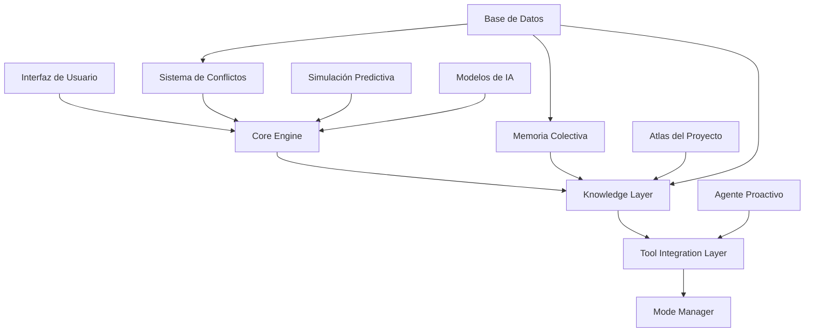

# 👨‍💻 Guía de Desarrollador - Dungeon Life Agent

## 🎯 Introducción

Esta guía está diseñada para desarrolladores que necesitan extender, modificar o integrar con el Dungeon Life Agent. Incluye información técnica detallada sobre la arquitectura interna, APIs disponibles, puntos de extensión y mejores prácticas de desarrollo.

---

## 🏗️ Arquitectura Interna

### Arquitectura General del Sistema



### Componentes Principales

#### 1. Core Engine
**Responsabilidades:**
- ✅ Procesamiento de consultas principales
- ✅ Gestión de modos operativos
- ✅ Coordinación entre componentes
- ✅ Respuestas contextualizadas

#### 2. Knowledge Layer
**Responsabilidades:**
- ✅ Indexación y búsqueda de documentos
- ✅ Gestión de embeddings y similitud semántica
- ✅ Integración con Atlas del proyecto
- ✅ **Nueva:** Memoria colectiva y conocimiento tácito

#### 3. Tool Integration Layer
**Responsabilidades:**
- ✅ Integración con herramientas externas vía MCP
- ✅ Ejecución segura de comandos del sistema
- ✅ **Nueva:** Agente proactivo y automatización
- ✅ **Nueva:** Detección y resolución de conflictos

#### 4. Mode Manager
**Responsabilidades:**
- ✅ Gestión de modos operativos (1, 2, 3)
- ✅ Control de permisos y seguridad
- ✅ Validación de operaciones

---

## 🔌 APIs y Puntos de Extensión

### API Principal del Agente

#### Inicialización y Configuración

```python
from dungeon_life_agent import DungeonLifeAgent

# Inicialización básica
agent = DungeonLifeAgent(
    model_path="models/llama-3-8b-instruct.q4_k_m.gguf",
    taxonomy_path="Doc/Repository_Taxonomy.yaml",
    config_path="config.yaml"
)

# Configuración avanzada
agent_config = {
    "model": {
        "path": "models/llama-3-8b-instruct.q4_k_m.gguf",
        "context_length": 8192,
        "gpu_layers": 35
    },
    "knowledge": {
        "indexing": {
            "enabled": True,
            "incremental": True,
            "auto_update": True
        },
        "collective_memory": {
            "enabled": True,
            "platforms": ["discord", "slack"],
            "auto_capture": True
        }
    },
    "conflicts": {
        "detection": {
            "enabled": True,
            "sensitivity": "medium",
            "auto_resolution": False
        }
    },
    "simulation": {
        "enabled": True,
        "max_scenarios": 10,
        "cache_results": True
    }
}

agent = DungeonLifeAgent(config=agent_config)
```

#### Procesamiento de Consultas

```python
# Consulta básica
response = await agent.query(
    message="¿Dónde está la documentación del personaje Bromar?",
    user_role="guionista",
    context={"current_file": "DLE_400_Quest_Main.md"}
)

# Consulta avanzada con funcionalidades nuevas
advanced_response = await agent.query_advanced(
    message="¿Qué impacto tendría reducir el daño de la Espada de Fuego?",
    user_role="game_designer",
    options={
        "include_historical_context": True,
        "detect_conflicts": True,
        "simulate_impact": True,
        "generate_scenarios": True,
        "proactive_monitoring": True
    }
)
```

### API de Memoria Colectiva

#### Captura de Conocimiento Tácito

```python
from collective_memory import CollectiveMemoryAPI

# Inicialización
memory_api = CollectiveMemoryAPI()

# Captura manual de decisión importante
await memory_api.capture_knowledge_manually(
    content="Decisión: Sistema de combate híbrido turnos/tiempo real",
    decision_type="arquitectura",
    participants=["project_manager", "game_designer", "tech_director"],
    related_entities=["combate", "progresion", "balance"],
    importance_score=0.9,
    access_level="internal"
)

# Consulta de contexto histórico
historical_context = await memory_api.query_historical_context(
    query="sistema de combate",
    date_range="2024-01-01 to 2024-12-31",
    importance_threshold=0.7,
    pillar_filter=["Pilar_2", "Pilar_4"]
)
```

#### Integración con Plataformas Externas

```python
# Integración con Discord
discord_config = {
    "bot_token": "your_discord_bot_token",
    "target_channels": ["game-design", "technical-discussion"],
    "auto_capture": True,
    "importance_threshold": 0.6
}

discord_integration = DiscordKnowledgeCapture(discord_config)
await discord_integration.start_capture()

# Integración con Slack
slack_config = {
    "bot_token": "your_slack_bot_token",
    "target_channels": ["#random", "#development"],
    "mention_patterns": ["@agent", "@dla"],
    "keyword_triggers": ["decidido", "aprobado", "importante"]
}

slack_integration = SlackKnowledgeCapture(slack_config)
await slack_integration.start_capture()
```

### API de Detección de Conflictos

#### Análisis de Conflictos

```python
from conflict_detection import ConflictDetectionAPI

# Inicialización
conflict_api = ConflictDetectionAPI()

# Análisis proactivo de propuesta
conflict_analysis = await conflict_api.analyze_potential_conflicts(
    proposed_change={
        "type": "mechanic_change",
        "description": "Reducción de daño del arma en 25%",
        "affected_entities": ["espada_fuego", "sistema_combate"]
    },
    context={
        "user_role": "game_designer",
        "current_project": "dungeon_life_v1",
        "related_files": ["DLE_200_01_Combate.md", "DLE_500_Weapon_EspadaFuego.yml"]
    }
)

# Procesar resultados
if conflict_analysis["conflicts_detected"] > 0:
    for conflict in conflict_analysis["high_priority_conflicts"]:
        print(f"⚠️ Conflicto detectado: {conflict['description']}")
        print(f"Roles afectados: {conflict['affected_roles']}")
        print(f"Severidad: {conflict['severity']}")

# Obtener recomendaciones de resolución
resolution_recommendations = await conflict_api.generate_resolution_recommendations(
    conflict_analysis["conflicts_detected"]
)
```

#### Sistema de Resolución Colaborativa

```python
# Iniciar proceso de resolución
resolution_session = await conflict_api.start_resolution_session(
    conflict_id=conflict_analysis["conflicts"][0]["id"],
    involved_roles=["game_designer", "narrative_writer", "3d_artist"],
    proposed_solutions=resolution_recommendations
)

# Participar en resolución
user_input = "Como game designer, prefiero la opción 2 pero con ajustes"
await resolution_session.submit_perspective(
    role="game_designer",
    perspective=user_input,
    preferred_solution_id="solution_2"
)

# Obtener consenso
consensus = await resolution_session.reach_consensus()
if consensus["agreed"]:
    implementation_plan = await resolution_session.generate_implementation_plan(
        consensus["final_solution"]
    )
```

### API de Simulación Predictiva

#### Simulación Básica

```python
from predictive_simulation import SimulationAPI

# Inicialización
simulation_api = SimulationAPI()

# Crear propuesta de cambio
proposed_change = {
    "id": "change_001",
    "type": "mechanic_modification",
    "description": "Reducción de daño del arma en 25%",
    "target_entity": "espada_fuego",
    "change_magnitude": -0.25,
    "affected_domains": ["mechanical", "narrative", "technical"]
}

# Ejecutar simulación
simulation_results = await simulation_api.simulate_change_impact(
    proposed_change=proposed_change,
    context={
        "current_project_state": await get_current_project_state(),
        "user_role": "game_designer",
        "simulation_depth": "comprehensive"
    }
)

# Procesar resultados
print(f"Simulación completada: {simulation_results['simulation_id']}")
print(f"Confianza: {simulation_results['confidence_score']}")

for domain, impact in simulation_results["domain_simulations"].items():
    print(f"Impacto en {domain}: {impact['overall_impact']}")
```

#### Exploración de Escenarios

```python
# Generar escenarios alternativos
scenarios = await simulation_api.generate_alternative_scenarios(
    base_change=proposed_change,
    scenario_types=["conservative", "aggressive", "creative"],
    count_per_type=3
)

# Comparar escenarios
comparison = await simulation_api.compare_scenarios(
    scenarios=scenarios,
    comparison_metrics=["impact_magnitude", "risk_level", "implementation_effort"]
)

# Obtener mejor escenario
best_scenario = comparison["ranked_scenarios"][0]
print(f"Mejor opción: {best_scenario['scenario_id']}")
print(f"Puntuación: {best_scenario['overall_score']}")
```

### API de Agente Proactivo

#### Configuración de Monitoreo

```python
from proactive_agent import ProactiveAgentAPI

# Inicialización
proactive_api = ProactiveAgentAPI()

# Configurar monitoreo personalizado
monitoring_config = {
    "file_patterns": [
        "02_ContentAssets/**/*.fbx",
        "02_ContentAssets/**/*.png",
        "01_SourceCode/**/*.md",
        "03_Data/**/*.jsonl"
    ],
    "validation_rules": {
        "3d_models": {
            "max_polycount": 50000,
            "required_bones": ["root", "spine"],
            "texture_resolution": "2048x2048"
        },
        "documentation": {
            "required_frontmatter": True,
            "pillar_classification": True,
            "entity_links": True
        }
    },
    "notification_settings": {
        "roles_to_notify": {
            "3d_artist": ["model_validation", "optimization_needed"],
            "game_designer": ["balance_impact", "mechanic_conflict"],
            "project_manager": ["timeline_impact", "resource_conflict"]
        },
        "urgency_levels": {
            "low": {"channels": ["general"], "frequency": "daily"},
            "medium": {"channels": ["development"], "frequency": "immediate"},
            "high": {"channels": ["urgent", "project_manager"], "frequency": "immediate"}
        }
    }
}

await proactive_api.configure_monitoring(monitoring_config)
```

#### Acciones Automáticas

```python
# Definir acciones automáticas
automation_rules = [
    {
        "trigger": {
            "event_type": "new_3d_model",
            "conditions": {
                "file_size": ">100MB",
                "polycount": ">30000"
            }
        },
        "actions": [
            {
                "type": "optimization",
                "parameters": {
                    "target_polycount": 25000,
                    "lod_levels": 3,
                    "compression": "high"
                }
            },
            {
                "type": "notification",
                "targets": ["3d_artist", "tech_director"],
                "message": "Modelo optimizado automáticamente por exceso de polycount"
            }
        ]
    },
    {
        "trigger": {
            "event_type": "documentation_created",
            "conditions": {
                "missing_pillar_classification": True
            }
        },
        "actions": [
            {
                "type": "classification_suggestion",
                "parameters": {
                    "auto_suggest": True,
                    "confidence_threshold": 0.8
                }
            }
        ]
    }
]

await proactive_api.register_automation_rules(automation_rules)
```

---

## 🔧 Desarrollo de Extensiones

### Creación de Nuevos Simuladores de Dominio

#### Estructura Base para Simuladores

```python
from base_simulator import BaseDomainSimulator

class CustomDomainSimulator(BaseDomainSimulator):
    def __init__(self):
        super().__init__("custom_domain")
        self.domain_specific_models = self.load_domain_models()

    async def simulate_change(self, proposed_change, current_state, scenarios):
        """Implementar lógica de simulación específica del dominio"""

        domain_impact = {}

        for scenario in scenarios:
            # 1. Análisis específico del dominio
            domain_analysis = await self.analyze_domain_specific_impact(
                scenario, current_state
            )

            # 2. Cálculo de métricas del dominio
            domain_metrics = await self.calculate_domain_metrics(
                domain_analysis, current_state
            )

            # 3. Evaluación de riesgos específicos
            domain_risks = await self.assess_domain_risks(
                domain_analysis, domain_metrics
            )

            # 4. Generación de recomendaciones
            domain_recommendations = await self.generate_domain_recommendations(
                domain_analysis, domain_risks
            )

            scenario_key = scenario["id"]
            domain_impact[scenario_key] = {
                "domain_analysis": domain_analysis,
                "domain_metrics": domain_metrics,
                "domain_risks": domain_risks,
                "recommendations": domain_recommendations,
                "confidence_score": await self.calculate_confidence(domain_analysis)
            }

        return domain_impact

    def load_domain_models(self):
        """Cargar modelos específicos del dominio"""
        # Implementar carga de modelos ML específicos
        return {
            "prediction_model": self.load_ml_model("domain_prediction.pkl"),
            "risk_model": self.load_ml_model("domain_risk_assessment.pkl"),
            "optimization_model": self.load_ml_model("domain_optimizer.pkl")
        }
```

#### Registro de Nuevo Simulador

```python
# Registrar simulador personalizado
await simulation_api.register_domain_simulator(
    domain_name="custom_domain",
    simulator_instance=CustomDomainSimulator(),
    interaction_rules={
        "influences": ["narrative", "technical"],
        "influenced_by": ["mechanical", "artistic"],
        "interaction_strength": 0.7
    }
)
```

### Desarrollo de Nuevos Patrones de Conflicto

#### Definición de Patrones Personalizados

```python
from conflict_detection import ConflictPattern

# Crear patrón de conflicto específico del proyecto
custom_conflict_pattern = ConflictPattern(
    pattern_id="narrative_technical_balance",
    name="Conflicto Narrativa vs Técnica en Balance",
    description="Conflicto cuando requerimientos narrativos chocan con balance técnico",

    # Condiciones de detección
    detection_conditions={
        "keywords_narrative": ["inmersión", "experiencia", "sentimiento", "emoción"],
        "keywords_technical": ["balance", "progresión", "curva", "dificultad"],
        "context_indicators": ["discusión_caliente", "posturas_opuestas", "frustración"]
    },

    # Análisis de roles
    role_analysis={
        "narrative_writer": {
            "typical_concerns": ["coherencia_historia", "experiencia_jugador"],
            "communication_style": ["emocional", "creativo", "holístico"]
        },
        "game_designer": {
            "typical_concerns": ["balance_matemático", "progresión_justa"],
            "communication_style": ["analítico", "sistemático", "cuantitativo"]
        }
    },

    # Estrategias de resolución
    resolution_strategies=[
        {
            "name": "compromiso_híbrido",
            "description": "Encontrar solución que satisfaga ambos lados parcialmente",
            "success_rate": 0.8,
            "implementation_complexity": "medium"
        },
        {
            "name": "propuesta_alternativa",
            "description": "Desarrollar tercera opción que supere el conflicto",
            "success_rate": 0.6,
            "implementation_complexity": "high"
        }
    ]
)

# Registrar patrón
await conflict_api.register_conflict_pattern(custom_conflict_pattern)
```

### Creación de Acciones Automáticas Personalizadas

#### Desarrollo de Acciones Automáticas

```python
from proactive_agent import AutomationAction

class CustomAutomationAction(AutomationAction):
    def __init__(self):
        super().__init__(
            action_id="custom_optimization",
            name="Optimización Personalizada de Modelos",
            description="Optimización automática basada en reglas específicas del proyecto"
        )

    async def execute(self, trigger_context, parameters):
        """Ejecutar acción automática personalizada"""

        # 1. Validar contexto del trigger
        validation_result = await self.validate_trigger_context(trigger_context)
        if not validation_result["valid"]:
            return {"status": "skipped", "reason": validation_result["reason"]}

        # 2. Ejecutar lógica específica
        execution_result = await self.execute_custom_logic(
            trigger_context, parameters
        )

        # 3. Registrar resultados
        await self.log_execution_results(execution_result)

        # 4. Generar notificaciones si es necesario
        if execution_result["requires_notification"]:
            await self.send_notifications(execution_result)

        return execution_result

    async def execute_custom_logic(self, trigger_context, parameters):
        """Lógica específica de la acción automática"""

        # Ejemplo: Optimización específica para modelos de personajes
        if trigger_context["file_type"] == "fbx":
            optimization_result = await self.optimize_character_model(
                trigger_context["file_path"],
                parameters
            )

            return {
                "status": "completed",
                "optimization_applied": optimization_result,
                "file_size_reduction": optimization_result["size_reduction"],
                "performance_improvement": optimization_result["performance_gain"],
                "requires_notification": True,
                "notification_targets": ["3d_artist", "tech_director"]
            }

        return {"status": "no_action", "reason": "Tipo de archivo no soportado"}

# Registrar acción automática
await proactive_api.register_automation_action(CustomAutomationAction())
```

---

## 🧪 Testing y Validación

### Framework de Testing para Extensiones

#### Testing de Simuladores

```python
import pytest
from simulation_testing import SimulationTestFramework

class TestCustomDomainSimulator:
    @pytest.fixture
    def simulator(self):
        return CustomDomainSimulator()

    @pytest.fixture
    def sample_project_state(self):
        return {
            "entities": ["character_1", "location_1", "mechanic_1"],
            "relationships": [("character_1", "location_1", "lives_in")],
            "current_metrics": {"balance_score": 0.8, "complexity": 0.6}
        }

    async def test_simulation_accuracy(self, simulator, sample_project_state):
        """Test precisión de simulaciones"""

        # Crear cambio de prueba
        test_change = {
            "id": "test_change",
            "type": "entity_modification",
            "target_entity": "character_1",
            "change_magnitude": 0.2
        }

        # Ejecutar simulación
        results = await simulator.simulate_change(
            test_change, sample_project_state, [test_change]
        )

        # Validar resultados
        assert results["test_change"]["confidence_score"] > 0.7
        assert "domain_metrics" in results["test_change"]
        assert "recommendations" in results["test_change"]

    async def test_domain_specific_logic(self, simulator, sample_project_state):
        """Test lógica específica del dominio"""

        # Test casos específicos del dominio custom
        domain_specific_results = await simulator.test_domain_specific_features()

        assert domain_specific_results["custom_metric"] is not None
        assert len(domain_specific_results["domain_insights"]) > 0
```

#### Testing de Conflict Detection

```python
import pytest
from conflict_testing import ConflictTestFramework

class TestCustomConflictPattern:
    @pytest.fixture
    def conflict_api(self):
        return ConflictDetectionAPI()

    async def test_conflict_detection_accuracy(self, conflict_api):
        """Test precisión en detección de conflictos"""

        # Caso de prueba conocido
        test_scenario = {
            "messages": [
                "Como guionista, necesito más inmersión emocional",
                "Como diseñador, esto rompe el balance matemático",
                "Esto es frustrante, no nos ponemos de acuerdo"
            ],
            "participants": ["narrative_writer", "game_designer"]
        }

        # Ejecutar detección
        detection_results = await conflict_api.analyze_potential_conflicts(
            test_scenario, context={"discussion_context": "game_mechanics"}
        )

        # Validar detección
        assert detection_results["conflicts_detected"] > 0
        assert any(c["pattern_id"] == "narrative_technical_balance"
                  for c in detection_results["conflicts"])

    async def test_resolution_effectiveness(self, conflict_api):
        """Test efectividad de resolución"""

        # Simular proceso de resolución
        resolution_results = await conflict_api.test_resolution_strategies(
            conflict_pattern="narrative_technical_balance",
            test_scenarios=10
        )

        # Validar efectividad
        assert resolution_results["average_success_rate"] > 0.7
        assert resolution_results["average_resolution_time"] < 300  # segundos
```

### Métricas de Validación

#### Métricas para Simuladores

```yaml
simulation_validation_metrics:
  precision_predictiva:
    descripcion: "Qué tan precisas son las predicciones"
    objetivo: ">90% precisión en impactos mayores"
    medicion: "Comparación con cambios reales implementados"

  velocidad_simulacion:
    descripcion: "Tiempo de respuesta de simulaciones"
    objetivo: "<5 segundos para escenarios complejos"
    medicion: "Tiempo promedio end-to-end"

  cobertura_dominios:
    descripcion: "Cobertura de diferentes tipos de cambios"
    objetivo: ">95% tipos de cambio cubiertos"
    medicion: "Porcentaje de tipos de cambio simulables"

  utilidad_recomendaciones:
    descripcion: "Qué tan útiles son las recomendaciones"
    objetivo: ">85% recomendaciones consideradas útiles"
    medicion: "Feedback de desarrolladores"
```

#### Métricas para Conflict Detection

```yaml
conflict_detection_metrics:
  precision_deteccion:
    descripcion: "Precisión en detección de conflictos reales"
    objetivo: ">90% precisión (evitar falsos positivos)"
    medicion: "Validación contra conflictos reales reportados"

  velocidad_deteccion:
    descripcion: "Tiempo desde conflicto hasta detección"
    objetivo: "<1 minuto para conflictos críticos"
    medicion: "Tiempo promedio de detección"

  efectividad_resolucion:
    descripcion: "Qué tan efectivas son las estrategias de resolución"
    objetivo: ">80% conflictos resueltos exitosamente"
    medicion: "Tasa de éxito en resolución de conflictos"

  cobertura_roles:
    descripcion: "Cobertura de diferentes tipos de conflictos entre roles"
    objetivo: ">95% tipos de conflicto cubiertos"
    medicion: "Porcentaje de patrones de conflicto detectables"
```

---

## 🚀 Despliegue y Configuración

### Configuración de Desarrollo

#### Archivo de Configuración para Desarrollo

```yaml
# config/development.yaml
development:
  debug_mode: true
  logging:
    level: "DEBUG"
    file_path: "logs/development.log"
    max_size: "100MB"

  testing:
    auto_run_tests: true
    test_coverage_target: 0.85
    performance_benchmarks: true

  hot_reload:
    enabled: true
    watch_patterns: ["**/*.py", "**/*.yaml", "**/*.json"]
    restart_delay: 2

  profiling:
    enabled: true
    profile_memory: true
    profile_cpu: true
    profile_io: true
```

#### Configuración de Extensiones

```yaml
# config/extensions.yaml
extensions:
  custom_simulators:
    enabled: true
    auto_register: true
    validation_required: true

  conflict_patterns:
    enabled: true
    custom_patterns_path: "extensions/conflict_patterns/"
    auto_update: true

  automation_actions:
    enabled: true
    custom_actions_path: "extensions/automation_actions/"
    security_validation: true

  memory_integrations:
    enabled: true
    platform_configs:
      discord:
        development_server: true
        test_channels: ["bot-testing"]
      slack:
        test_workspace: true
        sandbox_channels: ["#dev-bot"]
```

### Despliegue de Extensiones

#### Empaquetado de Extensiones

```python
from extension_packager import ExtensionPackager

# Crear paquete de extensión
packager = ExtensionPackager()

extension_package = await packager.create_package(
    extension_name="custom_domain_simulator",
    version="1.0.0",
    components={
        "simulator": CustomDomainSimulator(),
        "tests": "tests/",
        "documentation": "docs/",
        "config": "config/extension_config.yaml"
    },
    metadata={
        "author": "Dungeon Life Team",
        "description": "Simulador personalizado para dominio específico",
        "dependencies": ["numpy", "torch", "domain_specific_lib"],
        "compatibility": ["dungeon_life_agent >= 1.1.0"]
    }
)

# Validar paquete
validation_results = await packager.validate_package(extension_package)
if validation_results["valid"]:
    # Publicar extensión
    await packager.publish_package(
        extension_package,
        repository_url="https://extensions.dungeonlife.dev"
    )
```

---

## 🔍 Debugging y Troubleshooting

### Herramientas de Debugging

#### Debugging de Simulaciones

```python
from simulation_debugger import SimulationDebugger

# Herramientas de debugging
debugger = SimulationDebugger()

# Debug paso a paso
await debugger.trace_simulation(
    proposed_change=proposed_change,
    context=context,
    trace_level="detailed"
)

# Los resultados incluirán:
# - Estado en cada paso de simulación
# - Valores intermedios de cálculos
# - Decisiones tomadas por algoritmos
# - Tiempo de ejecución por componente
```

#### Debugging de Conflict Detection

```python
from conflict_debugger import ConflictDebugger

# Análisis detallado de detección
debug_analysis = await ConflictDebugger.analyze_detection_process(
    scenario=test_scenario,
    expected_conflicts=["narrative_technical_balance"],
    debug_level="verbose"
)

# Resultados incluyen:
# - Matching de patrones paso a paso
# - Scores de similitud en cada etapa
# - Razones por las que se aceptó/rechazó cada patrón
# - Sugerencias para mejorar detección
```

### Logs y Monitoreo

#### Configuración de Logging Avanzado

```python
import logging
from advanced_logger import AdvancedLogger

# Configuración de logging para desarrollo
logger = AdvancedLogger.setup_development_logging(
    log_level="DEBUG",
    include_timestamps=True,
    include_context=True,
    include_performance_metrics=True,
    log_file="logs/detailed_development.log"
)

# Logging estructurado para funcionalidades avanzadas
await logger.log_simulation_event(
    event_type="simulation_started",
    simulation_id="sim_001",
    user_context={"role": "game_designer", "current_task": "balance_testing"},
    additional_context={
        "proposed_change": proposed_change,
        "simulation_config": simulation_config
    }
)

await logger.log_conflict_event(
    event_type="conflict_detected",
    conflict_id="conf_001",
    involved_roles=["narrative_writer", "game_designer"],
    conflict_pattern="narrative_technical_balance",
    severity="medium"
)
```

---

## 📚 Mejores Prácticas de Desarrollo

### Desarrollo de Simuladores

#### 1. Diseño Modular
```markdown
✅ **Recomendado:**
- Cada simulador en módulo separado
- Interfaces bien definidas entre componentes
- Configuración externa de parámetros

❌ **Evitar:**
- Simuladores monolíticos
- Dependencias internas complejas
- Parámetros hardcodeados
```

#### 2. Testing Exhaustivo
```markdown
✅ **Recomendado:**
- Tests unitarios para cada componente
- Tests de integración entre simuladores
- Tests de performance con datos reales

❌ **Evitar:**
- Testing solo con datos sintéticos
- Ignorar edge cases específicos del dominio
- No testear interacciones entre dominios
```

### Desarrollo de Patrones de Conflicto

#### 1. Basados en Datos Reales
```markdown
✅ **Recomendado:**
- Analizar conflictos históricos del proyecto
- Incluir perspectivas de todos los roles
- Validar patrones con el equipo

❌ **Evitar:**
- Patrones basados solo en teoría
- Ignorar contexto cultural del equipo
- No validar con usuarios reales
```

#### 2. Estrategias de Resolución Prácticas
```markdown
✅ **Recomendado:**
- Múltiples estrategias por patrón
- Considerar recursos disponibles
- Incluir métricas de éxito realistas

❌ **Evitar:**
- Una sola estrategia por conflicto
- Ignorar limitaciones prácticas
- Estrategias teóricas sin implementación
```

### Desarrollo de Acciones Automáticas

#### 1. Seguridad Primero
```markdown
✅ **Recomendado:**
- Validación estricta de permisos
- Respaldos automáticos antes de acciones
- Logging completo de todas las operaciones

❌ **Evitar:**
- Acciones con permisos excesivos
- Sin mecanismos de rollback
- Logging insuficiente para auditoría
```

#### 2. Monitoreo y Alertas
```markdown
✅ **Recomendado:**
- Métricas de éxito para cada acción
- Alertas automáticas en fallos
- Dashboard de monitoreo en tiempo real

❌ **Evitar:**
- Acciones sin métricas de seguimiento
- Sin alertas de problemas
- Falta de visibilidad de operaciones
```

---

## 🔮 Evolución y Mantenimiento

### Mantenimiento de Extensiones

#### Actualizaciones de Extensiones

```python
from extension_manager import ExtensionManager

# Verificar actualizaciones disponibles
updates_available = await ExtensionManager.check_for_updates(
    installed_extensions=["custom_simulator", "conflict_detector"]
)

# Aplicar actualizaciones
for extension, update_info in updates_available.items():
    if update_info["severity"] == "critical":
        await ExtensionManager.update_extension(
            extension_name=extension,
            update_version=update_info["latest_version"],
            backup_before_update=True
        )
```

#### Monitoreo de Performance de Extensiones

```python
# Métricas de performance por extensión
performance_metrics = await ExtensionManager.collect_performance_metrics(
    time_period="24h",
    extensions=["custom_simulator", "conflict_detector"]
)

# Identificar extensiones problemáticas
problematic_extensions = await ExtensionManager.identify_performance_issues(
    performance_metrics,
    thresholds={
        "max_response_time": 5.0,  # segundos
        "max_memory_usage": 512,   # MB
        "max_error_rate": 0.01     # 1%
    }
)
```

### Contribución a Extensiones Core

#### Proceso de Contribución

```markdown
1. **Desarrollo Local:**
   - Crear extensión en entorno de desarrollo
   - Testing exhaustivo con datos reales
   - Documentación completa

2. **Validación Interna:**
   - Review de código por equipo técnico
   - Testing de integración con agente principal
   - Validación de seguridad y performance

3. **Propuesta de Inclusión:**
   - Crear pull request con extensión
   - Incluir tests, documentación y ejemplos
   - Proporcionar métricas de beneficio

4. **Incorporación:**
   - Merge después de aprobación
   - Despliegue en siguiente versión
   - Monitoreo post-despliegue
```

---

## 📋 Recursos Adicionales

### Documentación Técnica Detallada

#### Arquitectura Interna
- 📖 **02_Arquitectura_Tecnica.md** - Arquitectura técnica completa del agente
- 📖 **17_Memoria_Colectiva_y_Conocimiento_Tacito.md** - Especificaciones técnicas detalladas
- 📖 **18_Sistema_Conflictos_y_Resolucion.md** - Sistema de conflictos completo
- 📖 **19_Agente_Proactivo_y_Automatizacion.md** - Automatización avanzada
- 📖 **20_Simulacion_y_Analisis_Predictivo.md** - Simulación predictiva

#### APIs y Referencias
- 🔗 **09_API_y_Interfaces.md** - Documentación completa de APIs
- 🔗 **Dungeon Life Agent API Reference** - Referencia técnica completa
- 🔗 **Extension Development Kit** - Kit de desarrollo para extensiones

### Herramientas de Desarrollo

#### Herramientas Disponibles
```yaml
development_tools:
  testing_framework:
    descripcion: "Framework completo para testing de extensiones"
    componentes: ["unit_tests", "integration_tests", "performance_tests"]

  debugging_tools:
    descripcion: "Herramientas avanzadas de debugging"
    componentes: ["step_debugger", "performance_profiler", "memory_analyzer"]

  deployment_tools:
    descripcion: "Herramientas para despliegue de extensiones"
    componentes: ["package_builder", "validator", "publisher"]

  monitoring_tools:
    descripcion: "Herramientas de monitoreo y métricas"
    componentes: ["metrics_collector", "dashboard_generator", "alert_system"]
```

### Comunidad y Soporte

#### Canales de Comunicación
```yaml
community_channels:
  desarrollo_tecnico:
    descripcion: "Discusiones técnicas y desarrollo"
    plataforma: "Discord"
    canal: "#technical-development"

  soporte_desarrolladores:
    descripcion: "Soporte específico para desarrolladores"
    plataforma: "GitHub Discussions"
    categoria: "Developer Support"

  propuestas_mejoras:
    descripcion: "Propuestas de nuevas funcionalidades"
    plataforma: "GitHub Issues"
    etiqueta: "enhancement"

  reporte_bugs:
    descripcion: "Reporte de bugs en extensiones"
    plataforma: "GitHub Issues"
    etiqueta: "bug"
```

---

## 🎯 Próximos Pasos para Desarrolladores

### Para Empezar con Extensiones

1. **Explorar APIs existentes** - Revisar documentación de APIs actuales
2. **Crear extensión simple** - Empezar con algo pequeño y funcional
3. **Testing exhaustivo** - Validar con datos reales del proyecto
4. **Documentación completa** - Incluir ejemplos y casos de uso
5. **Compartir con el equipo** - Obtener feedback temprano

### Para Contribuir al Core

1. **Entender arquitectura** - Estudiar componentes internos
2. **Identificar área de mejora** - Encontrar oportunidades específicas
3. **Desarrollar solución** - Crear implementación robusta
4. **Testing riguroso** - Validar completamente la solución
5. **Proponer mejora** - Seguir proceso de contribución

---

Esta guía proporciona los fundamentos técnicos necesarios para desarrollar extensiones avanzadas del Dungeon Life Agent. Las nuevas funcionalidades críticas (memoria colectiva, detección de conflictos, simulación predictiva y agente proactivo) ofrecen oportunidades únicas para crear herramientas que transformen el flujo de trabajo del equipo.

¿Necesita ayuda con algún aspecto específico de desarrollo o tiene preguntas sobre alguna API en particular?