---
title: "API y Interfaces del Dungeon Life Agent"
version: "1.0.0"
date: "2025-10-07"
status: "active"
author: "Dungeon Life Agent Team"
tags: ["api", "interfaces", "integracion", "protocolos", "comunicacion"]
machine_readable_spec:
  schema_version: "1.0"
  ai_compatibility: true
  export_formats: ["markdown", "html", "pdf", "json", "openapi"]
  api_version: "v1.0"
  interface_types: ["cli", "http", "websocket", "mcp"]
---

# 🔌 API y Interfaces del Dungeon Life Agent

## 🎯 Introducción

Este documento especifica las interfaces de programación de aplicaciones (APIs) y protocolos de comunicación del Dungeon Life Agent. Está diseñado para permitir integraciones externas, automatización de procesos y comunicación con otras herramientas del ecosistema DLE.

---

## 🏗️ Arquitectura de Interfaces

### Modelo de Comunicación

```mermaid
graph TB
    A[Cliente Externo] --> B[API Gateway]
    B --> C[Autenticación]
    C --> D[Router de Comandos]
    D --> E[Modo 1: Consultor]
    D --> F[Modo 2: Taxonómico]
    D --> G[Modo 3: Colaborador]
    E --> H[Respuesta]
    F --> H
    G --> H
    H --> I[Formateo de Respuesta]
    I --> J[Cliente Externo]

    K[Herramientas Externas] --> L[MCP Server]
    L --> M[Protocolo MCP]
    M --> N[Agente Core]
    N --> O[Respuesta MCP]
    O --> K
```



### Capas de la Arquitectura

```yaml
interface_layers:
  capa_presentacion:
    descripcion: "Interfaces de usuario y cliente"
    componentes: ["CLI", "Web Interface", "API REST", "WebSocket"]

  capa_negocio:
    descripcion: "Lógica de negocio y modos operativos"
    componentes: ["Modo 1", "Modo 2", "Modo 3", "Router de Comandos"]

  capa_datos:
    descripcion: "Acceso a datos y conocimiento"
    componentes: ["Knowledge Layer", "Taxonomía", "Sistema FES"]

  capa_integracion:
    descripcion: "Integración con herramientas externas"
    componentes: ["MCP Server", "Git Integration", "Shell Tools"]
```

---

## 🖥️ Interface de Línea de Comandos (CLI)

### Especificación de la CLI

#### Comando Principal
```bash
python run_agent.py [OPCIONES] [COMANDO] [ARGUMENTOS...]
```

#### Opciones Globales
```yaml
cli_options:
  modo:
    descripcion: "Modo operativo del agente"
    opciones: ["1", "2", "3", "consultor", "taxonomico", "colaborador"]
    default: "1"
    alias: ["-m", "--mode"]

  configuracion:
    descripcion: "Archivo de configuración personalizado"
    tipo: "ruta_archivo"
    default: "config/config.yaml"
    alias: ["-c", "--config"]

  log_level:
    descripcion: "Nivel de logging"
    opciones: ["DEBUG", "INFO", "WARNING", "ERROR"]
    default: "INFO"
    alias: ["-l", "--log-level"]

  interactive:
    descripcion: "Modo interactivo"
    tipo: "booleano"
    default: true
    alias: ["-i", "--interactive"]

  archivo_consulta:
    descripcion: "Archivo con consulta (modo no interactivo)"
    tipo: "ruta_archivo"
    alias: ["-f", "--file"]

  salida:
    descripcion: "Formato de salida"
    opciones: ["texto", "json", "yaml", "markdown"]
    default: "texto"
    alias: ["-o", "--output"]
```

#### Comandos Disponibles

**Comandos de Modo**
```bash
# Cambio de modo durante ejecución
python run_agent.py modo 2
python run_agent.py modo colaborador
python run_agent.py modo consultor
```

**Comandos de Información**
```bash
# Información del sistema
python run_agent.py status
python run_agent.py info
python run_agent.py health

# Información de configuración
python run_agent.py config
python run_agent.py modelo
python run_agent.py memoria
```

**Comandos de Mantenimiento**
```bash
# Mantenimiento del sistema
python run_agent.py limpiar-cache
python run_agent.py reindexar
python run_agent.py actualizar-modelo
python run_agent.py respaldar
```

### Ejemplos de Uso CLI

#### Consulta Simple
```bash
python run_agent.py -m 1 -o json "¿Cuál es el arco de Bromar?"
```

#### Consulta desde Archivo
```bash
echo "¿Dónde está la documentación técnica?" > consulta.txt
python run_agent.py -f consulta.txt -o yaml
```

#### Modo No Interactivo
```bash
python run_agent.py -i false -f consulta.txt -o json > respuesta.json
```

---

## 🌐 API REST

### Especificación OpenAPI

#### Endpoint Base
```
Base URL: http://localhost:8000/api/v1
Content-Type: application/json
Authorization: Bearer <token> (si requerido)
```

#### Endpoints Principales

##### POST /query
Consulta principal al agente

**Request:**
```json
{
  "query": "string",
  "mode": "1|2|3",
  "role": "guionista|game_designer|3d_artist|project_manager|director|willow",
  "domain": "narrativa|tecnica|assets|produccion",
  "context": {
    "user_id": "string",
    "session_id": "string",
    "project_context": "string"
  },
  "options": {
    "output_format": "text|json|yaml|markdown",
    "max_length": "number",
    "include_references": "boolean",
    "include_suggestions": "boolean"
  }
}
```

**Response:**
```json
{
  "success": true,
  "data": {
    "response": "string",
    "mode_used": "1|2|3",
    "role_detected": "string",
    "domain_classified": "string",
    "confidence": "number",
    "references": ["array of file paths"],
    "suggestions": ["array of suggestions"],
    "execution_time": "number",
    "tokens_used": "number"
  },
  "metadata": {
    "timestamp": "ISO 8601",
    "version": "string",
    "request_id": "string"
  }
}
```

##### GET /status
Estado del sistema del agente

**Response:**
```json
{
  "status": "healthy|degraded|unhealthy",
  "version": "string",
  "uptime": "number",
  "memory_usage": {
    "total_gb": "number",
    "used_gb": "number",
    "percentage": "number"
  },
  "model_info": {
    "name": "string",
    "size_gb": "number",
    "context_window": "number",
    "gpu_layers": "number"
  },
  "active_sessions": "number",
  "last_activity": "ISO 8601"
}
```

##### POST /mode/{mode}
Cambio de modo operativo

**Parameters:**
- mode: "1|2|3|consultor|taxonomico|colaborador"

**Request:**
```json
{
  "reason": "string",
  "user_id": "string",
  "require_confirmation": "boolean"
}
```

**Response:**
```json
{
  "success": true,
  "previous_mode": "string",
  "new_mode": "string",
  "confirmation_required": "boolean",
  "backup_created": "boolean"
}
```

##### GET /knowledge/search
Búsqueda en el conocimiento del repositorio

**Parameters:**
- q: "consulta de búsqueda"
- role: "rol específico"
- domain: "dominio específico"
- limit: "número de resultados"
- format: "formato de respuesta"

**Response:**
```json
{
  "query": "string",
  "results": [
    {
      "file_path": "string",
      "title": "string",
      "content": "string",
      "relevance_score": "number",
      "role_context": "string",
      "domain_context": "string",
      "last_modified": "ISO 8601"
    }
  ],
  "total_results": "number",
  "execution_time": "number"
}
```

### Códigos de Estado HTTP

```yaml
http_status_codes:
  200: "Operación exitosa"
  201: "Recurso creado exitosamente"
  400: "Solicitud mal formada"
  401: "No autorizado"
  403: "Prohibido (modo no permitido)"
  404: "Recurso no encontrado"
  422: "Entidad no procesable"
  429: "Demasiadas solicitudes"
  500: "Error interno del servidor"
  503: "Servicio no disponible"
```

---

## 🔗 WebSocket API

### Conexión WebSocket

#### Endpoint
```
ws://localhost:8000/ws/agent
```

#### Mensajes de Protocolo

**Mensaje de Conexión**
```json
{
  "type": "connection",
  "data": {
    "user_id": "string",
    "role": "guionista|game_designer|3d_artist|project_manager|director|willow",
    "mode": "1|2|3",
    "auth_token": "string (opcional)"
  }
}
```

**Mensaje de Consulta**
```json
{
  "type": "query",
  "data": {
    "message": "string",
    "context": {
      "conversation_id": "string",
      "parent_message_id": "string",
      "metadata": "object"
    }
  }
}
```

**Mensaje de Cambio de Modo**
```json
{
  "type": "mode_change",
  "data": {
    "new_mode": "1|2|3",
    "reason": "string"
  }
}
```

**Mensaje de Respuesta**
```json
{
  "type": "response",
  "data": {
    "message": "string",
    "mode_used": "string",
    "role_context": "string",
    "references": ["array"],
    "suggestions": ["array"],
    "metadata": {
      "response_id": "string",
      "timestamp": "ISO 8601",
      "execution_time": "number"
    }
  }
}
```

**Mensaje de Error**
```json
{
  "type": "error",
  "data": {
    "code": "string",
    "message": "string",
    "details": "object"
  }
}
```

### Eventos WebSocket

```yaml
websocket_events:
  on_connection:
    descripcion: "Cliente conectado"
    mensaje: "connection_established"

  on_mode_change:
    descripcion: "Modo cambiado"
    mensaje: "mode_changed"

  on_query_start:
    descripcion: "Procesamiento de consulta iniciado"
    mensaje: "query_processing"

  on_query_complete:
    descripcion: "Consulta procesada"
    mensaje: "query_complete"

  on_error:
    descripcion: "Error ocurrido"
    mensaje: "error_occurred"

  on_backup_created:
    descripcion: "Respaldo automático creado"
    mensaje: "backup_created"
```

---

## 🔧 Model Context Protocol (MCP)

### Especificación MCP

#### Servidor MCP del Agente

**Nombre del Servidor:** `dungeon-life-agent`
**Versión:** `1.0.0`
**Protocolo:** `stdio` (para herramientas locales)

##### Recursos MCP

**Recurso: Repositorio de Conocimiento**
```json
{
  "type": "resource",
  "name": "repository_knowledge",
  "description": "Acceso al conocimiento completo del repositorio DLE",
  "uri": "dla://repository/knowledge",
  "mime_type": "application/json"
}
```

**Recurso: Estado del Sistema**
```json
{
  "type": "resource",
  "name": "system_status",
  "description": "Estado actual del sistema del agente",
  "uri": "dla://system/status",
  "mime_type": "application/json"
}
```

**Recurso: Configuración Actual**
```json
{
  "type": "resource",
  "name": "current_config",
  "description": "Configuración actual del agente",
  "uri": "dla://config/current",
  "mime_type": "application/yaml"
}
```

##### Herramientas MCP

**Herramienta: Consulta de Conocimiento**
```json
{
  "type": "tool",
  "name": "query_knowledge",
  "description": "Realizar consultas al conocimiento del repositorio",
  "input_schema": {
    "type": "object",
    "properties": {
      "query": {"type": "string"},
      "mode": {"type": "string", "enum": ["1", "2", "3"]},
      "role": {"type": "string"},
      "domain": {"type": "string"}
    },
    "required": ["query"]
  }
}
```

**Herramienta: Análisis de Archivos**
```json
{
  "type": "tool",
  "name": "analyze_files",
  "description": "Analizar archivos específicos del repositorio",
  "input_schema": {
    "type": "object",
    "properties": {
      "file_paths": {"type": "array", "items": {"type": "string"}},
      "analysis_type": {"type": "string", "enum": ["content", "structure", "relationships"]},
      "role_context": {"type": "string"}
    },
    "required": ["file_paths", "analysis_type"]
  }
}
```

**Herramienta: Operaciones Seguras**
```json
{
  "type": "tool",
  "name": "safe_operations",
  "description": "Realizar operaciones seguras en archivos (Modo 3)",
  "input_schema": {
    "type": "object",
    "properties": {
      "operation": {"type": "string", "enum": ["create", "modify", "move", "backup"]},
      "file_path": {"type": "string"},
      "content": {"type": "string"},
      "reason": {"type": "string"}
    },
    "required": ["operation", "file_path"]
  }
}
```

### Integración con Herramientas Externas

#### Ejemplo: Blender Integration

**Script de Blender usando MCP:**
```python
# blender_integration.py
import json
import subprocess
import sys

class BlenderDungeonAgent:
    def __init__(self):
        self.mcp_process = None

    def start_mcp_connection(self):
        """Iniciar conexión MCP con el agente"""
        self.mcp_process = subprocess.Popen(
            [sys.executable, "run_agent.py", "--mcp-server"],
            stdin=subprocess.PIPE,
            stdout=subprocess.PIPE,
            stderr=subprocess.PIPE,
            text=True
        )

    def query_agent(self, query, context="blender_optimization"):
        """Consultar al agente sobre optimización de modelos"""
        request = {
            "jsonrpc": "2.0",
            "id": 1,
            "method": "tools/call",
            "params": {
                "name": "query_knowledge",
                "arguments": {
                    "query": query,
                    "role": "3d_artist",
                    "domain": "optimizacion_tecnica",
                    "context": context
                }
            }
        }

        # Comunicación JSON-RPC con el proceso MCP
        self.mcp_process.stdin.write(json.dumps(request) + '\n')
        self.mcp_process.stdin.flush()

        response = self.mcp_process.stdout.readline()
        return json.loads(response)

    def optimize_model(self, model_path):
        """Optimizar modelo usando recomendaciones del agente"""
        # Consultar optimización
        query = f"¿Cómo optimizar el modelo {model_path} según estándares DLE?"
        response = self.query_agent(query, "blender_optimization")

        if response.get("success"):
            # Aplicar recomendaciones automáticamente
            recommendations = response["data"]["suggestions"]

            # Ejecutar operaciones de optimización en Blender
            for rec in recommendations:
                if "polycount" in rec.lower():
                    self.apply_polycount_optimization(model_path)
                elif "texture" in rec.lower():
                    self.apply_texture_optimization(model_path)

            return True
        return False
```

---

## 🔒 Autenticación y Autorización

### Sistema de Autenticación

#### API Key Authentication
```yaml
auth_api_key:
  header: "X-API-Key"
  formato: "Bearer <token>"
  generacion: "UUID v4 + timestamp"
  expiracion: "24 horas"
  renovacion: "Automática si está activo"
```

#### Configuración de Autenticación
```yaml
auth_config:
  enabled: false  # Deshabilitado por defecto para desarrollo local
  token_file: "config/auth_tokens.json"
  allowed_ips: ["127.0.0.1", "localhost"]
  rate_limiting:
    requests_per_minute: 60
    burst_limit: 10
```

### Autorización por Roles

#### Matriz de Permisos
```yaml
role_permissions:
  guionista:
    modos_permitidos: ["1", "2"]
    operaciones: ["read", "search", "analyze"]
    recursos: ["documentacion", "narrativa", "personajes"]

  game_designer:
    modos_permitidos: ["1", "2", "3"]
    operaciones: ["read", "search", "analyze", "modify"]
    recursos: ["mecanicas", "balance", "progresion"]

  "3d_artist":
    modos_permitidos: ["1", "2", "3"]
    operaciones: ["read", "search", "analyze", "modify", "create"]
    recursos: ["modelos", "texturas", "animaciones"]

  project_manager:
    modos_permitidos: ["1", "2", "3"]
    operaciones: ["read", "search", "analyze", "modify", "manage"]
    recursos: ["proyectos", "recursos", "timeline"]

  director:
    modos_permitidos: ["1", "2", "3"]
    operaciones: ["read", "search", "analyze", "modify", "approve"]
    recursos: ["vision", "calidad", "coherencia"]

  willow_assistant:
    modos_permitidos: ["1", "2"]
    operaciones: ["read", "search", "analyze", "validate"]
    recursos: ["coherencia", "trazabilidad", "fes"]
```

---

## 📡 Protocolos de Comunicación

### Protocolo de Mensajes Internos

#### Formato de Mensaje Estándar
```json
{
  "header": {
    "message_id": "uuid",
    "timestamp": "ISO 8601",
    "source": "component_name",
    "destination": "component_name",
    "message_type": "query|response|command|event|error"
  },
  "payload": {
    "data": "object",
    "metadata": {
      "user_id": "string",
      "session_id": "string",
      "role": "string",
      "mode": "string"
    }
  },
  "security": {
    "checksum": "sha256_hash",
    "encryption": "none|aes256",
    "compression": "none|gzip"
  }
}
```

### Eventos del Sistema

#### Tipos de Eventos
```yaml
system_events:
  mode_change:
    descripcion: "Cambio de modo operativo"
    campos: ["previous_mode", "new_mode", "reason", "user_id"]

  file_operation:
    descripcion: "Operación en archivo"
    campos: ["operation", "file_path", "backup_created", "user_id"]

  knowledge_update:
    descripcion: "Actualización de conocimiento"
    campos: ["update_type", "files_affected", "timestamp"]

  error_occurred:
    descripcion: "Error en el sistema"
    campos: ["error_code", "error_message", "component", "user_id"]

  performance_alert:
    descripcion: "Alerta de rendimiento"
    campos: ["metric", "value", "threshold", "severity"]
```

---

## 🔄 Integración con Sistemas Externos

### Git Integration API

#### Webhook para Git Events
```json
{
  "event": "push|pull_request|merge",
  "repository": "string",
  "branch": "string",
  "commits": [
    {
      "id": "string",
      "message": "string",
      "author": "string",
      "files_changed": ["array"]
    }
  ],
  "action_required": "analyze|backup|notify"
}
```

#### Git Operations API
```json
# POST /git/backup
{
  "reason": "Antes de cambios importantes",
  "branch_name": "backup_pre_agent_changes",
  "auto_restore": false
}

# POST /git/status
{
  "include_modified": true,
  "include_untracked": true,
  "include_staged": true
}
```

### File System Integration

#### File Operations API
```json
# POST /files/analyze
{
  "file_paths": ["array"],
  "analysis_type": "content|structure|relationships",
  "role_context": "string"
}

# POST /files/backup
{
  "file_paths": ["array"],
  "reason": "string",
  "compression": "none|gzip"
}
```

---

## 📊 Monitoreo y Logging

### Métricas de API

#### Métricas de Rendimiento
```yaml
api_metrics:
  request_count:
    descripcion: "Número total de solicitudes"
    tipo: "contador"

  response_time:
    descripcion: "Tiempo de respuesta promedio"
    tipo: "histograma"
    buckets: [0.1, 0.5, 1.0, 2.5, 5.0, 10.0]

  error_rate:
    descripcion: "Tasa de errores por endpoint"
    tipo: "medidor"

  active_connections:
    descripcion: "Conexiones WebSocket activas"
    tipo: "medidor"
```

### Logging de API

#### Formato de Log
```json
{
  "timestamp": "ISO 8601",
  "level": "INFO|WARN|ERROR",
  "component": "api|websocket|mcp|cli",
  "operation": "query|mode_change|file_operation",
  "user_id": "string",
  "session_id": "string",
  "details": {
    "request": "object",
    "response": "object",
    "execution_time": "number",
    "success": "boolean"
  }
}
```

---

## 🛠️ Herramientas de Desarrollo

### SDK y Librerías

#### Python SDK
```python
# dungeon_life_agent_sdk.py
from typing import Dict, List, Optional
import requests
import json

class DungeonLifeAgentSDK:
    def __init__(self, base_url: str = "http://localhost:8000/api/v1"):
        self.base_url = base_url
        self.session = requests.Session()

    def query(self, message: str, mode: str = "1", **kwargs) -> Dict:
        """Realizar consulta al agente"""
        payload = {
            "query": message,
            "mode": mode,
            **kwargs
        }

        response = self.session.post(f"{self.base_url}/query", json=payload)
        response.raise_for_status()
        return response.json()

    def get_status(self) -> Dict:
        """Obtener estado del agente"""
        response = self.session.get(f"{self.base_url}/status")
        response.raise_for_status()
        return response.json()

    def change_mode(self, new_mode: str, reason: str = "") -> Dict:
        """Cambiar modo operativo"""
        payload = {"reason": reason}
        response = self.session.post(f"{self.base_url}/mode/{new_mode}", json=payload)
        response.raise_for_status()
        return response.json()

    def search_knowledge(self, query: str, **filters) -> Dict:
        """Buscar en el conocimiento"""
        params = {"q": query, **filters}
        response = self.session.get(f"{self.base_url}/knowledge/search", params=params)
        response.raise_for_status()
        return response.json()
```

#### JavaScript/TypeScript SDK
```typescript
// dungeon-life-agent-client.ts
export class DungeonLifeAgentClient {
    private baseUrl: string;
    private websocket: WebSocket | null = null;

    constructor(baseUrl: string = 'ws://localhost:8000/ws/agent') {
        this.baseUrl = baseUrl;
    }

    async connect(userId: string, role: string): Promise<void> {
        return new Promise((resolve, reject) => {
            this.websocket = new WebSocket(this.baseUrl);

            this.websocket.onopen = () => {
                this.send({
                    type: 'connection',
                    data: { user_id: userId, role: role }
                });
                resolve();
            };

            this.websocket.onerror = (error) => reject(error);
        });
    }

    async query(message: string): Promise<any> {
        if (!this.websocket) throw new Error('Not connected');

        return new Promise((resolve, reject) => {
            const messageId = this.generateId();

            this.websocket!.onmessage = (event) => {
                const response = JSON.parse(event.data);
                if (response.type === 'response') {
                    resolve(response.data);
                }
            };

            this.send({
                type: 'query',
                data: { message: message }
            });
        });
    }

    private send(message: any): void {
        if (this.websocket) {
            this.websocket.send(JSON.stringify(message));
        }
    }

    private generateId(): string {
        return Math.random().toString(36).substr(2, 9);
    }
}
```

---

## 🔒 Seguridad de API

### Validación de Entrada

#### Esquemas de Validación
```yaml
validation_schemas:
  query_request:
    type: "object"
    required: ["query"]
    properties:
      query:
        type: "string"
        minLength: 1
        maxLength: 10000
      mode:
        type: "string"
        enum: ["1", "2", "3"]
      role:
        type: "string"
        enum: ["guionista", "game_designer", "3d_artist", "project_manager", "director", "willow"]

  file_operation:
    type: "object"
    required: ["operation", "file_path"]
    properties:
      operation:
        type: "string"
        enum: ["create", "modify", "move", "delete"]
      file_path:
        type: "string"
        pattern: "^[^<>:*?\"]*$"
      content:
        type: "string"
        maxLength: 10485760  # 10MB
```

### Límites de Seguridad

#### Rate Limiting
```yaml
rate_limiting:
  general:
    requests_per_minute: 60
    burst_limit: 10

  by_endpoint:
    "/query":
      requests_per_minute: 30
      burst_limit: 5

    "/files/*":
      requests_per_minute: 20
      burst_limit: 3

  by_user:
    max_concurrent_sessions: 3
    max_requests_per_hour: 1000
```

#### Sanitización de Datos
```python
import re
import html

class InputSanitizer:
    @staticmethod
    def sanitize_query(query: str) -> str:
        """Sanitizar consulta de usuario"""
        # Remover caracteres potencialmente peligrosos
        sanitized = re.sub(r'[<>"\'\`]', '', query)

        # Limitar longitud
        if len(sanitized) > 10000:
            sanitized = sanitized[:10000] + "..."

        return sanitized.strip()

    @staticmethod
    def sanitize_file_path(file_path: str) -> str:
        """Sanitizar ruta de archivo"""
        # Prevenir directory traversal
        sanitized = re.sub(r'\.\.|[/\\]+', '/', file_path)

        # Remover caracteres especiales
        sanitized = re.sub(r'[^a-zA-Z0-9/_.-]', '', sanitized)

        return sanitized.strip('/')
```

---

## 📈 Versionado y Evolución

### Versionado Semántico

#### Esquema de Versionado
```yaml
versioning_scheme:
  formato: "v{major}.{minor}.{patch}"
  ejemplos:
    "v1.0.0": "Versión inicial estable"
    "v1.1.0": "Nuevas funcionalidades compatibles"
    "v2.0.0": "Cambios incompatibles hacia atrás"

  ciclo_vida:
    alpha: "Características experimentales"
    beta: "Características probadas internamente"
    rc: "Release candidate para pruebas externas"
    stable: "Versión de producción"
```

### Evolución de API

#### Hoja de Ruta de Características
```yaml
api_roadmap:
  v1.1.0:
    caracteristicas:
      - "Soporte para múltiples modelos"
      - "API de streaming para respuestas largas"
      - "Sistema de plugins personalizado"

  v1.2.0:
    caracteristicas:
      - "Integración avanzada con herramientas 3D"
      - "API de análisis de rendimiento"
      - "Sistema de métricas avanzado"

  v2.0.0:
    caracteristicas:
      - "Arquitectura de microservicios"
      - "API distribuida"
      - "Soporte multi-agente"
```

---

Este documento proporciona una especificación completa de las APIs e interfaces del Dungeon Life Agent, permitiendo integraciones seguras y eficientes con herramientas externas y sistemas del ecosistema DLE.

¿Necesita detalles específicos sobre alguna interfaz o ejemplos de integración para su caso de uso particular?</result>
</attempt_completion>