---
title: "Seguridad y Permisos del Dungeon Life Agent"
version: "1.0.0"
date: "2025-10-07"
status: "active"
author: "Dungeon Life Agent Team"
tags: ["seguridad", "permisos", "autenticacion", "autorizacion", "backups"]
machine_readable_spec:
  schema_version: "1.0"
  ai_compatibility: true
  export_formats: ["markdown", "html", "pdf", "json"]
  security_level: "high"
  compliance_frameworks: ["iso27001", "gdpr", "local_regulations"]
---

# 🔒 Seguridad y Permisos del Dungeon Life Agent

## 🎯 Introducción

Este documento establece el marco de seguridad integral del Dungeon Life Agent, diseñado para proteger la integridad del ecosistema DLE mientras permite operaciones eficientes y controladas. El sistema implementa múltiples capas de seguridad con el principio de "least privilege" y operaciones seguras por defecto.

---

## 🏗️ Arquitectura de Seguridad

### Modelo de Seguridad en Capas

```mermaid
graph TB
    A[Usuario/Cliente] --> B[Capa de Autenticación]
    B --> C[Capa de Autorización]
    C --> D[Capa de Validación]
    D --> E[Capa de Operaciones]
    E --> F[Capa de Auditoría]
    F --> G[Sistema de Respaldos]

    H[Amenazas Externas] --> I[Firewall/Router]
    I --> J[Monitoreo de Seguridad]
    J --> K[Respuesta a Incidentes]

    L[Seguridad Física] --> M[Encriptación de Datos]
    M --> N[Control de Acceso]
    N --> O[Registro de Actividades]
```



### Principios de Seguridad

```yaml
security_principles:
  least_privilege:
    descripcion: "Otorgar solo los permisos mínimos necesarios"
    implementacion: "Permisos específicos por rol y modo"

  defense_in_depth:
    descripcion: "Múltiples capas de seguridad independientes"
    capas: ["autenticación", "autorización", "validación", "auditoría"]

  fail_secure:
    descripcion: "Fallar de forma segura por defecto"
    implementacion: "Denegar operaciones dudosas automáticamente"

  zero_trust:
    descripcion: "Verificar cada operación independientemente"
    implementacion: "Validación continua de permisos y contexto"

  audit_everything:
    descripcion: "Registrar todas las operaciones sensibles"
    implementacion: "Logging completo con trazabilidad"
```

---

## 🔐 Autenticación y Autorización

### Sistema de Autenticación

#### Métodos de Autenticación

**Autenticación por Rol (Primario)**
```yaml
role_based_auth:
  metodo: "Detección automática basada en contexto"
  factores: ["patrón de archivos", "tipo de consulta", "historial de uso"]
  confianza: "Alta para usuarios conocidos, media para nuevos"
  fallback: "Autenticación manual si es necesario"
```

**Autenticación por Token (API)**
```yaml
token_auth:
  formato: "JWT (JSON Web Token)"
  algoritmo: "RS256"
  expiracion: "24 horas"
  renovacion: "Automática para sesiones activas"
  almacenamiento: "HttpOnly cookie para web, header para API"
```

**Autenticación Multi-Factor (Opcional)**
```yaml
mfa_config:
  habilitado: false  # Por defecto deshabilitado para desarrollo
  metodos: ["TOTP", "SMS", "Email"]
  obligatorio_para: ["modo_3", "operaciones_criticas"]
```

#### Proceso de Autenticación

```mermaid
graph TD
    A[Solicitud de Operación] --> B[Extracción de Contexto]
    B --> C[Detección de Patrón de Usuario]
    C --> D[Consulta Historial de Sesiones]
    D --> E[Evaluación de Confianza]
    E --> F{Confianza Suficiente?}
    F -->|Sí| G[Autenticación Exitosa]
    F -->|No| H[Solicitar Autenticación Manual]
    H --> I[Verificación Manual]
    I --> J[Autenticación Exitosa]
    G --> K[Registro de Sesión]
    J --> K
```



### Sistema de Autorización

#### Matriz de Permisos por Rol y Modo

```yaml
permission_matrix:
  guionista:
    modo_1_consultor:
      permisos: ["leer", "buscar", "analizar"]
      recursos: ["documentacion", "narrativa", "personajes"]
      restricciones: ["solo_lectura", "sin_modificaciones"]

    modo_2_taxonomico:
      permisos: ["leer", "buscar", "analizar", "sugerir"]
      recursos: ["estructura", "clasificacion", "organización"]
      restricciones: ["solo_sugerencias", "sin_implementacion"]

    modo_3_colaborador:
      permisos: ["restringido"]
      recursos: ["ninguno"]
      restricciones: ["bloqueado_por_defecto"]

  game_designer:
    modo_1_consultor:
      permisos: ["leer", "buscar", "analizar"]
      recursos: ["mecanicas", "balance", "progresion", "economia"]
      restricciones: ["solo_lectura"]

    modo_2_taxonomico:
      permisos: ["leer", "buscar", "analizar", "sugerir"]
      recursos: ["estructura_tecnica", "especificaciones"]
      restricciones: ["solo_sugerencias"]

    modo_3_colaborador:
      permisos: ["leer", "escribir", "modificar"]
      recursos: ["mecanicas", "balance", "progresion"]
      restricciones: ["confirmacion_requerida", "backup_obligatorio"]

  "3d_artist":
    modo_1_consultor:
      permisos: ["leer", "buscar", "analizar"]
      recursos: ["modelos", "texturas", "animaciones", "estandares"]
      restricciones: ["solo_lectura"]

    modo_2_taxonomico:
      permisos: ["leer", "buscar", "analizar", "sugerir"]
      recursos: ["pipeline", "optimizacion", "performance"]
      restricciones: ["solo_sugerencias"]

    modo_3_colaborador:
      permisos: ["leer", "escribir", "modificar", "crear"]
      recursos: ["modelos", "texturas", "animaciones"]
      restricciones: ["confirmacion_requerida", "backup_obligatorio", "validacion_tecnica"]

  project_manager:
    modo_1_consultor:
      permisos: ["leer", "buscar", "analizar"]
      recursos: ["proyectos", "recursos", "timeline", "estado"]
      restricciones: ["solo_lectura"]

    modo_2_taxonomico:
      permisos: ["leer", "buscar", "analizar", "sugerir"]
      recursos: ["estructura_proyectos", "dependencias"]
      restricciones: ["solo_sugerencias"]

    modo_3_colaborador:
      permisos: ["leer", "escribir", "modificar", "gestionar"]
      recursos: ["proyectos", "recursos", "timeline"]
      restricciones: ["confirmacion_requerida", "backup_obligatorio"]

  director:
    modo_1_consultor:
      permisos: ["leer", "buscar", "analizar"]
      recursos: ["vision", "calidad", "coherencia", "estandares"]
      restricciones: ["solo_lectura"]

    modo_2_taxonomico:
      permisos: ["leer", "buscar", "analizar", "sugerir"]
      recursos: ["estructura_creativa", "direccion"]
      restricciones: ["solo_sugerencias"]

    modo_3_colaborador:
      permisos: ["leer", "escribir", "modificar", "aprobar"]
      recursos: ["vision", "calidad", "coherencia"]
      restricciones: ["confirmacion_requerida", "backup_obligatorio"]

  willow_assistant:
    modo_1_consultor:
      permisos: ["leer", "buscar", "analizar"]
      recursos: ["coherencia", "trazabilidad", "fes", "filosofia"]
      restricciones: ["solo_lectura", "analisis_especializado"]

    modo_2_taxonomico:
      permisos: ["leer", "buscar", "analizar", "sugerir"]
      recursos: ["estructura_fes", "relaciones"]
      restricciones: ["solo_sugerencias", "sin_modificaciones"]

    modo_3_colaborador:
      permisos: ["restringido"]
      recursos: ["ninguno"]
      restricciones: ["bloqueado_por_seguridad"]
```

---

## 🛡️ Validación y Controles de Seguridad

### Validación de Operaciones

#### Sistema de Pre-validación

```python
class OperationValidator:
    def __init__(self):
        self.security_rules = self.load_security_rules()
        self.threat_patterns = self.load_threat_patterns()

    async def validate_operation(self, operation_request):
        """Validar operación antes de ejecutarla"""

        # 1. Validación básica de estructura
        basic_validation = self.validate_request_structure(operation_request)
        if not basic_validation["valid"]:
            return {
                "approved": False,
                "reason": "Invalid request structure",
                "details": basic_validation["errors"]
            }

        # 2. Validación de permisos
        permission_check = await self.check_permissions(operation_request)
        if not permission_check["allowed"]:
            return {
                "approved": False,
                "reason": "Insufficient permissions",
                "details": permission_check["missing_permissions"]
            }

        # 3. Validación de seguridad
        security_check = await self.perform_security_check(operation_request)
        if not security_check["safe"]:
            return {
                "approved": False,
                "reason": "Security violation detected",
                "details": security_check["violations"]
            }

        # 4. Análisis de impacto
        impact_analysis = await self.analyze_operation_impact(operation_request)
        if impact_analysis["risk_level"] == "high":
            return {
                "approved": False,
                "reason": "High risk operation",
                "details": impact_analysis["risk_factors"]
            }

        # 5. Validación aprobada
        return {
            "approved": True,
            "validation_id": self.generate_validation_id(),
            "backup_required": impact_analysis["backup_required"],
            "monitoring_required": impact_analysis["monitoring_required"]
        }
```

#### Reglas de Validación Específicas

```yaml
validation_rules:
  file_operations:
    max_file_size: "100MB"
    allowed_extensions: [".md", ".txt", ".py", ".json", ".yaml", ".yml"]
    blocked_paths: ["system32", "Windows", "Program Files", "Users/*/AppData"]
    content_validation: true

  git_operations:
    allowed_commands: ["status", "add", "commit", "log", "diff"]
    blocked_commands: ["push", "pull", "clone", "remote"]
    require_confirmation: true
    backup_before_commit: true

  shell_operations:
    allowed_commands: ["dir", "ls", "cat", "head", "tail", "find", "grep"]
    blocked_commands: ["rm", "del", "format", "fdisk", "net", "reg"]
    timeout_limit: "30 segundos"
    output_size_limit: "10MB"
```

### Controles de Seguridad Adicionales

#### Análisis de Patrones Sospechosos

```yaml
suspicious_patterns:
  rapid_operations:
    descripcion: "Múltiples operaciones rápidas"
    umbral: "10 operaciones en 60 segundos"
    accion: "requerir_confirmacion_adicional"

  unusual_file_access:
    descripcion: "Acceso a archivos no relacionados con el rol"
    umbral: "3 archivos fuera del dominio típico"
    accion: "bloquear_y_notificar"

  large_data_operations:
    descripcion: "Operaciones con grandes cantidades de datos"
    umbral: "Modificaciones > 50 archivos"
    accion: "analisis_impacto_requerido"

  system_file_access:
    descripcion: "Intento de acceso a archivos del sistema"
    patrones: ["system32/*", "Windows/*", "Program Files/*"]
    accion: "bloqueo_inmediato"
```

---

## 💾 Sistema de Respaldos y Recuperación

### Estrategia de Respaldos

#### Tipos de Respaldo

```yaml
backup_types:
  automatico:
    descripcion: "Respaldo automático antes de operaciones Modo 3"
    trigger: "Antes de cualquier modificación"
    retencion: "30 días"
    compresion: true
    encriptacion: true

  programado:
    descripcion: "Respaldo programado del estado del agente"
    frecuencia: "Diario a las 2:00 AM"
    retencion: "90 días"
    contenido: ["configuracion", "historial", "estado_sistema"]

  manual:
    descripcion: "Respaldo bajo demanda"
    trigger: "Comando del usuario o administrador"
    retencion: "Ilimitada hasta eliminación manual"
    contenido: "Seleccionable por usuario"
```

#### Ubicaciones de Respaldo

```yaml
backup_locations:
  local_primary:
    ruta: "A:/07_Tools/DungeonLifeAgent/backups/"
    descripcion: "Respaldo local principal"
    capacidad: "50GB"
    redundancia: "RAID 1 (si disponible)"

  local_secondary:
    ruta: "A:/07_Tools/DungeonLifeAgent/backups_secondary/"
    descripcion: "Respaldo local secundario"
    capacidad: "50GB"
    sincronizacion: "Cada 6 horas"

  remote_backup:
    ruta: "Configurable (opcional)"
    descripcion: "Respaldo remoto para disaster recovery"
    encriptacion: "Obligatoria"
    acceso: "Credenciales seguras"
```

### Proceso de Respaldo

```mermaid
graph TD
    A[Solicitud de Operación Modo 3] --> B[Evaluación de Impacto]
    B --> C{¿Requiere Respaldo?}
    C -->|Sí| D[Crear Respaldo Automático]
    D --> E[Registrar Metadatos]
    E --> F[Ejecutar Operación]
    F --> G[Verificar Integridad]
    G --> H[Registrar Operación]
    C -->|No| F
```



### Recuperación de Datos

#### Procedimientos de Restauración

```python
class BackupManager:
    def __init__(self, backup_dir="A:/07_Tools/DungeonLifeAgent/backups/"):
        self.backup_dir = Path(backup_dir)
        self.metadata_file = self.backup_dir / "backup_metadata.json"

    def list_available_backups(self, file_pattern=None):
        """Listar respaldos disponibles"""
        backups = []

        for backup_file in self.backup_dir.glob("*.bak"):
            metadata = self.get_backup_metadata(backup_file)

            if file_pattern and file_pattern not in backup_file.name:
                continue

            backups.append({
                "file": backup_file.name,
                "original_file": metadata.get("original_file"),
                "timestamp": metadata.get("timestamp"),
                "reason": metadata.get("reason"),
                "size_mb": backup_file.stat().st_size / (1024*1024),
                "age_days": self.calculate_age_days(metadata.get("timestamp"))
            })

        return sorted(backups, key=lambda x: x["timestamp"], reverse=True)

    def restore_backup(self, backup_file, confirm_restore=True):
        """Restaurar archivo desde respaldo"""
        backup_path = self.backup_dir / backup_file

        if not backup_path.exists():
            return {"success": False, "error": "Backup file not found"}

        # Obtener metadatos del respaldo
        metadata = self.get_backup_metadata(backup_path)
        original_file = metadata.get("original_file")

        if confirm_restore:
            confirmation = self.request_restore_confirmation(original_file, metadata)
            if not confirmation:
                return {"success": False, "error": "Restore cancelled by user"}

        # Crear respaldo del estado actual (backup del backup)
        current_backup = self.create_current_state_backup(original_file)

        try:
            # Restaurar desde respaldo
            import shutil
            shutil.copy2(backup_path, original_file)

            # Registrar restauración
            self.log_restore_operation(original_file, backup_file, current_backup)

            return {
                "success": True,
                "restored_file": original_file,
                "backup_file": backup_file,
                "current_backup": current_backup
            }

        except Exception as e:
            return {"success": False, "error": str(e)}

    def get_backup_metadata(self, backup_path):
        """Obtener metadatos de un respaldo"""
        try:
            # Buscar en el archivo de metadatos general
            if self.metadata_file.exists():
                with open(self.metadata_file, 'r') as f:
                    all_metadata = json.load(f)

                filename = backup_path.name
                return all_metadata.get(filename, {})

            return {}
        except:
            return {}
```

---

## 📊 Auditoría y Logging

### Sistema de Logging de Seguridad

#### Niveles de Logging

```yaml
logging_levels:
  critical:
    descripcion: "Eventos que comprometen la seguridad"
    eventos: ["acceso_no_autorizado", "violacion_permisos", "error_sistema"]
    retencion: "Ilimitada"

  high:
    descripcion: "Operaciones importantes de seguridad"
    eventos: ["cambio_modo", "operacion_archivo", "acceso_recurso_sensible"]
    retencion: "1 año"

  medium:
    descripcion: "Operaciones regulares con impacto"
    eventos: ["consulta_sistema", "cambio_configuracion", "error_operacion"]
    retencion: "90 días"

  low:
    descripcion: "Operaciones rutinarias"
    eventos: ["consulta_informacion", "acceso_archivo_normal"]
    retencion: "30 días"
```

#### Formato de Log de Seguridad

```json
{
  "timestamp": "2025-10-07T10:30:45.123Z",
  "level": "high",
  "category": "file_operation",
  "event": "file_modification",
  "user_context": {
    "user_id": "user_001",
    "role_detected": "game_designer",
    "session_id": "sess_20251007_001"
  },
  "operation_details": {
    "operation_type": "modify",
    "file_path": "DLE_210_Mechanics_Balance.md",
    "file_size_before": 15432,
    "file_size_after": 15876,
    "backup_created": "backup_20251007_103045.bak"
  },
  "security_context": {
    "mode": "3",
    "permissions_validated": true,
    "confirmation_obtained": true,
    "risk_level": "medium"
  },
  "system_context": {
    "agent_version": "1.0.0",
    "model_used": "llama-3-8b-instruct.q4_k_m.gguf",
    "memory_usage": "2.1GB",
    "response_time": "1.2s"
  }
}
```

### Análisis de Logs de Seguridad

#### Métricas de Seguridad

```yaml
security_metrics:
  operaciones_por_rol:
    descripcion: "Número de operaciones por rol especializado"
    calculo: "Conteo por rol y tipo de operación"
    umbral_alerta: "50 operaciones/hora por usuario"

  operaciones_por_modo:
    descripcion: "Distribución de operaciones por modo"
    calculo: "Porcentaje de uso de cada modo"
    umbral_alerta: "Modo 3 > 80% del tiempo"

  tiempo_respuesta_promedio:
    descripcion: "Tiempo promedio de respuesta del agente"
    calculo: "Media de response_time"
    umbral_alerta: ">10 segundos consistentemente"

  tasa_error:
    descripcion: "Porcentaje de operaciones fallidas"
    calculo: "(errores / operaciones_total) * 100"
    umbral_alerta: ">5% errores"

  accesos_denegados:
    descripcion: "Número de accesos denegados por seguridad"
    calculo: "Conteo de denegaciones"
    umbral_alerta: ">10 por hora"
```

---

## 🚨 Respuesta a Incidentes

### Plan de Respuesta a Incidentes

#### Niveles de Severidad

```yaml
incident_levels:
  bajo:
    descripcion: "Incidentes menores sin impacto significativo"
    ejemplos: ["consulta_fallida", "timeout_operacion"]
    respuesta: "Logging automático, monitoreo continuo"

  medio:
    descripcion: "Incidentes con posible impacto en operaciones"
    ejemplos: ["acceso_denegado_repetido", "operacion_sospechosa"]
    respuesta: "Notificación al usuario, análisis detallado"

  alto:
    descripcion: "Incidentes que comprometen la seguridad o integridad"
    ejemplos: ["intento_acceso_sistema", "modificacion_masiva"]
    respuesta: "Bloqueo inmediato, notificación urgente, investigación"

  critico:
    descripcion: "Incidentes que comprometen todo el sistema"
    ejemplos: ["brecha_seguridad", "perdida_datos_masiva"]
    respuesta: "Parada de emergencia, aislamiento, recuperación completa"
```

#### Procedimiento de Respuesta

```mermaid
graph TD
    A[Detección de Incidente] --> B[Evaluación Inicial]
    B --> C{Clasificación de Severidad}
    C -->|Bajo| D[Logging y Monitoreo]
    C -->|Medio| E[Notificación Usuario]
    E --> F[Análisis Detallado]
    C -->|Alto| G[Bloqueo Inmediato]
    G --> H[Notificación Urgente]
    H --> I[Investigación]
    C -->|Crítico| J[Parada de Emergencia]
    J --> K[Aislamiento Total]
    K --> L[Recuperación Completa]

    D --> M[Resolución Automática]
    F --> M
    I --> M
    L --> M
    M --> N[Reporte Final]
```



### Herramientas de Respuesta

#### Bloqueo de Emergencia

```python
class EmergencyBlocker:
    def __init__(self):
        self.blocked_users = set()
        self.blocked_operations = set()
        self.emergency_mode = False

    def activate_emergency_mode(self, reason, duration_minutes=60):
        """Activar modo de emergencia"""
        self.emergency_mode = True
        self.emergency_reason = reason
        self.emergency_start = datetime.datetime.now()
        self.emergency_duration = duration_minutes

        # Bloquear todas las operaciones Modo 3
        self.blocked_operations.add("modo_3_operations")

        # Crear respaldo de emergencia
        self.create_emergency_backup()

        # Notificar a administradores
        self.notify_administrators(reason)

        return {
            "emergency_mode": True,
            "reason": reason,
            "duration": duration_minutes,
            "backup_created": True
        }

    def is_operation_blocked(self, operation_type, user_id):
        """Verificar si operación está bloqueada"""
        if self.emergency_mode:
            return True, "Emergency mode active"

        if user_id in self.blocked_users:
            return True, "User blocked"

        if operation_type in self.blocked_operations:
            return True, "Operation type blocked"

        return False, None

    def deactivate_emergency_mode(self, admin_confirmation):
        """Desactivar modo de emergencia"""
        if not admin_confirmation:
            return {"success": False, "error": "Admin confirmation required"}

        self.emergency_mode = False
        self.emergency_reason = None
        self.blocked_operations.clear()

        # Registrar desactivación
        self.log_emergency_deactivation()

        return {"success": True, "emergency_mode": False}
```

---

## 🔒 Encriptación y Protección de Datos

### Estrategia de Encriptación

#### Datos en Reposo

```yaml
encryption_at_rest:
  backups:
    algoritmo: "AES-256-GCM"
    clave_derivacion: "PBKDF2 con salt único"
    almacenamiento_clave: "Separado de datos"

  configuracion_sensible:
    algoritmo: "AES-256-GCM"
    clave_derivacion: "Basada en contraseña maestra"
    rotacion_clave: "Cada 30 días"

  cache_embeddings:
    algoritmo: "AES-256-CBC"
    clave_derivacion: "Basada en sesión"
    borrado_seguro: true
```

#### Datos en Tránsito

```yaml
encryption_in_transit:
  api_communications:
    protocolo: "TLS 1.3"
    certificados: "Auto-generados para desarrollo, certificados válidos para producción"
    cipher_suites: "ECDHE+AESGCM:ECDHE+CHACHA20"

  websocket_connections:
    protocolo: "WSS (WebSocket Secure)"
    encriptacion: "TLS 1.3"
    certificados: "Mismo que API"

  file_transfers:
    protocolo: "SFTP/SCP para transferencias grandes"
    encriptacion: "SSH-2 con RSA 4096-bit"
```

### Gestión de Claves

#### Sistema de Gestión de Claves

```python
class KeyManager:
    def __init__(self, key_storage_path="A:/07_Tools/DungeonLifeAgent/security/keys/"):
        self.key_storage_path = Path(key_storage_path)
        self.key_storage_path.mkdir(parents=True, exist_ok=True)

        # Clave maestra para el agente
        self.master_key = self.load_or_create_master_key()

    def load_or_create_master_key(self):
        """Cargar o crear clave maestra"""
        master_key_file = self.key_storage_path / "master.key"

        if master_key_file.exists():
            with open(master_key_file, 'rb') as f:
                return f.read()
        else:
            # Generar nueva clave maestra
            master_key = secrets.token_bytes(32)

            # Encriptar con contraseña (pedir al usuario)
            password = self.get_master_password()
            encrypted_key = self.encrypt_with_password(master_key, password)

            with open(master_key_file, 'wb') as f:
                f.write(encrypted_key)

            return master_key

    def encrypt_data(self, data, key_purpose="general"):
        """Encriptar datos con propósito específico"""
        # Derivar clave específica para el propósito
        purpose_key = self.derive_purpose_key(key_purpose)

        # Encriptar datos
        iv = secrets.token_bytes(16)
        cipher = Cipher(algorithms.AES(purpose_key), modes.GCM(iv))
        encryptor = cipher.encryptor()

        if isinstance(data, str):
            data = data.encode('utf-8')

        ciphertext = encryptor.update(data) + encryptor.finalize()

        return {
            "iv": iv,
            "ciphertext": ciphertext,
            "tag": encryptor.tag,
            "purpose": key_purpose
        }

    def decrypt_data(self, encrypted_data):
        """Desencriptar datos"""
        # Derivar clave específica para el propósito
        purpose_key = self.derive_purpose_key(encrypted_data["purpose"])

        # Desencriptar datos
        cipher = Cipher(algorithms.AES(purpose_key), modes.GCM(encrypted_data["iv"], encrypted_data["tag"]))
        decryptor = cipher.decryptor()

        decrypted_data = decryptor.update(encrypted_data["ciphertext"]) + decryptor.finalize()

        return decrypted_data.decode('utf-8')
```

---

## 📋 Cumplimiento y Regulaciones

### Marco de Cumplimiento

#### GDPR (General Data Protection Regulation)

```yaml
gdpr_compliance:
  base_legal:
    descripcion: "Procesamiento legítimo de datos"
    bases: ["consentimiento", "interes_legitimo", "obligacion_legal"]

  derechos_sujetos:
    acceso: "Proporcionar acceso a datos personales procesados"
    rectificacion: "Corregir datos inexactos"
    supresion: "Eliminar datos cuando sea solicitado"
    portabilidad: "Exportar datos en formato estructurado"
    oposicion: "Oponerse al procesamiento"
    limitacion: "Restringir procesamiento en ciertos casos"

  medidas_tecnicas:
    encriptacion: "Datos personales encriptados"
    anonimizacion: "Técnicas de anonimización aplicadas"
    control_acceso: "Control de acceso basado en roles"
    logging: "Registro completo de actividades"
```

#### ISO 27001 (Seguridad de la Información)

```yaml
iso27001_compliance:
  controles_implementados:
    a9_control_acceso:
      descripcion: "Gestión de accesos"
      controles: ["autenticacion", "autorizacion", "control_sesiones"]

    a12_seguridad_operaciones:
      descripcion: "Seguridad en operaciones"
      controles: ["proteccion_malware", "respaldo_datos", "logging"]

    a16_gestion_incidentes:
      descripcion: "Gestión de incidentes de seguridad"
      controles: ["reporte_incidentes", "respuesta_incidentes", "lecciones_aprendidas"]

    a18_cumplimiento:
      descripcion: "Cumplimiento normativo"
      controles: ["revisiones_periodicas", "auditorias_internas"]
```

### Auditorías de Seguridad

#### Programa de Auditorías

```yaml
audit_program:
  auditorias_internas:
    frecuencia: "Mensual"
    alcance: ["configuracion", "logs_seguridad", "respaldos"]
    responsable: "Equipo de seguridad interno"

  auditorias_externas:
    frecuencia: "Anual"
    alcance: ["cumplimiento_gdpr", "seguridad_sistema", "controles_acceso"]
    responsable: "Auditor externo certificado"

  auditorias_automaticas:
    frecuencia: "Diaria"
    alcance: ["integridad_logs", "estado_respaldos", "cumplimiento_politicas"]
    responsable: "Sistema automatizado"
```

---

## 🔧 Configuración de Seguridad

### Archivo de Configuración de Seguridad

**Ubicación:** `A:/07_Tools/DungeonLifeAgent/config/security.yaml`

```yaml
# Configuración de Seguridad del Dungeon Life Agent
security_config:
  # Nivel general de seguridad
  security_level: "high"  # low, medium, high, maximum

  # Autenticación
  authentication:
    role_detection_enabled: true
    token_auth_enabled: false  # Para desarrollo local
    mfa_required: false
    session_timeout: 3600  # segundos

  # Autorización
  authorization:
    strict_mode: true
    require_confirmation_mode3: true
    validate_all_operations: true
    check_permissions_continuously: true

  # Validación de operaciones
  operation_validation:
    pre_validate_all_operations: true
    analyze_impact_before_execution: true
    require_backup_high_impact: true
    max_concurrent_operations: 3

  # Sistema de respaldos
  backup_system:
    auto_backup_enabled: true
    backup_before_all_modifications: true
    compression_enabled: true
    encryption_enabled: true
    retention_days: 30

  # Auditoría y logging
  audit_logging:
    enabled: true
    log_level: "INFO"
    log_sensitive_operations: true
    log_file_path: "logs/security.log"
    max_log_file_size: "100MB"
    rotate_logs: true

  # Monitoreo de seguridad
  security_monitoring:
    enabled: true
    check_suspicious_patterns: true
    alert_on_security_events: true
    performance_impact_threshold: 5  # porcentaje

  # Encriptación
  encryption:
    encrypt_backups: true
    encrypt_sensitive_config: true
    encrypt_cache_files: false  # Impacto en performance
    key_rotation_days: 30

  # Respuesta a incidentes
  incident_response:
    auto_block_suspicious_activity: true
    notify_admin_security_events: true
    create_emergency_backups: true
    emergency_mode_timeout: 3600  # segundos

  # Cumplimiento
  compliance:
    gdpr_compliant: true
    iso27001_considered: true
    data_retention_compliant: true
    audit_trail_maintained: true
```

---

## 🚨 Monitoreo de Seguridad

### Dashboard de Seguridad

#### Métricas en Tiempo Real

```yaml
realtime_metrics:
  operaciones_activas:
    descripcion: "Número de operaciones actualmente ejecutándose"
    umbral_alerta: ">10 operaciones simultáneas"

  uso_memoria:
    descripcion: "Uso de memoria del agente"
    umbral_alerta: ">80% de RAM disponible"

  tiempo_respuesta:
    descripcion: "Tiempo promedio de respuesta"
    umbral_alerta: ">5 segundos consistentemente"

  tasa_error:
    descripcion: "Porcentaje de operaciones con error"
    umbral_alerta: ">2% en última hora"

  accesos_denegados:
    descripcion: "Número de accesos denegados por seguridad"
    umbral_alerta: ">5 en última hora"
```

### Alertas de Seguridad

#### Sistema de Alertas

```python
class SecurityAlertManager:
    def __init__(self):
        self.alert_rules = self.load_alert_rules()
        self.notification_channels = self.setup_notification_channels()

    async def check_security_events(self, security_event):
        """Verificar si evento requiere alerta"""

        # Evaluar contra reglas de alerta
        for rule in self.alert_rules:
            if self.evaluate_alert_rule(rule, security_event):
                await self.trigger_alert(rule, security_event)
                break

    def evaluate_alert_rule(self, rule, event):
        """Evaluar si evento cumple con regla de alerta"""
        # Implementar lógica de evaluación de reglas
        # Ejemplo: si es operación crítica Y usuario no autorizado -> alerta
        return True

    async def trigger_alert(self, rule, event):
        """Activar alerta de seguridad"""
        alert_message = {
            "timestamp": datetime.datetime.now().isoformat(),
            "severity": rule["severity"],
            "category": rule["category"],
            "message": rule["message_template"].format(**event),
            "event_details": event,
            "recommended_action": rule["recommended_action"]
        }

        # Enviar a todos los canales de notificación
        for channel in self.notification_channels:
            await channel.send_alert(alert_message)

        # Registrar alerta
        self.log_security_alert(alert_message)
```

---

Este documento establece un marco de seguridad robusto y completo para el Dungeon Life Agent, asegurando la protección de datos sensibles mientras permite operaciones eficientes dentro del ecosistema DLE.

¿Necesita detalles específicos sobre alguna área de seguridad o ejemplos de implementación para su entorno particular?</result>
</attempt_completion>