---
title: "Testing y Validación del Dungeon Life Agent"
version: "1.0.0"
date: "2025-10-07"
status: "active"
author: "Dungeon Life Agent Team"
tags: ["testing", "validacion", "qa", "automatizacion", "calidad"]
machine_readable_spec:
  schema_version: "1.0"
  ai_compatibility: true
  export_formats: ["markdown", "html", "pdf", "json"]
  testing_frameworks: ["pytest", "unittest", "integration_tests"]
  validation_types: ["unit", "integration", "e2e", "performance", "security"]
---

# 🧪 Testing y Validación del Dungeon Life Agent

## 🎯 Introducción

Este documento establece la estrategia completa de testing y validación para el Dungeon Life Agent, asegurando la calidad, confiabilidad y seguridad de todas las funcionalidades. Incluye pruebas automatizadas, validación continua y métricas de calidad.

---

## 🏗️ Estrategia de Testing

### Pirámide de Testing

```mermaid
graph TB
    A[Pruebas Exploratorias] --> B[Pruebas End-to-End]
    B --> C[Pruebas de Integración]
    C --> D[Pruebas Unitarias]
    D --> E[Pruebas Estáticas]

    E --> F[Código de Calidad]
    D --> G[Funcionalidad Básica]
    C --> H[Interacciones Complejas]
    B --> I[Flujos Completos]
    A --> J[Experiencia de Usuario]
```



### Niveles de Testing

```yaml
testing_levels:
  unit_tests:
    descripcion: "Pruebas de funciones y métodos individuales"
    alcance: "Componentes aislados del agente"
    herramientas: ["pytest", "unittest"]
    cobertura_objetivo: ">90%"
    tiempo_ejecucion: "<30 segundos"

  integration_tests:
    descripcion: "Pruebas de interacción entre componentes"
    alcance: "Módulos del agente trabajando juntos"
    herramientas: ["pytest", "testcontainers"]
    cobertura_objetivo: ">80%"
    tiempo_ejecucion: "<2 minutos"

  e2e_tests:
    descripcion: "Pruebas de flujo completo del agente"
    alcance: "Desde consulta hasta respuesta completa"
    herramientas: ["pytest", "selenium", "playwright"]
    cobertura_objetivo: ">70%"
    tiempo_ejecucion: "<5 minutos"

  performance_tests:
    descripcion: "Pruebas de rendimiento y carga"
    alcance: "Comportamiento bajo diferentes condiciones"
    herramientas: ["locust", "pytest-benchmark"]
    metricas: ["response_time", "memory_usage", "cpu_usage"]

  security_tests:
    descripcion: "Pruebas de seguridad y vulnerabilidades"
    alcance: "Validación de controles de seguridad"
    herramientas: ["bandit", "safety", "pytest"]
    cobertura: "Análisis estático y dinámico"
```

---

## 🧪 Marco de Pruebas Automatizadas

### Configuración de Testing

#### Archivo de Configuración de Pruebas

**Ubicación:** `tests/conftest.py`

```python
# Configuración global de pruebas
import pytest
import sys
from pathlib import Path

# Agregar ruta del proyecto para imports
project_root = Path(__file__).parent.parent
sys.path.insert(0, str(project_root))

# Fixtures globales
@pytest.fixture(scope="session")
def agent_config():
    """Configuración de prueba del agente"""
    return {
        "model_path": "tests/fixtures/test_model.gguf",
        "config_path": "tests/fixtures/test_config.yaml",
        "test_data_path": "tests/fixtures/test_data/",
        "temp_dir": "tests/temp/"
    }

@pytest.fixture(scope="session")
def sample_knowledge_base():
    """Base de conocimiento de prueba"""
    return {
        "documents": [
            "tests/fixtures/sample_docs/DLE_500_CHAR_Test.md",
            "tests/fixtures/sample_docs/DLE_400_Quest_Test.md",
            "tests/fixtures/sample_docs/DLE_210_Mechanics_Test.md"
        ],
        "taxonomies": [
            "tests/fixtures/sample_docs/taxonomy_test.yaml"
        ],
        "expected_results": {
            "character_query": "Debería encontrar información de personajes",
            "quest_query": "Debería encontrar información de quests",
            "mechanics_query": "Debería encontrar información técnica"
        }
    }

@pytest.fixture(scope="function")
def temp_workspace(tmp_path):
    """Espacio de trabajo temporal para pruebas"""
    workspace = tmp_path / "agent_workspace"
    workspace.mkdir()

    # Crear estructura básica
    (workspace / "models").mkdir()
    (workspace / "config").mkdir()
    (workspace / "memory").mkdir()

    return workspace

@pytest.fixture(scope="function")
def mock_llm_responses():
    """Respuestas mock del modelo de lenguaje"""
    return {
        "character_analysis": "Análisis del personaje: Bromar es un guerrero experimentado...",
        "taxonomy_suggestion": "Sugerencia de organización: Crear DLE_500_CHAR_Nuevo.md...",
        "file_operation": "Operación propuesta: Crear archivo en ubicación específica...",
        "error_response": "Error: No se pudo procesar la solicitud..."
    }
```

### Pruebas Unitarias

#### Estructura de Pruebas Unitarias

```python
# tests/unit/test_knowledge_layer.py
import pytest
from dungeon_life_agent.knowledge_layer import KnowledgeLayer

class TestKnowledgeLayer:
    """Pruebas unitarias para KnowledgeLayer"""

    def test_document_loading(self, agent_config, sample_knowledge_base):
        """Probar carga de documentos"""
        knowledge_layer = KnowledgeLayer(agent_config)

        # Cargar documentos de prueba
        result = knowledge_layer.load_documents(sample_knowledge_base["documents"])

        assert result["success"] == True
        assert len(result["loaded_documents"]) == 3
        assert result["total_size_mb"] > 0

    def test_search_functionality(self, agent_config, sample_knowledge_base):
        """Probar funcionalidad de búsqueda"""
        knowledge_layer = KnowledgeLayer(agent_config)
        knowledge_layer.load_documents(sample_knowledge_base["documents"])

        # Búsqueda de personaje
        results = knowledge_layer.search("Bromar", role="guionista")

        assert len(results) > 0
        assert results[0]["relevance_score"] > 0.5
        assert "Bromar" in results[0]["content"]

    def test_role_specific_filtering(self, agent_config, sample_knowledge_base):
        """Probar filtrado específico por rol"""
        knowledge_layer = KnowledgeLayer(agent_config)
        knowledge_layer.load_documents(sample_knowledge_base["documents"])

        # Consulta como guionista
        writer_results = knowledge_layer.search("mecánicas", role="guionista")

        # Consulta como game designer
        designer_results = knowledge_layer.search("mecánicas", role="game_designer")

        # Deberían ser diferentes (filtrado por rol)
        assert writer_results != designer_results

    def test_error_handling(self, agent_config):
        """Probar manejo de errores"""
        knowledge_layer = KnowledgeLayer(agent_config)

        # Archivo inexistente
        result = knowledge_layer.load_documents(["nonexistent_file.md"])

        assert result["success"] == False
        assert "error" in result
        assert result["error_type"] == "file_not_found"
```

#### Cobertura de Código

```yaml
coverage_requirements:
  conocimiento_layer:
    objetivo: ">95%"
    archivos_criticos: ["knowledge_loader.py", "search_engine.py", "taxonomy_handler.py"]

  modo_manager:
    objetivo: ">90%"
    archivos_criticos: ["mode_controller.py", "permission_validator.py"]

  herramientas_integration:
    objetivo: ">85%"
    archivos_criticos: ["git_tool.py", "shell_tool.py", "file_tool.py"]

  seguridad:
    objetivo: ">95%"
    archivos_criticos: ["auth_manager.py", "permission_system.py", "backup_manager.py"]

  api_interfaces:
    objetivo: ">80%"
    archivos_criticos: ["api_server.py", "websocket_handler.py", "mcp_server.py"]
```

### Pruebas de Integración

#### Configuración de Entorno de Integración

```python
# tests/integration/conftest.py
import pytest
import subprocess
import time
from pathlib import Path

@pytest.fixture(scope="session")
def integration_environment():
    """Entorno completo para pruebas de integración"""
    return {
        "agent_process": None,
        "test_database": "tests/integration/test.db",
        "temp_files": [],
        "network_ports": {"api": 8080, "websocket": 8081}
    }

@pytest.fixture(scope="session")
def running_agent(integration_environment):
    """Agente ejecutándose para pruebas de integración"""
    # Iniciar agente en modo test
    process = subprocess.Popen([
        sys.executable, "run_agent.py",
        "--mode", "1",
        "--config", "tests/integration/test_config.yaml",
        "--log-level", "DEBUG"
    ], cwd=project_root)

    integration_environment["agent_process"] = process

    # Esperar a que el agente esté listo
    time.sleep(5)

    yield integration_environment

    # Cleanup
    process.terminate()
    process.wait()
```

#### Pruebas de Flujos Completos

```python
# tests/integration/test_complete_workflows.py
import pytest
import requests
import json

class TestCompleteWorkflows:
    """Pruebas de flujos completos del agente"""

    def test_character_analysis_workflow(self, running_agent):
        """Probar flujo completo de análisis de personaje"""
        # 1. Consulta inicial sobre personaje
        response1 = requests.post(
            "http://localhost:8080/api/v1/query",
            json={
                "query": "¿Cuál es el arco de desarrollo de Bromar?",
                "mode": "1",
                "role": "guionista"
            }
        )

        assert response1.status_code == 200
        data1 = response1.json()
        assert "Bromar" in data1["data"]["response"]

        # 2. Consulta de seguimiento
        response2 = requests.post(
            "http://localhost:8080/api/v1/query",
            json={
                "query": "¿Qué relaciones tiene Bromar?",
                "mode": "1",
                "role": "guionista",
                "context": {"parent_query": data1["data"]["response_id"]}
            }
        )

        assert response2.status_code == 200
        data2 = response2.json()
        assert "relaciones" in data2["data"]["response"].lower()

    def test_mode_progression_workflow(self, running_agent):
        """Probar progresión entre modos"""
        # 1. Iniciar en Modo 1
        response1 = requests.post(
            "http://localhost:8080/api/v1/query",
            json={
                "query": "¿Dónde debería ubicar nueva documentación?",
                "mode": "1"
            }
        )

        # 2. Cambiar a Modo 2 para sugerencias
        response2 = requests.post(
            "http://localhost:8080/mode/2",
            json={"reason": "Necesito sugerencias de organización"}
        )

        assert response2.status_code == 200

        # 3. Obtener sugerencias en Modo 2
        response3 = requests.post(
            "http://localhost:8080/api/v1/query",
            json={
                "query": "¿Dónde ubicar nueva documentación?",
                "mode": "2"
            }
        )

        assert response3.status_code == 200
        data3 = response3.json()
        assert "sugerencia" in data3["data"]["response"].lower()

    def test_file_operation_workflow(self, running_agent):
        """Probar flujo completo de operación de archivos"""
        # 1. Obtener sugerencias en Modo 2
        response1 = requests.post(
            "http://localhost:8080/api/v1/query",
            json={
                "query": "¿Dónde crear nueva plantilla de personaje?",
                "mode": "2"
            }
        )

        # 2. Cambiar a Modo 3 para implementación
        response2 = requests.post(
            "http://localhost:8080/mode/3",
            json={"reason": "Crear nueva plantilla según sugerencias"}
        )

        # 3. Crear archivo con confirmación
        response3 = requests.post(
            "http://localhost:8080/api/v1/query",
            json={
                "query": "Crear DLE_500_FES_Character_Test.md",
                "mode": "3"
            }
        )

        assert response3.status_code == 200
        data3 = response3.json()

        # Verificar que se creó respaldo
        assert "backup_created" in data3["data"]
        assert data3["data"]["backup_created"] == True
```

---

## 🔬 Validación de Funcionalidades

### Validación por Rol Especializado

#### Validación para Guionistas

```python
# tests/validation/test_writer_validation.py
import pytest

class TestWriterValidation:
    """Validación específica para guionistas"""

    @pytest.mark.parametrize("query,expected_keywords", [
        ("arco desarrollo personaje", ["arco", "desarrollo", "personaje"]),
        ("relaciones personajes", ["relación", "personaje", "conexión"]),
        ("estructura narrativa", ["estructura", "narrativa", "historia"]),
        ("diálogos conversaciones", ["diálogo", "conversación", "habla"])
    ])
    def test_narrative_query_handling(self, query, expected_keywords, running_agent):
        """Validar manejo de consultas narrativas"""
        response = requests.post(
            "http://localhost:8080/api/v1/query",
            json={"query": query, "role": "guionista"}
        )

        assert response.status_code == 200
        response_text = response.json()["data"]["response"]

        # Verificar que la respuesta es narrativa
        for keyword in expected_keywords:
            assert keyword in response_text.lower()

    def test_narrative_context_preservation(self, running_agent):
        """Validar preservación de contexto narrativo"""
        # Consulta inicial
        response1 = requests.post(
            "http://localhost:8080/api/v1/query",
            json={
                "query": "¿Cuál es la trama principal?",
                "role": "guionista"
            }
        )

        # Consulta de seguimiento
        response2 = requests.post(
            "http://localhost:8080/api/v1/query",
            json={
                "query": "¿Cómo conecta esto con el personaje principal?",
                "role": "guionista"
            }
        )

        # Ambas respuestas deberían ser coherentes narrativamente
        assert response1.status_code == 200
        assert response2.status_code == 200
```

#### Validación para Game Designers

```python
# tests/validation/test_gamedesigner_validation.py
import pytest

class TestGameDesignerValidation:
    """Validación específica para game designers"""

    @pytest.mark.parametrize("query,expected_technical_terms", [
        ("mecánicas combate", ["daño", "defensa", "habilidad"]),
        ("balance personaje", ["stats", "equilibrio", "poder"]),
        ("progresión jugador", ["nivel", "experiencia", "progresión"]),
        ("economía juego", ["moneda", "recurso", "costo"])
    ])
    def test_technical_query_handling(self, query, expected_technical_terms, running_agent):
        """Validar manejo de consultas técnicas"""
        response = requests.post(
            "http://localhost:8080/api/v1/query",
            json={"query": query, "role": "game_designer"}
        )

        assert response.status_code == 200
        response_text = response.json()["data"]["response"]

        # Verificar que la respuesta es técnica
        for term in expected_technical_terms:
            assert term in response_text.lower()

    def test_balance_analysis_accuracy(self, running_agent):
        """Validar precisión de análisis de balance"""
        response = requests.post(
            "http://localhost:8080/api/v1/query",
            json={
                "query": "¿Está balanceado este personaje según GDD?",
                "role": "game_designer"
            }
        )

        assert response.status_code == 200
        data = response.json()["data"]

        # Debería mencionar aspectos específicos de balance
        assert any(term in data["response"].lower()
                  for term in ["stats", "equilibrio", "poder", "comparación"])
```

#### Validación para 3D Artists

```python
# tests/validation/test_3dartist_validation.py
import pytest

class Test3DArtistValidation:
    """Validación específica para artistas 3D"""

    def test_model_optimization_queries(self, running_agent):
        """Validar consultas de optimización de modelos"""
        response = requests.post(
            "http://localhost:8080/api/v1/query",
            json={
                "query": "¿Está optimizado este modelo 3D?",
                "role": "3d_artist"
            }
        )

        assert response.status_code == 200
        response_text = response.json()["data"]["response"]

        # Debería mencionar aspectos técnicos específicos
        technical_terms = ["polígonos", "texturas", "performance", "optimización"]
        assert any(term in response_text.lower() for term in technical_terms)

    def test_texture_analysis_queries(self, running_agent):
        """Validar consultas de análisis de texturas"""
        response = requests.post(
            "http://localhost:8080/api/v1/query",
            json={
                "query": "¿Qué materiales están definidos para este modelo?",
                "role": "3d_artist"
            }
        )

        assert response.status_code == 200
        response_text = response.json()["data"]["response"]

        # Debería mencionar materiales y texturas
        material_terms = ["material", "textura", "shader", "pbr"]
        assert any(term in response_text.lower() for term in material_terms)
```

### Validación de Modos Operativos

#### Validación de Modo 1 (Consultor)

```python
# tests/validation/test_mode1_validation.py
import pytest

class TestMode1Validation:
    """Validación específica del Modo 1"""

    def test_readonly_operations(self, running_agent):
        """Validar que Modo 1 es solo lectura"""
        # Intentar operación de escritura
        response = requests.post(
            "http://localhost:8080/api/v1/query",
            json={
                "query": "Crear nuevo archivo de documentación",
                "mode": "1"
            }
        )

        # Debería rechazar la operación
        assert response.status_code == 403
        data = response.json()
        assert "solo lectura" in data.get("message", "").lower()

    def test_search_functionality(self, running_agent):
        """Validar funcionalidad de búsqueda"""
        response = requests.post(
            "http://localhost:8080/api/v1/query",
            json={
                "query": "¿Dónde está la documentación de personajes?",
                "mode": "1"
            }
        )

        assert response.status_code == 200
        data = response.json()["data"]

        # Debería proporcionar información útil
        assert len(data["response"]) > 100  # Respuesta sustancial
        assert "DLE_500" in data["response"] or "personaje" in data["response"].lower()
```

#### Validación de Modo 2 (Taxonómico)

```python
# tests/validation/test_mode2_validation.py
import pytest

class TestMode2Validation:
    """Validación específica del Modo 2"""

    def test_suggestion_generation(self, running_agent):
        """Validar generación de sugerencias"""
        response = requests.post(
            "http://localhost:8080/api/v1/query",
            json={
                "query": "¿Dónde ubicar nueva documentación?",
                "mode": "2"
            }
        )

        assert response.status_code == 200
        data = response.json()["data"]

        # Debería generar sugerencias específicas
        suggestion_terms = ["sugerencia", "ubicar", "organizar", "DLE_"]
        assert any(term in data["response"].lower() for term in suggestion_terms)

    def test_no_file_modification(self, running_agent):
        """Validar que Modo 2 no modifica archivos"""
        # Verificar estado inicial
        initial_state = requests.get("http://localhost:8080/api/v1/status")

        # Realizar consulta en Modo 2
        response = requests.post(
            "http://localhost:8080/api/v1/query",
            json={
                "query": "¿Dónde crear nueva plantilla?",
                "mode": "2"
            }
        )

        # Verificar que no se crearon archivos
        final_state = requests.get("http://localhost:8080/api/v1/status")

        # Estado debería ser similar (sin modificaciones significativas)
        assert initial_state.json()["status"] == final_state.json()["status"]
```

#### Validación de Modo 3 (Colaborador)

```python
# tests/validation/test_mode3_validation.py
import pytest

class TestMode3Validation:
    """Validación específica del Modo 3"""

    def test_confirmation_requirement(self, running_agent):
        """Validar requisito de confirmación"""
        response = requests.post(
            "http://localhost:8080/api/v1/query",
            json={
                "query": "Crear nuevo archivo DLE_500_Test.md",
                "mode": "3"
            }
        )

        # Debería requerir confirmación
        assert response.status_code == 200
        data = response.json()["data"]

        # Verificar elementos de seguridad
        assert "confirmacion" in data["response"].lower() or "backup" in data["response"].lower()

    def test_backup_creation(self, running_agent):
        """Validar creación automática de respaldos"""
        # Realizar operación que requiere respaldo
        response = requests.post(
            "http://localhost:8080/api/v1/query",
            json={
                "query": "Crear archivo de prueba para validación",
                "mode": "3"
            }
        )

        # Verificar que se menciona respaldo
        assert response.status_code == 200
        data = response.json()["data"]
        assert "respaldo" in data["response"].lower() or "backup" in data["response"].lower()
```

---

## 📊 Métricas de Calidad

### Métricas de Testing

#### Cobertura de Código

```yaml
coverage_metrics:
  objetivo_general: ">85%"
  por_componente:
    knowledge_layer: ">90%"
    mode_manager: ">85%"
    tools_integration: ">80%"
    security_system: ">95%"
    api_interfaces: ">80%"

  por_tipo_prueba:
    unit_tests: ">90%"
    integration_tests: ">80%"
    e2e_tests: ">70%"
```

#### Métricas de Rendimiento

```yaml
performance_metrics:
  tiempo_respuesta:
    promedio: "<2 segundos"
    percentil_95: "<5 segundos"
    maximo: "<10 segundos"

  uso_recursos:
    memoria_promedio: "<1GB"
    cpu_promedio: "<30%"
    memoria_pico: "<2GB"

  throughput:
    consultas_por_minuto: ">30"
    operaciones_concurrentes: ">5"
```

#### Métricas de Calidad

```yaml
quality_metrics:
  tasa_exito:
    descripcion: "Porcentaje de operaciones exitosas"
    objetivo: ">98%"
    medicion: "(operaciones_exitosas / operaciones_total) * 100"

  tiempo_resolucion_incidentes:
    descripcion: "Tiempo promedio para resolver problemas"
    objetivo: "<4 horas"
    medicion: "Desde reporte hasta resolución"

  satisfaccion_usuario:
    descripcion: "Satisfacción con respuestas del agente"
    objetivo: ">4.5/5"
    medicion: "Encuestas periódicas a usuarios"

  precision_respuestas:
    descripcion: "Precisión de respuestas según rol"
    objetivo: ">90%"
    medicion: "Validación manual de respuestas"
```

---

## 🔄 Integración Continua y Despliegue

### Pipeline de CI/CD

#### Configuración de GitHub Actions

```yaml
# .github/workflows/testing.yml
name: Testing Pipeline

on:
  push:
    branches: [main, develop]
  pull_request:
    branches: [main]

jobs:
  unit-tests:
    runs-on: ubuntu-latest
    steps:
      - uses: actions/checkout@v3
      - name: Set up Python
        uses: actions/setup-python@v4
        with:
          python-version: '3.9'
      - name: Install dependencies
        run: |
          python -m pip install --upgrade pip
          pip install poetry
          poetry install
      - name: Run unit tests
        run: poetry run pytest tests/unit/ -v --cov=dungeon_life_agent

  integration-tests:
    runs-on: ubuntu-latest
    services:
      postgres:
        image: postgres:13
        env:
          POSTGRES_PASSWORD: test_password
        ports:
          - 5432:5432
    steps:
      - uses: actions/checkout@v3
      - name: Set up Python
        uses: actions/setup-python@v4
        with:
          python-version: '3.9'
      - name: Install dependencies
        run: |
          python -m pip install --upgrade pip
          pip install poetry
          poetry install
      - name: Run integration tests
        run: poetry run pytest tests/integration/ -v

  e2e-tests:
    runs-on: ubuntu-latest
    steps:
      - uses: actions/checkout@v3
      - name: Set up Python
        uses: actions/setup-python@v4
        with:
          python-version: '3.9'
      - name: Install dependencies
        run: |
          python -m pip install --upgrade pip
          pip install poetry
          poetry install
      - name: Start agent
        run: poetry run python run_agent.py --mode 1 &
      - name: Wait for agent to start
        run: sleep 10
      - name: Run E2E tests
        run: poetry run pytest tests/e2e/ -v
```

### Validación Continua

#### Monitoreo de Calidad en Producción

```python
class QualityMonitor:
    def __init__(self):
        self.metrics_collector = MetricsCollector()
        self.quality_analyzer = QualityAnalyzer()

    async def monitor_production_quality(self):
        """Monitorear calidad en producción"""

        while True:
            # Recopilar métricas actuales
            current_metrics = await self.metrics_collector.collect_metrics()

            # Analizar calidad
            quality_analysis = await self.quality_analyzer.analyze_metrics(current_metrics)

            # Verificar contra umbrales
            if self.check_quality_thresholds(quality_analysis):
                await self.trigger_quality_alert(quality_analysis)

            # Registrar análisis
            await self.log_quality_analysis(quality_analysis)

            # Esperar siguiente ciclo
            await asyncio.sleep(300)  # 5 minutos

    def check_quality_thresholds(self, analysis):
        """Verificar si métricas están dentro de umbrales aceptables"""
        issues = []

        if analysis["response_time_p95"] > 5.0:
            issues.append("Response time too high")

        if analysis["error_rate"] > 0.02:
            issues.append("Error rate too high")

        if analysis["memory_usage"] > 0.8:
            issues.append("Memory usage too high")

        return issues
```

---

## 🛠️ Herramientas de Testing

### Herramientas Automatizadas

#### Generador de Datos de Prueba

```python
# tests/utils/test_data_generator.py
import yaml
from pathlib import Path

class TestDataGenerator:
    """Generador de datos de prueba"""

    def __init__(self, output_dir="tests/fixtures/"):
        self.output_dir = Path(output_dir)
        self.output_dir.mkdir(parents=True, exist_ok=True)

    def generate_sample_documents(self):
        """Generar documentos de muestra para testing"""

        # Documento de personaje de prueba
        character_doc = {
            "title": "Personaje de Prueba - Bromar",
            "type": "character",
            "version": "1.0.0",
            "content": """
# DLE_500_CHAR_Bromar_Test

## Información del Personaje

**Nombre:** Bromar el Guardián
**Rol:** Mentor y protector
**Edad:** 45 años
**Raza:** Humano

## Arco de Desarrollo

Bromar comienza como un guerrero solitario...
"""
        }

        # Guardar documento
        doc_path = self.output_dir / "sample_docs" / "DLE_500_CHAR_Bromar_Test.md"
        doc_path.parent.mkdir(parents=True, exist_ok=True)

        with open(doc_path, 'w', encoding='utf-8') as f:
            f.write(yaml.dump(character_doc, allow_unicode=True, default_flow_style=False))

        return str(doc_path)

    def generate_taxonomy_sample(self):
        """Generar taxonomía de muestra"""

        taxonomy = {
            "roles": {
                "guionista": {
                    "dominios": ["narrativa", "personajes", "dialogos"],
                    "palabras_clave": ["arco", "desarrollo", "motivacion"]
                },
                "game_designer": {
                    "dominios": ["mecanicas", "balance", "progresion"],
                    "palabras_clave": ["stats", "equilibrio", "poder"]
                }
            },
            "documentos_tipo": {
                "DLE_500_*": "Entidades semánticas de personajes",
                "DLE_400_*": "Documentos narrativos",
                "DLE_210_*": "Especificaciones técnicas"
            }
        }

        taxonomy_path = self.output_dir / "sample_docs" / "taxonomy_test.yaml"
        with open(taxonomy_path, 'w', encoding='utf-8') as f:
            yaml.dump(taxonomy, f, allow_unicode=True, default_flow_style=False)

        return str(taxonomy_path)
```

#### Comparador de Respuestas

```python
# tests/utils/response_comparator.py
import difflib
from typing import Dict, List

class ResponseComparator:
    """Comparador de respuestas para validación"""

    def __init__(self):
        self.baseline_responses = self.load_baseline_responses()

    def compare_responses(self, actual_response: str, expected_patterns: List[str]) -> Dict:
        """Comparar respuesta actual con patrones esperados"""

        comparison_results = {
            "matches": [],
            "missing": [],
            "unexpected": [],
            "similarity_score": 0.0
        }

        # Verificar patrones esperados
        for pattern in expected_patterns:
            if pattern.lower() in actual_response.lower():
                comparison_results["matches"].append(pattern)
            else:
                comparison_results["missing"].append(pattern)

        # Calcular similitud general
        if self.baseline_responses:
            max_similarity = 0.0
            for baseline in self.baseline_responses:
                similarity = self.calculate_similarity(actual_response, baseline)
                max_similarity = max(max_similarity, similarity)

            comparison_results["similarity_score"] = max_similarity

        return comparison_results

    def calculate_similarity(self, response1: str, response2: str) -> float:
        """Calcular similitud entre dos respuestas"""
        return difflib.SequenceMatcher(
            None,
            response1.lower(),
            response2.lower()
        ).ratio()

    def validate_response_quality(self, response: str, role: str) -> Dict:
        """Validar calidad general de respuesta"""

        quality_metrics = {
            "length_adequate": len(response) > 100,
            "contains_relevant_info": self.check_relevant_content(response, role),
            "well_formatted": self.check_formatting(response),
            "role_appropriate": self.check_role_appropriateness(response, role),
            "no_errors": self.check_for_errors(response)
        }

        # Calcular score general
        score = sum(1 for metric in quality_metrics.values() if metric) / len(quality_metrics)

        return {
            "quality_score": score,
            "metrics": quality_metrics,
            "recommendations": self.generate_quality_recommendations(quality_metrics)
        }
```

---

## 📈 Reportes de Testing

### Dashboard de Calidad

#### Métricas Visuales

```python
class QualityDashboard:
    def __init__(self):
        self.metrics_history = []

    def generate_quality_report(self) -> Dict:
        """Generar reporte completo de calidad"""

        report = {
            "timestamp": datetime.datetime.now().isoformat(),
            "summary": self.generate_summary(),
            "detailed_metrics": self.get_detailed_metrics(),
            "trends": self.analyze_trends(),
            "recommendations": self.generate_recommendations()
        }

        return report

    def generate_summary(self) -> Dict:
        """Generar resumen ejecutivo"""
        recent_metrics = self.get_recent_metrics()

        return {
            "overall_quality_score": self.calculate_overall_score(recent_metrics),
            "test_coverage": recent_metrics.get("coverage_percentage", 0),
            "performance_score": recent_metrics.get("performance_score", 0),
            "security_score": recent_metrics.get("security_score", 0),
            "user_satisfaction": recent_metrics.get("user_satisfaction", 0)
        }

    def get_detailed_metrics(self) -> Dict:
        """Obtener métricas detalladas por categoría"""

        return {
            "testing_metrics": {
                "unit_tests_passed": self.get_unit_test_results(),
                "integration_tests_passed": self.get_integration_test_results(),
                "e2e_tests_passed": self.get_e2e_test_results(),
                "coverage_percentage": self.get_coverage_percentage()
            },
            "performance_metrics": {
                "average_response_time": self.get_average_response_time(),
                "memory_usage_trend": self.get_memory_usage_trend(),
                "error_rate": self.get_error_rate()
            },
            "quality_metrics": {
                "response_accuracy": self.get_response_accuracy(),
                "role_appropriateness": self.get_role_appropriateness(),
                "context_preservation": self.get_context_preservation()
            }
        }
```

### Reportes Automatizados

#### Generación de Reportes

```python
# tests/utils/report_generator.py
import json
from pathlib import Path
from datetime import datetime

class TestReportGenerator:
    """Generador de reportes de testing"""

    def __init__(self, output_dir="tests/reports/"):
        self.output_dir = Path(output_dir)
        self.output_dir.mkdir(parents=True, exist_ok=True)

    def generate_comprehensive_report(self, test_results: Dict) -> str:
        """Generar reporte completo de testing"""

        report = {
            "metadata": {
                "generated_at": datetime.now().isoformat(),
                "agent_version": "1.0.0",
                "test_environment": "CI/CD Pipeline"
            },
            "summary": self.generate_test_summary(test_results),
            "detailed_results": test_results,
            "coverage_analysis": self.analyze_coverage(test_results),
            "performance_analysis": self.analyze_performance(test_results),
            "quality_assessment": self.assess_quality(test_results),
            "recommendations": self.generate_test_recommendations(test_results)
        }

        # Guardar reporte
        report_file = self.output_dir / f"test_report_{datetime.now().strftime('%Y%m%d_%H%M%S')}.json"
        with open(report_file, 'w', encoding='utf-8') as f:
            json.dump(report, f, indent=2, ensure_ascii=False)

        # Generar versión markdown
        markdown_report = self.generate_markdown_report(report)
        markdown_file = self.output_dir / f"test_report_{datetime.now().strftime('%Y%m%d_%H%M%S')}.md"
        with open(markdown_file, 'w', encoding='utf-8') as f:
            f.write(markdown_report)

        return str(report_file)
```

---

Este documento establece un marco completo de testing y validación para el Dungeon Life Agent, asegurando la calidad y confiabilidad de todas las funcionalidades a través de pruebas automatizadas, validación continua y métricas de calidad.

¿Necesita detalles específicos sobre alguna área de testing o ejemplos de implementación para su entorno particular?</result>
</attempt_completion>