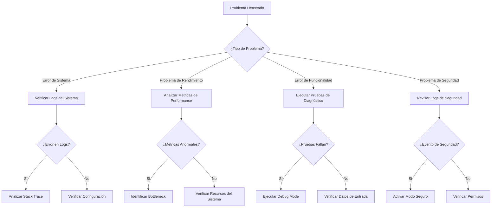

---
title: "Troubleshooting y Solución de Problemas - Dungeon Life Agent"
version: "1.0.0"
date: "2025-10-07"
status: "active"
author: "Dungeon Life Agent Team"
tags: ["troubleshooting", "solucion_problemas", "debug", "diagnostico", "soporte"]
machine_readable_spec:
  schema_version: "1.0"
  ai_compatibility: true
  export_formats: ["markdown", "html", "pdf", "json"]
  support_level: "comprehensive"
  update_frequency: "as_needed"
---

# 🔧 Troubleshooting y Solución de Problemas

## 🎯 Introducción

Esta guía proporciona soluciones detalladas para problemas comunes, procedimientos de diagnóstico y herramientas de debugging para el Dungeon Life Agent. Está diseñada para ayudar tanto a usuarios finales como a desarrolladores a identificar y resolver problemas rápidamente.

---

## 🚨 Diagnóstico Inicial de Problemas

### Árbol de Diagnóstico de Problemas



### Herramientas de Diagnóstico Básicas

#### Comando de Diagnóstico Rápido

```bash
# Diagnóstico básico del agente
python run_agent.py --diagnose

# Salida esperada:
# 🔍 Diagnóstico del Dungeon Life Agent
# ✅ Versión: 1.0.0
# ✅ Modelo: Cargado correctamente
# ✅ Configuración: Válida
# ✅ Memoria: Disponible
# ⚠️  Advertencia: Alto uso de CPU
# ❌ Error: Puerto 8080 ocupado
```

#### Script de Health Check

```python
# tools/diagnostics/health_check.py
import psutil
import requests
import sys
from pathlib import Path

class HealthChecker:
    def __init__(self):
        self.issues = []
        self.warnings = []

    def check_system_health(self):
        """Verificar salud general del sistema"""
        print("🔍 Verificando salud del sistema...")

        # Verificar memoria
        memory = psutil.virtual_memory()
        if memory.percent > 80:
            self.issues.append(f"Memoria alta: {memory.percent}%")
        elif memory.percent > 60:
            self.warnings.append(f"Memoria elevada: {memory.percent}%")

        # Verificar disco
        disk = psutil.disk_usage("A:/")
        if disk.percent > 90:
            self.issues.append(f"Espacio en disco crítico: {disk.percent}%")
        elif disk.percent > 75:
            self.warnings.append(f"Espacio en disco bajo: {disk.percent}%")

        # Verificar procesos
        if not self.check_agent_process():
            self.issues.append("Proceso del agente no encontrado")

    def check_agent_process(self):
        """Verificar si el agente está corriendo"""
        for proc in psutil.process_iter(['pid', 'name', 'cmdline']):
            if 'python' in proc.info['name'] and 'run_agent.py' in ' '.join(proc.info['cmdline']):
                return True
        return False

    def check_configuration(self):
        """Verificar configuración del agente"""
        config_path = Path("A:/07_Tools/DungeonLifeAgent/config/config.yaml")

        if not config_path.exists():
            self.issues.append("Archivo de configuración no encontrado")
            return

        try:
            import yaml
            with open(config_path, 'r') as f:
                config = yaml.safe_load(f)

            # Validar configuración crítica
            if not config.get("system_config", {}).get("model_config", {}).get("model_path"):
                self.issues.append("Ruta del modelo no configurada")

        except Exception as e:
            self.issues.append(f"Error en configuración: {str(e)}")

    def run_diagnostics(self):
        """Ejecutar diagnóstico completo"""
        print("🏥 Ejecutando diagnóstico completo del Dungeon Life Agent")
        print("=" * 60)

        self.check_system_health()
        self.check_configuration()

        # Verificar conectividad
        if not self.check_connectivity():
            self.warnings.append("Limitaciones de conectividad detectadas")

        # Mostrar resultados
        print("\n📊 Resultados del Diagnóstico:")
        print("=" * 60)

        if not self.issues and not self.warnings:
            print("✅ Salud perfecta - No se detectaron problemas")
        else:
            if self.issues:
                print("❌ Problemas detectados:")
                for issue in self.issues:
                    print(f"  • {issue}")

            if self.warnings:
                print("⚠️ Advertencias:")
                for warning in self.warnings:
                    print(f"  • {warning}")

        print("\n💡 Recomendaciones:")
        if self.issues:
            print("  • Revise los problemas detectados antes de continuar")
            print("  • Consulte la sección específica del problema")
        else:
            print("  • Sistema funcionando correctamente")
            print("  • Puede proceder con uso normal")

        return len(self.issues) == 0
```

---

## 🐛 Problemas Comunes y Soluciones

### Problemas de Instalación

#### Error: "No se puede instalar llama-cpp-python"

**Síntomas:**
- Error durante `pip install llama-cpp-python`
- Mensajes sobre compiladores faltantes
- Error "Microsoft Visual C++ 14.0 not found"

**Soluciones:**

1. **Instalar Build Tools (Windows):**
```bash
# Descargar e instalar Microsoft C++ Build Tools
# Desde: https://visualstudio.microsoft.com/visual-cpp-build-tools/

# Luego intentar instalación normal
pip install llama-cpp-python
```

2. **Usar versión precompilada:**
```bash
pip install llama-cpp-python --only-binary=all
```

3. **Instalar versión específica:**
```bash
pip install llama-cpp-python==0.2.0 --extra-index-url https://download.pytorch.org/whl/cpu
```

4. **Alternativa: Usar versión CPU-only:**
```bash
pip install llama-cpp-python --no-cache-dir --force-reinstall
```

#### Error: "Modelo no encontrado"

**Síntomas:**
- Mensaje "Archivo de modelo no encontrado"
- El agente no inicia correctamente
- Error al cargar el modelo GGUF

**Soluciones:**

1. **Verificar ubicación del modelo:**
```bash
# Verificar que el modelo esté en la ubicación correcta
dir "A:/07_Tools/DungeonLifeAgent/models/"

# Debería mostrar: llama-3-8b-instruct.q4_k_m.gguf
```

2. **Descargar modelo manualmente:**
```bash
# Crear directorio
mkdir -p "A:/07_Tools/DungeonLifeAgent/models/"

# Descargar modelo Llama 3 8B
wget "https://huggingface.co/QuantFactory/Meta-Llama-3-8B-Instruct-GGUF/resolve/main/Meta-Llama-3-8B-Instruct.Q4_K_M.gguf" -O "A:/07_Tools/DungeonLifeAgent/models/llama-3-8b-instruct.q4_k_m.gguf"
```

3. **Actualizar configuración:**
```yaml
# En config.yaml, verificar:
model_config:
  model_path: "models/llama-3-8b-instruct.q4_k_m.gguf"
  # Asegurarse de que la ruta sea relativa al directorio del agente
```

#### Error: "Dependencias conflictivas"

**Síntomas:**
- Error durante instalación de dependencias
- Mensajes sobre versiones incompatibles
- Poetry reporta conflictos

**Soluciones:**

1. **Limpiar entorno:**
```bash
# Eliminar entorno virtual
poetry env remove python

# Recrear entorno
poetry install
```

2. **Actualizar Poetry:**
```bash
pip install --upgrade poetry
```

3. **Resolver conflictos manualmente:**
```bash
# Ver conflictos
poetry show --outdated

# Actualizar dependencias específicas
poetry update llama-cpp-python
```

### Problemas de Rendimiento

#### Respuestas Lentas

**Síntomas:**
- El agente tarda >5 segundos en responder
- Alto uso de CPU constantemente
- Mensajes de "procesando consulta..."

**Diagnóstico:**
```bash
# Verificar uso de recursos
python tools/diagnostics/performance_check.py

# Verificar configuración del modelo
python -c "
from config_manager import ConfigManager
config = ConfigManager()
print('Context length:', config.get('model_config.context_length'))
print('GPU layers:', config.get('model_config.gpu_layers'))
"
```

**Soluciones:**

1. **Optimizar configuración del modelo:**
```yaml
# En config.yaml
model_config:
  context_length: 4096  # Reducir de 8192
  max_tokens: 1024      # Reducir de 2048
  gpu_layers: 20        # Específico para tu GPU
  threads: 4           # Limitar threads
```

2. **Liberar memoria:**
```bash
# Limpiar caché
python run_agent.py --clear-cache

# Reiniciar agente
python run_agent.py --restart
```

3. **Usar modelo más pequeño:**
```bash
# Cambiar a Phi-3-mini para respuestas más rápidas
model_config:
  model_path: "models/phi-3-mini-4k-instruct-q4.gguf"
```

#### Alto Uso de Memoria

**Síntomas:**
- El agente usa >2GB de RAM constantemente
- Mensajes de "memoria insuficiente"
- Sistema se ralentiza

**Soluciones:**

1. **Optimizar uso de memoria:**
```yaml
# Configuración de memoria eficiente
performance_config:
  cache_embeddings: false
  preload_common_files: false
  optimize_memory_usage: true
  parallel_processing: false
```

2. **Limpiar cachés regularmente:**
```python
# Script de limpieza automática
import gc
import torch
from memory_manager import MemoryManager

class MemoryOptimizer:
    def optimize_memory(self):
        # Forzar garbage collection
        gc.collect()

        # Limpiar caché de PyTorch (si aplica)
        if torch.cuda.is_available():
            torch.cuda.empty_cache()

        # Limpiar caché del agente
        memory_manager = MemoryManager()
        memory_manager.clear_all_caches()

        print("✅ Memoria optimizada")
```

3. **Monitorear uso de memoria:**
```python
# Monitoreo continuo
import psutil
import time

def monitor_memory_usage():
    process = psutil.Process()
    while True:
        memory_info = process.memory_info()
        memory_percent = process.memory_percent()

        print(f"RAM: {memory_info.rss / 1024 / 1024:.1f}MB ({memory_percent:.1f}%)")

        if memory_percent > 80:
            print("⚠️ Alto uso de memoria detectado")

        time.sleep(60)  # Verificar cada minuto
```

### Problemas de Funcionalidad

#### El Agente No Responde Correctamente

**Síntomas:**
- Respuestas irrelevantes o incorrectas
- No entiende las consultas
- Respuestas demasiado genéricas

**Diagnóstico:**

1. **Verificar detección de rol:**
```bash
# Probar detección de rol
python -c "
from role_detector import RoleDetector
detector = RoleDetector()
rol = detector.detect_role('Necesito información sobre mecánicas de combate')
print('Rol detectado:', rol)
"
```

2. **Verificar conocimiento cargado:**
```bash
# Verificar indexación de conocimiento
python tools/diagnostics/knowledge_check.py
```

**Soluciones:**

1. **Reindexar conocimiento:**
```bash
python run_agent.py --reindex-knowledge
```

2. **Actualizar taxonomía:**
```bash
# Si hay problemas de clasificación
python tools/update_taxonomy.py
```

3. **Verificar configuración de modelo:**
```yaml
# Ajustar parámetros del modelo
model_config:
  temperature: 0.7      # Aumentar para más creatividad
  top_p: 0.9           # Ajustar para mejor coherencia
  repetition_penalty: 1.1  # Evitar respuestas repetitivas
```

#### Problemas de Detección de Rol

**Síntomas:**
- El agente responde como si fuera otro rol
- No adapta respuestas al usuario específico
- Clasificación incorrecta de consultas

**Soluciones:**

1. **Configuración manual de rol:**
```bash
# Durante conversación
Usuario: "configurar rol como game_designer"
Agente: "Rol configurado: Game Designer"
```

2. **Mejorar contexto de usuario:**
```yaml
# En config.yaml
knowledge_config:
  user_context_detection: true
  role_persistence: true
  context_window: 10  # Número de interacciones para detectar rol
```

3. **Actualizar patrones de detección:**
```python
# Si los patrones necesitan ajuste
from role_detector import RoleDetector

detector = RoleDetector()
detector.update_patterns({
    'game_designer': [
        'mecánicas', 'balance', 'stats', 'progresión',
        'economía', 'combate', 'habilidades'
    ]
})
```

### Problemas de Seguridad

#### Operaciones Bloqueadas Inesperadamente

**Síntomas:**
- Operaciones válidas son rechazadas
- Mensajes de "permisos insuficientes"
- Bloqueo de funcionalidades normales

**Diagnóstico:**

1. **Verificar permisos actuales:**
```bash
python tools/diagnostics/security_check.py
```

2. **Revisar logs de seguridad:**
```bash
tail -f "A:/07_Tools/DungeonLifeAgent/logs/security.log"
```

**Soluciones:**

1. **Verificar configuración de seguridad:**
```yaml
# Revisar nivel de seguridad
security_config:
  security_level: "medium"  # Si está en "maximum", bajar a "high"
  strict_mode: false        # Si está causando problemas
```

2. **Reiniciar sesión de seguridad:**
```bash
python run_agent.py --reset-security-session
```

#### Falsos Positivos de Seguridad

**Síntomas:**
- Operaciones legítimas marcadas como sospechosas
- Bloqueos innecesarios
- Alertas de seguridad excesivas

**Soluciones:**

1. **Ajustar sensibilidad de seguridad:**
```yaml
security_monitoring:
  check_suspicious_patterns: true
  alert_threshold: "medium"  # En lugar de "low"
  false_positive_rate: "low"
```

2. **Agregar excepciones para operaciones comunes:**
```python
# Para operaciones frecuentes legítimas
from security_manager import SecurityManager

security = SecurityManager()
security.add_trusted_operation(
    operation_type="file_read",
    user_pattern="game_designer",
    resource_pattern="DLE_*/GDD_*"
)
```

### Problemas de Integración

#### Problemas con Git Integration

**Síntomas:**
- Comandos Git no funcionan
- Error "Git no encontrado"
- Problemas de permisos con repositorio

**Soluciones:**

1. **Verificar instalación de Git:**
```bash
git --version
# Debería mostrar versión 2.34.0 o superior
```

2. **Configurar Git correctamente:**
```bash
git config --global user.name "Tu Nombre"
git config --global user.email "tu.email@ejemplo.com"
```

3. **Verificar permisos del repositorio:**
```bash
# Verificar que el agente puede acceder al repositorio
python -c "
import git
try:
    repo = git.Repo('A:/')
    print('✅ Acceso al repositorio OK')
except Exception as e:
    print(f'❌ Error de acceso: {e}')
"
```

#### Problemas con Shell Integration

**Síntomas:**
- Comandos del sistema no ejecutan
- Error "comando no encontrado"
- Problemas de permisos

**Soluciones:**

1. **Verificar comandos disponibles:**
```python
# Probar comandos básicos
from shell_integration import ShellIntegration

shell = ShellIntegration()
result = shell.execute_command("dir")
print("Resultado:", result)
```

2. **Configurar comandos permitidos:**
```yaml
# En config.yaml
tools_config:
  shell_commands:
    allowed_commands: ["dir", "ls", "cat", "head", "tail", "find"]
    timeout: 30
    max_output_size: "10MB"
```

---

## 🔧 Herramientas de Debugging Avanzadas

### Debugger Interactivo

#### Script de Debug Paso a Paso

```python
# tools/debug/debug_agent.py
import pdb
import sys
from pathlib import Path

class AgentDebugger:
    def __init__(self):
        self.breakpoints = []

    def debug_query(self, query, role="guionista"):
        """Debug paso a paso de una consulta"""
        print(f"🐛 Debug de consulta: {query}")
        print(f"👤 Rol: {role}")

        # Punto de quiebre 1: Detección de rol
        pdb.set_trace()
        print("🔍 Paso 1: Detección de rol")

        # Punto de quiebre 2: Análisis de consulta
        pdb.set_trace()
        print("🔍 Paso 2: Análisis de consulta")

        # Punto de quiebre 3: Búsqueda de conocimiento
        pdb.set_trace()
        print("🔍 Paso 3: Búsqueda de conocimiento")

        # Punto de quiebre 4: Generación de respuesta
        pdb.set_trace()
        print("🔍 Paso 4: Generación de respuesta")

        return "Debug completado"

    def debug_file_operation(self, operation, file_path):
        """Debug de operación de archivos"""
        print(f"🐛 Debug operación: {operation} en {file_path}")

        # Verificar permisos
        pdb.set_trace()
        print("🔍 Verificando permisos")

        # Verificar archivo
        pdb.set_trace()
        print("🔍 Verificando archivo")

        # Crear respaldo
        pdb.set_trace()
        print("🔍 Creando respaldo")

        # Ejecutar operación
        pdb.set_trace()
        print("🔍 Ejecutando operación")

        return "Debug de operación completado"
```

### Analizador de Performance

#### Profiler de Rendimiento

```python
# tools/debug/performance_profiler.py
import cProfile
import pstats
import time
from functools import wraps

class PerformanceProfiler:
    def __init__(self):
        self.stats = []

    def profile_function(self, func):
        """Decorador para perfilar funciones"""
        @wraps(func)
        def wrapper(*args, **kwargs):
            profiler = cProfile.Profile()
            profiler.enable()

            result = func(*args, **kwargs)

            profiler.disable()
            stats = pstats.Stats(profiler)
            stats.sort_stats('cumulative')

            self.stats.append({
                'function': func.__name__,
                'stats': stats,
                'timestamp': time.time()
            })

            return result
        return wrapper

    def profile_query(self, query_text):
        """Perfilar una consulta completa"""
        profiler = cProfile.Profile()
        profiler.enable()

        # Aquí iría la lógica de consulta del agente
        time.sleep(0.1)  # Simulación

        profiler.disable()

        # Guardar estadísticas
        stats = pstats.Stats(profiler)
        stats.sort_stats('cumulative')

        # Mostrar resultados
        print("📊 Perfil de rendimiento:")
        stats.print_stats(10)  # Top 10 funciones más lentas

        return stats

    def generate_performance_report(self):
        """Generar reporte de rendimiento"""
        if not self.stats:
            return "No hay datos de rendimiento disponibles"

        report = []
        report.append("# 📊 Reporte de Rendimiento")
        report.append("")

        for stat in self.stats[-5:]:  # Últimas 5 ejecuciones
            report.append(f"## Función: {stat['function']}")
            report.append(f"**Timestamp:** {stat['timestamp']}")
            report.append("**Top 5 funciones más lentas:**")

            # Extraer información de stats
            lines = []
            stats_stream = io.StringIO()
            stat['stats'].print_stats(5, stream=stats_stream)
            lines = stats_stream.getvalue().split('\n')

            for line in lines[:10]:  # Primeras 10 líneas relevantes
                if line.strip():
                    report.append(f"    {line}")

            report.append("")

        return '\n'.join(report)
```

### Analizador de Memoria

#### Memory Debugger

```python
# tools/debug/memory_analyzer.py
import gc
import tracemalloc
from memory_profiler import profile
import psutil

class MemoryAnalyzer:
    def __init__(self):
        self.memory_snapshots = []

    def start_memory_tracking(self):
        """Iniciar seguimiento de memoria"""
        tracemalloc.start()
        gc.collect()

    def take_memory_snapshot(self, label=""):
        """Tomar snapshot de memoria"""
        current, peak = tracemalloc.get_traced_memory()

        snapshot = {
            'label': label,
            'timestamp': time.time(),
            'current_mb': current / 1024 / 1024,
            'peak_mb': peak / 1024 / 1024,
            'system_memory': psutil.virtual_memory().percent
        }

        self.memory_snapshots.append(snapshot)
        return snapshot

    def compare_snapshots(self, snapshot1, snapshot2):
        """Comparar dos snapshots de memoria"""
        current_diff = snapshot2['current_mb'] - snapshot1['current_mb']
        peak_diff = snapshot2['peak_mb'] - snapshot1['peak_mb']

        return {
            'current_mb_diff': current_diff,
            'peak_mb_diff': peak_diff,
            'significant_increase': current_diff > 50,  # Más de 50MB
            'memory_leak_suspected': peak_diff > 100   # Más de 100MB
        }

    def analyze_memory_usage(self):
        """Análisis completo de uso de memoria"""
        print("🔍 Analizando uso de memoria...")

        # Snapshot inicial
        self.start_memory_tracking()
        initial = self.take_memory_snapshot("initial")

        # Simular operaciones del agente
        print("Ejecutando operaciones de prueba...")

        # Carga de conocimiento
        middle = self.take_memory_snapshot("after_knowledge_load")

        # Consulta de prueba
        final = self.take_memory_snapshot("after_query")

        # Análisis comparativo
        load_analysis = self.compare_snapshots(initial, middle)
        query_analysis = self.compare_snapshots(middle, final)

        print("📊 Análisis de memoria:")
        print(f"  Uso inicial: {initial['current_mb']:.1f}MB")
        print(f"  Después de cargar conocimiento: {middle['current_mb']:.1f}MB (+{load_analysis['current_mb_diff']:.1f}MB)")
        print(f"  Después de consulta: {final['current_mb']:.1f}MB (+{query_analysis['current_mb_diff']:.1f}MB)")

        if load_analysis['memory_leak_suspected'] or query_analysis['memory_leak_suspected']:
            print("⚠️ Posible memory leak detectado")
            print("💡 Recomendaciones:")
            print("  • Revisar liberación de memoria en knowledge layer")
            print("  • Verificar limpieza de cachés después de consultas")
            print("  • Considerar optimización de modelo")

        return {
            'snapshots': [initial, middle, final],
            'analysis': [load_analysis, query_analysis]
        }
```

---

## 📊 Logs y Monitoreo

### Sistema de Logs Detallado

#### Interpretación de Logs

**Log de Operación Normal:**
```
2025-10-07 10:30:45 INFO    agent_core.py:123 - Consulta recibida
2025-10-07 10:30:45 DEBUG   role_detector.py:45 - Rol detectado: guionista
2025-10-07 10:30:46 INFO    knowledge_layer.py:234 - Búsqueda realizada: 15 resultados
2025-10-07 10:30:47 INFO    mode_manager.py:67 - Respuesta generada en Modo 1
```

**Log de Error:**
```
2025-10-07 10:30:45 ERROR   agent_core.py:125 - Error procesando consulta
2025-10-07 10:30:45 ERROR   agent_core.py:126 - Exception: FileNotFoundError
2025-10-07 10:30:45 DEBUG   traceback: - Archivo no encontrado: models/model.gguf
```

**Log de Seguridad:**
```
2025-10-07 10:30:45 WARN    security.py:234 - Operación sospechosa detectada
2025-10-07 10:30:45 INFO    security.py:235 - Usuario: game_designer, Operación: file_write
2025-10-07 10:30:45 INFO    security.py:236 - Archivo: DLE_500_Test.md, Acción: bloqueada
```

#### Herramientas de Análisis de Logs

```python
# tools/debug/log_analyzer.py
import re
from pathlib import Path
from collections import defaultdict, Counter

class LogAnalyzer:
    def __init__(self, log_file="A:/07_Tools/DungeonLifeAgent/logs/agent.log"):
        self.log_file = Path(log_file)
        self.error_patterns = self.load_error_patterns()

    def analyze_logs(self, hours_back=24):
        """Analizar logs de las últimas horas"""
        if not self.log_file.exists():
            return {"error": "Archivo de log no encontrado"}

        # Leer logs recientes
        logs = self.read_recent_logs(hours_back)

        # Análisis básico
        analysis = {
            "total_lines": len(logs),
            "error_count": self.count_errors(logs),
            "warning_count": self.count_warnings(logs),
            "performance_issues": self.identify_performance_issues(logs),
            "common_errors": self.get_most_common_errors(logs),
            "time_range": self.get_time_range(logs)
        }

        return analysis

    def count_errors(self, logs):
        """Contar errores en logs"""
        error_count = 0
        for log in logs:
            if 'ERROR' in log:
                error_count += 1
        return error_count

    def count_warnings(self, logs):
        """Contar advertencias en logs"""
        warning_count = 0
        for log in logs:
            if 'WARN' in log:
                warning_count += 1
        return warning_count

    def identify_performance_issues(self, logs):
        """Identificar problemas de rendimiento"""
        issues = []

        for log in logs:
            # Buscar operaciones lentas
            if 'response_time' in log and 'segundos' in log:
                # Extraer tiempo de respuesta
                time_match = re.search(r'response_time.*(\d+\.?\d*)', log)
                if time_match:
                    response_time = float(time_match.group(1))
                    if response_time > 5.0:
                        issues.append(f"Respuesta lenta: {response_time}s")

            # Buscar alto uso de memoria
            if 'memory' in log and 'MB' in log:
                memory_match = re.search(r'memory.*(\d+)', log)
                if memory_match:
                    memory_mb = int(memory_match.group(1))
                    if memory_mb > 2000:
                        issues.append(f"Alto uso de memoria: {memory_mb}MB")

        return issues

    def get_most_common_errors(self, logs, limit=5):
        """Obtener errores más comunes"""
        error_messages = []

        for log in logs:
            if 'ERROR' in log:
                # Extraer mensaje de error
                error_match = re.search(r'ERROR.*- (.+)', log)
                if error_match:
                    error_messages.append(error_match.group(1))

        # Contar frecuencia
        error_counts = Counter(error_messages)
        return error_counts.most_common(limit)
```

### Dashboard de Logs en Tiempo Real

#### Monitor de Logs

```python
# tools/debug/log_monitor.py
import time
from pathlib import Path
import subprocess

class LogMonitor:
    def __init__(self, log_file="A:/07_Tools/DungeonLifeAgent/logs/agent.log"):
        self.log_file = Path(log_file)
        self.last_position = 0

    def monitor_logs(self, callback=None):
        """Monitorear logs en tiempo real"""
        print(f"📋 Monitoreando logs: {self.log_file}")
        print("Presiona Ctrl+C para detener...")

        try:
            while True:
                if self.log_file.exists():
                    # Leer nuevas líneas
                    new_lines = self.read_new_lines()

                    for line in new_lines:
                        print(f"📄 {line}")

                        # Callback para procesamiento adicional
                        if callback:
                            callback(line)

                time.sleep(1)  # Verificar cada segundo

        except KeyboardInterrupt:
            print("\n✅ Monitoreo detenido")

    def read_new_lines(self):
        """Leer nuevas líneas del archivo de log"""
        try:
            with open(self.log_file, 'r', encoding='utf-8') as f:
                f.seek(self.last_position)
                new_lines = f.readlines()
                self.last_position = f.tell()
                return [line.strip() for line in new_lines if line.strip()]
        except:
            return []

    def filter_logs(self, filter_pattern, hours_back=1):
        """Filtrar logs por patrón"""
        if not self.log_file.exists():
            return []

        # Calcular timestamp de corte
        cutoff_time = time.time() - (hours_back * 3600)

        filtered_logs = []

        with open(self.log_file, 'r', encoding='utf-8') as f:
            for line in f:
                # Verificar si línea contiene patrón
                if filter_pattern.lower() in line.lower():
                    # Extraer timestamp si está disponible
                    timestamp_match = re.search(r'(\d{4}-\d{2}-\d{2} \d{2}:\d{2}:\d{2})', line)
                    if timestamp_match:
                        # Aquí podrías verificar el timestamp
                        filtered_logs.append(line.strip())

        return filtered_logs
```

---

## 🚨 Respuesta a Emergencias

### Procedimientos de Emergencia

#### Modo de Recuperación

**Activación:**
```bash
# Activar modo de recuperación
python run_agent.py --emergency-mode

# O desde la interfaz
Usuario: "activar modo emergencia"
Agente: "Modo de emergencia activado"
```

**Características del Modo Emergencia:**
- ✅ Solo operaciones de lectura permitidas
- ✅ Respaldo automático de todo el sistema
- ✅ Logging detallado de todas las operaciones
- ✅ Monitoreo continuo de recursos
- ❌ No se permiten modificaciones

#### Recuperación de Fallos Críticos

```python
class EmergencyRecovery:
    def __init__(self):
        self.recovery_steps = [
            "backup_critical_data",
            "stop_non_essential_services",
            "restart_core_components",
            "validate_system_integrity",
            "restore_from_backup_if_needed"
        ]

    def perform_emergency_recovery(self, failure_reason):
        """Realizar recuperación de emergencia"""
        print(f"🚨 Iniciando recuperación de emergencia: {failure_reason}")

        recovery_log = []

        for step in self.recovery_steps:
            try:
                print(f"🔄 Ejecutando: {step}")

                if step == "backup_critical_data":
                    result = self.backup_critical_data()
                elif step == "stop_non_essential_services":
                    result = self.stop_non_essential_services()
                elif step == "restart_core_components":
                    result = self.restart_core_components()
                elif step == "validate_system_integrity":
                    result = self.validate_system_integrity()
                elif step == "restore_from_backup_if_needed":
                    result = self.restore_from_backup_if_needed()

                recovery_log.append({"step": step, "success": True, "result": result})

            except Exception as e:
                recovery_log.append({"step": step, "success": False, "error": str(e)})
                print(f"❌ Error en {step}: {e}")

                # Si falla un paso crítico, intentar restauración completa
                if step in ["backup_critical_data", "validate_system_integrity"]:
                    print("🔥 Paso crítico falló, iniciando restauración completa...")
                    self.full_system_restore()
                    break

        # Reporte final
        success_count = sum(1 for step in recovery_log if step["success"])
        print(f"✅ Recuperación completada: {success_count}/{len(recovery_log)} pasos exitosos")

        return recovery_log
```

---

## 📋 Guías de Solución Rápida

### Cheat Sheet de Problemas Comunes

| Problema | Síntoma | Solución Rápida |
|----------|---------|-----------------|
| **Agente no inicia** | Error de modelo | `python run_agent.py --reinstall-model` |
| **Respuestas lentas** | >5 segundos | `python run_agent.py --optimize-performance` |
| **Alto uso memoria** | >2GB constantes | `python run_agent.py --clear-cache` |
| **Error permisos** | Acceso denegado | `python run_agent.py --reset-permissions` |
| **Git no funciona** | Comandos fallan | `python run_agent.py --reconfigure-git` |
| **Búsqueda falla** | No encuentra archivos | `python run_agent.py --reindex-knowledge` |

### Comandos de Recuperación Rápida

```bash
# Recuperación básica
python run_agent.py --recover

# Recuperación avanzada
python run_agent.py --full-recovery

# Reset completo (con confirmación)
python run_agent.py --factory-reset
```

---

## 📚 Recursos Adicionales

### Documentación Relacionada

- **[Guía de Instalación](06_Instalacion_y_Configuracion.md)** - Para problemas de setup
- **[Guía de Seguridad](10_Seguridad_y_Permisos.md)** - Para problemas de permisos
- **[Guía de Testing](11_Testing_y_Validacion.md)** - Para diagnóstico avanzado
- **[API Reference](09_API_y_Interfaces.md)** - Para problemas de integración

### Herramientas Externas

- **Procesos del Sistema**: `psutil` para monitoreo avanzado
- **Análisis de Memoria**: `memory_profiler` para profiling detallado
- **Análisis de Red**: `wireshark` para problemas de conectividad
- **Sistema de Archivos**: `winutils` para análisis de disco

### Comunidad y Soporte

Si los problemas persisten después de seguir estas guías:

1. **Revisar logs detalladamente** usando las herramientas proporcionadas
2. **Ejecutar diagnóstico completo** con `python run_agent.py --diagnose`
3. **Consultar documentación específica** del componente problemático
4. **Reportar el problema** usando el sistema integrado del agente

---

Esta guía de troubleshooting proporciona herramientas completas para diagnosticar y resolver problemas del Dungeon Life Agent, desde issues simples hasta situaciones de emergencia que requieren recuperación completa del sistema.

¿Estás experimentando un problema específico que no está cubierto en esta guía? Describe el problema y recibirás asistencia personalizada para su resolución.</result>
</attempt_completion>