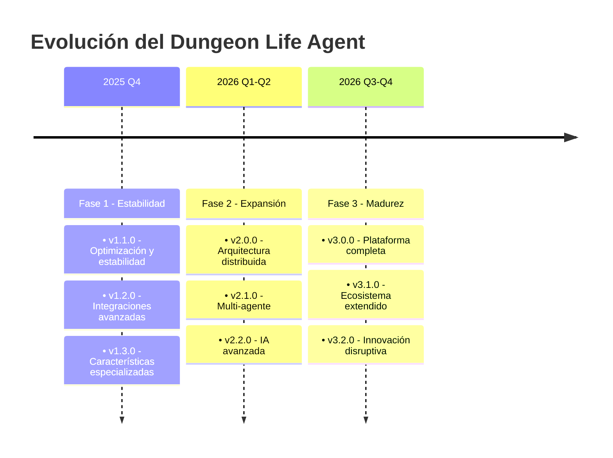
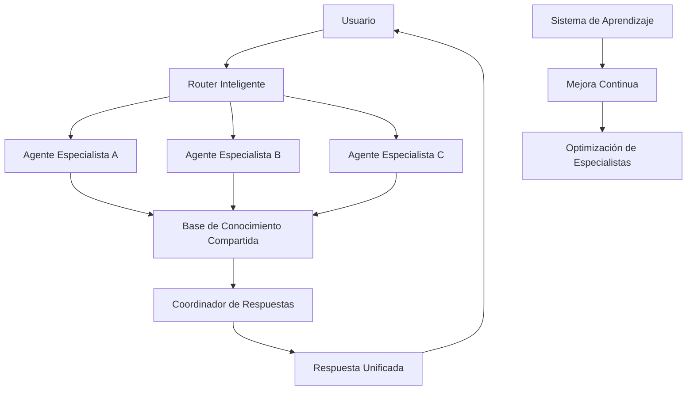
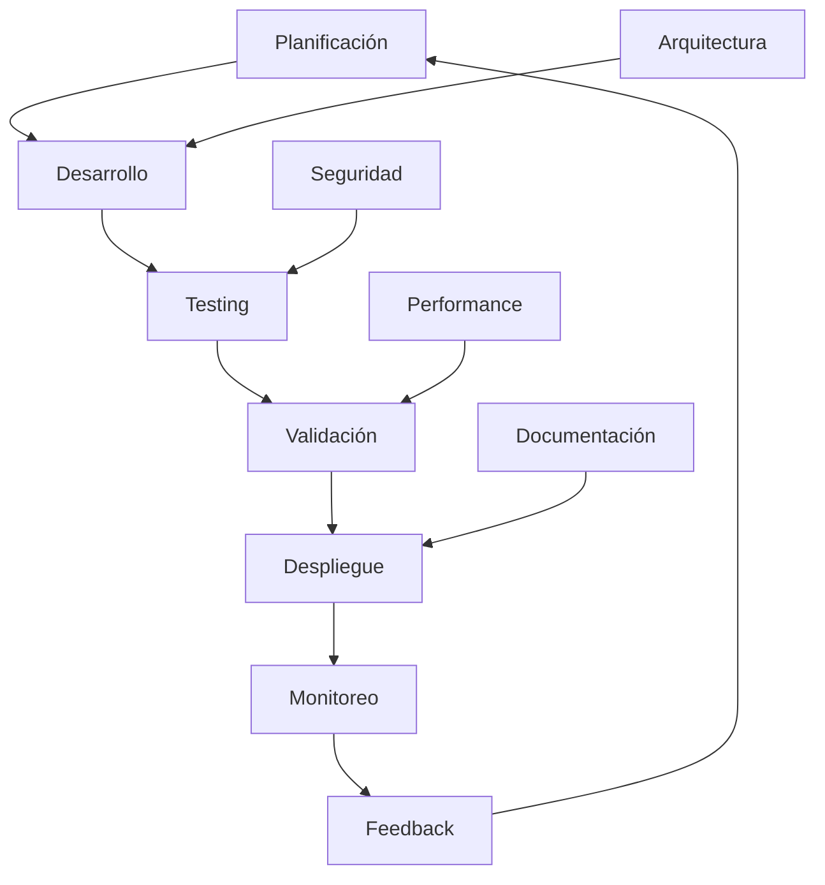

---
title: "Roadmap y Evolución del Dungeon Life Agent"
version: "1.0.0"
date: "2025-10-07"
status: "active"
author: "Dungeon Life Agent Team"
tags: ["roadmap", "evolucion", "planificacion", "futuro", "desarrollo"]
machine_readable_spec:
  schema_version: "1.0"
  ai_compatibility: true
  export_formats: ["markdown", "html", "pdf", "json"]
  roadmap_type: "comprehensive"
  update_frequency: "quarterly"
---

# 🗺️ Roadmap y Evolución del Dungeon Life Agent

## 🎯 Visión General

Este documento establece la hoja de ruta estratégica para la evolución continua del Dungeon Life Agent, desde su estado actual hasta su visión futura como un componente integral del ecosistema DLE. Incluye planificación de versiones, nuevas funcionalidades y estrategias de crecimiento.

---

## 📅 Horizonte de Planificación

### Marcos Temporales



---

## 🚀 Fase 1: Estabilidad y Optimización (Q4 2025)

### v1.1.0 - Optimización y Estabilidad

**Fecha objetivo:** Diciembre 2025
**Nivel de esfuerzo:** Alto
**Riesgo:** Bajo

#### Objetivos Principales
- ✅ Optimizar rendimiento general
- ✅ Mejorar estabilidad del sistema
- ✅ Refinar experiencia de usuario
- ✅ Expandir cobertura de conocimiento

#### Características Clave

**Optimización de Performance**
```yaml
performance_improvements:
  tiempo_respuesta:
    objetivo: "<1 segundo promedio"
    mejoras: ["cache inteligente", "preloading predictivo", "optimización GPU"]

  uso_memoria:
    objetivo: "<1GB promedio"
    mejoras: ["gestión inteligente de memoria", "limpieza automática", "compresión"]

  throughput:
    objetivo: ">60 consultas/minuto"
    mejoras: ["procesamiento paralelo", "streaming respuestas", "batch processing"]
```

**Mejoras de Estabilidad**
```yaml
stability_improvements:
  error_rate:
    objetivo: "<0.1%"
    mejoras: ["manejo robusto de errores", "recuperación automática", "circuit breakers"]

  uptime:
    objetivo: ">99.9%"
    mejoras: ["monitoreo continuo", "alertas proactivas", "auto-recuperación"]

  data_integrity:
    objetivo: "100%"
    mejoras: ["validación continua", "checksums", "respaldo automático"]
```

**Expansión de Conocimiento**
```yaml
knowledge_expansion:
  cobertura_documentos:
    objetivo: ">95% del repositorio"
    mejoras: ["indexación automática", "actualización en tiempo real", "embeddings avanzados"]

  precision_busqueda:
    objetivo: ">90% precisión"
    mejoras: ["modelos de búsqueda híbridos", "contexto semántico", "aprendizaje continuo"]

  personalizacion:
    objetivo: "Respuestas 100% adaptadas al rol"
    mejoras: ["perfiles de usuario avanzados", "historial de preferencias", "aprendizaje de patrones"]
```

### v1.2.0 - Integraciones Avanzadas

**Fecha objetivo:** Enero 2026
**Nivel de esfuerzo:** Medio-Alto
**Riesgo:** Medio

#### Nuevas Integraciones

**MCP Server Avanzado**
```yaml
mcp_advanced:
  herramientas_externas:
    - "Blender MCP": "Automatización completa de pipeline 3D"
    - "Unreal Engine MCP": "Integración directa con motor de juego"
    - "Git MCP": "Operaciones avanzadas de control de versiones"
    - "Database MCP": "Acceso directo a bases de datos del proyecto"

  protocolos_extendidos:
    - "MCP over WebSocket": "Comunicación en tiempo real"
    - "MCP over HTTP/2": "Múltiples conexiones simultáneas"
    - "MCP Streaming": "Transferencia de datos grandes"
```

**Integración con Herramientas de Desarrollo**
```yaml
development_tools:
  ide_integration:
    herramientas: ["VS Code", "PyCharm", "Vim", "Emacs"]
    caracteristicas: ["autocompletado inteligente", "sugerencias contextuales", "documentación integrada"]

  ci_cd_integration:
    plataformas: ["GitHub Actions", "GitLab CI", "Jenkins"]
    caracteristicas: ["testing automatizado", "despliegue continuo", "monitoreo de calidad"]

  collaboration_tools:
    plataformas: ["Discord", "Slack", "Microsoft Teams"]
    caracteristicas: ["notificaciones inteligentes", "reportes automáticos", "consultas por chat"]
```

### v1.3.0 - Características Especializadas

**Fecha objetivo:** Febrero 2026
**Nivel de esfuerzo:** Alto
**Riesgo:** Medio

#### Especializaciones por Rol

**Para Guionistas**
```yaml
writer_specialization:
  asistente_narrativo:
    caracteristicas: ["generación de tramas", "desarrollo de personajes", "análisis de coherencia"]

  herramientas_escritura:
    caracteristicas: ["sugerencias de diálogo", "estructuración de escenas", "análisis de ritmo"]

  integracion_narrativa:
    caracteristicas: ["conexión automática de elementos", "detección de inconsistencias", "sugerencias de mejora"]
```

**Para Game Designers**
```yaml
gamedesigner_specialization:
  asistente_balance:
    caracteristicas: ["análisis automático de balance", "sugerencias de ajuste", "comparación con estándares"]

  herramientas_mecanicas:
    caracteristicas: ["generador de mecánicas", "validador de reglas", "simulador de sistemas"]

  optimizacion_juego:
    caracteristicas: ["análisis de performance", "sugerencias de optimización", "testing automatizado"]
```

**Para 3D Artists**
```yaml
artist3d_specialization:
  asistente_tecnico:
    caracteristicas: ["optimización automática de modelos", "validación de estándares", "sugerencias técnicas"]

  herramientas_pipeline:
    caracteristicas: ["automatización de tareas repetitivas", "validación de calidad", "generación de reportes"]

  integracion_blender:
    caracteristicas: ["scripts personalizados", "optimización automática", "estándares de producción"]
```

---

## 🌟 Fase 2: Expansión y Escalabilidad (Q1-Q2 2026)

### v2.0.0 - Arquitectura Distribuida

**Fecha objetivo:** Marzo 2026
**Nivel de esfuerzo:** Muy Alto
**Riesgo:** Alto

#### Arquitectura Multi-Agente



**Componentes Especializados**
```yaml
specialized_agents:
  agente_narrativo:
    descripcion: "Especialista en narrativa y escritura"
    conocimiento: ["tramas", "personajes", "diálogos", "lore"]
    herramientas: ["generador de historias", "analizador de coherencia"]

  agente_tecnico:
    descripcion: "Especialista en mecánicas y sistemas"
    conocimiento: ["balance", "progresión", "economía", "combate"]
    herramientas: ["simulador de balance", "optimizador de mecánicas"]

  agente_visual:
    descripcion: "Especialista en producción 3D y arte"
    conocimiento: ["modelado", "texturizado", "animación", "optimización"]
    herramientas: ["validador técnico", "optimizador de assets"]

  agente_coordinador:
    descripcion: "Coordinador de agentes especializados"
    conocimiento: ["gestión de proyectos", "dependencias", "timeline"]
    herramientas: ["planificador inteligente", "resolvedor de conflictos"]
```

### v2.1.0 - Sistema Multi-Agente

**Fecha objetivo:** Abril 2026
**Nivel de esfuerzo:** Alto
**Riesgo:** Medio-Alto

#### Comunicación Inter-Agente

```yaml
inter_agent_communication:
  protocolo:
    nombre: "Dungeon Life Inter-Agent Protocol (DLIAP)"
    version: "1.0"
    transporte: "Message Queue + API REST"

  tipos_mensaje:
    consulta:
      descripcion: "Solicitud de información especializada"
      campos: ["query", "context", "urgency", "source_agent"]

    respuesta:
      descripcion: "Respuesta de agente especializado"
      campos: ["result", "confidence", "references", "suggestions"]

    coordinacion:
      descripcion: "Mensaje de coordinación entre agentes"
      campos: ["coordination_type", "participants", "objective", "constraints"]

  mecanismos_consenso:
    voting:
      descripcion: "Votación entre agentes para decisiones complejas"
      umbral: "70% acuerdo mínimo"

    hierarchical:
      descripcion: "Decisión basada en jerarquía de especialización"
      niveles: ["especialista > generalista > aprendiz"]
```

### v2.2.0 - IA Avanzada

**Fecha objetivo:** Mayo 2026
**Nivel de esfuerzo:** Muy Alto
**Riesgo:** Alto

#### Capacidades Avanzadas de IA

```yaml
advanced_ai_capabilities:
  aprendizaje_continuo:
    descripcion: "Aprendizaje automático basado en interacciones"
    mecanismos: ["feedback loop", "pattern recognition", "adaptive responses"]

  razonamiento_avanzado:
    descripcion: "Razonamiento multi-paso complejo"
    capacidades: ["cadena de pensamiento", "análisis hipotético", "planificación estratégica"]

  creatividad_aumentada:
    descripcion: "Generación creativa asistida por IA"
    herramientas: ["generador de ideas", "explorador de conceptos", "innovador de soluciones"]

  toma_decisiones:
    descripcion: "Sistema avanzado de toma de decisiones"
    algoritmos: ["árboles de decisión", "análisis de riesgo", "optimización multi-objetivo"]
```

---

## 🚀 Fase 3: Madurez y Innovación (Q3-Q4 2026)

### v3.0.0 - Plataforma Completa

**Fecha objetivo:** Julio 2026
**Nivel de esfuerzo:** Extremo
**Riesgo:** Muy Alto

#### Plataforma Integral

```yaml
complete_platform:
  ecosistema_integrado:
    descripcion: "Plataforma completa para desarrollo de juegos"
    componentes: ["agentes IA", "herramientas automatizadas", "sistemas de colaboración"]

  marketplace_extensiones:
    descripcion: "Mercado de extensiones y plugins"
    caracteristicas: ["plugins personalizados", "temas especializados", "herramientas de terceros"]

  comunidad_activa:
    descripcion: "Comunidad de desarrolladores y usuarios"
    herramientas: ["foros", "documentación colaborativa", "sistema de contribuciones"]
```

### v3.1.0 - Ecosistema Extendido

**Fecha objetivo:** Septiembre 2026
**Nivel de esfuerzo:** Alto
**Riesgo:** Medio

#### Expansión del Ecosistema

```yaml
ecosystem_expansion:
  soporte_multiples_proyectos:
    descripcion: "Soporte para múltiples proyectos simultáneos"
    caracteristicas: ["aislamiento de proyectos", "conocimiento separado", "configuraciones independientes"]

  integracion_industria:
    descripcion: "Integración con estándares de la industria"
    herramientas: ["Unity", "Unreal Engine", "Godot", "Blender", "Substance"]

  colaboracion_remota:
    descripcion: "Herramientas avanzadas de colaboración"
    caracteristicas: ["trabajo remoto", "sincronización en tiempo real", "control de versiones distribuido"]
```

### v3.2.0 - Innovación Disruptiva

**Fecha objetivo:** Noviembre 2026
**Nivel de esfuerzo:** Variable
**Riesgo:** Muy Alto

#### Tecnologías Emergentes

```yaml
disruptive_innovations:
  ia_generativa_avanzada:
    descripcion: "IA generativa de última generación"
    tecnologias: ["modelos de difusión", "transformers avanzados", "redes neuronales especializadas"]

  realidad_aumentada:
    descripcion: "Integración con AR/VR para desarrollo inmersivo"
    aplicaciones: ["visualización 3D", "testing inmersivo", "colaboración remota"]

  blockchain_integration:
    descripcion: "Integración con blockchain para trazabilidad"
    usos: ["certificación de assets", "historial de cambios", "propiedad intelectual"]

  quantum_computing:
    descripcion: "Exploración de computación cuántica"
    aplicaciones: ["optimización compleja", "simulación avanzada", "criptografía cuántica"]
```

---

## 📊 Métricas de Éxito

### KPIs por Fase

#### Fase 1: Estabilidad
```yaml
phase1_kpis:
  rendimiento:
    tiempo_respuesta_promedio: "<2 segundos"
    throughput: ">30 consultas/minuto"
    uptime: ">99.5%"

  calidad:
    precision_respuestas: ">90%"
    satisfaccion_usuario: ">4.5/5"
    cobertura_conocimiento: ">95%"

  estabilidad:
    error_rate: "<0.5%"
    recovery_time: "<5 minutos"
    data_integrity: "100%"
```

#### Fase 2: Expansión
```yaml
phase2_kpis:
  escalabilidad:
    usuarios_concurrentes: ">50"
    proyectos_simultaneos: ">10"
    volumen_datos: ">1TB"

  integracion:
    herramientas_conectadas: ">20"
    protocolos_soportados: ">5"
    tiempo_integracion: "<1 hora"

  inteligencia:
    precision_multiagente: ">95%"
    velocidad_coordinacion: "<100ms"
    aprendizaje_autonomo: ">80% precisión"
```

#### Fase 3: Madurez
```yaml
phase3_kpis:
  adopcion:
    usuarios_activos: ">1000"
    proyectos_usando_plataforma: ">100"
    tiempo_adopcion: "<1 semana"

  impacto_industria:
    publicaciones_academicas: ">5"
    contribuciones_open_source: ">50"
    estandares_industria: ">3"

  innovacion:
    patentes_presentadas: ">10"
    tecnologias_disruptivas: ">3"
    publicaciones_impacto: ">20"
```

---

## 🔄 Procesos de Desarrollo

### Ciclo de Desarrollo



### Gestión de Versiones

#### Estrategia de Release

```yaml
release_strategy:
  frecuencia:
    parches_criticos: "Según necesidad"
    versiones_menores: "Mensual"
    versiones_mayores: "Trimestral"

  proceso_release:
    desarrollo: "Rama develop"
    staging: "Rama staging"
    produccion: "Rama main"

  testing_antes_release:
    unit_tests: "Obligatorio"
    integration_tests: "Obligatorio"
    e2e_tests: "Obligatorio"
    performance_tests: "Obligatorio"
    security_tests: "Obligatorio"

  rollback_plan:
    tiempo_maximo: "<30 minutos"
    datos_preserve: "100%"
    notificaciones: "Automáticas a todos los usuarios"
```

---

## 🎓 Formación y Capacitación

### Programa de Formación

#### Niveles de Capacitación

```yaml
training_program:
  nivel_basico:
    descripcion: "Para nuevos usuarios del agente"
    duracion: "2 horas"
    contenido: ["introducción básica", "consultas simples", "navegación"]
    certificacion: "Badge de usuario básico"

  nivel_intermedio:
    descripcion: "Para usuarios regulares"
    duracion: "4 horas"
    contenido: ["modos avanzados", "consultas complejas", "integraciones"]
    certificacion: "Badge de usuario avanzado"

  nivel_experto:
    descripcion: "Para power users y desarrolladores"
    duracion: "8 horas"
    contenido: ["desarrollo de extensiones", "APIs avanzadas", "troubleshooting"]
    certificacion: "Badge de desarrollador certificado"

  nivel_especialista:
    descripcion: "Para formadores y consultores"
    duracion: "16 horas"
    contenido: ["arquitectura interna", "desarrollo de agentes", "estrategia"]
    certificacion: "Badge de especialista certificado"
```

### Recursos de Aprendizaje

#### Documentación Evolutiva

```yaml
learning_resources:
  documentacion_interactiva:
    descripcion: "Documentación que se actualiza con el uso"
    caracteristicas: ["ejemplos personalizados", "tutoriales adaptativos", "ayuda contextual"]

  comunidad_aprendizaje:
    descripcion: "Plataforma de aprendizaje colaborativo"
    herramientas: ["foros de discusión", "sesiones de Q&A", "proyectos colaborativos"]

  certificaciones:
    descripcion: "Programa de certificaciones oficial"
    niveles: ["usuario", "desarrollador", "arquitecto", "formador"]
    validez: "2 años con renovación automática"
```

---

## 🌍 Expansión Internacional

### Soporte Multi-Idioma

#### Idiomas Soportados

```yaml
language_support:
  lanzamiento_inicial:
    idiomas: ["Español", "Inglés"]
    cobertura: "100% funcionalidades"

  expansion_fase1:
    idiomas: ["Francés", "Alemán", "Italiano", "Portugués"]
    cobertura: ">90% funcionalidades"

  expansion_fase2:
    idiomas: ["Japonés", "Chino", "Coreano", "Ruso"]
    cobertura: ">80% funcionalidades"

  soporte_idioma:
    deteccion_automatica: true
    traduccion_contextual: true
    preservacion_terminologia: true
```

### Adaptación Cultural

#### Localización Completa

```yaml
cultural_adaptation:
  convenciones_regionales:
    descripcion: "Adaptación a convenciones locales"
    aspectos: ["formato de fechas", "unidades de medida", "convenciones de nombres"]

  sensibilidad_cultural:
    descripcion: "Respeto por diferencias culturales"
    mecanismos: ["detección de contexto cultural", "adaptación automática", "evitación de sesgos"]

  soporte_regional:
    descripcion: "Características específicas por región"
    ejemplos: ["integración con herramientas populares localmente", "formatos de archivo regionales"]
```

---

## 💡 Innovación Continua

### Investigación y Desarrollo

#### Áreas de Investigación

```yaml
research_areas:
  ia_conversacional_avanzada:
    descripcion: "Mejora continua de capacidades conversacionales"
    objetivos: ["comprensión contextual perfecta", "respuestas naturales", "manejo de ambigüedad"]

  automatizacion_inteligente:
    descripcion: "Automatización de tareas complejas"
    objetivos: ["identificación automática de tareas", "ejecución segura", "aprendizaje de procesos"]

  colaboracion_humano_ia:
    descripcion: "Optimización de interacción humano-IA"
    objetivos: ["flujos de trabajo híbridos", "toma de decisiones colaborativa", "creatividad aumentada"]

  escalabilidad_extrema:
    descripcion: "Soporte para cargas masivas"
    objetivos: ["procesamiento distribuido", "arquitectura serverless", "optimización automática"]
```

### Programa de Innovación

#### Mecanismos de Innovación

```yaml
innovation_program:
  hackathons_internos:
    frecuencia: "Trimestral"
    duracion: "3 días"
    enfoque: "Exploración de nuevas tecnologías"

  colaboracion_academia:
    descripcion: "Colaboración con instituciones académicas"
    actividades: ["proyectos de investigación", "publicaciones conjuntas", "tesis doctorales"]

  open_innovation:
    descripcion: "Innovación abierta con comunidad"
    mecanismos: ["concursos de ideas", "bounties de funcionalidades", "contribuciones open source"]

  laboratorio_innovacion:
    descripcion: "Espacio dedicado a experimentación"
    recursos: ["hardware especializado", "acceso temprano a tecnologías", "equipo dedicado"]
```

---

## 📈 Métricas de Evolución

### Seguimiento de Progreso

#### Dashboard de Evolución

```yaml
evolution_dashboard:
  progreso_versiones:
    descripcion: "Seguimiento de desarrollo de versiones"
    metricas: ["funcionalidades_completadas", "testing_aprobado", "documentacion_actualizada"]

  adopcion_usuario:
    descripcion: "Métricas de adopción y uso"
    metricas: ["usuarios_activos", "frecuencia_uso", "satisfaccion_general"]

  impacto_tecnico:
    descripcion: "Impacto técnico en el ecosistema"
    metricas: ["performance_mejorado", "bugs_reducidos", "integraciones_exitosas"]

  innovacion_generada:
    descripcion: "Innovación y mejora continua"
    metricas: ["nuevas_caracteristicas", "mejoras_sugeridas", "contribuciones_comunidad"]
```

### Reportes de Progreso

#### Reportes Periódicos

```python
class EvolutionReporter:
    def __init__(self):
        self.metrics_collector = MetricsCollector()
        self.progress_analyzer = ProgressAnalyzer()

    def generate_quarterly_report(self) -> Dict:
        """Generar reporte trimestral de evolución"""

        report = {
            "periodo": self.get_current_quarter(),
            "resumen_ejecutivo": self.generate_executive_summary(),
            "progreso_tecnico": self.analyze_technical_progress(),
            "adopcion_usuario": self.analyze_user_adoption(),
            "impacto_negocio": self.analyze_business_impact(),
            "proximos_pasos": self.outline_next_steps(),
            "riesgos_identificados": self.identify_risks(),
            "oportunidades": self.identify_opportunities()
        }

        return report

    def generate_executive_summary(self) -> str:
        """Generar resumen ejecutivo"""
        recent_metrics = self.metrics_collector.get_recent_metrics()

        return f"""
        **Progreso del Trimestre:**

        ✅ **Logros Principales:**
        • {recent_metrics.get('features_completed', 0)} funcionalidades completadas
        • {recent_metrics.get('user_satisfaction', 0)}% satisfacción de usuario
        • {recent_metrics.get('performance_improvement', 0)}% mejora de rendimiento

        📈 **Métricas Clave:**
        • Usuarios activos: {recent_metrics.get('active_users', 0)}
        • Tiempo de respuesta: {recent_metrics.get('avg_response_time', 0)}s
        • Tasa de error: {recent_metrics.get('error_rate', 0)}%

        🚀 **Próximos Objetivos:**
        • Completar optimizaciones de rendimiento
        • Expandir integraciones disponibles
        • Mejorar experiencia de desarrollador
        """

    def analyze_technical_progress(self) -> Dict:
        """Analizar progreso técnico"""
        return {
            "arquitectura": self.analyze_architecture_progress(),
            "seguridad": self.analyze_security_progress(),
            "performance": self.analyze_performance_progress(),
            "escalabilidad": self.analyze_scalability_progress()
        }
```

---

## 🌐 Impacto en la Industria

### Contribución al Ecosistema

#### Estándares y Mejores Prácticas

```yaml
industry_standards:
  contribution_standards:
    descripcion: "Contribución a estándares abiertos"
    areas: ["protocolos de IA", "integración de herramientas", "seguridad en agentes"]

  mejores_practicas:
    descripcion: "Establecimiento de mejores prácticas"
    categorias: ["desarrollo de agentes", "seguridad IA", "colaboración humano-IA"]

  comunidad_open_source:
    descripcion: "Contribución activa a proyectos open source"
    metricas: ["contribuciones de código", "documentación", "soporte comunitario"]
```

### Publicaciones y Reconocimiento

#### Programa de Publicaciones

```yaml
publication_program:
  academic_papers:
    descripcion: "Publicaciones académicas sobre avances técnicos"
    objetivos: ["conferencias IA", "journals especializados", "tesis doctorales"]

  industry_articles:
    descripcion: "Artículos para publicaciones de industria"
    objetivos: ["medios especializados", "blogs técnicos", "casos de estudio"]

  open_source_contributions:
    descripcion: "Contribuciones significativas a proyectos open source"
    metricas: ["proyectos contribuídos", "líneas de código", "issues resueltos"]
```

---

## 🎯 Visión a Largo Plazo

### Horizonte 2027-2030

#### Mega-Tendencias

```yaml
long_term_vision:
  ia_ubicua:
    descripcion: "IA integrada en todos los aspectos del desarrollo"
    timeline: "2027-2028"
    impacto: "Cambio paradigmático en workflows de desarrollo"

  colaboracion_total:
    descripcion: "Colaboración perfecta entre humanos e IA"
    timeline: "2028-2029"
    impacto: "Nuevos modelos de trabajo y creatividad"

  autonomia_creativa:
    descripcion: "IA capaz de autonomía creativa significativa"
    timeline: "2029-2030"
    impacto: "Revolución en industrias creativas"

  ecosistema_global:
    descripcion: "Ecosistema global de herramientas IA colaborativas"
    timeline: "2030+"
    impacto: "Nueva era de desarrollo colaborativo"
```

### Objetivos BHAG (Big Hairy Audacious Goals)

#### Metas Ambiciosas

```yaml
bhag_goals:
  revolucionar_desarrollo_juegos:
    descripcion: "Revolucionar completamente el desarrollo de juegos con IA"
    timeline: "2028"
    metricas: ["reducción 80% tiempo desarrollo", "mejora 200% calidad", "accesibilidad universal"]

  estandar_industria:
    descripcion: "Convertirse en estándar de facto para desarrollo asistido por IA"
    timeline: "2029"
    metricas: ["adopción >70% industria", "certificación estándar", "ecosistema propio"]

  ia_creativa_autonoma:
    descripcion: "Lograr IA creativa verdaderamente autónoma y colaborativa"
    timeline: "2030"
    metricas: ["autonomía creativa >90%", "colaboración seamless", "innovación disruptiva"]
```

---

Este roadmap establece una visión clara y ambiciosa para la evolución del Dungeon Life Agent, desde su estado actual hasta convertirse en una plataforma líder en el ecosistema de desarrollo de juegos asistido por IA.

¿Te interesa profundizar en alguna fase específica del roadmap o explorar detalles de implementación para alguna funcionalidad particular?</result>
</attempt_completion>