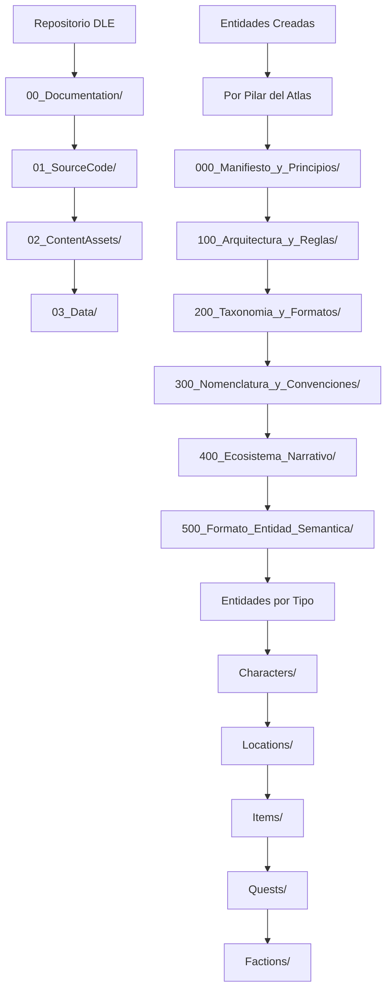

---
title: "Apéndice: Estructura de Directorios para Creación de Entidades Completas"
version: "1.0.0"
date: "2025-10-07"
status: "active"
author: "Dungeon Life Agent Team"
tags: ["apendice", "estructura_directorios", "entidades", "fes", "atlas", "creacion_contenido"]
machine_readable_spec:
  schema_version: "1.0"
  ai_compatible: true
  export_formats: ["markdown", "html", "pdf", "json"]
  structure_type: "hierarchical_entity_creation"
  atlas_compliance: "100%"
---

# 📁 Apéndice: Estructura de Directorios para Creación de Entidades Completas

## 🎯 Introducción

Este apéndice establece la estructura de directorios óptima para crear entidades y personajes completos dentro del ecosistema Dungeon Life, siguiendo estrictamente la arquitectura del Atlas del Proyecto (pilares 000-500) y los sistemas de taxonomía y formatos establecidos.

---

## 🏗️ Arquitectura General de Directorios

### Estructura Base por Pilar del Atlas



### Principios de Organización

#### 1. **Separación por Pilar del Atlas**
Cada entidad debe organizarse según el pilar del Atlas que gobierna su tipo:
- **Pilar 200** (Taxonomía): Define tipos y clasificaciones
- **Pilar 500** (FES): Define estructura de entidades
- **Pilar 400** (Narrativa): Define contexto narrativo
- **Pilar 100** (Arquitectura): Define implementación técnica

#### 2. **Estructura FES Obligatoria**
Toda entidad debe seguir el formato FES (Formato de Entidad Semántica):
```yaml
fes_structure:
  governance: "Metadatos de control y trazabilidad"
  taxonomy: "Clasificación según sistemas del pilar 20"
  trinity: "Balance DMTE (Data/Mechanics/Temporal/Environmental)"
  narrative: "Contexto narrativo y relaciones"
  mechanical: "Especificaciones técnicas y mecánicas"
  iron: "Constraints narrativos (50/30/20)"
  craft: "Aplicación metodología C.R.A.F.T."
```

#### 3. **Nomenclatura Estricta**
Todos los archivos siguen `DLE_[Pilar][Secuencia]_[Tipo]_[Nombre].[ext]`:
- **DLE_**: Prefijo del ecosistema
- **[Pilar]**: Número del pilar (200, 500, etc.)
- **[Secuencia]**: Numeración secuencial dentro del pilar
- **[Tipo]**: Tipo de entidad según DMTE
- **[Nombre]**: Nombre específico de la entidad

---

## 📂 Estructura Detallada por Tipo de Entidad

### 1. Personajes (Characters) - DLE_500_CHAR_*

#### Estructura de Directorios para Personajes

```
01_SourceCode/DLS_V2.1/
├── documentation/DungeonLifeEcosystem/00_Atlas_del_Proyecto/
│   ├── 20_Taxonomia_y_Formatos/
│   │   ├── DLE_21_T_Tipos_de_Entidad.md (Definición tipos)
│   │   ├── DLE_22_T_Tags_Canónicos.md (Tags disponibles)
│   │   └── DLE_23_T_Relaciones_Canónicas.md (Relaciones posibles)
│   │
│   ├── 50_Formato_Entidad_Semantica/
│   │   ├── Sociales/
│   │   │   ├── DLE_540_FES_Character.md (Especificación FES)
│   │   │   └── Plantillas/
│   │   │       ├── TPL_CHAR_Base_FES_v2.1.md (Plantilla base)
│   │   │       └── TPL_CHAR_[Especialidad].md (Plantillas específicas)
│   │   │
│   │   └── Ejemplos/
│   │       └── EJU_001_Creacion_Character_Completo.md (Ejemplo completo)
│   │
│   └── 400_Ecosistema_Narrativo/
│       └── DLE_421_Narrativa_[Personaje].md (Contexto narrativo)
│
└── Characters/ (Implementación técnica)
    ├── DLE_500_CHAR_[Nombre]_v[Version].fes.yml (Archivo FES principal)
    ├── DLE_500_CHAR_[Nombre]_Dialogues.md (Diálogos específicos)
    ├── DLE_500_CHAR_[Nombre]_Quests.md (Quests relacionadas)
    ├── DLE_500_CHAR_[Nombre]_Relationships.md (Red de relaciones)
    └── Assets/
        ├── Concept_[Nombre].png/.jpg (Arte conceptual)
        ├── Model_[Nombre]_Reference.md (Referencias modelo 3D)
        └── Audio_[Nombre]_Voice_Lines.md (Líneas de voz)
```

#### Archivo FES Principal de Personaje

**Ubicación:** `01_SourceCode/DLS_V2.1/Characters/DLE_500_CHAR_[Nombre]_v[Version].fes.yml`

```yaml
# DLE_500_CHAR_Bromar_v1.0.fes.yml
fes_entity:
  # Governance - Control y trazabilidad
  governance:
    entity_id: "char_bromar_001"
    entity_type: "character"
    version: "1.0"
    status: "approved"
    created_at: "2025-10-07"
    created_by: "guionista_senior"
    last_modified: "2025-10-07"
    last_modified_by: "guionista_senior"
    willow_metadata:
      entity_id: "char_bromar_001"
      entity_type: "character"
      version: "1.0"
      status: "approved"
      created_at: "2025-10-07T00:00:00Z"
      created_by: "guionista_senior"
    willow_history:
      - module: "character_creation"
        summary: "Creación completa del personaje Bromar como mentor de Juan"
        changed_by: "guionista_senior"
        timestamp: "2025-10-07T00:00:00Z"

  # Taxonomy - Clasificación según pilar 20
  taxonomy:
    tipo_entidad: "character"
    subtipo: "npc"
    categoria: "mentor"
    tags:
      - "#mentor"
      - "#guardián"
      - "#veterano"
      - "#humano"
      - "#elder_town"
    relaciones_canonicas:
      - target_entity: "juan"
        relationship_type: "mentor_de"
        strength: "fuerte"
      - target_entity: "elder_town"
        relationship_type: "residente_de"
        strength: "fuerte"

  # Trinity - Balance DMTE (Data/Mechanics/Temporal/Environmental)
  trinity_balance:
    data: 0.9        # Información rica y detallada
    mechanics: 0.8   # Mecánicas de combate y mentoría
    temporal: 0.7    # Historia profunda con LOT War
    environmental: 0.6 # Conexión con Elder Town

  # Narrative - Contexto narrativo
  narrative_context:
    arco_desarrollo: "Veterano traumado → Guardián sabio → Leyenda eterna"
    motivaciones:
      - "Redención por fracaso en LOT War"
      - "Proteger Elder Town de amenazas"
      - "Preparar sucesor digno (Juan)"
    conflictos:
      - "Narcolepsia como debilidad física"
      - "Culpa por compañeros caídos"
      - "Presión de responsabilidad comunitaria"
    aliados:
      - "juan" # Aprendiz y sucesor
      - "aeliana" # Consejera espiritual
    antagonistas:
      - "draven" # Rival filosófico

  # Mechanical - Especificaciones técnicas
  mechanical_specs:
    clase_base: "guardián"
    nivel_recomendado: 15
    stats_principales:
      fuerza: 16
      defensa: 18
      liderazgo: 17
      resistencia: 15
    habilidades_especiales:
      - "Postura Defensiva" # Aumenta defensa +50%
      - "Inspiración" # Mejora aliados cercanos
      - "Golpe Guardián" # Contraataque automático
    debilidades:
      - "Narcolepsia" # Puede quedarse dormido en combate
      - "Exceso de confianza" # Baja guardia innecesariamente

  # IRON - Constraints narrativos (50/30/20)
  iron_constraints:
    critical_path: 0.5     # 50% - Elementos centrales de la narrativa
      # - Superviviente LOT War (fondo esencial)
      # - Relación mentor-aprendiz con Juan
      # - Guardián de Elder Town
    supporting_elements: 0.3  # 30% - Elementos de apoyo
      # - Habilidades de combate específicas
      # - Relaciones secundarias
      # - Objetos personales
    emergent_possibilities: 0.2  # 20% - Espacio para evolución
      # - Desarrollo de narcolepsia como poder
      # - Nuevos aliados o amenazas
      # - Evolución de relación con Juan

  # C.R.A.F.T. - Metodología aplicada
  craft_methodology:
    contexto_establecido: "Elder Town post-LOT War"
    reglas_aplicadas: "Sistema de clases, economía, progresión"
    arco_definido: "Redención y transmisión de conocimiento"
    flexibilidad_mantenida: "Espacio para desarrollo orgánico"
    transformacion_lograda: "De guerrero a leyenda"

  # Referencias cruzadas
  cross_references:
    documentos_relacionados:
      - "DLE_400_Quest_Bromar_Arc.md"
      - "DLE_500_LOC_Elder_Town.fes.yml"
      - "DLE_500_CHAR_Juan.fes.yml"
    assets_relacionados:
      - "Concept_Bromar_Mentor.png"
      - "Model_Bromar_Guardian.fbx"
      - "Audio_Bromar_Voice_Set_01.wav"
    sistemas_afectados:
      - "dialogue_system"
      - "quest_system"
      - "combat_system"
```

### 2. Ubicaciones (Locations) - DLE_500_LOC_*

#### Estructura de Directorios para Ubicaciones

```
01_SourceCode/DLS_V2.1/
├── documentation/DungeonLifeEcosystem/00_Atlas_del_Proyecto/
│   ├── 20_Taxonomia_y_Formatos/
│   │   └── DLE_21_T_Tipos_de_Entidad.md (Tipos de location)
│   │
│   ├── 50_Formato_Entidad_Semantica/
│   │   └── Mundiales/
│   │       └── DLE_545_FES_Location.md (Especificación FES)
│   │
│   └── 400_Ecosistema_Narrativo/
│       └── DLE_421_Narrativa_[Ubicacion].md (Contexto narrativo)
│
└── Locations/ (Implementación técnica)
    ├── DLE_500_LOC_[Nombre]_v[Version].fes.yml (Archivo FES principal)
    ├── DLE_500_LOC_[Nombre]_Map.md (Mapa y geografía)
    ├── DLE_500_LOC_[Nombre]_Quests.md (Quests disponibles)
    ├── DLE_500_LOC_[Nombre]_NPCs.md (NPCs residentes)
    └── Assets/
        ├── Map_[Nombre]_Overview.png (Mapa general)
        ├── Location_[Nombre]_Details.png (Detalles específicos)
        └── Environment_[Nombre]_Reference.md (Referencias ambientales)
```

#### Archivo FES Principal de Ubicación

**Ubicación:** `01_SourceCode/DLS_V2.1/Locations/DLE_500_LOC_[Nombre]_v[Version].fes.yml`

```yaml
# DLE_500_LOC_Elder_Town_v1.0.fes.yml
fes_entity:
  # Governance - Control y trazabilidad
  governance:
    entity_id: "loc_elder_town_001"
    entity_type: "location"
    version: "1.0"
    status: "approved"
    created_at: "2025-10-07"
    created_by: "game_designer_senior"
    willow_metadata:
      entity_id: "loc_elder_town_001"
      entity_type: "location"
      version: "1.0"
      status: "approved"
      created_at: "2025-10-07T00:00:00Z"
      created_by: "game_designer_senior"

  # Taxonomy - Clasificación según pilar 20
  taxonomy:
    tipo_entidad: "location"
    subtipo: "settlement"
    categoria: "town"
    tags:
      - "#pueblo"
      - "#comercial"
      - "#seguro"
      - "#central"
    relaciones_canonicas:
      - target_entity: "reino_aethermoor"
        relationship_type: "parte_de"
        strength: "fuerte"
      - target_entity: "bosque_eterno"
        relationship_type: "conectado_con"
        strength: "media"

  # Trinity - Balance DMTE
  trinity_balance:
    data: 0.8        # Información rica sobre historia y NPCs
    mechanics: 0.7   # Sistemas económicos y de quests
    temporal: 0.9    # Historia profunda con LOT War
    environmental: 0.8 # Ambiente detallado y atmosférico

  # Narrative - Contexto narrativo
  narrative_context:
    descripcion: "Pueblo central del reino, punto de partida de aventuras"
    historia: "Fundado por veteranos de LOT War como refugio seguro"
    importancia: "Centro económico y social del reino"
    atmosfera: "Esperanza mezclada con recuerdos de guerra"
    conflictos:
      - "Amenaza de bandidos desde el bosque"
      - "Tensión económica post-guerra"
      - "Política interna entre facciones"

  # Mechanical - Especificaciones técnicas
  mechanical_specs:
    tipo_ubicacion: "town"
    tamaño: "medium"  # small/medium/large
    poblacion: 1500
    nivel_recomendado: "5-15"
    zonas:
      - "plaza_central" # Área social y económica
      - "barrio_comercial" # Tiendas y artesanos
      - "distrito_templos" # Área religiosa
      - "barrio_residencial" # Casas de NPCs
      - "murallas_exteriores" # Defensas y guardias
    servicios_disponibles:
      - "taberna" # Punto de encuentro social
      - "tienda_general" # Suministros básicos
      - "herrero" # Reparación y mejoras
      - "templo" # Curación y bendiciones
      - "establo" # Transporte y monturas
    peligros:
      - "ladrones_nocturnos" # Crimen menor
      - "animales_salvajes" # Amenazas externas
      - "fantasmas_del_pasado" # Eventos sobrenaturales

  # IRON - Constraints narrativos
  iron_constraints:
    critical_path: 0.5     # 50% - Elementos centrales
      # - Historia con LOT War (fondo esencial)
      # - Relación con personajes principales
      # - Rol como safe haven
    supporting_elements: 0.3  # 30% - Elementos de apoyo
      # - NPCs secundarios específicos
      # - Eventos locales menores
      # - Detalles ambientales
    emergent_possibilities: 0.2  # 20% - Espacio para evolución
      # - Desarrollo de facciones internas
      # - Eventos dinámicos basados en jugador
      # - Expansión o destrucción posible

  # C.R.A.F.T. - Metodología aplicada
  craft_methodology:
    contexto_establecido: "Post-LOT War, reino en reconstrucción"
    reglas_aplicadas: "Sistema económico, facciones, progresión social"
    arco_definido: "De refugio a centro próspero"
    flexibilidad_mantenida: "Espacio para eventos dinámicos"
    transformacion_lograda: "Safe haven vibrante y complejo"
```

### 3. Items - DLE_500_ITM_*

#### Estructura de Directorios para Items

```
01_SourceCode/DLS_V2.1/
├── documentation/DungeonLifeEcosystem/00_Atlas_del_Proyecto/
│   ├── 20_Taxonomia_y_Formatos/
│   │   └── DLE_21_T_Tipos_de_Entidad.md (Tipos de item)
│   │
│   ├── 50_Formato_Entidad_Semantica/
│   │   └── Mundiales/
│   │       └── DLE_546_FES_Item.md (Especificación FES)
│   │
│   └── 400_Ecosistema_Narrativo/
│       └── DLE_421_Narrativa_[Item].md (Contexto narrativo)
│
└── Items/ (Implementación técnica)
    ├── DLE_500_ITM_[Nombre]_v[Version].fes.yml (Archivo FES principal)
    ├── DLE_500_ITM_[Nombre]_Crafting.md (Receta de creación)
    ├── DLE_500_ITM_[Nombre]_Locations.md (Dónde conseguirlo)
    └── Assets/
        ├── Icon_[Nombre].png (Icono del item)
        ├── Model_[Nombre]_3D.fbx (Modelo 3D)
        └── Texture_[Nombre]_Materials.md (Materiales y texturas)
```

### 4. Quests - DLE_500_QUE_*

#### Estructura de Directorios para Quests

```
01_SourceCode/DLS_V2.1/
├── documentation/DungeonLifeEcosystem/00_Atlas_del_Proyecto/
│   ├── 20_Taxonomia_y_Formatos/
│   │   └── DLE_21_T_Tipos_de_Entidad.md (Tipos de quest)
│   │
│   ├── 50_Formato_Entidad_Semantica/
│   │   └── Jugabilidad/
│   │       └── DLE_548_FES_Quest.md (Especificación FES)
│   │
│   └── 400_Ecosistema_Narrativo/
│       └── DLE_421_Narrativa_[Quest].md (Contexto narrativo)
│
└── Quests/ (Implementación técnica)
    ├── DLE_500_QUE_[Nombre]_v[Version].fes.yml (Archivo FES principal)
    ├── DLE_500_QUE_[Nombre]_Objectives.md (Objetivos detallados)
    ├── DLE_500_QUE_[Nombre]_Flowchart.md (Diagrama de flujo)
    ├── DLE_500_QUE_[Nombre]_Dialogues.md (Diálogos asociados)
    └── Assets/
        ├── Quest_[Nombre]_Map.png (Mapa de la quest)
        └── Quest_[Nombre]_Journal.md (Entradas de diario)
```

---

## 🔧 Procesos de Creación de Entidades

### 1. Fase de Planificación (Pilar 200 - Taxonomía)

#### Paso 1: Investigación Taxonómica
```bash
# Consultar tipos de entidad disponibles
python run_agent.py -m 1 "¿Qué tipos de entidad están definidos en el pilar 20?"

# Consultar tags canónicos disponibles
python run_agent.py -m 1 "¿Qué tags puedo usar para un personaje mentor?"

# Consultar relaciones posibles
python run_agent.py -m 1 "¿Qué relaciones canónicas existen para personajes?"
```

#### Paso 2: Verificación de Unicidad
```bash
# Verificar que la entidad no exista
python run_agent.py -m 1 "¿Existe ya un personaje llamado Bromar?"

# Verificar conflictos de nomenclatura
python run_agent.py -m 1 "¿Hay conflictos con el nombre 'Bromar' en el proyecto?"
```

### 2. Fase de Creación (Pilar 500 - FES)

#### Paso 3: Crear Estructura Base
```bash
# Crear directorio para la entidad
mkdir -p "01_SourceCode/DLS_V2.1/Characters/"

# Crear archivo FES principal
python run_agent.py -m 3 "Crear DLE_500_CHAR_Bromar_v1.0.fes.yml con estructura básica"
```

#### Paso 4: Desarrollar Contenido FES
```bash
# Completar sección de governance
python run_agent.py -m 3 "Agregar metadatos de governance al archivo Bromar"

# Completar sección de taxonomy
python run_agent.py -m 3 "Agregar clasificación taxonómica según pilar 20"

# Completar sección de trinity
python run_agent.py -m 3 "Calcular y agregar balance DMTE apropiado"
```

### 3. Fase de Integración (Pilar 400 - Narrativa)

#### Paso 5: Crear Documentos Relacionados
```bash
# Crear contexto narrativo
python run_agent.py -m 3 "Crear DLE_400_Quest_Bromar_Arc.md"

# Crear relaciones con otras entidades
python run_agent.py -m 3 "Crear DLE_500_CHAR_Bromar_Relationships.md"

# Crear diálogos específicos
python run_agent.py -m 3 "Crear DLE_500_CHAR_Bromar_Dialogues.md"
```

### 4. Fase de Validación (Sistema IRON + C.R.A.F.T.)

#### Paso 6: Validación Técnica
```bash
# Validar estructura FES
python run_agent.py -m 2 "¿Está correctamente estructurado el archivo FES de Bromar?"

# Validar balance DMTE
python run_agent.py -m 2 "¿Está balanceado el personaje según criterios DMTE?"

# Validar constraints IRON
python run_agent.py -m 2 "¿Cumple con los constraints narrativos 50/30/20?"
```

#### Paso 7: Validación Cruzada
```bash
# Verificar referencias cruzadas
python run_agent.py -m 1 "¿Todas las referencias en el archivo Bromar existen?"

# Verificar coherencia narrativa
python run_agent.py -m 1 "¿Es coherente Bromar con el universo establecido?"

# Verificar integración técnica
python run_agent.py -m 1 "¿Está Bromar listo para implementación técnica?"
```

---

## 📋 Nomenclatura Específica por Tipo

### Personajes (Characters)
```
DLE_500_CHAR_[Nombre]_v[Version].fes.yml
├── DLE_500_CHAR_[Nombre]_Dialogues.md
├── DLE_500_CHAR_[Nombre]_Quests.md
├── DLE_500_CHAR_[Nombre]_Relationships.md
└── Assets/
    ├── Concept_[Nombre].png
    ├── Model_[Nombre]_Reference.md
    └── Audio_[Nombre]_Voice_Lines.md
```

### Ubicaciones (Locations)
```
DLE_500_LOC_[Nombre]_v[Version].fes.yml
├── DLE_500_LOC_[Nombre]_Map.md
├── DLE_500_LOC_[Nombre]_Quests.md
├── DLE_500_LOC_[Nombre]_NPCs.md
└── Assets/
    ├── Map_[Nombre]_Overview.png
    └── Location_[Nombre]_Details.png
```

### Items (Objetos)
```
DLE_500_ITM_[Nombre]_v[Version].fes.yml
├── DLE_500_ITM_[Nombre]_Crafting.md
├── DLE_500_ITM_[Nombre]_Locations.md
└── Assets/
    ├── Icon_[Nombre].png
    └── Model_[Nombre]_3D.fbx
```

### Quests (Misiones)
```
DLE_500_QUE_[Nombre]_v[Version].fes.yml
├── DLE_500_QUE_[Nombre]_Objectives.md
├── DLE_500_QUE_[Nombre]_Flowchart.md
├── DLE_500_QUE_[Nombre]_Dialogues.md
└── Assets/
    ├── Quest_[Nombre]_Map.png
    └── Quest_[Nombre]_Journal.md
```

---

## 🔗 Sistema de Referencias Cruzadas

### Archivo de Referencias Maestras

Cada entidad debe mantener un archivo de referencias que documente todas sus conexiones:

**Ubicación:** `01_SourceCode/DLS_V2.1/Characters/DLE_500_CHAR_[Nombre]_References.md`

```markdown
# Referencias Cruzadas - DLE_500_CHAR_Bromar_v1.0

## Documentos Relacionados
- **Archivo FES Principal:** DLE_500_CHAR_Bromar_v1.0.fes.yml
- **Contexto Narrativo:** DLE_400_Quest_Bromar_Arc.md
- **Especificación Técnica:** DLE_210_CHAR_Bromar_GDD.md
- **Arte Conceptual:** DLE_300_Concept_Bromar_Mentor.png

## Entidades Relacionadas
- **Juan (Aprendiz):** DLE_500_CHAR_Juan.fes.yml - Relación mentor_de
- **Elder Town:** DLE_500_LOC_Elder_Town.fes.yml - Relación residente_de
- **Aeliana:** DLE_500_CHAR_Aeliana.fes.yml - Relación aliado_de

## Assets Relacionados
- **Modelo 3D:** Model_Bromar_Guardian.fbx
- **Texturas:** Texture_Bromar_Armor_PBR.png
- **Audio:** Audio_Bromar_Voice_Set_Elderly_Mentor.wav
- **Animaciones:** Animation_Bromar_Combat_Stance.fbx

## Sistemas Afectados
- **Sistema de Diálogos:** Diálogos de mentor incluidos
- **Sistema de Quests:** Arc de desarrollo de Juan integrado
- **Sistema de Combate:** Habilidades de guardián implementadas

## Última Actualización
- **Fecha:** 2025-10-07
- **Versión:** 1.0
- **Estado:** Completamente integrado
```

---

## 📊 Sistema de Versionado y Control

### Estrategia de Versionado

#### Versionado por Entidad
```yaml
versioning_strategy:
  formato: "v[Major].[Minor]"
  ejemplos:
    "v1.0": "Versión inicial completa"
    "v1.1": "Ajustes menores, correcciones"
    "v2.0": "Cambios significativos en diseño"

  triggers_version_increment:
    cambios_narrativos: "Incrementar minor si afecta arco"
    cambios_mecanicos: "Incrementar minor si afecta gameplay"
    cambios_mayores: "Incrementar major si cambia concepto base"
```

#### Control de Cambios Willow

Cada entidad debe incluir historial completo:
```yaml
willow_history:
  - module: "character_creation"
    summary: "Creación inicial del personaje Bromar como mentor"
    changed_by: "guionista_senior"
    timestamp: "2025-10-07T00:00:00Z"
  - module: "character_balancing"
    summary: "Ajuste de habilidades de guardián para mejor balance"
    changed_by: "game_designer"
    timestamp: "2025-10-08T00:00:00Z"
```

---

## 🔍 Validación y Quality Gates

### Proceso de Validación Completo

#### 1. Validación Estructural
```bash
# Validar estructura YAML
python tools/validate_fes_structure.py DLE_500_CHAR_Bromar_v1.0.fes.yml

# Validar referencias cruzadas
python tools/validate_cross_references.py DLE_500_CHAR_Bromar_v1.0.fes.yml

# Validar balance DMTE
python tools/validate_dmte_balance.py DLE_500_CHAR_Bromar_v1.0.fes.yml
```

#### 2. Validación de Contenido
```bash
# Validar coherencia narrativa
python tools/validate_narrative_coherence.py DLE_500_CHAR_Bromar_v1.0.fes.yml

# Validar constraints IRON
python tools/validate_iron_constraints.py DLE_500_CHAR_Bromar_v1.0.fes.yml

# Validar aplicación C.R.A.F.T.
python tools/validate_craft_methodology.py DLE_500_CHAR_Bromar_v1.0.fes.yml
```

#### 3. Validación Técnica
```bash
# Validar integración con sistemas
python tools/validate_system_integration.py DLE_500_CHAR_Bromar_v1.0.fes.yml

# Validar assets relacionados
python tools/validate_related_assets.py DLE_500_CHAR_Bromar_v1.0.fes.yml

# Validar export a formatos técnicos
python tools/validate_technical_export.py DLE_500_CHAR_Bromar_v1.0.fes.yml
```

---

## 🚀 Ejemplo Práctico: Creación de "Bromar el Guardián"

### Paso 1: Investigación y Planificación

```bash
# 1. Investigar tipos de entidad disponibles
python run_agent.py -m 1 "¿Qué tipos de personaje están definidos?"

# 2. Investigar tags disponibles para mentor
python run_agent.py -m 1 "¿Qué tags puedo usar para un personaje mentor?"

# 3. Verificar nombre único
python run_agent.py -m 1 "¿Existe ya un personaje llamado Bromar?"
```

### Paso 2: Creación de Estructura Base

```bash
# 1. Crear directorio
mkdir -p "01_SourceCode/DLS_V2.1/Characters/"

# 2. Crear archivo FES básico
python run_agent.py -m 3 """
Crear DLE_500_CHAR_Bromar_v1.0.fes.yml con:
- Tipo: character, subtipo: npc, categoria: mentor
- Tags: #mentor, #guardián, #veterano, #humano
- Balance DMTE inicial: data:0.9, mechanics:0.8, temporal:0.7, environmental:0.6
"""
```

### Paso 3: Desarrollo de Contenido

```bash
# 1. Completar narrativa
python run_agent.py -m 3 """
Agregar narrativa a Bromar:
- Arco: Veterano traumado → Guardián sabio → Leyenda eterna
- Motivaciones: Redención, protección, transmisión conocimiento
- Relaciones: Mentor de Juan, residente de Elder Town
"""

# 2. Definir mecánicas
python run_agent.py -m 3 """
Agregar mecánicas a Bromar:
- Clase: Guardián con habilidades de protección
- Debilidad: Narcolepsia como handicap interesante
- Habilidades: Postura Defensiva, Inspiración, Golpe Guardián
"""

# 3. Aplicar IRON constraints
python run_agent.py -m 3 """
Aplicar constraints 50/30/20 a Bromar:
- 50%: Superviviente LOT War, relación con Juan, guardián de Elder Town
- 30%: Habilidades específicas, NPCs relacionados, detalles ambientales
- 20%: Espacio para evolución, nuevas relaciones, desarrollo narcolepsia
"""
```

### Paso 4: Crear Documentos Relacionados

```bash
# 1. Crear contexto narrativo
python run_agent.py -m 3 "Crear DLE_400_Quest_Bromar_Arc.md"

# 2. Crear relaciones específicas
python run_agent.py -m 3 "Crear DLE_500_CHAR_Bromar_Relationships.md"

# 3. Crear diálogos
python run_agent.py -m 3 "Crear DLE_500_CHAR_Bromar_Dialogues.md"
```

### Paso 5: Validación Final

```bash
# 1. Validar estructura completa
python run_agent.py -m 2 "¿Está correctamente estructurado Bromar?"

# 2. Validar todos los aspectos
python run_agent.py -m 2 "¿Está Bromar listo para implementación?"

# 3. Crear referencias cruzadas
python run_agent.py -m 3 "Crear DLE_500_CHAR_Bromar_References.md"
```

---

## 📈 Métricas de Calidad para Entidades

### Métricas de Completitud

```yaml
completion_metrics:
  estructura_fes:
    objetivo: "100%"
    elementos_requeridos: ["governance", "taxonomy", "trinity", "narrative", "mechanical", "iron", "craft"]

  referencias_cruzadas:
    objetivo: ">90%"
    elementos_requeridos: ["documentos_relacionados", "assets_relacionados", "sistemas_afectados"]

  balance_frameworks:
    objetivo: ">95%"
    elementos_requeridos: ["dmte_balance", "iron_constraints", "craft_application"]

  documentacion_completa:
    objetivo: "100%"
    elementos_requeridos: ["fes_principal", "documentos_relacionados", "referencias_cruzadas"]
```

### Métricas de Calidad

```yaml
quality_metrics:
  coherencia_narrativa:
    objetivo: ">90%"
    medicion: "Consistencia con universo establecido"

  balance_mecanico:
    objetivo: ">85%"
    medicion: "Equilibrio según estándares GDD"

  integracion_tecnica:
    objetivo: "100%"
    medicion: "Compatibilidad con sistemas existentes"

  trazabilidad:
    objetivo: "100%"
    medicion: "Historial Willow completo y actualizado"
```

---

## 🔄 Mantenimiento y Evolución

### Procesos de Mantenimiento

#### Actualización de Entidades
```bash
# 1. Evaluar necesidad de cambios
python run_agent.py -m 1 "¿Necesita actualización Bromar?"

# 2. Crear nueva versión
python run_agent.py -m 3 "Crear DLE_500_CHAR_Bromar_v1.1.fes.yml"

# 3. Migrar referencias
python run_agent.py -m 3 "Actualizar referencias para apuntar a nueva versión"

# 4. Archivar versión anterior
python run_agent.py -m 3 "Mover versión anterior a carpeta de legacy"
```

#### Limpieza Periódica
```bash
# 1. Identificar entidades obsoletas
python run_agent.py -m 2 "¿Qué entidades necesitan limpieza?"

# 2. Archivar entidades no utilizadas
python run_agent.py -m 3 "Archivar entidades obsoletas"

# 3. Actualizar referencias huérfanas
python run_agent.py -m 3 "Limpiar referencias huérfanas"
```

---

## 🎯 Conclusión

Esta estructura de directorios proporciona un sistema completo y escalable para crear entidades dentro del ecosistema Dungeon Life, siguiendo estrictamente la arquitectura del Atlas del Proyecto y asegurando:

- **Consistencia** con los pilares establecidos (200, 500, 400)
- **Trazabilidad** completa mediante Willow
- **Integración** perfecta con sistemas técnicos
- **Escalabilidad** para crecimiento futuro
- **Calidad** mediante validación automática

El sistema permite crear entidades completas y coherentes que sirven tanto para documentación narrativa como para implementación técnica, manteniendo la visión unificada del proyecto mientras permite la evolución orgánica del universo.

¿Necesita ejemplos específicos para algún tipo de entidad o asistencia para implementar esta estructura en su proyecto?</result>
</attempt_completion>