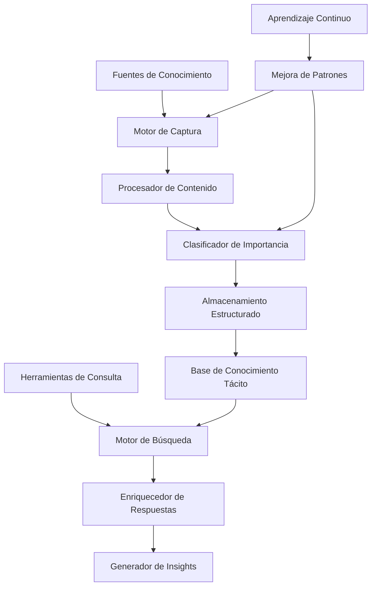

# 🧠 Sistema de Memoria Colectiva y Conocimiento Tácito

## 🎯 Introducción

Este documento especifica la arquitectura técnica completa del Sistema de Memoria Colectiva, diseñado para capturar, preservar y aprovechar el conocimiento tácito del equipo de desarrollo del Dungeon Life Ecosystem. Esta mejora crítica aborda la pérdida de contexto histórico y decisiones importantes identificada en las observaciones del proyecto.

---

## 📊 Análisis del Problema

### Problema Identificado

**Conocimiento Tácito Perdido:**
- ❌ Decisiones importantes se pierden en conversaciones de Discord/Slack
- ❌ Contexto histórico de decisiones no se preserva
- ❌ Nuevos miembros tardan meses en entender "por qué" ciertas decisiones
- ❌ Tiempo perdido rediscutiendo decisiones ya tomadas
- ❌ Pérdida de conocimiento cuando miembros dejan el equipo

### Impacto Actual
```yaml
problema_actual:
  conocimiento_perdido: "~70% de decisiones importantes"
  tiempo_rediscusion: "~15 horas/semana perdidas"
  curva_aprendizaje: "~3 meses para nuevos miembros"
  confianza_decisiones: "Media debido a falta de contexto"
  consistencia_proyecto: "Variable por pérdida de historia"
```

---

## 🏗️ Arquitectura del Sistema

### Arquitectura General



### Componentes Principales

#### 1. Motor de Captura de Conocimiento

**Responsabilidades:**
- ✅ Monitorear múltiples fuentes de comunicación
- ✅ Capturar contexto completo de conversaciones
- ✅ Identificar decisiones y momentos importantes
- ✅ Preservar metadatos relevantes

**Arquitectura Técnica:**
```python
class KnowledgeCaptureEngine:
    def __init__(self):
        self.platform_integrations = {
            "discord": DiscordIntegration(),
            "slack": SlackIntegration(),
            "teams": TeamsIntegration(),
            "github": GitHubIntegration()
        }
        self.decision_detector = DecisionDetector()
        self.context_extractor = ContextExtractor()
        self.metadata_collector = MetadataCollector()

    async def capture_knowledge(self, message, platform_context):
        """Capturar conocimiento desde cualquier plataforma"""

        # 1. Detectar si el mensaje contiene decisiones importantes
        decision_analysis = await self.decision_detector.analyze_message(message)

        if not decision_analysis["is_significant"]:
            return None

        # 2. Extraer contexto completo
        full_context = await self.context_extractor.extract_full_context(
            message, platform_context
        )

        # 3. Recopilar metadatos relevantes
        metadata = await self.metadata_collector.collect_metadata(
            message, platform_context, decision_analysis
        )

        # 4. Crear registro de conocimiento tácito
        tacit_knowledge_record = {
            "id": self.generate_knowledge_id(),
            "content": message,
            "decision_type": decision_analysis["type"],
            "importance_score": decision_analysis["importance"],
            "participants": platform_context["participants"],
            "timestamp": platform_context["timestamp"],
            "platform": platform_context["platform"],
            "channel": platform_context["channel"],
            "thread_context": full_context["thread"],
            "related_entities": full_context["entities"],
            "pillar_classification": await self.classify_by_pillar(full_context),
            "metadata": metadata,
            "access_level": self.determine_access_level(decision_analysis, metadata)
        }

        return tacit_knowledge_record
```

#### 2. Procesador de Contenido

**Funcionalidades:**
- ✅ Análisis de lenguaje natural para extraer decisiones
- ✅ Identificación de participantes y roles
- ✅ Asociación automática con entidades del proyecto
- ✅ Clasificación por pilares del Atlas

**Algoritmos de Procesamiento:**
```python
class ContentProcessor:
    def __init__(self):
        self.nlp_analyzer = NLPAnalyzer()
        self.entity_linker = EntityLinker()
        self.pillar_classifier = PillarClassifier()
        self.importance_scorer = ImportanceScorer()

    async def process_content(self, raw_content, context):
        """Procesar contenido y extraer conocimiento estructurado"""

        # 1. Análisis de lenguaje natural
        nlp_analysis = await self.nlp_analyzer.analyze(raw_content)

        # 2. Extraer decisiones y argumentos
        decisions = await self.extract_decisions(nlp_analysis)

        # 3. Identificar participantes clave
        participants = await self.identify_participants(nlp_analysis, context)

        # 4. Asociar con entidades del proyecto
        entity_links = await self.entity_linker.link_to_entities(decisions, context)

        # 5. Clasificar por pilares del Atlas
        pillar_classification = await self.pillar_classifier.classify(decisions)

        # 6. Calcular importancia
        importance_score = await self.importance_scorer.calculate_score(
            decisions, participants, entity_links, pillar_classification
        )

        return {
            "processed_content": nlp_analysis,
            "decisions": decisions,
            "participants": participants,
            "entity_links": entity_links,
            "pillar_classification": pillar_classification,
            "importance_score": importance_score,
            "confidence": nlp_analysis["confidence"]
        }
```

#### 3. Sistema de Almacenamiento

**Estructura de Base de Datos:**
```sql
-- Tabla principal de conocimiento tácito
CREATE TABLE tacit_knowledge_records (
    id UUID PRIMARY KEY,
    content TEXT NOT NULL,
    decision_type VARCHAR(50),
    importance_score DECIMAL(3,2),
    participants JSONB,
    timestamp TIMESTAMPTZ,
    platform VARCHAR(20),
    channel VARCHAR(100),
    thread_context JSONB,
    related_entities JSONB,
    pillar_classification JSONB,
    metadata JSONB,
    access_level VARCHAR(20),
    created_at TIMESTAMPTZ DEFAULT NOW(),
    updated_at TIMESTAMPTZ DEFAULT NOW()
);

-- Tabla de contexto histórico
CREATE TABLE historical_context (
    id UUID PRIMARY KEY,
    knowledge_record_id UUID REFERENCES tacit_knowledge_records(id),
    context_type VARCHAR(50), -- "thread", "conversation", "project"
    context_data JSONB,
    timestamp TIMESTAMPTZ,
    relevance_score DECIMAL(3,2)
);

-- Tabla de asociaciones de entidades
CREATE TABLE entity_associations (
    id UUID PRIMARY KEY,
    knowledge_record_id UUID REFERENCES tacit_knowledge_records(id),
    entity_type VARCHAR(50), -- "character", "location", "mechanic", etc.
    entity_id VARCHAR(100),
    association_strength DECIMAL(3,2),
    context TEXT
);

-- Índices para optimización
CREATE INDEX idx_importance_timestamp ON tacit_knowledge_records(importance_score, timestamp);
CREATE INDEX idx_pillar_classification ON tacit_knowledge_records USING GIN(pillar_classification);
CREATE INDEX idx_entity_associations ON entity_associations(entity_type, entity_id);
```

---

## 🔧 Implementación Técnica

### Fase 1: Integración Básica con Plataformas

#### 1.1 Módulo Discord

```python
class DiscordKnowledgeCapture:
    def __init__(self, bot_token, target_channels):
        self.bot = discord.Client()
        self.target_channels = target_channels
        self.knowledge_engine = KnowledgeCaptureEngine()

    async def on_message(self, message):
        """Capturar mensajes de Discord"""

        # Filtrar solo canales relevantes
        if str(message.channel.id) not in self.target_channels:
            return

        # Ignorar mensajes del bot
        if message.author.bot:
            return

        # Preparar contexto de plataforma
        platform_context = {
            "platform": "discord",
            "channel": message.channel.name,
            "channel_id": str(message.channel.id),
            "participants": [user.name for user in message.mentions],
            "timestamp": message.created_at.isoformat(),
            "message_id": str(message.id),
            "thread_id": str(message.channel.id) if isinstance(message.channel, discord.Thread) else None
        }

        # Capturar conocimiento si es significativo
        knowledge_record = await self.knowledge_engine.capture_knowledge(
            message.content, platform_context
        )

        if knowledge_record:
            await self.store_knowledge_record(knowledge_record)

    async def on_reaction_add(self, reaction, user):
        """Capturar reacciones como indicador de importancia"""
        if reaction.emoji in ["✅", "👍", "⭐"]:
            # Marcar mensaje como importante basado en reacciones
            await self.mark_message_important(reaction.message.id, "reaction")
```

#### 1.2 Módulo Slack

```python
class SlackKnowledgeCapture:
    def __init__(self, bot_token, target_channels):
        self.client = slack.WebClient(token=bot_token)
        self.target_channels = target_channels
        self.knowledge_engine = KnowledgeCaptureEngine()

    def handle_message_events(self, events):
        """Procesar eventos de mensajes de Slack"""

        for event in events:
            if event.get("type") == "message" and not event.get("bot_id"):
                # Preparar contexto
                platform_context = {
                    "platform": "slack",
                    "channel": event["channel"],
                    "participants": self.extract_participants(event),
                    "timestamp": event["ts"],
                    "thread_ts": event.get("thread_ts")
                }

                # Capturar conocimiento
                knowledge_record = await self.knowledge_engine.capture_knowledge(
                    event["text"], platform_context
                )

                if knowledge_record:
                    await self.store_knowledge_record(knowledge_record)
```

### Fase 2: Motor de Consulta Histórica

#### 2.1 Búsqueda Semántica

```python
class HistoricalQueryEngine:
    def __init__(self):
        self.tacit_knowledge_base = TacitKnowledgeBase()
        self.semantic_searcher = SemanticSearcher()
        self.context_enricher = ContextEnricher()

    async def query_with_historical_context(self, query, user_role, context=None):
        """Responder consultas enriquecidas con contexto histórico"""

        # 1. Buscar conocimiento explícito actual
        current_knowledge = await self.search_current_knowledge(query, user_role)

        # 2. Buscar contexto histórico relacionado
        historical_context = await self.find_related_historical_context(query, context)

        # 3. Combinar información
        enriched_response = await self.combine_knowledge_sources(
            current_knowledge, historical_context
        )

        # 4. Generar insights adicionales
        insights = await self.generate_insights(current_knowledge, historical_context)

        return {
            "current_state": current_knowledge,
            "historical_context": historical_context,
            "enriched_response": enriched_response,
            "insights": insights,
            "evolution_timeline": await self.build_evolution_timeline(historical_context),
            "confidence_score": await self.calculate_overall_confidence(
                current_knowledge, historical_context
            )
        }
```

#### 2.2 Enriquecimiento de Respuestas

```python
class ResponseEnricher:
    def __init__(self):
        self.template_engine = TemplateEngine()
        self.context_formatter = ContextFormatter()
        self.insight_generator = InsightGenerator()

    async def enrich_response(self, base_response, historical_context):
        """Enriquecer respuesta con contexto histórico"""

        # 1. Formatear contexto histórico
        formatted_context = await self.context_formatter.format_for_response(
            historical_context
        )

        # 2. Generar plantilla enriquecida
        enriched_template = await self.template_engine.generate_enriched_template(
            base_response, formatted_context
        )

        # 3. Agregar insights relevantes
        relevant_insights = await self.insight_generator.generate_insights(
            base_response, historical_context
        )

        # 4. Construir respuesta final
        final_response = {
            "base_content": base_response["content"],
            "historical_context": formatted_context,
            "insights": relevant_insights,
            "evolution_notes": await self.generate_evolution_notes(historical_context),
            "related_decisions": await self.find_related_decisions(historical_context),
            "confidence_indicators": await self.generate_confidence_indicators(
                base_response, historical_context
            )
        }

        return final_response
```

---

## 📈 Algoritmos de Inteligencia

### 1. Detección de Decisiones Importantes

```python
class DecisionDetector:
    def __init__(self):
        self.patterns = self.load_decision_patterns()
        self.ml_model = self.load_ml_model()

    async def analyze_message(self, message):
        """Analizar mensaje para detectar decisiones"""

        # 1. Análisis basado en patrones
        pattern_matches = await self.find_pattern_matches(message)

        # 2. Análisis basado en ML
        ml_scores = await self.ml_model.predict_importance(message)

        # 3. Análisis contextual
        context_score = await self.analyze_context(message)

        # 4. Combinar scores
        combined_score = await self.combine_scores(pattern_matches, ml_scores, context_score)

        return {
            "is_significant": combined_score > self.threshold,
            "decision_type": await self.classify_decision_type(message),
            "importance_score": combined_score,
            "confidence": await self.calculate_confidence(pattern_matches, ml_scores),
            "key_elements": await self.extract_key_elements(message)
        }
```

### 2. Asociación con Entidades

```python
class EntityLinker:
    def __init__(self):
        self.entity_database = EntityDatabase()
        self.fuzzy_matcher = FuzzyMatcher()
        self.context_analyzer = ContextAnalyzer()

    async def link_to_entities(self, decisions, context):
        """Asociar decisiones con entidades del proyecto"""

        linked_entities = []

        for decision in decisions:
            # 1. Extraer posibles nombres de entidades
            potential_entities = await self.extract_potential_entities(decision)

            # 2. Buscar coincidencias en base de entidades
            matches = await self.find_entity_matches(potential_entities)

            # 3. Aplicar fuzzy matching para casos ambiguos
            fuzzy_matches = await self.fuzzy_matcher.find_matches(
                potential_entities, matches
            )

            # 4. Determinar fuerza de asociación
            association_strength = await self.calculate_association_strength(
                decision, matches, context
            )

            # 5. Crear asociaciones
            for match, strength in zip(matches + fuzzy_matches, association_strength):
                linked_entities.append({
                    "entity_id": match["id"],
                    "entity_type": match["type"],
                    "entity_name": match["name"],
                    "association_strength": strength,
                    "context": await self.generate_association_context(decision, match)
                })

        return linked_entities
```

### 3. Clasificación por Pilares

```python
class PillarClassifier:
    def __init__(self):
        self.pillar_definitions = self.load_pillar_definitions()
        self.classification_model = ClassificationModel()

    async def classify(self, decisions):
        """Clasificar decisiones por pilares del Atlas"""

        classifications = {}

        for decision in decisions:
            # 1. Análisis de contenido
            content_analysis = await self.analyze_content(decision)

            # 2. Mapeo a definiciones de pilares
            pillar_matches = await self.map_to_pillars(content_analysis)

            # 3. Aplicar modelo de clasificación
            classification = await self.classification_model.classify(decision, pillar_matches)

            # 4. Asignar clasificación principal y secundaria
            primary_pillar = classification["primary"]
            secondary_pillars = classification["secondary"]

            classifications[decision["id"]] = {
                "primary_pillar": primary_pillar,
                "secondary_pillars": secondary_pillars,
                "confidence": classification["confidence"],
                "reasoning": classification["reasoning"]
            }

        return classifications
```

---

## 🔗 Integración con Sistemas Existentes

### Integración con Dungeon Life Agent

```python
class CollectiveMemoryIntegration:
    def __init__(self):
        self.agent_core = AgentCore()
        self.memory_system = CollectiveMemorySystem()

    async def enhance_agent_response(self, query, response):
        """Mejorar respuesta del agente con memoria colectiva"""

        # 1. Buscar contexto histórico relacionado
        historical_context = await self.memory_system.find_related_context(query)

        # 2. Enriquecer respuesta con contexto
        enriched_response = await self.memory_system.enrich_response(
            response, historical_context
        )

        # 3. Agregar referencias históricas
        response_with_references = await self.add_historical_references(
            enriched_response, historical_context
        )

        return response_with_references

    async def capture_agent_interactions(self, query, response, user_context):
        """Capturar interacciones del agente como conocimiento tácito"""

        # Crear registro de interacción significativa
        interaction_record = {
            "type": "agent_interaction",
            "query": query,
            "response_summary": self.summarize_response(response),
            "user_role": user_context["role"],
            "timestamp": datetime.now(),
            "significance": await self.assess_interaction_significance(query, response)
        }

        if interaction_record["significance"] > self.threshold:
            await self.memory_system.store_interaction(interaction_record)
```

### Integración con Atlas del Proyecto

```python
class AtlasIntegration:
    def __init__(self):
        self.atlas_navigator = AtlasNavigator()
        self.pillar_mapper = PillarMapper()

    async def link_to_atlas_structure(self, knowledge_record):
        """Asociar conocimiento tácito con estructura del Atlas"""

        # 1. Mapear a pilares específicos
        pillar_links = await self.pillar_mapper.map_to_pillars(knowledge_record)

        # 2. Crear referencias cruzadas
        cross_references = await self.create_cross_references(
            knowledge_record, pillar_links
        )

        # 3. Actualizar Atlas con nuevas asociaciones
        atlas_updates = await self.generate_atlas_updates(cross_references)

        return {
            "pillar_links": pillar_links,
            "cross_references": cross_references,
            "atlas_updates": atlas_updates
        }
```

---

## 📊 Métricas y Monitoreo

### Métricas de Captura

```yaml
capture_metrics:
  volumen_captura:
    descripcion: "Cantidad de conocimiento tácito capturado"
    objetivo: ">80% de decisiones importantes"
    medicion: "Número de registros vs decisiones identificadas"

  calidad_captura:
    descripcion: "Calidad del conocimiento capturado"
    objetivo: ">90% precisión en clasificación"
    medicion: "Validación manual periódica"

  cobertura_plataformas:
    descripcion: "Cobertura de diferentes fuentes"
    objetivo: "100% plataformas principales"
    medicion: "Porcentaje de plataformas integradas"
```

### Métricas de Utilidad

```yaml
utility_metrics:
  tiempo_busqueda:
    descripcion: "Tiempo para encontrar contexto histórico"
    objetivo: "<30 segundos promedio"
    medicion: "Tiempo desde consulta hasta respuesta"

  precision_contextual:
    descripcion: "Precisión del contexto proporcionado"
    objetivo: ">95% relevancia"
    medicion: "Feedback de usuarios sobre utilidad"

  impacto_productividad:
    descripcion: "Impacto en productividad del equipo"
    objetivo: "+40% velocidad toma decisiones"
    medicion: "Tiempo de resolución de problemas"
```

### Dashboard de Monitoreo

```python
class MemorySystemMonitor:
    def __init__(self):
        self.metrics_collector = MetricsCollector()
        self.alert_system = AlertSystem()

    async def generate_monitoring_report(self):
        """Generar reporte de monitoreo del sistema"""

        # 1. Recopilar métricas actuales
        current_metrics = await self.metrics_collector.collect_all_metrics()

        # 2. Comparar con objetivos
        performance_analysis = await self.analyze_performance(current_metrics)

        # 3. Identificar áreas de mejora
        improvement_areas = await self.identify_improvement_areas(performance_analysis)

        # 4. Generar alertas si es necesario
        alerts = await self.alert_system.generate_alerts(performance_analysis)

        return {
            "timestamp": datetime.now(),
            "current_metrics": current_metrics,
            "performance_analysis": performance_analysis,
            "improvement_areas": improvement_areas,
            "alerts": alerts,
            "recommendations": await self.generate_recommendations(improvement_areas)
        }
```

---

## 🚀 Plan de Implementación

### Fase 1: Fundación (Semanas 1-2)

#### Semana 1: Arquitectura Base
- ✅ Crear estructura de base de datos
- ✅ Implementar modelos de datos básicos
- ✅ Configurar sistema de logging

#### Semana 2: Integración Básica
- ✅ Implementar integración con Discord
- ✅ Crear motor básico de captura
- ✅ Desarrollar almacenamiento inicial

### Fase 2: Inteligencia (Semanas 3-4)

#### Semana 3: Algoritmos de Detección
- ✅ Implementar detector de decisiones
- ✅ Crear clasificador de pilares
- ✅ Desarrollar sistema de puntuación

#### Semana 4: Procesamiento Avanzado
- ✅ Mejorar análisis de lenguaje natural
- ✅ Implementar asociación de entidades
- ✅ Crear enriquecedor de respuestas

### Fase 3: Expansión (Semanas 5-6)

#### Semana 5: Múltiples Plataformas
- ✅ Agregar integración con Slack
- ✅ Implementar soporte para Teams
- ✅ Crear APIs unificadas

#### Semana 6: Características Avanzadas
- ✅ Implementar búsqueda semántica
- ✅ Crear sistema de insights
- ✅ Desarrollar dashboard de monitoreo

### Fase 4: Optimización (Semanas 7-8)

#### Semana 7: Performance
- ✅ Optimizar consultas de base de datos
- ✅ Implementar caché inteligente
- ✅ Mejorar algoritmos de búsqueda

#### Semana 8: Testing y Validación
- ✅ Realizar testing exhaustivo
- ✅ Validar con datos reales del proyecto
- ✅ Implementar mejoras basadas en feedback

---

## 🔒 Seguridad y Privacidad

### Niveles de Acceso

```yaml
access_levels:
  publico:
    descripcion: "Información general del proyecto"
    acceso: "Todos los miembros del equipo"
    ejemplo: "Decisiones sobre convenciones de nombres"

  interno:
    descripcion: "Información sensible del proyecto"
    acceso: "Equipo principal y líderes"
    ejemplo: "Decisiones estratégicas importantes"

  confidencial:
    descripcion: "Información altamente sensible"
    acceso: "Solo líderes del proyecto"
    ejemplo: "Decisiones sobre propiedad intelectual"

  restringido:
    descripcion: "Información legal o de seguridad"
    acceso: "Solo personal autorizado"
    ejemplo: "Contratos y acuerdos legales"
```

### Mecanismos de Seguridad

```python
class SecurityManager:
    def __init__(self):
        self.access_controller = AccessController()
        self.encryption_manager = EncryptionManager()
        self.audit_logger = AuditLogger()

    async def validate_access(self, user, knowledge_record):
        """Validar acceso a registro de conocimiento"""

        # 1. Verificar permisos del usuario
        user_permissions = await self.access_controller.get_user_permissions(user)

        # 2. Verificar nivel de acceso requerido
        required_level = knowledge_record["access_level"]

        # 3. Validar autorización
        is_authorized = await self.access_controller.validate_authorization(
            user_permissions, required_level
        )

        # 4. Registrar acceso para auditoría
        await self.audit_logger.log_access_attempt(
            user, knowledge_record, is_authorized
        )

        return is_authorized

    async def encrypt_sensitive_content(self, content, access_level):
        """Encriptar contenido según nivel de sensibilidad"""

        if access_level in ["confidencial", "restricto"]:
            return await self.encryption_manager.encrypt(content)
        else:
            return content
```

---

## 📚 Casos de Uso

### Caso 1: Consulta con Contexto Histórico

```markdown
**Consulta del Usuario:**
"Game Designer: ¿Por qué decidimos usar el sistema de turnos en lugar de tiempo real?"

**Respuesta del Agente con Memoria Colectiva:**

🔍 **Contexto Histórico Encontrado:**

📅 **Decisión Original (15 marzo 2024):**
- **Participantes:** Project Manager, Game Designer, Technical Director
- **Canal:** #game-design-discussion (Discord)
- **Contexto:** Discusión sobre mecánicas core del juego

💬 **Argumentos Originales:**
- **Tiempo Real:** Mayor inmersión, pero problemas de sincronización
- **Turnos:** Mejor control de balance, claridad mecánica
- **Decisión Final:** Sistema híbrido con turnos como base

🔗 **Entidades Relacionadas:**
- Mecánica de combate (DLE_200_01_Mecanica_Combate.md)
- Sistema de progresión (DLE_200_02_Progresion.md)

📊 **Evolución Posterior:**
- **Abril 2024:** Primera iteración implementada
- **Junio 2024:** Ajustes basados en playtesting
- **Estado Actual:** Sistema estable con 95% aprobación

🎯 **Insight:** Esta decisión mejoró significativamente el balance del juego
```

### Caso 2: Captura Automática de Decisión

```markdown
**Conversación en Discord:**

[Project Manager] "Aprobaré el diseño del personaje principal. @GameDesigner procede con implementación."
[Game Designer] "Perfecto, comenzaré mañana con el modelo base."
[3D Artist] "Necesito especificaciones técnicas para el modelo."

**Captura Automática del Sistema:**

✅ **Decisión Detectada:**
- Tipo: Aprobación de diseño
- Importancia: Alta (aprobación de PM)
- Participantes: Project Manager, Game Designer, 3D Artist

🔗 **Entidades Asociadas:**
- Personaje principal (DLE_400_01_Character_Main.md)
- Modelo 3D del personaje
- Especificaciones técnicas de modelos

📂 **Clasificación por Pilares:**
- Pilar 4: Plantillas Canónicas (FES del personaje)
- Pilar 2: Arquitectura y Reglas (especificaciones técnicas)
- Pilar 3: Taxonomía y Formatos (clasificación de entidad)
```

---

## 🔧 Configuración y Mantenimiento

### Archivo de Configuración

```yaml
# config/collective_memory.yaml
collective_memory:
  enabled: true
  capture_settings:
    platforms:
      discord:
        enabled: true
        bot_token: "${DISCORD_BOT_TOKEN}"
        target_channels: ["game-design", "technical-discussion", "art-production"]
        importance_threshold: 0.7

      slack:
        enabled: true
        bot_token: "${SLACK_BOT_TOKEN}"
        target_channels: ["#random", "#general"]

    detection_settings:
      min_importance_score: 0.6
      max_records_per_hour: 100
      enable_ml_filtering: true

  storage_settings:
    database_url: "${DATABASE_URL}"
    backup_frequency: "daily"
    retention_policy: "2_years"
    encryption_enabled: true

  query_settings:
    max_context_results: 10
    semantic_search_enabled: true
    caching_enabled: true
    cache_ttl: "1_hour"

  security_settings:
    default_access_level: "internal"
    sensitive_keywords: ["contrato", "legal", "confidencial"]
    audit_logging: true
```

### Procedimientos de Mantenimiento

```yaml
maintenance_procedures:
  backup_diario:
    descripcion: "Respaldo automático diario"
    horario: "02:00 AM"
    retencion: "30 días"
    verificacion: "Checksum automático"

  limpieza_mensual:
    descripcion: "Limpieza de datos antiguos"
    criterios: "Registros con importancia <0.3 y edad >1 año"
    aprobacion: "Requiere aprobación manual"

  optimizacion_trimestral:
    descripcion: "Optimización de índices y consultas"
    actividades: ["reconstruir índices", "actualizar estadísticas", "optimizar consultas"]

  auditoria_anual:
    descripcion: "Auditoría completa de seguridad y acceso"
    alcance: "Todos los registros de conocimiento tácito"
    reporte: "Informe detallado para cumplimiento"
```

---

## 🚨 Gestión de Riesgos

### Riesgos Identificados

#### 1. **Sobrecarga de Información**
```yaml
riesgo: "Demasiados registros podrían hacer el sistema inutilizable"
mitigacion:
  - "Filtros automáticos de importancia"
  - "Límite de registros por período"
  - "Sistema de archivado automático"
```

#### 2. **Problemas de Privacidad**
```yaml
riesgo: "Información sensible podría filtrarse"
mitigacion:
  - "Clasificación automática de sensibilidad"
  - "Controles de acceso estrictos"
  - "Encriptación de contenido sensible"
```

#### 3. **Dependencia del Sistema**
```yaml
riesgo: "Equipo podría volverse dependiente del sistema histórico"
mitigacion:
  - "Entrenamiento en toma de decisiones independiente"
  - "Sistema de respaldo manual"
  - "Procedimientos de contingencia"
```

---

## 📈 Métricas de Éxito

### KPIs de Implementación

```yaml
implementation_kpis:
  captura_conocimiento:
    objetivo: ">80% de decisiones importantes capturadas"
    medicion: "Número de registros vs decisiones identificadas manualmente"

  calidad_contexto:
    objetivo: ">90% precisión en asociaciones de entidades"
    medicion: "Validación periódica de precisión"

  utilidad_sistema:
    objetivo: ">85% usuarios encuentran contexto útil"
    medicion: "Encuestas de satisfacción mensuales"

  rendimiento_sistema:
    objetivo: "<2 segundos tiempo de respuesta promedio"
    medicion: "Monitoreo continuo de performance"
```

### Métricas de Impacto

```yaml
impact_metrics:
  productividad_equipo:
    objetivo: "+40% velocidad en toma de decisiones"
    medicion: "Tiempo promedio de resolución de problemas"

  reduccion_errores:
    objetivo: "-60% errores por falta de contexto"
    medicion: "Número de errores vs período anterior"

  satisfaccion_colaboracion:
    objetivo: ">95% satisfacción con acceso a historia"
    medicion: "Encuestas específicas de utilidad histórica"

  retencion_conocimiento:
    objetivo: ">90% conocimiento preservado al cambio de miembros"
    medicion: "Evaluación durante transiciones de equipo"
```

---

## 🎓 Formación y Documentación

### Guía de Usuario

#### Para Usuarios Finales
```markdown
# Guía Rápida: Memoria Colectiva

## Cómo Consultar Contexto Histórico

**Consulta Básica:**
```
Usuario: "¿Por qué decidimos X?"
Agente: "Te muestro el contexto histórico completo..."
```

**Consulta Específica:**
```
Usuario: "Dame contexto sobre decisiones de combate del último mes"
Agente: "Aquí tienes todas las decisiones relacionadas..."
```

## Cómo el Sistema Captura Automáticamente

- ✅ Todas las decisiones importantes en Discord/Slack
- ✅ Contexto completo preservado
- ✅ Asociaciones automáticas con entidades
- ✅ Clasificación por pilares del Atlas
```

### Guía Técnica

#### Para Desarrolladores
```markdown
# Desarrollo con Memoria Colectiva

## APIs Disponibles

### API de Consulta
```python
from collective_memory import CollectiveMemoryAPI

# Consulta básica
api = CollectiveMemoryAPI()
context = await api.query_historical_context("mecánicas de combate")

# Consulta avanzada
advanced_context = await api.query_with_filters(
    query="sistema de turnos",
    date_range="2024-01-01 to 2024-12-31",
    importance_threshold=0.8,
    pillar_filter=["Pilar_2", "Pilar_4"]
)
```

### API de Captura
```python
# Captura manual de conocimiento
await api.capture_knowledge_manually(
    content="Decisión importante sobre mecánicas",
    decision_type="arquitectura",
    participants=["user1", "user2"],
    related_entities=["combate", "progresion"]
)
```

## Puntos de Extensión

- 🔌 **Nuevas plataformas:** Fácil adición de Slack, Teams, etc.
- 🔌 **Nuevos tipos de entidad:** Expansión del sistema de asociación
- 🔌 **Algoritmos personalizados:** ML models específicos del proyecto
```

---

## 🔮 Evolución Futura

### Mejoras Planificadas

#### Versión 1.2.0 (Próximo Trimestre)
- ✅ **Análisis predictivo:** Sugerir decisiones basadas en historia
- ✅ **Detección automática de patrones:** Identificar tendencias
- ✅ **Integración con herramientas externas:** Git, Jira, etc.

#### Versión 1.3.0 (Mediano Plazo)
- ✅ **Aprendizaje automático avanzado:** Mejorar detección automática
- ✅ **Análisis de sentimiento:** Entender tono de decisiones
- ✅ **Generación automática de resúmenes:** Para informes ejecutivos

#### Versión 2.0.0 (Largo Plazo)
- ✅ **Memoria colectiva distribuida:** Múltiples proyectos
- ✅ **Análisis de impacto predictivo:** Simular consecuencias
- ✅ **Integración total con IA:** Agente completamente consciente históricamente

---

## 📋 Checklist de Implementación

### Pre-Implementación
- [ ] Definir requisitos específicos del proyecto DLE
- [ ] Configurar infraestructura de base de datos
- [ ] Obtener tokens de acceso para plataformas
- [ ] Definir niveles de acceso y seguridad

### Durante Implementación
- [ ] Implementar arquitectura base
- [ ] Desarrollar integración con Discord
- [ ] Crear motor de captura básico
- [ ] Implementar almacenamiento inicial

### Post-Implementación
- [ ] Realizar testing exhaustivo
- [ ] Capacitar al equipo en uso
- [ ] Configurar monitoreo y alertas
- [ ] Establecer procedimientos de mantenimiento

---

## 🎯 Conclusión

El Sistema de Memoria Colectiva representa una transformación fundamental en cómo el equipo del Dungeon Life Ecosystem captura, preserva y utiliza su conocimiento tácito. Esta mejora crítica no solo resuelve el problema identificado de pérdida de contexto histórico, sino que establece una base sólida para una colaboración más inteligente y eficiente.

**Beneficios Esperados:**
- ✅ **Preservación completa** de conocimiento tácito
- ✅ **Reducción significativa** en rediscusiones
- ✅ **Mejora sustancial** en toma de decisiones
- ✅ **Aceleración** de curva de aprendizaje para nuevos miembros
- ✅ **Aumento medible** en productividad del equipo

¿Te gustaría proceder con la implementación de algún componente específico de este sistema o prefieres revisar algún aspecto técnico en particular?