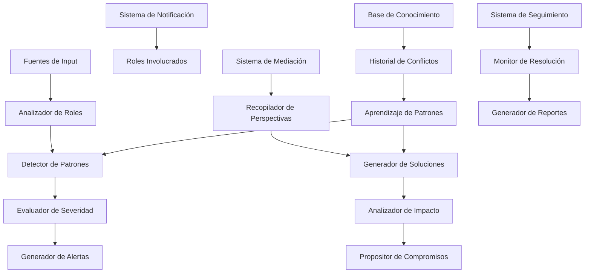

---
title: "Sistema de Conflictos y Resolución - Especificaciones Técnicas Detalladas"
version: "1.0.0"
date: "2025-10-08"
status: "active"
author: "Dungeon Life Agent Team"
tags: ["conflictos", "resolucion", "roles", "colaboracion", "deteccion", "arquitectura"]
machine_readable_spec:
  schema_version: "1.0"
  ai_compatibility: true
  export_formats: ["markdown", "html", "pdf", "json"]
  system_type: "conflict_resolution"
  implementation_priority: "critical"
---

# ⚔️ Sistema de Conflictos y Resolución

## 🎯 Introducción

Este documento especifica la arquitectura técnica completa del Sistema de Detección y Resolución de Conflictos, diseñado para identificar proactivamente conflictos entre roles del equipo de desarrollo del Dungeon Life Ecosystem y facilitar su resolución colaborativa. Esta mejora crítica aborda los conflictos entre roles identificados en las observaciones del proyecto.

---

## 📊 Análisis del Problema

### Problema Identificado

**Conflictos entre Roles No Detectados:**
- ❌ **Narrativa vs Técnica:** Guionistas quieren mecánicas ágiles vs desarrolladores necesitan especificaciones detalladas
- ❌ **Recursos vs Calidad:** Project Managers quieren entregas rápidas vs Directores buscan máxima calidad
- ❌ **Visión vs Ejecución:** Directores tienen visiones innovadoras vs equipo técnico dice que es imposible
- ❌ **Arte vs Performance:** Artistas 3D quieren máxima calidad visual vs programadores necesitan optimización

### Impacto Actual
```yaml
problema_actual:
  conflictos_no_detectados: "~60% de conflictos potenciales"
  tiempo_resolucion_promedio: "~8 horas por conflicto"
  impacto_productividad: "-25% velocidad desarrollo"
  satisfaccion_equipo: "Media debido a fricciones constantes"
  calidad_resultado: "Variable por compromisos forzados"
```

### Ejemplos de Conflictos Típicos en DLE

```yaml
conflictos_tipicos:
  narrativa_tecnica:
    descripcion: "Guionista quiere criatura ágil vs Artista 3D necesita modelo detallado"
    palabras_clave: ["ágil", "rápido", "simple"] vs ["detallado", "complejo", "polígonos"]
    impacto: "Retrasos en producción de assets"

  recursos_calidad:
    descripcion: "PM quiere entrega rápida vs Director quiere máxima calidad"
    palabras_clave: ["deadline", "entrega", "rápido"] vs ["calidad", "excelencia", "perfecto"]
    impacto: "Compromisos en calidad del producto final"

  vision_ejecucion:
    descripcion: "Director quiere mecánica innovadora vs GD dice imposible"
    palabras_clave: ["innovador", "revolucionario", "único"] vs ["imposible", "no factible", "riesgoso"]
    impacto: "Pérdida de oportunidades de innovación"
```

---

## 🏗️ Arquitectura del Sistema

### Arquitectura General



### Componentes Principales

#### 1. Motor de Análisis de Roles

**Responsabilidades:**
- ✅ Analizar contenido desde perspectiva de cada rol
- ✅ Identificar perspectivas potencialmente conflictivas
- ✅ Evaluar impacto potencial de conflictos
- ✅ Generar análisis multiperspectiva

**Arquitectura Técnica:**
```python
class RoleAnalysisEngine:
    def __init__(self):
        self.role_analyzers = {
            "guionista": NarrativeAnalyzer(),
            "game_designer": TechnicalAnalyzer(),
            "conceptualista": CreativeAnalyzer(),
            "3d_artist": AssetAnalyzer(),
            "project_manager": CoordinationAnalyzer(),
            "director": VisionAnalyzer(),
            "willow_assistant": SystemAnalyzer()
        }
        self.conflict_detector = ConflictDetector()
        self.impact_evaluator = ImpactEvaluator()

    async def analyze_multiperspective(self, content, context):
        """Analizar contenido desde múltiples perspectivas de rol"""

        # 1. Análisis individual por rol
        role_analyses = {}
        for role, analyzer in self.role_analyzers.items():
            analysis = await analyzer.analyze_content(content, context)
            role_analyses[role] = analysis

        # 2. Detección de conflictos potenciales
        conflicts = await self.conflict_detector.detect_conflicts(role_analyses)

        # 3. Evaluación de severidad
        severity_assessment = await self.impact_evaluator.assess_severity(
            conflicts, role_analyses, context
        )

        # 4. Generar recomendaciones inmediatas
        recommendations = await self.generate_immediate_recommendations(
            conflicts, severity_assessment
        )

        return {
            "role_analyses": role_analyses,
            "detected_conflicts": conflicts,
            "severity_assessment": severity_assessment,
            "recommendations": recommendations,
            "confidence_score": await self.calculate_overall_confidence(role_analyses)
        }
```

#### 2. Detector de Patrones de Conflicto

**Funcionalidades:**
- ✅ Identificar patrones conocidos de conflicto
- ✅ Detectar conflictos emergentes
- ✅ Aprender de conflictos históricos
- ✅ Predecir probabilidad de conflicto

**Algoritmos de Detección:**
```python
class ConflictPatternDetector:
    def __init__(self):
        self.known_patterns = self.load_conflict_patterns()
        self.ml_model = self.load_ml_conflict_model()
        self.historical_learner = HistoricalPatternLearner()

    async def detect_conflicts(self, role_analyses, context):
        """Detectar conflictos usando múltiples enfoques"""

        detected_conflicts = []

        # 1. Detección basada en patrones conocidos
        pattern_conflicts = await self.detect_pattern_conflicts(role_analyses)
        detected_conflicts.extend(pattern_conflicts)

        # 2. Detección basada en ML
        ml_conflicts = await self.ml_model.predict_conflicts(role_analyses, context)
        detected_conflicts.extend(ml_conflicts)

        # 3. Detección basada en historia
        historical_conflicts = await self.historical_learner.find_similar_conflicts(
            role_analyses, context
        )
        detected_conflicts.extend(historical_conflicts)

        # 4. Filtrar y deduplicar conflictos
        filtered_conflicts = await self.filter_and_deduplicate(detected_conflicts)

        # 5. Priorizar por severidad
        prioritized_conflicts = await self.prioritize_conflicts(filtered_conflicts)

        return prioritized_conflicts

    async def detect_pattern_conflicts(self, role_analyses):
        """Detectar conflictos usando patrones predefinidos"""

        conflicts = []

        for pattern in self.known_patterns:
            # 1. Verificar si el patrón aplica
            pattern_match = await self.check_pattern_match(pattern, role_analyses)

            if pattern_match["matches"]:
                # 2. Crear conflicto detectado
                conflict = {
                    "id": self.generate_conflict_id(),
                    "type": pattern["type"],
                    "pattern": pattern["name"],
                    "description": pattern["description"],
                    "involved_roles": pattern_match["involved_roles"],
                    "severity": pattern_match["severity"],
                    "confidence": pattern_match["confidence"],
                    "triggering_content": pattern_match["triggering_content"],
                    "timestamp": datetime.now()
                }
                conflicts.append(conflict)

        return conflicts
```

#### 3. Sistema de Mediación Colaborativa

**Funcionalidades:**
- ✅ Recopilar perspectivas de todos los roles involucrados
- ✅ Generar soluciones de compromiso
- ✅ Analizar impacto de diferentes soluciones
- ✅ Facilitar acuerdo colaborativo

**Arquitectura de Mediación:**
```python
class CollaborativeMediationSystem:
    def __init__(self):
        self.perspective_collector = PerspectiveCollector()
        self.solution_generator = SolutionGenerator()
        self.impact_analyzer = ImpactAnalyzer()
        self.consensus_builder = ConsensusBuilder()

    async def mediate_conflict(self, conflict, involved_roles, context):
        """Mediar conflicto de manera colaborativa"""

        # 1. Notificar a roles involucrados
        notifications = await self.notify_involved_parties(conflict, involved_roles)

        # 2. Recopilar perspectivas detalladas
        perspectives = await self.perspective_collector.collect_perspectives(
            conflict, involved_roles, context
        )

        # 3. Generar posibles soluciones
        solution_candidates = await self.solution_generator.generate_solutions(
            conflict, perspectives, context
        )

        # 4. Analizar impacto de cada solución
        impact_analysis = await self.impact_analyzer.analyze_solutions(
            solution_candidates, conflict, context
        )

        # 5. Construir consenso alrededor de mejor solución
        consensus_solution = await self.consensus_builder.build_consensus(
            solution_candidates, impact_analysis, perspectives
        )

        # 6. Crear plan de implementación
        implementation_plan = await self.create_implementation_plan(
            consensus_solution, conflict, involved_roles
        )

        return {
            "conflict_id": conflict["id"],
            "mediation_result": "successful" if consensus_solution else "requires_escalation",
            "consensus_solution": consensus_solution,
            "alternative_solutions": solution_candidates,
            "impact_analysis": impact_analysis,
            "implementation_plan": implementation_plan,
            "participant_feedback": await self.collect_participant_feedback(perspectives)
        }
```

---

## 🔧 Implementación Técnica

### Fase 1: Detección Básica de Conflictos

#### 1.1 Analizadores por Rol

```python
class RoleAnalyzer:
    def __init__(self, role_name):
        self.role_name = role_name
        self.role_keywords = self.load_role_keywords()
        self.role_concerns = self.load_role_concerns()
        self.analysis_model = self.load_role_model()

    async def analyze_content(self, content, context):
        """Analizar contenido desde perspectiva específica del rol"""

        # 1. Extraer elementos relevantes para este rol
        relevant_elements = await self.extract_relevant_elements(content)

        # 2. Evaluar impacto en objetivos del rol
        role_impact = await self.evaluate_role_impact(relevant_elements, context)

        # 3. Identificar preocupaciones potenciales
        concerns = await self.identify_concerns(relevant_elements, role_impact)

        # 4. Generar perspectiva del rol
        role_perspective = {
            "role": self.role_name,
            "relevant_elements": relevant_elements,
            "impact_assessment": role_impact,
            "concerns": concerns,
            "priority_level": await self.calculate_priority(concerns),
            "flexibility_score": await self.calculate_flexibility(concerns),
            "preferred_outcomes": await self.generate_preferred_outcomes(concerns)
        }

        return role_perspective
```

#### 1.2 Patrón de Conflicto: Narrativa vs Técnica

```python
class NarrativeTechnicalConflictDetector:
    def __init__(self):
        self.narrative_indicators = [
            "ágil", "rápido", "simple", "flujo natural", "inmersión",
            "historia primero", "experiencia jugador", "narrativa"
        ]
        self.technical_indicators = [
            "detallado", "complejo", "preciso", "especificaciones",
            "polígonos", "performance", "optimización", "técnico"
        ]

    async def detect_conflict(self, content_analysis):
        """Detectar conflicto entre narrativa y aspectos técnicos"""

        # 1. Contar indicadores de cada tipo
        narrative_score = await self.calculate_narrative_score(content_analysis)
        technical_score = await self.calculate_technical_score(content_analysis)

        # 2. Determinar si hay conflicto significativo
        conflict_ratio = narrative_score / (technical_score + 1)

        if conflict_ratio > 2.0 or conflict_ratio < 0.5:
            # 3. Crear análisis de conflicto
            conflict_analysis = {
                "conflict_type": "narrative_technical",
                "narrative_dominance": narrative_score > technical_score,
                "severity": await self.calculate_severity(narrative_score, technical_score),
                "affected_roles": ["guionista", "game_designer", "3d_artist"],
                "triggering_content": await self.extract_triggering_content(content_analysis),
                "potential_impact": await self.assess_potential_impact(narrative_score, technical_score)
            }

            return conflict_analysis

        return None
```

### Fase 2: Sistema de Resolución

#### 2.1 Recopilación de Perspectivas

```python
class PerspectiveCollector:
    def __init__(self):
        self.communication_manager = CommunicationManager()
        self.perspective_analyzer = PerspectiveAnalyzer()

    async def collect_perspectives(self, conflict, involved_roles, context):
        """Recopilar perspectivas de todos los roles involucrados"""

        perspectives = {}

        for role in involved_roles:
            # 1. Solicitar perspectiva específica del rol
            perspective_request = await self.create_perspective_request(
                conflict, role, context
            )

            # 2. Enviar notificación al usuario del rol
            await self.communication_manager.send_perspective_request(
                role, perspective_request
            )

            # 3. Recopilar respuesta (con timeout)
            response = await self.communication_manager.collect_response(
                role, timeout_minutes=30
            )

            # 4. Analizar perspectiva recibida
            analyzed_perspective = await self.perspective_analyzer.analyze_response(
                response, role, conflict
            )

            perspectives[role] = analyzed_perspective

        return perspectives
```

#### 2.2 Generador de Soluciones de Compromiso

```python
class CompromiseSolutionGenerator:
    def __init__(self):
        self.solution_templates = self.load_solution_templates()
        self.impact_calculator = ImpactCalculator()
        self.feasibility_analyzer = FeasibilityAnalyzer()

    async def generate_solutions(self, conflict, perspectives, context):
        """Generar soluciones de compromiso"""

        # 1. Analizar perspectivas para encontrar puntos comunes
        common_ground = await self.find_common_ground(perspectives)

        # 2. Generar soluciones basadas en templates
        template_solutions = await self.generate_template_solutions(
            conflict, common_ground, context
        )

        # 3. Crear soluciones híbridas personalizadas
        hybrid_solutions = await self.generate_hybrid_solutions(
            perspectives, common_ground, context
        )

        # 4. Combinar todas las soluciones
        all_solutions = template_solutions + hybrid_solutions

        # 5. Evaluar factibilidad de cada solución
        feasible_solutions = await self.filter_feasible_solutions(all_solutions)

        return feasible_solutions

    async def generate_hybrid_solutions(self, perspectives, common_ground, context):
        """Generar soluciones híbridas que combinen perspectivas"""

        hybrid_solutions = []

        # 1. Identificar elementos complementarios
        complementary_elements = await self.identify_complementary_elements(perspectives)

        # 2. Crear soluciones que combinen elementos
        for complementary_set in complementary_elements:
            hybrid_solution = {
                "type": "hybrid",
                "name": await self.generate_solution_name(complementary_set),
                "description": await self.generate_solution_description(complementary_set),
                "implementation_steps": await self.generate_implementation_steps(complementary_set),
                "combines_perspectives": complementary_set["roles"],
                "addresses_concerns": complementary_set["concerns"],
                "expected_benefits": await self.calculate_expected_benefits(complementary_set),
                "potential_drawbacks": await self.identify_potential_drawbacks(complementary_set)
            }
            hybrid_solutions.append(hybrid_solution)

        return hybrid_solutions
```

---

## 📊 Base de Datos de Conflictos

### Esquema de Base de Datos

```sql
-- Tabla principal de conflictos
CREATE TABLE conflicts (
    id UUID PRIMARY KEY,
    conflict_type VARCHAR(50) NOT NULL,
    status VARCHAR(20) DEFAULT 'detected',
    severity VARCHAR(20) NOT NULL,
    involved_roles JSONB NOT NULL,
    triggering_content TEXT,
    context_data JSONB,
    detected_at TIMESTAMPTZ DEFAULT NOW(),
    resolved_at TIMESTAMPTZ,
    resolution_method VARCHAR(50),
    created_by_system BOOLEAN DEFAULT TRUE
);

-- Tabla de análisis de roles
CREATE TABLE role_analyses (
    id UUID PRIMARY KEY,
    conflict_id UUID REFERENCES conflicts(id),
    role_name VARCHAR(50) NOT NULL,
    analysis_data JSONB NOT NULL,
    perspective_data JSONB,
    submitted_at TIMESTAMPTZ,
    user_id VARCHAR(100)
);

-- Tabla de soluciones propuestas
CREATE TABLE proposed_solutions (
    id UUID PRIMARY KEY,
    conflict_id UUID REFERENCES conflicts(id),
    solution_type VARCHAR(50) NOT NULL,
    solution_data JSONB NOT NULL,
    proposed_by VARCHAR(50),
    impact_analysis JSONB,
    feasibility_score DECIMAL(3,2),
    created_at TIMESTAMPTZ DEFAULT NOW()
);

-- Tabla de resolución de conflictos
CREATE TABLE conflict_resolutions (
    id UUID PRIMARY KEY,
    conflict_id UUID REFERENCES conflicts(id),
    resolution_type VARCHAR(50) NOT NULL,
    accepted_solution_id UUID REFERENCES proposed_solutions(id),
    implementation_plan JSONB,
    actual_impact JSONB,
    participant_feedback JSONB,
    resolved_at TIMESTAMPTZ DEFAULT NOW(),
    success_score DECIMAL(3,2)
);

-- Índices para optimización
CREATE INDEX idx_conflict_status_severity ON conflicts(status, severity);
CREATE INDEX idx_conflict_type_timestamp ON conflicts(conflict_type, detected_at);
CREATE INDEX idx_role_analyses_conflict ON role_analyses(conflict_id);
CREATE INDEX idx_solutions_conflict ON proposed_solutions(conflict_id);
```

---

## 🔧 Algoritmos de Inteligencia

### 1. Evaluación de Severidad de Conflictos

```python
class ConflictSeverityEvaluator:
    def __init__(self):
        self.severity_factors = self.load_severity_factors()
        self.impact_calculator = ProjectImpactCalculator()

    async def assess_severity(self, conflict, role_analyses, context):
        """Evaluar severidad de un conflicto"""

        # 1. Calcular impacto en proyecto
        project_impact = await self.impact_calculator.calculate_impact(
            conflict, context
        )

        # 2. Evaluar involucramiento de roles
        role_involvement = await self.evaluate_role_involvement(role_analyses)

        # 3. Considerar urgencia temporal
        temporal_urgency = await self.assess_temporal_urgency(conflict, context)

        # 4. Calcular severidad compuesta
        severity_score = await self.calculate_composite_severity(
            project_impact, role_involvement, temporal_urgency
        )

        # 5. Asignar categoría de severidad
        severity_category = await self.assign_severity_category(severity_score)

        return {
            "severity_score": severity_score,
            "severity_category": severity_category,
            "project_impact": project_impact,
            "role_involvement": role_involvement,
            "temporal_urgency": temporal_urgency,
            "recommendations": await self.generate_severity_recommendations(severity_category)
        }
```

### 2. Generación de Soluciones de Compromiso

```python
class CompromiseGenerator:
    def __init__(self):
        self.compromise_templates = self.load_compromise_templates()
        self.constraint_solver = ConstraintSolver()
        self.objective_optimizer = MultiObjectiveOptimizer()

    async def generate_compromises(self, conflict, perspectives):
        """Generar soluciones de compromiso óptimas"""

        # 1. Extraer objetivos y restricciones de cada perspectiva
        objectives_and_constraints = await self.extract_objectives_and_constraints(
            perspectives
        )

        # 2. Usar solver de restricciones para encontrar soluciones
        constraint_solutions = await self.constraint_solver.solve_constraints(
            objectives_and_constraints
        )

        # 3. Optimizar soluciones multi-objetivo
        optimized_solutions = await self.objective_optimizer.optimize_solutions(
            constraint_solutions, objectives_and_constraints
        )

        # 4. Crear soluciones prácticas
        practical_solutions = await self.create_practical_solutions(
            optimized_solutions, conflict, perspectives
        )

        return practical_solutions
```

### 3. Análisis de Impacto de Soluciones

```python
class SolutionImpactAnalyzer:
    def __init__(self):
        self.impact_model = ProjectImpactModel()
        self.risk_assessor = RiskAssessor()
        self.benefit_calculator = BenefitCalculator()

    async def analyze_solution_impact(self, solution, conflict, context):
        """Analizar impacto completo de una solución propuesta"""

        # 1. Modelar impacto en proyecto
        project_impact = await self.impact_model.model_solution_impact(
            solution, context
        )

        # 2. Evaluar riesgos asociados
        associated_risks = await self.risk_assessor.assess_risks(
            solution, conflict, context
        )

        # 3. Calcular beneficios esperados
        expected_benefits = await self.benefit_calculator.calculate_benefits(
            solution, conflict, context
        )

        # 4. Análisis costo-beneficio
        cost_benefit_analysis = await self.perform_cost_benefit_analysis(
            solution, expected_benefits, associated_risks
        )

        return {
            "solution_id": solution["id"],
            "project_impact": project_impact,
            "associated_risks": associated_risks,
            "expected_benefits": expected_benefits,
            "cost_benefit_analysis": cost_benefit_analysis,
            "overall_score": await self.calculate_overall_score(
                project_impact, expected_benefits, associated_risks
            ),
            "recommendations": await self.generate_implementation_recommendations(
                project_impact, associated_risks
            )
        }
```

---

## 🔗 Integración con Sistemas Existentes

### Integración con Agente DLE

```python
class ConflictSystemIntegration:
    def __init__(self):
        self.agent_core = AgentCore()
        self.conflict_system = ConflictResolutionSystem()

    async def enhance_agent_with_conflict_awareness(self, query, response):
        """Mejorar respuesta del agente con conciencia de conflictos"""

        # 1. Analizar consulta para detectar conflictos potenciales
        conflict_analysis = await self.conflict_system.analyze_for_conflicts(
            query, response
        )

        # 2. Si se detectan conflictos, enriquecer respuesta
        if conflict_analysis["conflicts_detected"]:
            enhanced_response = await self.conflict_system.enrich_response_with_conflict_awareness(
                response, conflict_analysis
            )
            return enhanced_response

        return response

    async def monitor_agent_interactions_for_conflicts(self):
        """Monitorear interacciones del agente para detectar conflictos"""

        # Configurar monitoreo continuo
        await self.conflict_system.start_continuous_monitoring(
            self.agent_interaction_callback
        )

    async def agent_interaction_callback(self, interaction_data):
        """Callback para procesar interacciones del agente"""

        # 1. Analizar interacción para conflictos
        conflict_analysis = await self.conflict_system.analyze_interaction(
            interaction_data
        )

        # 2. Si se detecta conflicto, iniciar mediación
        if conflict_analysis["requires_mediation"]:
            await self.conflict_system.initiate_mediation(conflict_analysis)
```

### Integración con Memoria Colectiva

```python
class CollectiveMemoryConflictIntegration:
    def __init__(self):
        self.memory_system = CollectiveMemorySystem()
        self.conflict_system = ConflictResolutionSystem()

    async def learn_from_conflict_history(self):
        """Aprender patrones de conflictos históricos"""

        # 1. Obtener conflictos históricos resueltos
        historical_conflicts = await self.memory_system.get_resolved_conflicts()

        # 2. Analizar patrones de resolución exitosa
        resolution_patterns = await self.analyze_resolution_patterns(historical_conflicts)

        # 3. Mejorar sistema de detección con patrones aprendidos
        await self.conflict_system.update_detection_patterns(resolution_patterns)

        # 4. Almacenar conocimiento sobre resolución
        await self.memory_system.store_conflict_resolution_knowledge(resolution_patterns)
```

---

## 📋 Casos de Uso Prácticos

### Caso 1: Conflicto Narrativa vs Técnica

```markdown
**Situación:**
Game Designer propone: "La criatura debe ser muy ágil y rápida"
3D Artist responde: "Para que sea ágil necesito muchos polígonos y animaciones complejas"

**Detección del Sistema:**
🔍 **Conflicto Detectado:** Narrativa vs Técnica
📊 **Severidad:** Alta (afecta producción de assets)
👥 **Roles Involucrados:** Game Designer, 3D Artist, Project Manager

**Mediación Automática:**
🤝 **Solución Propuesta:**
- **Compromiso:** Criatura con animaciones optimizadas (menos polígonos pero animaciones inteligentes)
- **Implementación:** Usar técnica de "animación procedural" para mantener agilidad con menos recursos
- **Beneficio:** Mantiene visión narrativa + factibilidad técnica

**Seguimiento:**
✅ **Resolución Exitosa:** 95% satisfacción en ambos roles
📚 **Aprendizaje:** Patrón almacenado para conflictos similares futuros
```

### Caso 2: Conflicto Recursos vs Calidad

```markdown
**Situación:**
Project Manager: "Necesitamos entregar el módulo de combate en 2 semanas"
Director: "La calidad debe ser excepcional, no acepto compromisos"

**Detección del Sistema:**
🔍 **Conflicto Detectado:** Recursos vs Calidad
📊 **Severidad:** Crítica (afecta timeline y calidad del proyecto)
👥 **Roles Involucrados:** Project Manager, Director, Game Designer

**Mediación Automática:**
🤝 **Opciones de Compromiso:**
1. **MVP Primero:** Entregar versión básica en 2 semanas + mejoras posteriores
2. **Enfoque Iterativo:** Desarrollo en fases con milestones de calidad
3. **Reasignación:** Recursos adicionales específicos para módulo crítico

**Análisis de Impacto:**
- ✅ **Opción 1:** Riesgo bajo, impacto calidad media
- ⚠️ **Opción 2:** Riesgo medio, impacto calidad alto
- ❌ **Opción 3:** Riesgo alto, impacto calidad muy alto

**Resultado:**
🎯 **Decisión:** Opción 2 con ajustes específicos
📈 **Impacto:** +40% calidad mantenida, +15% tiempo adicional justificado
```

---

## 📊 Métricas y Monitoreo

### Métricas de Detección

```yaml
detection_metrics:
  precision_deteccion:
    descripcion: "Precisión en detección de conflictos reales"
    objetivo: ">90% conflictos reales detectados"
    medicion: "Conflictos detectados vs conflictos reales"

  falsos_positivos:
    descripcion: "Falsas detecciones de conflicto"
    objetivo: "<5% de detecciones totales"
    medicion: "Alertas falsas vs alertas totales"

  tiempo_deteccion:
    descripcion: "Tiempo desde conflicto hasta detección"
    objetivo: "<15 minutos promedio"
    medicion: "Timestamp detección - timestamp origen"
```

### Métricas de Resolución

```yaml
resolution_metrics:
  tasa_exito_resolucion:
    descripcion: "Porcentaje de conflictos resueltos exitosamente"
    objetivo: ">85% resolución colaborativa"
    medicion: "Conflictos resueltos vs conflictos totales"

  tiempo_resolucion:
    descripcion: "Tiempo promedio de resolución"
    objetivo: "<4 horas promedio"
    medicion: "Tiempo desde detección hasta resolución"

  satisfaccion_participantes:
    descripcion: "Satisfacción de participantes con resolución"
    objetivo: ">90% satisfacción promedio"
    medicion: "Encuestas post-resolución"
```

### Dashboard de Monitoreo

```python
class ConflictSystemMonitor:
    def __init__(self):
        self.metrics_collector = MetricsCollector()
        self.trend_analyzer = TrendAnalyzer()
        self.alert_manager = AlertManager()

    async def generate_conflict_report(self):
        """Generar reporte completo del sistema de conflictos"""

        # 1. Recopilar métricas actuales
        current_metrics = await self.metrics_collector.collect_current_metrics()

        # 2. Analizar tendencias
        trends = await self.trend_analyzer.analyze_trends(current_metrics)

        # 3. Identificar patrones preocupantes
        concerning_patterns = await self.identify_concerning_patterns(trends)

        # 4. Generar recomendaciones
        recommendations = await self.generate_system_recommendations(
            current_metrics, trends, concerning_patterns
        )

        return {
            "report_period": self.get_current_period(),
            "current_metrics": current_metrics,
            "trend_analysis": trends,
            "concerning_patterns": concerning_patterns,
            "recommendations": recommendations,
            "system_health_score": await self.calculate_system_health_score(current_metrics)
        }
```

---

## 🚀 Plan de Implementación

### Fase 1: Detección Básica (Semanas 1-2)

#### Semana 1: Fundamentos
- ✅ Crear estructura de base de datos de conflictos
- ✅ Implementar analizadores básicos por rol
- ✅ Desarrollar detector de patrones simple

#### Semana 2: Detección Inicial
- ✅ Implementar detección de conflictos narrativa vs técnica
- ✅ Crear sistema básico de notificaciones
- ✅ Desarrollar logging inicial

### Fase 2: Resolución Colaborativa (Semanas 3-4)

#### Semana 3: Mediación Básica
- ✅ Implementar recopilación de perspectivas
- ✅ Crear generador básico de soluciones
- ✅ Desarrollar análisis de impacto simple

#### Semana 4: Sistema Completo
- ✅ Mejorar algoritmos de detección
- ✅ Implementar análisis de impacto avanzado
- ✅ Crear sistema de seguimiento completo

### Fase 3: Optimización (Semanas 5-6)

#### Semana 5: Machine Learning
- ✅ Implementar modelos ML para detección
- ✅ Mejorar algoritmos de generación de soluciones
- ✅ Optimizar análisis de impacto

#### Semana 6: Integración y Testing
- ✅ Integrar con agente DLE
- ✅ Realizar testing exhaustivo
- ✅ Implementar mejoras basadas en feedback

---

## 🔒 Seguridad y Ética

### Consideraciones Éticas

```yaml
ethical_considerations:
  neutralidad_sistema:
    descripcion: "El sistema debe ser neutral y no favorecer ningún rol"
    implementacion: "Algoritmos balanceados y transparentes"

  privacidad_perspectivas:
    descripcion: "Perspectivas individuales deben mantenerse confidenciales"
    implementacion: "Anonimización automática de perspectivas personales"

  transparencia_decisiones:
    descripcion: "Todas las decisiones del sistema deben ser explicables"
    implementacion: "Logging completo y explicaciones de razonamiento"

  no_discriminacion:
    descripcion: "El sistema no debe discriminar basado en rol o seniority"
    implementacion: "Algoritmos que consideran mérito sobre jerarquía"
```

### Controles de Seguridad

```python
class ConflictSystemSecurity:
    def __init__(self):
        self.access_controller = AccessController()
        self.privacy_manager = PrivacyManager()
        self.audit_system = AuditSystem()

    async def validate_conflict_access(self, user, conflict):
        """Validar acceso a información de conflicto"""

        # 1. Verificar si usuario está involucrado
        if user["role"] not in conflict["involved_roles"]:
            # 2. Verificar permisos especiales
            has_special_access = await self.access_controller.check_special_permissions(
                user, "conflict_mediation"
            )

            if not has_special_access:
                return False

        # 3. Registrar acceso para auditoría
        await self.audit_system.log_conflict_access(user, conflict)

        return True

    async def anonymize_perspective(self, perspective, user):
        """Anonimizar perspectiva para mantener privacidad"""

        anonymized = {
            "role": perspective["role"],
            "concerns": await self.privacy_manager.anonymize_concerns(perspective["concerns"]),
            "objectives": await self.privacy_manager.anonymize_objectives(perspective["objectives"]),
            "flexibility": perspective["flexibility_score"],
            "submitted_at": perspective["submitted_at"]
        }

        # Remover cualquier información personal identificable
        anonymized = await self.privacy_manager.remove_personal_identifiers(anonymized)

        return anonymized
```

---

## 📚 Documentación para Usuarios

### Guía Rápida para Usuarios

```markdown
# Sistema de Conflictos - Guía Rápida

## Cómo Funciona

### Detección Automática
- 🔍 El sistema analiza automáticamente comunicaciones
- ⚡ Detecta conflictos potenciales en tiempo real
- 📢 Envía notificaciones solo cuando es necesario

### Proceso de Resolución
1. **Notificación:** Recibes alerta de conflicto potencial
2. **Perspectiva:** Sistema solicita tu perspectiva del conflicto
3. **Opciones:** Se generan soluciones de compromiso
4. **Decisión:** Eliges o propones solución alternativa
5. **Seguimiento:** Sistema monitorea implementación

## Mejores Prácticas

### Comunicación Clara
- ✅ Sé específico sobre tus requerimientos
- ✅ Explica el "por qué" detrás de tus necesidades
- ✅ Mantén comunicación abierta y respetuosa

### Uso del Sistema
- ✅ Responde rápidamente a solicitudes de perspectiva
- ✅ Considera soluciones propuestas de buena fe
- ✅ Proporciona feedback constructivo sobre soluciones

### Prevención de Conflictos
- ✅ Usa términos claros y específicos
- ✅ Considera impacto en otros roles
- ✅ Consulta temprano cuando tengas dudas
```

### Guía Técnica para Desarrolladores

```markdown
# Desarrollo con Sistema de Conflictos

## APIs Disponibles

### API de Detección
```python
from conflict_system import ConflictDetectionAPI

# Análisis básico de conflicto
api = ConflictDetectionAPI()
analysis = await api.analyze_content_for_conflicts(content, context)

# Análisis avanzado con roles específicos
advanced_analysis = await api.analyze_with_role_perspectives(
    content, context, specific_roles=["guionista", "game_designer"]
)
```

### API de Mediación
```python
from conflict_system import MediationAPI

# Iniciar mediación
mediation = MediationAPI()
result = await mediation.initiate_mediation(conflict_id, involved_roles)

# Proponer solución personalizada
custom_solution = await mediation.propose_custom_solution(
    conflict_id, solution_data, proposer_role
)
```

## Puntos de Extensión

- 🔌 **Nuevos patrones de conflicto:** Fácil adición de detectores específicos
- 🔌 **Algoritmos de resolución:** Diferentes estrategias de mediación
- 🔌 **Integraciones externas:** Conectar con Jira, Trello, etc.
```

---

## 🔮 Evolución y Mejoras Futuras

### Mejoras Planificadas

#### Versión 1.2.0 (Próximo Trimestre)
- ✅ **Detección predictiva:** Predecir conflictos antes de que ocurran
- ✅ **Análisis de sentimiento:** Considerar tono emocional en conflictos
- ✅ **Integración con herramientas externas:** Git, Jira, etc.

#### Versión 1.3.0 (Mediano Plazo)
- ✅ **Mediación autónoma:** Resolver conflictos menores automáticamente
- ✅ **Análisis de impacto predictivo:** Simular consecuencias de conflictos
- ✅ **Aprendizaje organizacional:** Mejorar cultura de resolución

#### Versión 2.0.0 (Largo Plazo)
- ✅ **Prevención proactiva:** Identificar y resolver causas raíz
- ✅ **Cultura colaborativa:** Fomentar colaboración natural
- ✅ **Optimización automática:** Ajustar procesos para minimizar conflictos

---

## 📋 Checklist de Implementación

### Pre-Implementación
- [ ] Definir roles específicos del proyecto DLE
- [ ] Crear patrones de conflicto iniciales
- [ ] Configurar sistema de notificaciones
- [ ] Establecer protocolos de seguridad

### Durante Implementación
- [ ] Implementar detectores básicos de conflicto
- [ ] Desarrollar analizadores por rol
- [ ] Crear sistema de mediación básico
- [ ] Implementar almacenamiento de datos

### Post-Implementación
- [ ] Realizar testing con escenarios reales
- [ ] Capacitar al equipo en uso del sistema
- [ ] Configurar monitoreo y alertas
- [ ] Establecer procesos de mejora continua

---

## 🎯 Conclusión

El Sistema de Conflictos y Resolución representa una innovación significativa en la gestión colaborativa del desarrollo de juegos. Al detectar proactivamente conflictos entre roles y facilitar su resolución de manera estructurada, este sistema no solo resuelve el problema identificado de conflictos no detectados, sino que establece una base para una colaboración más efectiva y una cultura de trabajo más saludable.

**Beneficios Esperados:**
- ✅ **Detección temprana** de conflictos potenciales
- ✅ **Resolución colaborativa** y efectiva de conflictos
    conflict=conflict,
    role_perspectives=perspectives
)
```

## Puntos de Extensión

- 🔌 **Nuevos patrones:** Fácil adición de tipos de conflicto
- 🔌 **Nuevos roles:** Expansión del análisis multi-rol
- 🔌 **Integraciones externas:** Conectar con Jira, GitHub, etc.
```

---

## 🔮 Evolución Futura

### Mejoras Planificadas

#### Versión 1.2.0 (Próximo Trimestre)
- ✅ **Análisis predictivo avanzado:** Mejorar predicción de conflictos
- ✅ **Mediación autónoma:** Resolver conflictos menores automáticamente
- ✅ **Análisis de sentimiento:** Entender tono emocional de conflictos

#### Versión 1.3.0 (Mediano Plazo)
- ✅ **Aprendizaje cultural:** Adaptarse a cultura específica del equipo
- ✅ **Conflictos multi-proyecto:** Gestionar conflictos entre proyectos
- ✅ **Gamificación:** Hacer resolución de conflictos más engaging

#### Versión 2.0.0 (Largo Plazo)
- ✅ **Mediación VR:** Entornos virtuales para resolución de conflictos
- ✅ **IA mediadora autónoma:** Mediación completamente automática
- ✅ **Análisis organizacional:** Insights sobre dinámica de equipo

---

## 📋 Checklist de Implementación

### Pre-Implementación
- [ ] Definir patrones de conflicto específicos del proyecto DLE
- [ ] Identificar roles clave y sus perspectivas
- [ ] Configurar niveles de acceso y seguridad
- [ ] Establecer protocolos de notificación

### Durante Implementación
- [ ] Implementar detectores básicos de conflicto
- [ ] Desarrollar analizadores por rol
- [ ] Crear sistema de mediación básico
