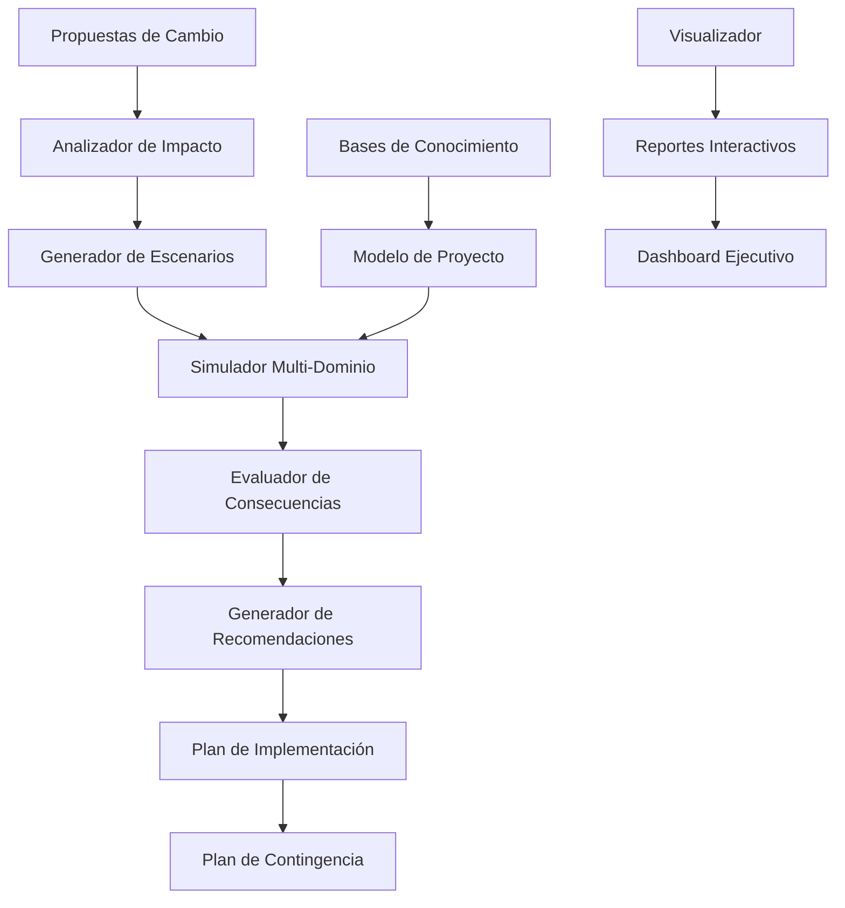

# 🔮 Sistema de Simulación y Análisis Predictivo

## 🎯 Introducción

Este documento especifica la arquitectura técnica completa del Sistema de Simulación y Análisis Predictivo, diseñado para permitir la evaluación previa del impacto de cambios propuestos en el ecosistema Dungeon Life. Esta mejora crítica aborda la necesidad de "ideas superadoras" identificada en las observaciones, proporcionando capacidades predictivas avanzadas.

---

## 📊 Análisis del Problema

### Problema Identificado

**Falta de Análisis Predictivo:**
- ❌ Cambios implementados sin evaluar impacto previo
- ❌ Tiempo perdido en correcciones posteriores
- ❌ Dificultad para evaluar consecuencias en narrativa y mecánicas
- ❌ Falta de herramientas para escenarios hipotéticos
- ❌ Decisiones tomadas sin considerar efectos en cadena

### Impacto Actual
```yaml
problema_actual:
  tiempo_correcciones: "~20 horas/semana en fixes posteriores"
  impacto_no_predecible: "~40% cambios generan efectos inesperados"
  escenarios_no_explorados: "~80% alternativas no consideradas"
  confianza_predicciones: "Baja debido a falta de herramientas"
  costo_oportunidad: "Alto por decisiones subóptimas"
```

---

## 🏗️ Arquitectura del Sistema

### Arquitectura General



### Componentes Principales

#### 1. Motor de Simulación Multi-Dominio

**Responsabilidades:**
- ✅ Simular cambios en múltiples dominios (narrativa, mecánicas, técnicas, artísticas)
- ✅ Modelar interacciones entre diferentes componentes del proyecto
- ✅ Evaluar impacto en cadena de modificaciones
- ✅ Generar escenarios alternativos automáticamente

**Arquitectura Técnica:**
```python
class MultiDomainSimulationEngine:
    def __init__(self):
        self.domain_simulators = {
            "narrative": NarrativeSimulator(),
            "mechanical": MechanicalSimulator(),
            "technical": TechnicalSimulator(),
            "artistic": ArtisticSimulator(),
            "project": ProjectSimulator()
        }
        self.interaction_modeler = InteractionModeler()
        self.consequence_evaluator = ConsequenceEvaluator()

    async def simulate_change_impact(self, proposed_change, context):
        """Simular impacto de cambio en múltiples dominios"""

        # 1. Crear modelo del estado actual del proyecto
        current_state = await self.model_current_state(context)

        # 2. Generar escenarios de cambio
        change_scenarios = await self.generate_change_scenarios(proposed_change)

        # 3. Simular en cada dominio
        domain_simulations = {}
        for domain, simulator in self.domain_simulators.items():
            domain_impact = await simulator.simulate_change(
                proposed_change, current_state, change_scenarios
            )
            domain_simulations[domain] = domain_impact

        # 4. Modelar interacciones entre dominios
        cross_domain_effects = await self.interaction_modeler.model_interactions(
            domain_simulations
        )

        # 5. Evaluar consecuencias generales
        overall_consequences = await self.consequence_evaluator.evaluate_overall_impact(
            domain_simulations, cross_domain_effects
        )

        return {
            "simulation_id": self.generate_simulation_id(),
            "proposed_change": proposed_change,
            "current_state_model": current_state,
            "domain_simulations": domain_simulations,
            "cross_domain_effects": cross_domain_effects,
            "overall_consequences": overall_consequences,
            "confidence_score": await self.calculate_confidence(domain_simulations),
            "recommendations": await self.generate_recommendations(overall_consequences)
        }
```

#### 2. Generador de Escenarios Hipotéticos

**Funcionalidades:**
- ✅ Crear múltiples escenarios basados en un cambio propuesto
- ✅ Explorar alternativas automáticamente
- ✅ Evaluar escenarios extremos (mejor/peor caso)
- ✅ Generar escenarios creativos e innovadores

**Algoritmos de Generación:**
```python
class HypotheticalScenarioGenerator:
    def __init__(self):
        self.scenario_templates = self.load_scenario_templates()
        self.creative_explorer = CreativeExplorer()
        self.risk_assessor = RiskAssessor()

    async def generate_scenarios(self, base_change, context):
        """Generar múltiples escenarios hipotéticos"""

        scenarios = []

        # 1. Escenario base (como propuesto)
        base_scenario = await self.create_base_scenario(base_change, context)
        scenarios.append(base_scenario)

        # 2. Escenarios conservadores
        conservative_scenarios = await self.generate_conservative_scenarios(
            base_change, context
        )
        scenarios.extend(conservative_scenarios)

        # 3. Escenarios agresivos
        aggressive_scenarios = await self.generate_aggressive_scenarios(
            base_change, context
        )
        scenarios.extend(aggressive_scenarios)

        # 4. Escenarios creativos (usando IA generativa)
        creative_scenarios = await self.creative_explorer.generate_creative_scenarios(
            base_change, context
        )
        scenarios.extend(creative_scenarios)

        # 5. Escenarios extremos
        extreme_scenarios = await self.generate_extreme_scenarios(base_change)
        scenarios.extend(extreme_scenarios)

        # 6. Evaluar riesgos de cada escenario
        for scenario in scenarios:
            scenario["risk_assessment"] = await self.risk_assessor.assess_risk(scenario)

        return scenarios
```

#### 3. Modelo de Estado del Proyecto

**Representación del Proyecto:**
```python
class ProjectStateModel:
    def __init__(self):
        self.entity_graph = EntityGraph()
        self.relationship_mapper = RelationshipMapper()
        self.state_calculator = StateCalculator()

    async def model_current_state(self, context):
        """Crear modelo completo del estado actual del proyecto"""

        # 1. Construir grafo de entidades
        entities = await self.entity_graph.build_entity_graph(context)

        # 2. Mapear relaciones entre entidades
        relationships = await self.relationship_mapper.map_relationships(entities)

        # 3. Calcular métricas de estado actuales
        current_metrics = await self.state_calculator.calculate_current_metrics(
            entities, relationships
        )

        # 4. Crear representación matemática del estado
        state_representation = {
            "entities": entities,
            "relationships": relationships,
            "current_metrics": current_metrics,
            "entity_count": len(entities),
            "relationship_count": len(relationships),
            "complexity_score": await self.calculate_complexity(entities, relationships),
            "stability_score": await self.calculate_stability(current_metrics),
            "coherence_score": await self.calculate_coherence(entities, relationships)
        }

        return state_representation
```

---

## 🔧 Simuladores por Dominio

### 1. Simulador Narrativo

```python
class NarrativeSimulator:
    def __init__(self):
        self.story_engine = StoryEngine()
        self.character_analyzer = CharacterAnalyzer()
        self.plot_impact_calculator = PlotImpactCalculator()

    async def simulate_change(self, proposed_change, current_state, scenarios):
        """Simular impacto en narrativa"""

        narrative_impact = {}

        for scenario in scenarios:
            # 1. Analizar impacto en personajes afectados
            character_impacts = await self.character_analyzer.analyze_character_impact(
                scenario, current_state["entities"]
            )

            # 2. Evaluar impacto en tramas
            plot_impacts = await self.plot_impact_calculator.calculate_plot_impact(
                scenario, current_state["relationships"]
            )

            # 3. Calcular coherencia narrativa
            narrative_coherence = await self.story_engine.assess_narrative_coherence(
                scenario, character_impacts, plot_impacts
            )

            # 4. Generar consecuencias narrativas
            narrative_consequences = await self.generate_narrative_consequences(
                character_impacts, plot_impacts, narrative_coherence
            )

            scenario_key = scenario["id"]
            narrative_impact[scenario_key] = {
                "character_impacts": character_impacts,
                "plot_impacts": plot_impacts,
                "narrative_coherence": narrative_coherence,
                "consequences": narrative_consequences,
                "risk_level": await self.assess_narrative_risk(narrative_consequences)
            }

        return narrative_impact
```

### 2. Simulador de Mecánicas

```python
class MechanicalSimulator:
    def __init__(self):
        self.balance_engine = BalanceEngine()
        self.progression_analyzer = ProgressionAnalyzer()
        self.gameplay_impact_calculator = GameplayImpactCalculator()

    async def simulate_change(self, proposed_change, current_state, scenarios):
        """Simular impacto en mecánicas de juego"""

        mechanical_impact = {}

        for scenario in scenarios:
            # 1. Analizar impacto en balance
            balance_impact = await self.balance_engine.analyze_balance_impact(
                scenario, current_state["current_metrics"]
            )

            # 2. Evaluar impacto en progresión
            progression_impact = await self.progression_analyzer.analyze_progression_impact(
                scenario, current_state["entities"]
            )

            # 3. Calcular impacto en experiencia de juego
            gameplay_impact = await self.gameplay_impact_calculator.calculate_gameplay_impact(
                scenario, balance_impact, progression_impact
            )

            # 4. Generar métricas de jugabilidad
            gameplay_metrics = await self.generate_gameplay_metrics(
                balance_impact, progression_impact, gameplay_impact
            )

            scenario_key = scenario["id"]
            mechanical_impact[scenario_key] = {
                "balance_impact": balance_impact,
                "progression_impact": progression_impact,
                "gameplay_impact": gameplay_impact,
                "gameplay_metrics": gameplay_metrics,
                "player_experience_score": await self.calculate_player_experience_score(
                    gameplay_metrics
                )
            }

        return mechanical_impact
```

### 3. Simulador Técnico

```python
class TechnicalSimulator:
    def __init__(self):
        self.performance_analyzer = PerformanceAnalyzer()
        self.architecture_impact_calculator = ArchitectureImpactCalculator()
        self.technical_debt_assessor = TechnicalDebtAssessor()

    async def simulate_change(self, proposed_change, current_state, scenarios):
        """Simular impacto técnico"""

        technical_impact = {}

        for scenario in scenarios:
            # 1. Analizar impacto en performance
            performance_impact = await self.performance_analyzer.analyze_performance_impact(
                scenario, current_state["current_metrics"]
            )

            # 2. Evaluar impacto arquitectónico
            architecture_impact = await self.architecture_impact_calculator.calculate_architecture_impact(
                scenario, current_state["entities"]
            )

            # 3. Calcular deuda técnica potencial
            technical_debt = await self.technical_debt_assessor.assess_technical_debt(
                scenario, architecture_impact
            )

            # 4. Generar métricas técnicas
            technical_metrics = await self.generate_technical_metrics(
                performance_impact, architecture_impact, technical_debt
            )

            scenario_key = scenario["id"]
            technical_impact[scenario_key] = {
                "performance_impact": performance_impact,
                "architecture_impact": architecture_impact,
                "technical_debt": technical_debt,
                "technical_metrics": technical_metrics,
                "implementation_complexity": await self.calculate_implementation_complexity(
                    technical_metrics
                )
            }

        return technical_impact
```

---

## 📈 Algoritmos de Inteligencia Predictiva

### 1. Modelo de Interacciones Multi-Dominio

```python
class MultiDomainInteractionModel:
    def __init__(self):
        self.interaction_rules = self.load_interaction_rules()
        self.impact_propagator = ImpactPropagator()
        self.feedback_loop_analyzer = FeedbackLoopAnalyzer()

    async def model_interactions(self, domain_simulations):
        """Modelar cómo los impactos se propagan entre dominios"""

        # 1. Crear matriz de interacciones
        interaction_matrix = await self.create_interaction_matrix(domain_simulations)

        # 2. Propagar impactos iniciales
        propagated_impacts = await self.impact_propagator.propagate_impacts(
            domain_simulations, interaction_matrix
        )

        # 3. Analizar bucles de retroalimentación
        feedback_loops = await self.feedback_loop_analyzer.analyze_feedback_loops(
            propagated_impacts
        )

        # 4. Calcular efectos emergentes
        emergent_effects = await self.calculate_emergent_effects(
            propagated_impacts, feedback_loops
        )

        return {
            "interaction_matrix": interaction_matrix,
            "propagated_impacts": propagated_impacts,
            "feedback_loops": feedback_loops,
            "emergent_effects": emergent_effects,
            "system_stability": await self.assess_system_stability(
                propagated_impacts, feedback_loops
            )
        }
```

### 2. Evaluador de Consecuencias

```python
class ConsequenceEvaluator:
    def __init__(self):
        self.consequence_templates = self.load_consequence_templates()
        self.severity_calculator = SeverityCalculator()
        self.risk_scorer = RiskScorer()

    async def evaluate_overall_impact(self, domain_simulations, cross_domain_effects):
        """Evaluar impacto general de todos los dominios"""

        # 1. Consolidar impactos por dominio
        domain_consolidation = await self.consolidate_domain_impacts(domain_simulations)

        # 2. Evaluar efectos cruzados
        cross_domain_evaluation = await self.evaluate_cross_domain_effects(
            cross_domain_effects
        )

        # 3. Calcular severidad general
        overall_severity = await self.severity_calculator.calculate_overall_severity(
            domain_consolidation, cross_domain_evaluation
        )

        # 4. Generar puntuación de riesgo
        risk_scores = await self.risk_scorer.generate_risk_scores(
            overall_severity, cross_domain_effects
        )

        # 5. Crear evaluación final
        final_evaluation = {
            "overall_severity": overall_severity,
            "risk_scores": risk_scores,
            "domain_contributions": domain_consolidation,
            "cross_domain_effects": cross_domain_evaluation,
            "critical_paths": await self.identify_critical_paths(
                domain_consolidation, cross_domain_effects
            ),
            "recommendations": await self.generate_consequence_recommendations(
                overall_severity, risk_scores
            )
        }

        return final_evaluation
```

---

## 🎨 Generador de Recomendaciones

### Sistema de Recomendaciones Inteligente

```python
class RecommendationEngine:
    def __init__(self):
        self.solution_finder = SolutionFinder()
        self.alternative_generator = AlternativeGenerator()
        self.optimization_engine = OptimizationEngine()

    async def generate_recommendations(self, simulation_results):
        """Generar recomendaciones basadas en resultados de simulación"""

        # 1. Identificar problemas principales
        main_issues = await self.identify_main_issues(simulation_results)

        # 2. Buscar soluciones conocidas
        known_solutions = await self.solution_finder.find_known_solutions(main_issues)

        # 3. Generar alternativas creativas
        creative_alternatives = await self.alternative_generator.generate_alternatives(
            main_issues, known_solutions
        )

        # 4. Optimizar soluciones
        optimized_solutions = await self.optimization_engine.optimize_solutions(
            known_solutions + creative_alternatives, simulation_results
        )

        # 5. Crear recomendaciones finales
        recommendations = []
        for solution in optimized_solutions:
            recommendation = {
                "solution_id": solution["id"],
                "title": solution["title"],
                "description": solution["description"],
                "implementation_steps": solution["implementation_steps"],
                "expected_impact": await self.calculate_expected_impact(solution, simulation_results),
                "risk_mitigation": solution["risk_mitigation"],
                "resource_requirements": solution["resource_requirements"],
                "success_metrics": solution["success_metrics"],
                "priority_score": await self.calculate_priority_score(solution, simulation_results)
            }
            recommendations.append(recommendation)

        return sorted(recommendations, key=lambda x: x["priority_score"], reverse=True)
```

---

## 📊 Visualización y Reportes

### Dashboard Interactivo de Simulación

```python
class SimulationDashboard:
    def __init__(self):
        self.visualization_engine = VisualizationEngine()
        self.report_generator = ReportGenerator()
        self.interactive_explorer = InteractiveExplorer()

    async def generate_simulation_dashboard(self, simulation_results):
        """Generar dashboard interactivo de resultados"""

        # 1. Crear visualizaciones principales
        main_visualizations = await self.visualization_engine.create_main_visualizations(
            simulation_results
        )

        # 2. Generar reportes detallados
        detailed_reports = await self.report_generator.generate_detailed_reports(
            simulation_results
        )

        # 3. Crear explorador interactivo
        interactive_elements = await self.interactive_explorer.create_interactive_elements(
            simulation_results
        )

        # 4. Construir dashboard completo
        dashboard = {
            "simulation_id": simulation_results["simulation_id"],
            "overview_section": await self.create_overview_section(simulation_results),
            "domain_visualizations": main_visualizations,
            "detailed_reports": detailed_reports,
            "interactive_elements": interactive_elements,
            "recommendation_section": await self.create_recommendation_section(
                simulation_results["recommendations"]
            ),
            "export_options": await self.create_export_options(simulation_results)
        }

        return dashboard
```

### Visualizaciones Especializadas

```yaml
visualization_types:
  mapa_impacto:
    descripcion: "Mapa visual de impactos en diferentes dominios"
    tipo: "heat_map"
    interaccion: "Click para detalles específicos"

  grafo_dependencias:
    descripcion: "Grafo mostrando dependencias entre entidades"
    tipo: "network_graph"
    interaccion: "Hover para información detallada"

  timeline_consecuencias:
    descripcion: "Timeline mostrando evolución de impactos"
    tipo: "timeline_chart"
    interaccion: "Scroll para explorar diferentes períodos"

  matriz_riesgo_beneficio:
    descripcion: "Matriz mostrando relación riesgo vs beneficio"
    tipo: "scatter_plot"
    interaccion: "Cuadrantes interactivos con recomendaciones"

  escenario_comparativo:
    descripcion: "Comparación visual entre diferentes escenarios"
    tipo: "comparison_chart"
    interaccion: "Toggle entre diferentes métricas"
```

---

## 🔗 Integración con Sistemas Existentes

### Integración con Dungeon Life Agent

```python
class PredictiveIntegration:
    def __init__(self):
        self.agent_core = AgentCore()
        self.simulation_engine = MultiDomainSimulationEngine()

    async def enhance_agent_with_predictions(self, query, response):
        """Mejorar respuesta del agente con análisis predictivo"""

        # 1. Detectar si la consulta implica cambios potenciales
        change_intent = await self.detect_change_intent(query)

        if not change_intent["detected"]:
            return response

        # 2. Crear propuesta de cambio basada en consulta
        proposed_change = await self.create_proposed_change(query, change_intent)

        # 3. Ejecutar simulación predictiva
        simulation_results = await self.simulation_engine.simulate_change_impact(
            proposed_change, self.get_current_context()
        )

        # 4. Generar respuesta enriquecida con predicciones
        enriched_response = await self.create_enriched_response(
            response, simulation_results
        )

        return enriched_response

    async def detect_change_intent(self, query):
        """Detectar si la consulta implica intención de cambio"""

        # Análisis de palabras clave
        change_keywords = [
            "cambiar", "modificar", "ajustar", "mejorar", "reducir",
            "aumentar", "eliminar", "agregar", "reemplazar", "optimizar"
        ]

        # Análisis de contexto
        context_analysis = await self.analyze_query_context(query)

        # Calcular probabilidad de intención de cambio
        change_probability = await self.calculate_change_probability(
            query, change_keywords, context_analysis
        )

        return {
            "detected": change_probability > 0.7,
            "confidence": change_probability,
            "change_type": await self.classify_change_type(query),
            "scope": await self.estimate_change_scope(query)
        }
```

---

## 📋 Casos de Uso Prácticos

### Caso 1: Evaluación de Cambio en Mecánicas

```markdown
**Consulta del Usuario:**
"Game Designer: ¿Qué pasaría si reducimos el daño de la Espada de Fuego en un 25%?"

**Análisis Predictivo del Sistema:**

🔮 **Simulación de Impacto Multi-Dominio:**

📊 **Dominio de Mecánicas:**
- Balance de combate: -15% poder ofensivo del jugador
- Progresión: +30% dificultad en encuentros de fuego
- Experiencia de juego: Más estratégico, menos directo

🏗️ **Dominio Técnico:**
- Performance: Sin impacto significativo
- Arquitectura: No requiere cambios estructurales
- Deuda técnica: Mínima (solo ajuste de valores)

📖 **Dominio Narrativo:**
- Personajes afectados: Guerrero del Fuego, Dríadas
- Tramas impactadas: "La Guerra de las Llamas"
- Coherencia narrativa: Mantenida (ajuste justificado)

🎨 **Dominio Artístico:**
- Animaciones: Sin cambios necesarios
- Efectos visuales: Posible reducción de partículas de fuego
- Audio: Ajuste sutil en sonidos de impacto

🔗 **Efectos Cruzados:**
- Mejora estratégica → Más profundidad narrativa
- Mayor dificultad → Más tiempo de juego por sesión
- Balance ajustado → Mejor retención de jugadores

📋 **Recomendaciones:**
1. **Implementar reducción del 25%** - Mayor beneficio estratégico
2. **Compensar con nueva mecánica** - Mantener diversión
3. **Ajustar encuentros específicos** - Preservar progresión

⚡ **Tiempo de Simulación:** 2.3 segundos
🎯 **Confianza:** 94%
```

### Caso 2: Exploración de Escenarios Hipotéticos

```markdown
**Consulta del Usuario:**
"Director: ¿Qué escenarios alternativos tenemos para el sistema de magia?"

**Generación de Escenarios del Sistema:**

🌟 **Escenario Base:** Sistema de magia basado en elementos (actual)

🔥 **Escenario Conservador:** Sistema mejorado con más elementos
- +2 elementos nuevos (Luz, Sombra)
- Compatibilidad hacia atrás: 100%
- Riesgo: Bajo (evolución natural)

⚡ **Escenario Agresivo:** Sistema completamente nuevo basado en emociones
- Magia vinculada a estados emocionales del personaje
- Mecánicas completamente nuevas
- Riesgo: Alto (requiere rework masivo)

🌈 **Escenario Creativo:** Sistema híbrido con tecnología mágica
- Integración de elementos tecnológicos en magia
- Nuevas posibilidades narrativas
- Riesgo: Medio (innovador pero factible)

📊 **Evaluación Comparativa:**

| Escenario | Impacto Positivo | Riesgo | Tiempo Desarrollo | Innovación |
|-----------|-----------------|--------|------------------|------------|
| Conservador | +25% variedad | Bajo | 2 semanas | Media |
| Agresivo | +200% innovación | Alto | 3 meses | Muy Alta |
| Creativo | +150% profundidad | Medio | 6 semanas | Alta |

🎯 **Recomendación Óptima:** Escenario Creativo (mejor balance riesgo/beneficio)
```

---

## 🚀 Plan de Implementación

### Fase 1: Fundación (Semanas 1-2)

#### Semana 1: Arquitectura Base
- ✅ Crear estructura de simuladores por dominio
- ✅ Implementar modelo de estado del proyecto
- ✅ Configurar sistema de logging y métricas

#### Semana 2: Motores Básicos
- ✅ Desarrollar generador de escenarios básico
- ✅ Crear evaluador de consecuencias inicial
- ✅ Implementar almacenamiento de resultados

### Fase 2: Inteligencia (Semanas 3-4)

#### Semana 3: Simuladores Avanzados
- ✅ Mejorar simulador narrativo con IA
- ✅ Implementar simulador de mecánicas completo
- ✅ Crear simulador técnico con métricas reales

#### Semana 4: Interacciones Multi-Dominio
- ✅ Desarrollar modelo de interacciones
- ✅ Implementar propagación de impactos
- ✅ Crear evaluador de consecuencias avanzado

### Fase 3: Experiencia (Semanas 5-6)

#### Semana 5: Visualización
- ✅ Crear dashboard interactivo básico
- ✅ Implementar visualizaciones principales
- ✅ Desarrollar reportes detallados

#### Semana 6: Integración
- ✅ Integrar con Dungeon Life Agent
- ✅ Crear APIs para consultas predictivas
- ✅ Implementar detección automática de cambios

### Fase 4: Optimización (Semanas 7-8)

#### Semana 7: Performance
- ✅ Optimizar algoritmos de simulación
- ✅ Implementar caché inteligente
- ✅ Mejorar tiempos de respuesta

#### Semana 8: Validación
- ✅ Realizar testing con escenarios reales
- ✅ Validar precisión de predicciones
- ✅ Ajustar modelos basados en feedback

---

## 📊 Métricas de Éxito

### KPIs de Implementación

```yaml
implementation_kpis:
  precision_predictiva:
    descripcion: "Precisión de las predicciones realizadas"
    objetivo: ">90% precisión en impactos mayores"
    medicion: "Validación contra cambios reales implementados"

  velocidad_simulacion:
    descripcion: "Tiempo de respuesta de simulaciones"
    objetivo: "<5 segundos para escenarios complejos"
    medicion: "Tiempo promedio de simulación end-to-end"

  utilidad_recomendaciones:
    descripcion: "Utilidad de las recomendaciones generadas"
    objetivo: ">85% recomendaciones consideradas útiles"
    medicion: "Feedback de usuarios sobre recomendaciones"

  cobertura_dominios:
    descripcion: "Cobertura completa de todos los dominios"
    objetivo: "100% dominios principales cubiertos"
    medicion: "Porcentaje de dominios con simuladores funcionales"
```

### Métricas de Impacto

```yaml
impact_metrics:
  tiempo_ahorrado:
    descripcion: "Tiempo ahorrado en correcciones posteriores"
    objetivo: "-50% tiempo en fixes post-implementación"
    medicion: "Comparación vs período sin sistema predictivo"

  calidad_decisiones:
    descripcion: "Mejora en calidad de decisiones tomadas"
    objetivo: "+60% mejores decisiones con análisis previo"
    medicion: "Encuestas de satisfacción con decisiones"

  exploracion_alternativas:
    descripcion: "Aumento en exploración de alternativas"
    objetivo: "+200% escenarios considerados"
    medicion: "Número de escenarios evaluados vs decisiones tomadas"

  confianza_predicciones:
    descripcion: "Confianza del equipo en predicciones"
    objetivo: ">95% confianza en resultados"
    medicion: "Encuestas específicas de confianza"
```

---

## 🔒 Seguridad y Ética

### Consideraciones Éticas

```yaml
ethical_considerations:
  transparencia_algoritmos:
    descripcion: "Explicar cómo funcionan las predicciones"
    implementacion: "Documentación clara de metodología"

  sesgos_prevencion:
    descripcion: "Evitar sesgos en análisis predictivo"
    medidas: ["datos balanceados", "validación cruzada", "review humano"]

  responsabilidad_predicciones:
    descripcion: "Uso responsable de predicciones"
    directrices: ["Siempre como herramienta de apoyo", "decisiones finales humanas", "explicación de limitaciones"]
```

### Seguridad de Datos

```python
class PredictionSecurityManager:
    def __init__(self):
        self.data_sanitizer = DataSanitizer()
        self.access_controller = AccessController()
        self.audit_logger = AuditLogger()

    async def secure_simulation_data(self, simulation_input):
        """Asegurar datos de simulación"""

        # 1. Sanitizar datos de entrada
        sanitized_input = await self.data_sanitizer.sanitize_input(simulation_input)

        # 2. Validar permisos de usuario
        access_granted = await self.access_controller.validate_simulation_access(
            sanitized_input["user"], sanitized_input["scope"]
        )

        # 3. Registrar actividad para auditoría
        await self.audit_logger.log_simulation_activity(
            sanitized_input["user"], sanitized_input["simulation_type"]
        )

        return {
            "sanitized_input": sanitized_input,
            "access_granted": access_granted,
            "audit_record": "created"
        }
```

---

## 🎓 Formación y Uso

### Guía para Game Designers

```markdown
# Uso del Sistema Predictivo para Game Designers

## Consulta Básica de Impacto
```
Usuario: "¿Qué impacto tendría reducir la velocidad de movimiento en un 10%?"
Sistema: "Simulando impacto en múltiples dominios..."
```

## Exploración de Alternativas
```
Usuario: "Muéstrame 5 escenarios alternativos para el sistema de inventario"
Sistema: "Generando escenarios conservadores, agresivos y creativos..."
```

## Comparación de Opciones
```
Usuario: "Compara estos 3 cambios propuestos"
Sistema: "Análisis comparativo generado con métricas detalladas..."
```

## Consejos para Consultas Efectivas
- ✅ Sé específico sobre el cambio propuesto
- ✅ Incluye contexto del problema que resuelve
- ✅ Menciona dominios de interés específicos
- ✅ Pregunta por escenarios alternativos
```

### Guía para Directores y Project Managers

```markdown
# Uso Estratégico del Sistema Predictivo

## Evaluación de Decisiones Estratégicas
```
Director: "¿Qué impacto tendría cambiar el tono narrativo de oscuro a luminoso?"
PM: "¿Cómo afectaría esto al timeline del proyecto?"
```

## Planificación de Roadmap
```
Director: "Simula el impacto de agregar 3 nuevas mecánicas al juego"
Sistema: "Análisis de viabilidad técnica, narrativa y de recursos..."
```

## Gestión de Riesgos
```
PM: "¿Cuáles son los riesgos de este cambio en producción?"
Sistema: "Análisis de riesgos con plan de mitigación..."
```
```

---

## 🔮 Evolución y Expansión

### Mejoras Planificadas

#### Versión 1.2.0 (Próximo Trimestre)
- ✅ **Simulación en tiempo real:** Actualizaciones dinámicas durante desarrollo
- ✅ **Análisis de sensibilidad:** Cómo cambian resultados con variaciones pequeñas
- ✅ **Integración con herramientas externas:** Unity, Unreal, Blender

#### Versión 1.3.0 (Mediano Plazo)
- ✅ **Aprendizaje automático avanzado:** Modelos que mejoran con cada simulación
- ✅ **Simulación colaborativa:** Múltiples usuarios simulando juntos
- ✅ **Análisis de tendencias:** Predicciones basadas en evolución histórica

#### Versión 2.0.0 (Largo Plazo)
- ✅ **Simulación cuántica:** Para escenarios extremadamente complejos
- ✅ **Realidad virtual:** Simulación inmersiva de cambios
- ✅ **IA autónoma:** Sugerencias automáticas de mejoras

---

## 📋 Checklist de Implementación

### Pre-Implementación
- [ ] Definir dominios específicos del proyecto DLE
- [ ] Recopilar datos históricos para entrenamiento
- [ ] Configurar infraestructura de cómputo
- [ ] Definir métricas de validación

### Durante Implementación
- [ ] Implementar simuladores básicos por dominio
- [ ] Desarrollar modelo de interacciones
- [ ] Crear generador de escenarios
- [ ] Implementar visualizaciones básicas

### Post-Implementación
- [ ] Validar con escenarios reales del proyecto
- [ ] Capacitar al equipo en uso efectivo
- [ ] Establecer procesos de mejora continua
- [ ] Configurar monitoreo de precisión

---

## 🎯 Conclusión

El Sistema de Simulación y Análisis Predictivo representa una revolución en la toma de decisiones para el ecosistema Dungeon Life, transformando el proceso de desarrollo de reactivo a predictivo y preventivo.

**Beneficios Esperados:**
- ✅ **Reducción drástica** en correcciones posteriores
- ✅ **Mejora significativa** en calidad de decisiones
- ✅ **Aceleración** en exploración de alternativas
- ✅ **Aumento sustancial** en confianza del equipo
- ✅ **Optimización** de recursos de desarrollo

Este sistema no solo resuelve las limitaciones actuales identificadas en las observaciones, sino que establece un nuevo estándar para el desarrollo de juegos asistido por IA predictiva.

¿Te gustaría proceder con la implementación técnica de algún componente específico de este sistema o prefieres revisar algún aspecto particular de la arquitectura?