# 🏗️ Arquitectura Técnica Detallada - Mejoras Críticas

## 🎯 Introducción

Este documento presenta la arquitectura técnica completa del Dungeon Life Agent con las mejoras críticas integradas. Muestra cómo los nuevos sistemas (Memoria Colectiva, Detección de Conflictos, Simulación Predictiva y Agente Proactivo) se integran con la arquitectura existente para crear un ecosistema de desarrollo asistido por IA verdaderamente avanzado.

---

## 📊 Arquitectura General Mejorada

### Visión General del Sistema Completo

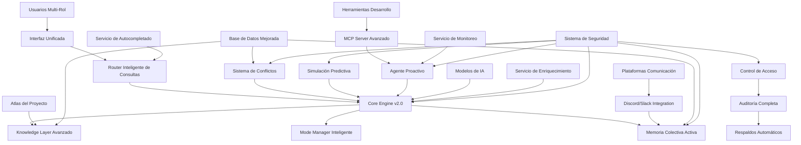

---

## 🏛️ Arquitectura por Capas

### 1. Capa de Presentación (Interfaz de Usuario)

#### Componentes de Interfaz Mejorados

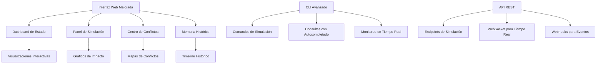

**Especificaciones Técnicas:**

```python
class EnhancedPresentationLayer:
    def __init__(self):
        self.web_interface = EnhancedWebInterface()
        self.cli_interface = AdvancedCLIInterface()
        self.api_layer = RESTfulAPI()

        # Nuevas funcionalidades de interfaz
        self.simulation_dashboard = SimulationDashboard()
        self.conflict_center = ConflictResolutionCenter()
        self.collective_memory_browser = CollectiveMemoryBrowser()
        self.proactive_monitoring_panel = ProactiveMonitoringPanel()

    async def handle_user_interaction(self, user_input, interface_type):
        """Manejar interacción del usuario con mejoras"""

        # 1. Autocompletado inteligente
        if interface_type == "cli" and self.is_partial_query(user_input):
            suggestions = await self.generate_autocomplete_suggestions(user_input)
            return {"type": "suggestions", "content": suggestions}

        # 2. Enriquecimiento automático
        enriched_input = await self.enrich_user_input(user_input)

        # 3. Routing inteligente
        routing_decision = await self.route_to_appropriate_system(enriched_input)

        # 4. Procesamiento con mejoras críticas
        if routing_decision["requires_simulation"]:
            return await self.process_with_simulation(enriched_input, routing_decision)

        if routing_decision["requires_conflict_analysis"]:
            return await self.process_with_conflict_analysis(enriched_input, routing_decision)

        if routing_decision["requires_historical_context"]:
            return await self.process_with_historical_context(enriched_input, routing_decision)

        # 5. Respuesta estándar mejorada
        return await self.process_standard_query(enriched_input, routing_decision)
```

### 2. Capa de Lógica de Negocio (Core Engine v2.0)

#### Arquitectura del Motor Mejorado

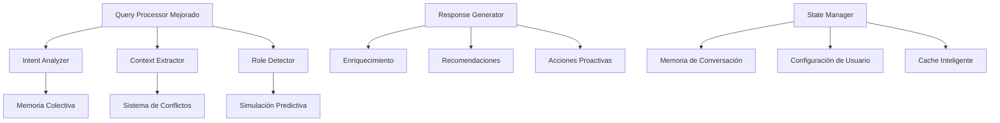

**Especificaciones Técnicas:**

```python
class EnhancedCoreEngine:
    def __init__(self):
        # Sistemas existentes mejorados
        self.query_processor = EnhancedQueryProcessor()
        self.response_generator = AdvancedResponseGenerator()
        self.state_manager = ImprovedStateManager()

        # Sistemas críticos nuevos
        self.collective_memory = CollectiveMemorySystem()
        self.conflict_system = ConflictDetectionAndResolutionSystem()
        self.simulation_engine = MultiDomainSimulationEngine()
        self.proactive_agent = ProactiveAgentSystem()

        # Integración entre sistemas
        self.system_integrator = SystemIntegrator()

    async def process_enhanced_query(self, query, context):
        """Procesar consulta con todas las mejoras críticas"""

        # 1. Análisis inicial mejorado
        initial_analysis = await self.query_processor.analyze_query(query, context)

        # 2. Consulta a memoria colectiva si es relevante
        if initial_analysis["requires_historical_context"]:
            historical_context = await self.collective_memory.query_related_context(
                query, context
            )
            initial_analysis["historical_context"] = historical_context

        # 3. Detección proactiva de conflictos
        conflict_analysis = await self.conflict_system.detect_potential_conflicts(
            query, initial_analysis
        )

        # 4. Simulación predictiva si implica cambios
        if initial_analysis["implies_change"]:
            simulation_results = await self.simulation_engine.simulate_impact(
                query, initial_analysis, context
            )
            initial_analysis["simulation_results"] = simulation_results

        # 5. Generación de respuesta enriquecida
        enhanced_response = await self.response_generator.generate_enriched_response(
            initial_analysis, conflict_analysis, context
        )

        # 6. Acciones proactivas si son necesarias
        proactive_actions = await self.proactive_agent.generate_proactive_actions(
            enhanced_response, context
        )

        return {
            "response": enhanced_response,
            "historical_context": initial_analysis.get("historical_context"),
            "conflict_analysis": conflict_analysis,
            "simulation_results": initial_analysis.get("simulation_results"),
            "proactive_actions": proactive_actions,
            "confidence_score": await self.calculate_overall_confidence(
                initial_analysis, conflict_analysis
            )
        }
```

### 3. Capa de Datos (Knowledge Layer Avanzado)

#### Arquitectura de Datos Mejorada

```mermaid
graph TD
    A[Repositorio de Archivos] --> B[Indexador Incremental]
    A --> C[Extractor de Entidades]
    A --> D[Clasificador de Pilares]

    E[Base de Datos Mejorada] --> F[Tablas de Conocimiento Tácito]
    E --> G[Tablas de Conflictos]
    E --> H[Tablas de Simulaciones]
    E --> I[Tablas de Acciones Proactivas]

    J[Cache Inteligente] --> K[Cache de Simulaciones]
    J --> L[Cache de Contextos]
    J --> M[Cache de Conflictos]

    N[Sistema de Embeddings] --> O[Embeddings de Documentos]
    N --> P[Embeddings de Conocimiento Tácito]
    N --> Q[Embeddings de Patrones de Conflicto]
```

**Especificaciones Técnicas:**

```python
class EnhancedKnowledgeLayer:
    def __init__(self):
        # Sistemas existentes mejorados
        self.indexer = IncrementalIndexer()
        self.entity_extractor = EntityExtractor()
        self.pillar_classifier = PillarClassifier()
        self.embedding_system = EmbeddingSystem()

        # Nuevas bases de datos
        self.tacit_knowledge_db = TacitKnowledgeDatabase()
        self.conflict_patterns_db = ConflictPatternsDatabase()
        self.simulation_results_db = SimulationResultsDatabase()
        self.proactive_actions_db = ProactiveActionsDatabase()

        # Cache avanzado
        self.intelligent_cache = IntelligentCache()

    async def store_tacit_knowledge(self, knowledge_record):
        """Almacenar conocimiento tácito con enriquecimiento"""

        # 1. Procesar y enriquecer registro
        enriched_record = await self.enrich_knowledge_record(knowledge_record)

        # 2. Generar embeddings específicos
        tacit_embeddings = await self.embedding_system.generate_tacit_embeddings(
            enriched_record
        )

        # 3. Almacenar en base de datos especializada
        stored_id = await self.tacit_knowledge_db.store_record(
            enriched_record, tacit_embeddings
        )

        # 4. Actualizar índices relacionados
        await self.update_related_indices(stored_id, enriched_record)

        # 5. Cachear para acceso rápido
        await self.intelligent_cache.cache_tacit_knowledge(
            stored_id, enriched_record
        )

        return stored_id

    async def query_enhanced_knowledge(self, query, context):
        """Consulta mejorada con múltiples fuentes de conocimiento"""

        # 1. Consulta tradicional mejorada
        traditional_results = await self.query_traditional_knowledge(query, context)

        # 2. Consulta a memoria colectiva
        collective_results = await self.tacit_knowledge_db.query_related_knowledge(
            query, context
        )

        # 3. Consulta de patrones de conflicto
        conflict_insights = await self.conflict_patterns_db.query_relevant_patterns(
            query, context
        )

        # 4. Consulta de resultados de simulación
        simulation_insights = await self.simulation_results_db.query_similar_scenarios(
            query, context
        )

        # 5. Combinar y enriquecer resultados
        combined_results = await self.combine_knowledge_sources(
            traditional_results, collective_results,
            conflict_insights, simulation_insights
        )

        return combined_results
```

---

## 🔧 Integración de Sistemas Críticos

### 1. Integración Memoria Colectiva

#### Flujo de Integración

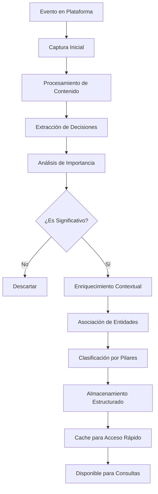

**Especificaciones de Integración:**

```python
class CollectiveMemoryIntegration:
    def __init__(self):
        self.platform_integrations = {
            "discord": DiscordIntegration(),
            "slack": SlackIntegration(),
            "teams": TeamsIntegration()
        }
        self.knowledge_processor = TacitKnowledgeProcessor()
        self.storage_manager = TacitKnowledgeStorage()

    async def integrate_with_core_engine(self):
        """Integrar memoria colectiva con motor principal"""

        # 1. Hook en procesamiento de consultas
        original_query_method = self.core_engine.process_query

        async def enhanced_query_method(query, context):
            # Buscar contexto histórico relacionado
            historical_context = await self.find_relevant_historical_context(query)

            # Procesar consulta original
            response = await original_query_method(query, context)

            # Enriquecer respuesta con contexto histórico
            enriched_response = await self.enrich_response_with_history(
                response, historical_context
            )

            return enriched_response

        self.core_engine.process_query = enhanced_query_method

    async def integrate_with_proactive_agent(self):
        """Integrar con agente proactivo para captura automática"""

        # Hook en acciones proactivas
        original_action_method = self.proactive_agent.execute_action

        async def enhanced_action_method(action, context):
            # Ejecutar acción original
            result = await original_action_method(action, context)

            # Capturar conocimiento tácito si es significativo
            if await self.is_action_significant(action, result):
                await self.capture_action_as_knowledge(action, result, context)

            return result

        self.proactive_agent.execute_action = enhanced_action_method
```

### 2. Integración Sistema de Conflictos

#### Flujo de Integración

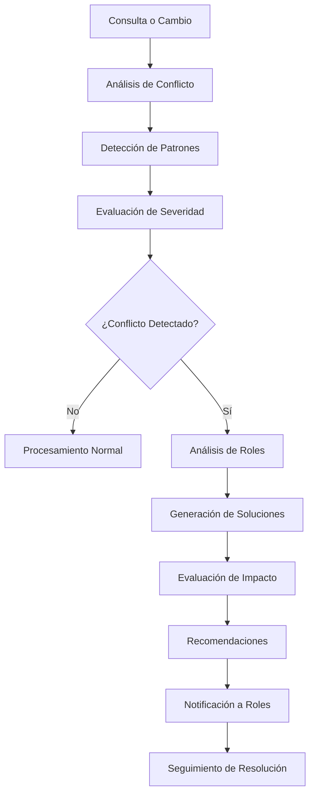

**Especificaciones de Integración:**

```python
class ConflictSystemIntegration:
    def __init__(self):
        self.conflict_detector = ConflictDetector()
        self.resolution_engine = ConflictResolutionEngine()
        self.notification_system = ConflictNotificationSystem()

    async def integrate_with_all_systems(self):
        """Integrar detección de conflictos en todo el sistema"""

        # 1. Integración con procesamiento de consultas
        await self.integrate_with_query_processing()

        # 2. Integración con simulaciones
        await self.integrate_with_simulation_engine()

        # 3. Integración con acciones proactivas
        await self.integrate_with_proactive_actions()

        # 4. Integración con memoria colectiva
        await self.integrate_with_collective_memory()

    async def integrate_with_query_processing(self):
        """Integrar detección de conflictos en procesamiento de consultas"""

        original_process = self.core_engine.process_query

        async def conflict_aware_process(query, context):
            # Procesamiento original
            result = await original_process(query, context)

            # Análisis de conflictos potenciales
            conflict_analysis = await self.conflict_detector.analyze_query_for_conflicts(
                query, result, context
            )

            if conflict_analysis["conflicts_detected"]:
                # Agregar análisis de conflictos a respuesta
                result["conflict_analysis"] = conflict_analysis

                # Generar recomendaciones de resolución
                resolution_recommendations = await self.resolution_engine.generate_recommendations(
                    conflict_analysis
                )
                result["resolution_recommendations"] = resolution_recommendations

            return result

        self.core_engine.process_query = conflict_aware_process
```

### 3. Integración Simulación Predictiva

#### Flujo de Integración

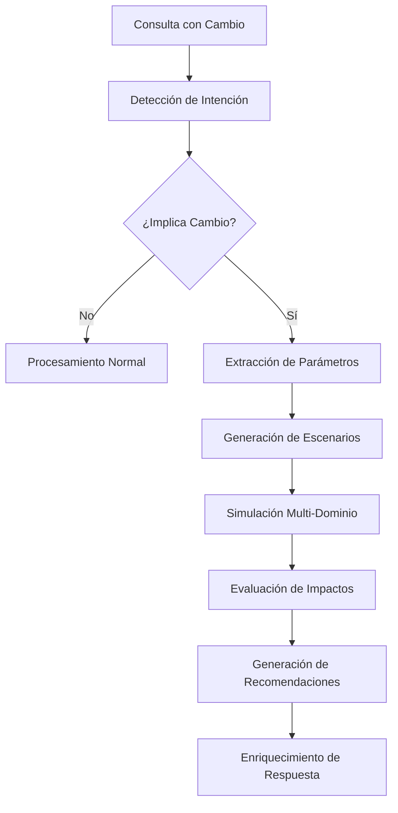

**Especificaciones de Integración:**

```python
class SimulationEngineIntegration:
    def __init__(self):
        self.simulation_engine = MultiDomainSimulationEngine()
        self.intent_detector = ChangeIntentDetector()
        self.scenario_generator = HypotheticalScenarioGenerator()

    async def integrate_with_response_generation(self):
        """Integrar simulación en generación de respuestas"""

        original_generate = self.response_generator.generate_response

        async def simulation_aware_generate(query_analysis, context):
            # Generación original
            response = await original_generate(query_analysis, context)

            # Detección de intención de cambio
            change_intent = await self.intent_detector.detect_change_intent(
                query_analysis
            )

            if change_intent["detected"]:
                # Crear propuesta de cambio
                proposed_change = await self.create_proposed_change(
                    query_analysis, change_intent
                )

                # Ejecutar simulación
                simulation_results = await self.simulation_engine.simulate_change_impact(
                    proposed_change, context
                )

                # Enriquecer respuesta con resultados
                response = await self.enrich_response_with_simulation(
                    response, simulation_results
                )

            return response

        self.response_generator.generate_response = simulation_aware_generate
```

### 4. Integración Agente Proactivo

#### Flujo de Integración

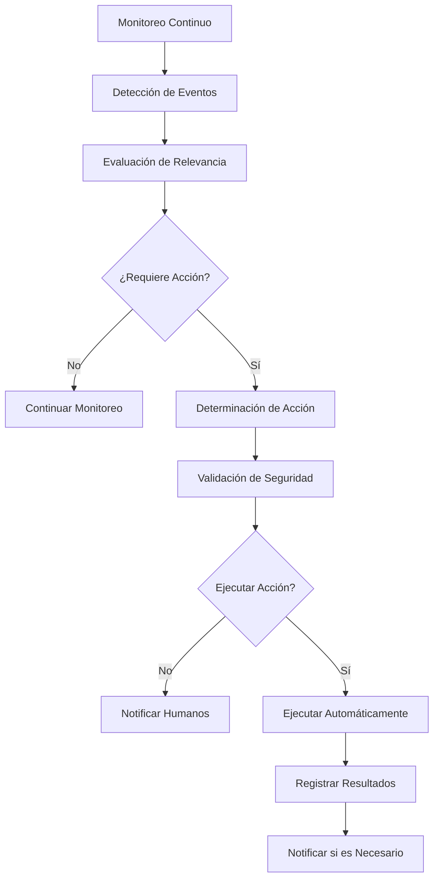

**Especificaciones de Integración:**

```python
class ProactiveAgentIntegration:
    def __init__(self):
        self.monitoring_system = RepositoryMonitoringSystem()
        self.automation_engine = AutomationEngine()
        self.notification_manager = ProactiveNotificationManager()

    async def integrate_with_file_operations(self):
        """Integrar monitoreo proactivo con operaciones de archivos"""

        # Hook en operaciones de archivos del sistema
        original_file_op = self.file_system_manager.perform_operation

        async def monitored_file_operation(operation, file_path, content):
            # Ejecutar operación original
            result = await original_file_op(operation, file_path, content)

            # Monitoreo proactivo
            monitoring_result = await self.monitoring_system.monitor_file_operation(
                operation, file_path, content, result
            )

            # Acciones automáticas si son necesarias
            if monitoring_result["requires_automation"]:
                automation_result = await self.automation_engine.execute_automation(
                    monitoring_result["automation_actions"], operation, file_path
                )

                # Combinar resultados
                result["proactive_actions"] = automation_result

            return result

        self.file_system_manager.perform_operation = monitored_file_operation
```

---

## 🔒 Arquitectura de Seguridad Mejorada

### Seguridad Multi-Capa

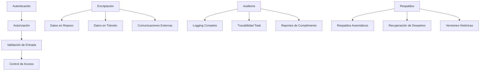

**Especificaciones de Seguridad:**

```python
class EnhancedSecurityArchitecture:
    def __init__(self):
        # Capas de seguridad existentes mejoradas
        self.authentication = MultiFactorAuthentication()
        self.authorization = RoleBasedAccessControl()
        self.input_validation = ComprehensiveInputValidation()
        self.access_control = GranularAccessControl()

        # Seguridad para nuevas funcionalidades
        self.tacit_knowledge_security = TacitKnowledgeSecurity()
        self.simulation_security = SimulationSecurity()
        self.proactive_action_security = ProactiveActionSecurity()

        # Auditoría avanzada
        self.comprehensive_audit = ComprehensiveAuditSystem()

    async def validate_critical_operation(self, operation, context):
        """Validar operaciones críticas con seguridad mejorada"""

        # 1. Validación de autenticación
        auth_result = await self.authentication.validate_user(context["user"])
        if not auth_result["valid"]:
            return {"status": "denied", "reason": "authentication_failed"}

        # 2. Validación de autorización
        authz_result = await self.authorization.validate_permissions(
            context["user"], operation["required_permissions"]
        )
        if not authz_result["authorized"]:
            return {"status": "denied", "reason": "insufficient_permissions"}

        # 3. Validación específica para conocimiento tácito
        if operation["type"] == "tacit_knowledge_access":
            tacit_validation = await self.tacit_knowledge_security.validate_access(
                context["user"], operation["knowledge_record"]
            )
            if not tacit_validation["allowed"]:
                return {"status": "denied", "reason": "tacit_knowledge_restricted"}

        # 4. Validación específica para simulaciones
        if operation["type"] == "simulation_execution":
            sim_validation = await self.simulation_security.validate_simulation(
                operation["simulation_params"], context
            )
            if not sim_validation["allowed"]:
                return {"status": "denied", "reason": "simulation_restricted"}

        # 5. Logging de auditoría completo
        await self.comprehensive_audit.log_critical_operation(
            operation, context, auth_result, authz_result
        )

        return {"status": "approved", "security_clearance": "complete"}
```

---

## 📊 Gestión de Estado y Memoria

### Estado Global Mejorado

```python
class EnhancedStateManager:
    def __init__(self):
        # Estado de sistemas existentes
        self.conversation_state = ConversationState()
        self.user_preferences = UserPreferences()
        self.system_configuration = SystemConfiguration()

        # Estado de nuevas funcionalidades
        self.collective_memory_state = CollectiveMemoryState()
        self.conflict_system_state = ConflictSystemState()
        self.simulation_state = SimulationState()
        self.proactive_agent_state = ProactiveAgentState()

        # Estado integrado
        self.global_state = GlobalStateIntegrator()

    async def get_enhanced_context(self, user_id, conversation_id):
        """Obtener contexto enriquecido con todas las mejoras"""

        # 1. Contexto básico existente
        base_context = await self.get_base_context(user_id, conversation_id)

        # 2. Contexto de memoria colectiva
        collective_context = await self.collective_memory_state.get_user_collective_context(
            user_id
        )

        # 3. Contexto de conflictos activos
        conflict_context = await self.conflict_system_state.get_active_conflicts(
            user_id
        )

        # 4. Contexto de simulaciones recientes
        simulation_context = await self.simulation_state.get_recent_simulations(
            user_id
        )

        # 5. Contexto de acciones proactivas
        proactive_context = await self.proactive_agent_state.get_proactive_status(
            user_id
        )

        # 6. Integración de todos los contextos
        enhanced_context = await self.global_state.integrate_all_contexts(
            base_context, collective_context, conflict_context,
            simulation_context, proactive_context
        )

        return enhanced_context
```

---

## 🔄 Flujos de Trabajo Completos

### Flujo 1: Consulta con Análisis Predictivo Completo

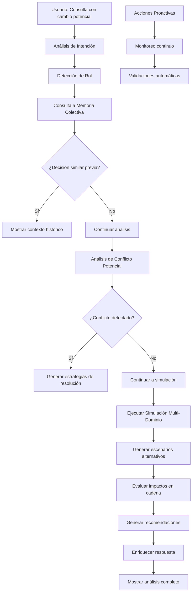

### Flujo 2: Captura y Uso de Conocimiento Tácito

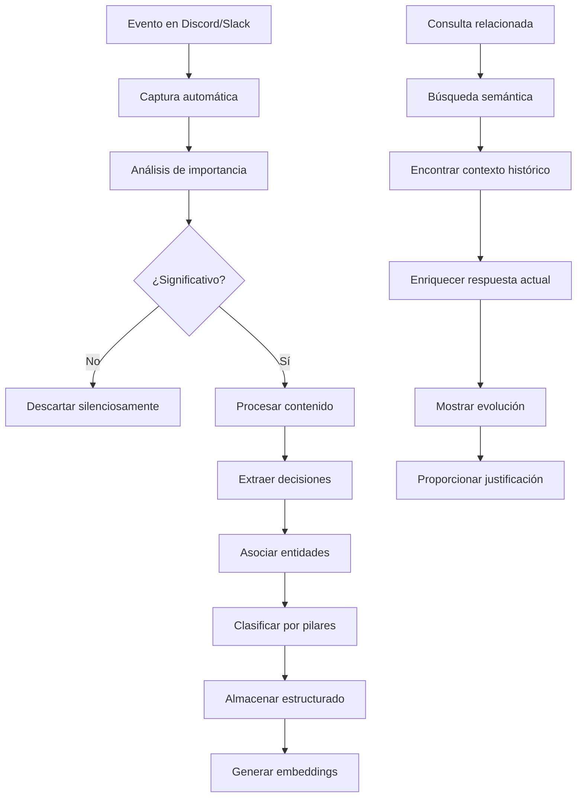

---

## 📈 Métricas y Monitoreo

### Sistema de Métricas Integrado

```python
class IntegratedMetricsSystem:
    def __init__(self):
        # Métricas de sistemas existentes
        self.core_metrics = CoreMetricsCollector()
        self.knowledge_metrics = KnowledgeMetricsCollector()

        # Métricas de nuevas funcionalidades
        self.collective_memory_metrics = CollectiveMemoryMetrics()
        self.conflict_system_metrics = ConflictSystemMetrics()
        self.simulation_metrics = SimulationMetrics()
        self.proactive_agent_metrics = ProactiveAgentMetrics()

        # Métricas integradas
        self.cross_system_metrics = CrossSystemMetricsAnalyzer()

    async def collect_all_metrics(self):
        """Recolectar métricas de todos los sistemas"""

        # Recolectar métricas individuales
        all_metrics = {
            "core": await self.core_metrics.collect(),
            "knowledge": await self.knowledge_metrics.collect(),
            "collective_memory": await self.collective_memory_metrics.collect(),
            "conflicts": await self.conflict_system_metrics.collect(),
            "simulation": await self.simulation_metrics.collect(),
            "proactive": await self.proactive_agent_metrics.collect()
        }

        # Análisis de métricas cruzadas
        cross_analysis = await self.cross_system_metrics.analyze_interactions(
            all_metrics
        )

        return {
            "individual_metrics": all_metrics,
            "cross_system_analysis": cross_analysis,
            "overall_health_score": await self.calculate_overall_health(all_metrics),
            "recommendations": await self.generate_system_recommendations(
                all_metrics, cross_analysis
            )
        }
```

---

## 🚀 Plan de Implementación Técnica

### Fase 1: Fundación (Semanas 1-2)

#### Semana 1: Arquitectura Base
- ✅ Crear estructura de integración mejorada
- ✅ Implementar seguridad multi-capa
- ✅ Configurar logging y auditoría avanzada

#### Semana 2: Bases de Datos Especializadas
- ✅ Crear tablas para conocimiento tácito
- ✅ Crear tablas para patrones de conflicto
- ✅ Crear tablas para resultados de simulación
- ✅ Crear tablas para acciones proactivas

### Fase 2: Sistemas Críticos (Semanas 3-5)

#### Semana 3: Memoria Colectiva
- ✅ Implementar integración con plataformas
- ✅ Desarrollar motor de captura
- ✅ Crear sistema de almacenamiento

#### Semana 4: Sistema de Conflictos
- ✅ Implementar motor de detección
- ✅ Desarrollar estrategias de resolución
- ✅ Crear sistema de notificaciones

#### Semana 5: Simulación Predictiva
- ✅ Implementar simuladores por dominio
- ✅ Crear generador de escenarios
- ✅ Desarrollar evaluador de impactos

### Fase 3: Integración Completa (Semanas 6-7)

#### Semana 6: Integración de Sistemas
- ✅ Conectar memoria colectiva con core engine
- ✅ Integrar detección de conflictos en flujo principal
- ✅ Conectar simulaciones con generación de respuestas

#### Semana 7: Agente Proactivo
- ✅ Implementar monitoreo continuo
- ✅ Desarrollar acciones automáticas
- ✅ Crear sistema de notificaciones inteligente

### Fase 4: Optimización y Testing (Semana 8)

#### Semana 8: Validación Completa
- ✅ Testing de integración end-to-end
- ✅ Validación de performance con carga
- ✅ Optimización de puntos críticos
- ✅ Documentación técnica completa

---

## 🔧 Configuración Técnica Detallada

### Archivo de Configuración Maestro

```yaml
# config/enhanced_agent.yaml
enhanced_dungeon_life_agent:
  version: "2.0.0"
  build_date: "2025-10-08"

  core_engine:
    model_path: "models/llama-3-8b-instruct.q4_k_m.gguf"
    context_length: 8192
    temperature: 0.7
    performance_optimized: true

  knowledge_layer:
    indexing:
      incremental_enabled: true
      auto_update: true
      embedding_model: "all-minilm-l6-v2"

    collective_memory:
      enabled: true
      platforms: ["discord", "slack", "teams"]
      auto_capture: true
      importance_threshold: 0.6

    databases:
      main_db_url: "postgresql://localhost/dungeon_life_main"
      tacit_knowledge_db_url: "postgresql://localhost/tacit_knowledge"
      conflict_patterns_db_url: "postgresql://localhost/conflict_patterns"
      simulation_results_db_url: "postgresql://localhost/simulation_results"

  conflict_system:
    enabled: true
    detection_sensitivity: "medium"
    auto_resolution: false
    notification_channels: ["discord", "email"]

  simulation_engine:
    enabled: true
    max_scenarios: 10
    cache_enabled: true
    domains: ["narrative", "mechanical", "technical", "artistic"]

  proactive_agent:
    enabled: true
    monitoring_frequency: "real_time"
    automation_enabled: true
    notification_settings:
      urgency_levels: ["low", "medium", "high", "critical"]

  security:
    encryption_enabled: true
    audit_logging: true
    access_control_granular: true
    backup_automatic: true

  performance:
    cache_enabled: true
    parallel_processing: true
    memory_optimization: true
    response_time_target: "<2s"
```

---

## 📋 Checklist de Implementación Técnica

### Pre-Implementación
- [ ] Definir especificaciones técnicas completas
- [ ] Configurar infraestructura de base de datos
- [ ] Establecer protocolos de seguridad
- [ ] Crear planes de respaldo y recuperación

### Durante Implementación
- [ ] Implementar arquitectura de integración
- [ ] Desarrollar cada sistema crítico
- [ ] Crear interfaces entre sistemas
- [ ] Implementar seguridad en cada capa

### Post-Implementación
- [ ] Realizar testing de integración completo
- [ ] Validar performance con escenarios reales
- [ ] Configurar monitoreo y alertas
- [ ] Documentar arquitectura implementada

---

## 🎯 Conclusión

Esta arquitectura técnica detallada proporciona el blueprint completo para implementar las mejoras críticas del Dungeon Life Agent. La integración cuidadosa de los nuevos sistemas con la arquitectura existente asegura que cada mejora crítica funcione en armonía con los componentes actuales mientras proporciona capacidades completamente nuevas.

**Beneficios Arquitectónicos:**
- ✅ **Escalabilidad:** Arquitectura preparada para crecimiento futuro
- ✅ **Mantenibilidad:** Separación clara de responsabilidades
- ✅ **Seguridad:** Protección integral en múltiples capas
- ✅ **Performance:** Optimización integrada en diseño
- ✅ **Extensibilidad:** Fácil adición de nuevas funcionalidades

¿Te gustaría proceder con la planificación detallada de implementación técnica paso a paso, o prefieres enfocarnos en algún componente arquitectónico específico?