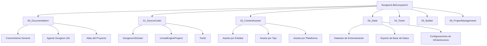

# 🗺️ Mapa Maestro de Navegación - Dungeon Life Ecosystem

## 🎯 Propósito

Este documento sirve como **punto de entrada único** para la navegación cognitiva del Dungeon Life Ecosystem. Permite a la IA:

- ✅ **Entender** qué hacer con documentos cuando se le piden
- ✅ **Saber** dónde buscar información específica de entidades
- ✅ **Navegar** eficientemente por grupos de archivos relacionados
- ✅ **Crear** nuevos documentos en el lugar correcto

## 🏛️ Estructura General del Ecosistema

### Jerarquía de Directorios Raíz



## 🧠 Árbol de Decisión para Consultas IA

### Algoritmo de Routing Principal

```python
def route_query(query, context):
    """Algoritmo maestro para routing de consultas IA"""

    # 1. Análisis semántico inicial
    semantic_analysis = analyze_semantic_context(query)

    # 2. Identificar tipo de entidad
    entity_type = identify_entity_type(semantic_analysis)

    # 3. Routing según tipo de consulta
    if "estado" in query.lower() or "información" in query.lower():
        return route_to_information_query(entity_type, query)
    elif "crear" in query.lower() or "nuevo" in query.lower():
        return route_to_creation_query(entity_type, query)
    elif "modificar" in query.lower() or "cambiar" in query.lower():
        return route_to_modification_query(entity_type, query)
    else:
        return route_to_general_query(query)

def identify_entity_type(semantic_analysis):
    """Identificar tipo de entidad basado en análisis semántico"""

    entity_patterns = {
        "personaje": ["personaje", "character", "npc", "pj", "protagonista"],
        "ubicación": ["ubicación", "location", "lugar", "escenario", "mapa"],
        "item": ["item", "objeto", "arma", "armadura", "consumible"],
        "quest": ["quest", "misión", "aventura", "historia"],
        "mecánica": ["mecánica", "sistema", "regla", "gameplay"],
        "asset": ["asset", "modelo", "textura", "audio", "arte"]
    }

    for entity_type, keywords in entity_patterns.items():
        if any(keyword in semantic_analysis.lower() for keyword in keywords):
            return entity_type

    return "general"
```

## 📂 Mapas Especializados por Dominio

### 1. Documentación (`00_Documentation/`)

**Basado en análisis de `README.md`:**

```yaml
documentacion:
  estructura_principal:
    - "00_Atlas_del_Proyecto/": "Arquitectura 6 pilares del conocimiento"
    - "01_Universo_y_Reglas/": "Cosmología, historia, religiones, razas"
    - "02_Entidades/": "Personajes, facciones, quests, culturas, items"
    - "03_Cronologia_y_Eventos/": "Timeline y eventos del mundo"
    - "04_Game_Design/": "Mecánicas, sistemas, balance"
    - "05_Documentacion_Tecnica/": "Arquitectura técnica, herramientas,DLS, DungeonLifeSuite, Dungeon Master, Lore Builder,Combat System"

  algoritmos_navegacion:
    consulta_documentacion: |
      0. Buscar en Atlas (pilares 000-500) para conceptos fundamentales
      1. Buscar en Universo_y_Reglas para lore específico y world Building
      2. Buscar en Entidades para elementos específicos del juego
      3. Buscar en Cronología y eventos para el guión y el argumento  
      4. Buscar en Game_Design para mecánicas y sistemas como el combat system o el card system
      5. Buscar en Documentacion_Tecnica para implementación del Dungeon Life suite y sus framworks FES, DMTE, IRON, CRAFT, Dungeon Master, Lore BUilder, Combat Arena

    crear_documentacion: |
      6. Determinar tipo de documento según taxonomía DLE_XXX
      7. Ubicar en pilar correspondiente del Atlas
      8. Seguir nomenclatura: DLE_Pilar_Secuencia_Tipo_Nombre.md
      9. Crear referencias cruzadas con entidades relacionadas
```

### 2. Assets de Contenido (`02_ContentAssets/`)

**Basado en análisis de `02_SourceArt/02_SourceArt.txt`:**

```yaml
content_assets:
  ciclo_de_vida_assets:
    - "00_ConceptualArt_Broad/": "Exploración temprana (Humano + IA)"
    - "01_Entities/": "Assets organizados por entidad específica"
    - "02_TransversalAssets/": "Assets no ligados a entidad específica"
    - "03_RawSourceLibraries/": "Librerías fuente de software de arte"

  estructura_por_entidad:
    personaje:
      - "00_ConceptArt/": "Arte conceptual específico"
      - "01_NativeSourceFiles/": "Archivos fuente editables (ZBrush, Blender, Substance)"
      - "02_ExportedGameReady/": "Assets listos para Unreal (FBX, texturas, materiales)"
      - "03_FinalRenders/": "Renders de presentación"
      - "04_Audio/": "Audio específico del personaje"
      - "05_2D/": "Arte 2D (retratos, iconos)"

    ubicacion:
      - "00_ConceptArt/": "Diseños de entorno y atmósfera"
      - "01_NativeSourceFiles/": "Modelos fuente de arquitectura y terreno"
      - "02_ExportedGameReady/": "Meshes modulares y texturas para Unreal"
      - "03_FinalRenders/": "Vistas previas del entorno"

    item:
      - "00_ConceptArt/": "Diseño visual del objeto"
      - "01_NativeSourceFiles/": "Modelado y texturizado fuente"
      - "02_ExportedGameReady/": "Modelo optimizado y materiales"
      - "05_2D/": "Icono de inventario"
```

### 3. Datos (`03_Data/`)

**Basado en análisis de `03_Data/03_Data.txt`:**

```yaml
datos:
  pipeline_procesamiento:
    - "01_LLMTrainer_Datasets/": "Datos para entrenamiento IA"
      - "00_Raw_Extracted/": "Datos iniciales de documentos fuente"
      - "01_Validated_Processed/": "Datasets curados y formateados"
      - "02_Legacy_Archive/": "Versiones históricas"
    - "02_Database_Exports/": "Backups y exports de PostgreSQL y Qdrant"
    - "03_Configs_Infrastructure/": "Configuraciones de infraestructura"
    - "04_Logs/": "Logs de sistema"
    - "05_Metrics/": "Métricas de rendimiento"

  algoritmos_consulta_datos:
    buscar_datasets_entrenamiento: |
      1. Identificar tipo de datos (narrativos, técnicos, artísticos)
      2. Buscar en 01_LLMTrainer_Datasets/01_Validated_Processed/
      3. Verificar formato requerido (.jsonl para fine-tuning)
      4. Validar calidad y completitud de datos
```

## 🎮 Mapas por Entidad de Juego

### Personajes

**Basado en análisis de `entities.txt.txt`:**

```yaml
entidad_personaje:
  ubicaciones_estandar:
    documentacion: "02_Entidades/ECH_[Nombre].md"
    assets: "02_ContentAssets/01_Entities/Characters/[Nombre]/"
    codigo: "01_SourceCode/DungeonLifeSuite/backend/app/models/character_[nombre].py"
    datos: "03_Data/Datasets/TrainingDatasets/NarrativeDatasets/CharacterDialogues/[Nombre]/"
    relaciones: "02_Entidades/REL_CHAR_[Nombre].md"

  estructura_assets_personaje:
    - "00_ConceptArt/": "Arte conceptual específico del personaje"
    - "01_NativeSourceFiles/":
      - "Modeling/": "Archivos fuente de modelado (.blend)"
      - "Sculpting/": "Archivos fuente de escultura (.ztl)"
      - "Texturing/": "Archivos fuente de texturizado (.spp)"
    - "02_ExportedGameReady/":
      - "Meshes/": "FBX listo para Unreal (SK_[Nombre].fbx)"
      - "Textures/": "Texturas exportadas (T_[Nombre]_BC.png, etc.)"
      - "Animations/": "Animaciones exportadas (Anim_[Nombre]_Walk.fbx)"
    - "03_FinalRenders/": "Renders de presentación"
    - "04_Audio/": "Voz y sonidos específicos"
    - "05_2D/": "Retratos e iconos 2D"

  algoritmo_consulta_personaje: |
    def consultar_personaje(nombre):
        # 1. Buscar documentación en 02_Entidades/
        # 2. Verificar assets en 02_ContentAssets/01_Entities/Characters/
        # 3. Revisar modelo de datos en 01_SourceCode/DungeonLifeSuite/
        # 4. Consultar diálogos en 03_Data/Datasets/TrainingDatasets/
        # 5. Verificar relaciones en 02_Entidades/REL_CHAR_*
        # 6. Consolidar información de todas las fuentes
        # 7. Consultar estado del proceso integral de la entidad
        # 8. Para Characters determinar tipo en improtancia de relato (Protagonista, Aliado jugable, NPC, Enemigo, StoryMode) porque esto determina en que directorio buscar a los characters 
      
```

### Ubicaciones

**Basado en análisis de `Locations_and_environments.txt.txt`:**

```yaml
entidad_ubicacion:
  jerarquia_geografica:
    - "Regions/": "Regiones amplias (Peninsula_De_Eldoria)"
    - "Zones_Or_Territories/": "Zonas bioma (Bosque_De_Eldoria)"
    - "Settlements/": "Asentamientos (Eldertown_City)"
    - "Structures_And_Buildings/": "Edificios individuales (Posada_Del_Semiogro)"
    - "Closed_Scenarios_And_Rooms/": "Escenarios cerrados (Cripta_Sellada)"
    - "Interactive_Elements_And_Landmarks/": "Elementos interactivos (Portal_Runico)"

  estructura_assets_ubicacion:
    - "00_ConceptArt/": "Mapas conceptuales, moodboards, diseños arquitectónicos"
    - "01_NativeSourceFiles/":
      - "Architecture_[Nombre]/": "Kits modulares de edificios"
      - "Props_[Estilo]/": "Props específicos del lugar"
      - "Flora_[Bioma]/": "Vegetación característica"
      - "Rocks_And_Terrain_[Bioma]/": "Elementos de terreno"
    - "02_ExportedGameReady/":
      - "Architecture/": "Meshes modulares listos para Unreal"
      - "Props_[Estilo]/": "Props optimizados"
      - "Flora/": "Vegetación para foliage"
      - "Rocks/": "Elementos de terreno"

  algoritmo_consulta_ubicacion: |
    def consultar_ubicacion(nombre):
        # 1. Determinar nivel jerárquico (región, zona, asentamiento, etc.)
        # 2. Buscar en ubicación correspondiente en 02_ContentAssets/01_Entities/Locations_And_Environments/
        # 3. Verificar modelo de datos en 01_SourceCode/DungeonLifeSuite/
        # 4. Consultar datasets de world building en 03_Data/
        # 5. Revisar conexiones con otras ubicaciones
```

### Items

**Basado en análisis de `items.txt.txt`:**

```yaml
entidad_item:
  categorias_funcionales:
    - "Weapons/": "Armas cuerpo a cuerpo, ranged, mágicas"
    - "Armor_And_Clothing/": "Armaduras, ropa, accesorios"
    - "Consumables/": "Pociones, comida, pergaminos"
    - "Key_Items/": "Ítems de misión, componentes de puzzle"
    - "Crafting_And_Misc_Resources/": "Materiales de crafteo"
    - "Accessories_And_Trinkets/": "Accesorios y objetos menores"
    - "Books_And_Documents_Readable/": "Libros y documentos"

  estructura_assets_item:
    - "00_ConceptArt/": "Diseño visual del objeto"
    - "01_NativeSourceFiles/":
      - "Modeling/": "Modelado fuente (.blend, .max)"
      - "Texturing/": "Texturizado fuente (.spp, .psd)"
    - "02_ExportedGameReady/":
      - "Meshes/": "Modelo 3D optimizado (SM_[Nombre].fbx)"
      - "Textures/": "Texturas del modelo"
      - "Materials/": "Configuración de materiales"
      - "VFX_Sources/": "Texturas para efectos visuales"
    - "03_FinalRenders/": "Renders de catálogo"
    - "05_2D/": "Icono de inventario"

  algoritmo_consulta_item: |
    def consultar_item(nombre):
        # 1. Determinar categoría funcional del ítem
        # 2. Buscar en ubicación correspondiente en 02_ContentAssets/01_Entities/Items_And_Equipment/
        # 3. Verificar modelo de datos en 01_SourceCode/DungeonLifeSuite/
        # 4. Revisar mecánicas asociadas en 04_Game_Design/
        # 5. Consultar datasets de items en 03_Data/
```

## 🔗 Sistema de Referencias Cruzadas

### Entre Entidades

```yaml
referencias_cruzadas:
  personaje_en_ubicacion:
    - "Personaje tiene ubicación de origen"
    - "Personaje puede tener ubicaciones visitadas"
    - "Ubicación puede tener NPCs residentes"

  personaje_con_items:
    - "Personaje puede equipar items"
    - "Personaje puede usar consumibles"
    - "Items pueden estar asociados a habilidades del personaje"

  ubicacion_con_items:
    - "Ubicación puede contener loot específico"
    - "Ubicación puede tener items de misión"
    - "Items pueden estar ligados a lugares específicos"
```

## 🚀 Ejemplos Prácticos de Uso

### Consulta: "¿Dónde está la información del personaje Bromar?"

```markdown
**Ruta de navegación IA:**
1. 📖 **Documentación principal**: `02_Entidades/ECH_Bromar.md`
2. 🎨 **Assets visuales**: `02_ContentAssets/01_Entities/Characters/Bromar/`
3. 💻 **Modelo de datos**: `01_SourceCode/DungeonLifeSuite/backend/app/models/character_bromar.py`
4. 🗣️ **Diálogos**: `03_Data/Datasets/TrainingDatasets/NarrativeDatasets/CharacterDialogues/Bromar/`
5. 🤝 **Relaciones**: `02_Entidades/REL_CHAR_Bromar.md`
6. 📊 **Estado consolidado**: Información de todas las fuentes anteriores
```

### Consulta: "¿Dónde crear nueva ubicación Eldoria?"

```markdown
**Ruta de creación IA:**
1. 📝 **Documentación FES**: Crear `02_Entidades/DLE_500_LOC_Eldoria.md`
2. 🎨 **Carpeta de assets**: Crear `02_ContentAssets/01_Entities/Locations/Eldoria/`
3. 🏗️ **Estructura interna**:
   - `00_ConceptArt/` - Arte conceptual de la ubicación
   - `01_NativeSourceFiles/` - Modelos fuente de arquitectura
   - `02_ExportedGameReady/` - Assets listos para Unreal
4. 💻 **Modelo de datos**: Crear `01_SourceCode/DungeonLifeSuite/backend/app/models/location_eldoria.py`
5. 📚 **Datasets**: Crear carpeta en `03_Data/Datasets/TrainingDatasets/NarrativeDatasets/WorldBuilding/Eldoria/`
6. ✅ **Validación**: Verificar que todos los componentes estén creados correctamente
```

## 📋 Próximos Pasos

### Mapas Especializados a Crear

1. ✅ **Mapa Maestro de Navegación** (ESTE DOCUMENTO)
2. 🔄 **Mapa de Documentación** - Basado en análisis de `00_Documentation/README.md`
3. 🔄 **Mapa de Assets de Contenido** - Basado en análisis de `02_SourceArt/02_SourceArt.txt`
4. 🔄 **Mapa de Datos** - Basado en análisis de `03_Data/03_Data.txt`
5. 🔄 **Mapa de Entidades Específicas** - Para personajes, ubicaciones, items, etc.

### Validación de Efectividad

- ✅ **Cobertura de estructura real** basada en archivos existentes
- ✅ **Algoritmos ejecutables** para diferentes tipos de consulta
- ✅ **Ejemplos prácticos** basados en entidades reales del proyecto
- 🔄 **Validación con consultas reales** de usuarios

---

**Este mapa maestro evoluciona con el proyecto. Última actualización basada en análisis de archivos existentes del Dungeon Life Ecosystem.**