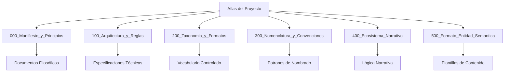

# 📚 Mapa de Documentación - Sistema de Conocimiento Dungeon Life

## 🎯 Propósito

Este mapa permite a la IA navegar eficientemente por el **sistema de conocimiento documental** del Dungeon Life Ecosystem, basado en el análisis del archivo `00_Documentation/README.md` y la estructura real del proyecto.

## 🏛️ Arquitectura de 6 Pilares - Atlas del Proyecto

### Estructura Jerárquica del Conocimiento



### Especificaciones por Pilar

#### 📜 Pilar 000: Manifiesto y Principios
**Ubicación:** `00_Documentation/DungeonLifeEcosystem/00_Atlas_del_Proyecto/000_Manifiesto_y_Principios/`

```yaml
pilar_000:
  proposito: "Filosofía unificada y principios fundamentales del proyecto"
  documentos_tipicos:
    - "DLE_000_01_Documento_Maestro_Organizacion_y_Principios.md"
    - "DLE_000_02_Constitucion_del_SimLibro.md"
    - "DLE_000_03_Manifiesto_Del_Proyecto.md"
  peso_entrenamiento_ia: "high"
  publico_objetivo: ["todos_colaboradores", "nuevos_miembros"]
  algoritmos_consulta:
    principios_fundamentales: |
      1. Buscar en documentos DLE_000_* para principios base
      2. Extraer conceptos filosóficos clave
      3. Relacionar con implementación práctica en otros pilares
```

#### ⚙️ Pilar 100: Arquitectura y Reglas de Sistema
**Ubicación:** `00_Documentation/DungeonLifeEcosystem/00_Atlas_del_Proyecto/100_Arquitectura_y_Reglas/`

```yaml
pilar_100:
  proposito: "Mecanismos técnicos y especificaciones del sistema"
  documentos_tipicos:
    - "DLE_100_01_Documento_Maestro_Mecanismos_Sistema.md"
    - "DLE_100_02_Formato_Entidad_Semantica.md"
    - "DLE_100_03_Protocolo_Arquitectura_Entidades.md"
    - "DLE_100_04_Sistema_Willow_Trazabilidad.md"
  peso_entrenamiento_ia: "critical"
  publico_objetivo: ["desarrolladores", "arquitectos_software"]
  algoritmos_consulta:
    arquitectura_tecnica: |
      1. Buscar mecanismos fundamentales en DLE_100_01
      2. Consultar formato FES en DLE_100_02
      3. Revisar protocolos en DLE_100_03
      4. Verificar trazabilidad en DLE_100_04
```

#### 📚 Pilar 200: Taxonomía y Formatos
**Ubicación:** `00_Documentation/DungeonLifeEcosystem/00_Atlas_del_Proyecto/200_Taxonomia_y_Formatos/`

```yaml
pilar_200:
  proposito: "Diccionario universal que define y clasifica entidades"
  documentos_tipicos:
    - "DLE_200_00_Indice_Maestro_de_Taxonomia.md"
    - "DLE_200_01_T_Tipos_de_Entidad.md"
    - "DLE_200_02_T_Tags_Canonicos.md"
    - "DLE_200_03_T_Relaciones_Canonicas.md"
    - "DLE_200_04_D_Diccionario_de_Propiedades.md"
  peso_entrenamiento_ia: "critical"
  publico_objetivo: ["diseñadores_contenido", "guionistas", "data_architects"]
  algoritmos_consulta:
    taxonomia_entidades: |
      1. Consultar índice maestro DLE_200_00 para navegación general
      2. Buscar tipos de entidad en DLE_200_01
      3. Revisar tags canónicos en DLE_200_02
      4. Verificar relaciones en DLE_200_03
      5. Consultar propiedades en DLE_200_04
```

#### ✒️ Pilar 300: Nomenclatura y Convenciones
**Ubicación:** `00_Documentation/DungeonLifeEcosystem/00_Atlas_del_Proyecto/300_Nomenclatura_y_Convenciones/`

```yaml
pilar_300:
  proposito: "Reglas para nombrar archivos, datos y assets"
  documentos_tipicos:
    - "DLE_300_01_Documento_Maestro_Nomenclatura_Sistema.md"
    - "DLE_300_02_Convenciones_Documentacion.md"
    - "DLE_300_03_Patrones_Archivos.md"
  peso_entrenamiento_ia: "medium"
  publico_objetivo: ["todos_colaboradores"]
  algoritmos_consulta:
    nomenclatura_archivos: |
      1. Consultar documento maestro DLE_300_01 para reglas generales
      2. Revisar convenciones específicas en DLE_300_02
      3. Aplicar patrones de archivos de DLE_300_03
```

#### 🗺️ Pilar 400: Ecosistema Narrativo
**Ubicación:** `00_Documentation/DungeonLifeEcosystem/00_Atlas_del_Proyecto/400_Ecosistema_Narrativo/`

```yaml
pilar_400:
  proposito: "Manual del motor de IA narrativa C.R.A.F.T."
  documentos_tipicos:
    - "DLE_400_01_Manual_CRAFT.md"
    - "DLE_400_02_Reglas_Narrativas.md"
    - "DLE_400_03_Sistema_Dialogos.md"
  peso_entrenamiento_ia: "high"
  publico_objetivo: ["guionistas", "diseñadores_narrativos"]
  algoritmos_consulta:
    narrativa_craft: |
      1. Consultar manual C.R.A.F.T. en DLE_400_01
      2. Revisar reglas narrativas en DLE_400_02
      3. Aplicar sistema de diálogos de DLE_400_03
```

#### 📄 Pilar 500: Formato de Entidad Semántica (FES)
**Ubicación:** `00_Documentation/DungeonLifeEcosystem/00_Atlas_del_Proyecto/500_Formato_Entidad_Semantica/`

```yaml
pilar_500:
  proposito: "Estructura y formato para creadores de contenido"
  documentos_tipicos:
    - "DLE_500_01_FES_Character.md"
    - "DLE_500_02_FES_Location.md"
    - "DLE_500_03_FES_Item.md"
    - "DLE_500_04_FES_Quest.md"
  peso_entrenamiento_ia: "critical"
  publico_objetivo: ["creadores_contenido", "guionistas", "diseñadores"]
  algoritmos_consulta:
    formato_fes: |
      1. Seleccionar plantilla según tipo de entidad
      2. Aplicar estructura FES específica
      3. Validar completitud de información requerida
      4. Crear referencias con otras entidades relacionadas
```

## 🎨 Dominios Especializados de Documentación

### 01_Universo_y_Reglas - World Building

```yaml
universo_reglas:
  ubicacion: "00_Documentation/DungeonLifeEcosystem/01_Universo_y_Reglas/"
  contenido:
    cosmologia: "WLD-001_Realidad_Programada_Magia_y_Deidades.md"
    historia: "WLD_101_Eldertown.md"
    religiones: "WLD_200_índice de Religiones y cultos.md"
    razas: "Perfil de Elfos.md, Perfil de los Enanos.md"
  algoritmos_consulta:
    lore_ubicacion: |
      1. Buscar ubicación específica en documentos WLD_*
      2. Relacionar con cosmología general WLD-001
      3. Verificar conexiones con religiones y razas
```

### 02_Entidades - Content Library

```yaml
entidades:
  ubicacion: "00_Documentation/DungeonLifeEcosystem/02_Entidades/"
  tipos_entidad:
    personajes: "ECH_Juan.md, ECH_Aelina.md"
    facciones: "EFAC_ElderTown.md"
    quests: "EQUE_Defender_la_muralla.md"
    culturas: "ECUL_Sureña.md"
    items: "ITM_Equipo_Bromar.md"
    relaciones: "REL_CHAR_Bromar.md"
  algoritmos_consulta:
    entidad_especifica: |
      1. Identificar tipo de entidad por prefijo (ECH_, EFAC_, EQUE_, etc.)
      2. Buscar documento específico en 02_Entidades/
      3. Verificar relaciones en documentos REL_*
      4. Relacionar con assets correspondientes
```

### 04_Game_Design - Especificación del Juego

```yaml
game_design:
  ubicacion: "00_Documentation/DungeonLifeEcosystem/04_Game_Design/"
  estructura:
    indices: "Indice GDD.md, README_GDD.md"
    pilares: "Bloque 1 Visión y Pilares Fundamentales.md"
    nucleo: "Bloque 2 El Núcleo de Jugabilidad.md"
    sistemas: "Bloque 3 Sistemas de Soporte y Progresión.md"
    tecnico: "Bloque 4 Especificación Técnica.md"
    clases: "00_CLA_Diccionario De Clases.md"
  algoritmos_consulta:
    mecanica_juego: |
      1. Consultar índice GDD para navegación general
      2. Buscar en bloque correspondiente según tipo de mecánica
      3. Verificar implementación técnica en Bloque 4
      4. Relacionar con clases y progresión
```

### 05_Documentacion_Tecnica - Arquitectura y Herramientas

```yaml
documentacion_tecnica:
  ubicacion: "00_Documentation/DungeonLifeEcosystem/05_Documentacion_Tecnica_y_Herramientas/"
  componentes:
    dls_suite: "DLS V2.5 Overview.md, DLS_V25_Vision_Integral_Recuperada.md"
    arquitectura: "DLS_01_Arquitectura Conceptual y Visión General.md"
    pipeline: "DLS_04_El Flujo Central de Creación y Edición_El Wizard.md"
    llm_trainer: "LLMT_01_Introducción.md, LLMT_09_El Pipeline de Datos Canónico.md"
    lore_builder: "LB_01_🧠 Dungeon Life Lore Builder CRAFT.md"
  algoritmos_consulta:
    componente_tecnico: |
      1. Identificar componente específico (DLS, LLM Trainer, Lore Builder)
      2. Buscar documentación correspondiente
      3. Verificar integración con otros componentes
      4. Consultar pipelines y flujos de datos
```

## 🧠 Algoritmos de Navegación Cognitiva

### Consulta por Tipo de Información

```python
def navigate_documentation(query, context):
    """Algoritmo de navegación por documentación"""

    # 1. Análisis semántico de la consulta
    semantic_analysis = analyze_query_intent(query)

    # 2. Identificar dominio de conocimiento
    knowledge_domain = identify_knowledge_domain(semantic_analysis)

    # 3. Routing según dominio
    if knowledge_domain == "atlas_fundamental":
        return search_atlas_pillars(semantic_analysis)
    elif knowledge_domain == "lore_world":
        return search_universe_rules(semantic_analysis)
    elif knowledge_domain == "entidad_especifica":
        return search_entities(semantic_analysis)
    elif knowledge_domain == "mecanica_juego":
        return search_game_design(semantic_analysis)
    elif knowledge_domain == "arquitectura_tecnica":
        return search_technical_docs(semantic_analysis)
    else:
        return search_general_documentation(query)

def identify_knowledge_domain(semantic_analysis):
    """Identificar dominio de conocimiento basado en análisis semántico"""

    domain_patterns = {
        "atlas_fundamental": ["principio", "filosofía", "manifiesto", "arquitectura"],
        "lore_world": ["universo", "lore", "historia", "religión", "cultura"],
        "entidad_especifica": ["personaje", "ubicación", "item", "quest", "facción"],
        "mecanica_juego": ["mecánica", "sistema", "combate", "progresión", "clase"],
        "arquitectura_tecnica": ["pipeline", "suite", "trainer", "builder", "integración"]
    }

    for domain, keywords in domain_patterns.items():
        if any(keyword in semantic_analysis.lower() for keyword in keywords):
            return domain

    return "general"
```

### Creación de Nueva Documentación

```python
def create_documentation_entity(entity_type, entity_name, properties):
    """Algoritmo para crear nueva documentación"""

    # 1. Determinar ubicación según tipo de entidad
    location_map = {
        "personaje": "02_Entidades/ECH_{entity_name}.md",
        "ubicacion": "02_Entidades/ELOC_{entity_name}.md",
        "item": "02_Entidades/EITM_{entity_name}.md",
        "quest": "02_Entidades/EQUE_{entity_name}.md",
        "faccion": "02_Entidades/EFAC_{entity_name}.md"
    }

    target_location = location_map.get(entity_type)
    if not target_location:
        target_location = f"02_Entidades/E{entity_type.upper()}_{entity_name}.md"

    # 2. Crear estructura según plantilla FES correspondiente
    template = get_fes_template(entity_type)

    # 3. Generar contenido inicial basado en propiedades
    content = generate_initial_content(template, properties)

    # 4. Crear referencias cruzadas con entidades relacionadas
    cross_references = generate_cross_references(entity_name, properties)

    return {
        "location": target_location,
        "content": content,
        "cross_references": cross_references,
        "validation_required": True
    }
```

## 🎯 Ejemplos Prácticos de Navegación

### Consulta: "Necesito información sobre el personaje Bromar"

```markdown
**Ruta de navegación basada en estructura real:**

1. **📖 Documentación principal**: `02_Entidades/ECH_Bromar.md`
   - Información básica del personaje
   - Características FES principales

2. **🤝 Relaciones**: `02_Entidades/REL_CHAR_Bromar.md`
   - Conexiones con otros personajes
   - Relaciones con ubicaciones y facciones

3. **⚔️ Equipment**: `02_Entidades/ITM_Equipo_Bromar.md`
   - Items y equipo específico del personaje

4. **🎨 Assets relacionados**:
   - Modelos: `02_ContentAssets/01_Entities/Characters/Bromar/02_ExportedGameReady/Meshes/`
   - Texturas: `02_ContentAssets/01_Entities/Characters/Bromar/02_ExportedGameReady/Textures/`
   - Audio: `02_ContentAssets/01_Entities/Characters/Bromar/04_Audio/`

5. **💻 Implementación técnica**:
   - Modelo datos: `01_SourceCode/DungeonLifeSuite/backend/app/models/character_bromar.py`
   - Diálogos: `03_Data/Datasets/TrainingDatasets/NarrativeDatasets/CharacterDialogues/Bromar/`
```

### Consulta: "Crear nueva ubicación Eldoria"

```markdown
**Ruta de creación basada en estructura real:**

1. **📝 Documentación FES**: Crear `02_Entidades/DLE_500_LOC_Eldoria.md`
   - Aplicar plantilla FES para ubicaciones
   - Definir propiedades semánticas básicas

2. **🏗️ Assets de ubicación**: Crear `02_ContentAssets/01_Entities/Locations/Eldoria/`
   - `00_ConceptArt/`: Arte conceptual de la ubicación
   - `01_NativeSourceFiles/`: Modelos fuente de arquitectura
   - `02_ExportedGameReady/`: Assets listos para Unreal

3. **💻 Modelo de datos**: Crear `01_SourceCode/DungeonLifeSuite/backend/app/models/location_eldoria.py`

4. **📚 Datasets de entrenamiento**: Crear carpeta en `03_Data/Datasets/TrainingDatasets/NarrativeDatasets/WorldBuilding/Eldoria/`

5. **🔗 Conexiones con entidades existentes**:
   - Relacionar con personajes que viven/visitaron Eldoria
   - Conectar con quests que ocurren en la ubicación
   - Vincular con items encontrados en el lugar
```

## 📋 Validación y Mantenimiento

### Criterios de Validación

- ✅ **Consistencia con estructura real** basada en archivos existentes
- ✅ **Cobertura completa** de todos los pilares del Atlas
- ✅ **Algoritmos ejecutables** para diferentes tipos de consulta
- ✅ **Referencias cruzadas** válidas entre entidades

### Mantenimiento

- 🔄 **Actualización automática** cuando cambie la estructura de directorios
- 🔄 **Validación periódica** de enlaces y referencias
- 🔄 **Expansión** según nuevos tipos de entidad o documentación

---

**Este mapa de documentación evoluciona con el proyecto. Última actualización basada en análisis del archivo `00_Documentation/README.md` y estructura real del ecosistema.**