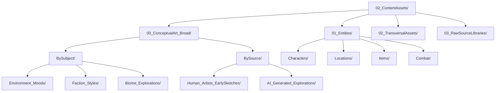

# 🎨 Mapa de Assets de Contenido - Organización de Activos Creativos

## 🎯 Propósito

Este mapa permite a la IA navegar eficientemente por los **activos de contenido no-código** del Dungeon Life Ecosystem, basado en el análisis detallado del archivo `02_SourceArt/02_SourceArt.txt` y la estructura real de assets existente.

## 🏗️ Arquitectura General de Assets

### Estructura Jerárquica de ContentAssets



## 📋 Organización por Ciclo de Vida de Assets

### 00_ConceptualArt_Broad - Exploración Temprana

```yaml
conceptual_art:
  organizacion_dual:
    by_subject:
      descripcion: "Organizado por tema o sujeto del arte conceptual"
      categorias:
        - "Environment_Moods/": "Tonos atmosféricos, paletas de colores"
        - "Faction_Styles/": "Estilos visuales de facciones principales"
        - "Biome_Explorations/": "Ideas visuales para biomas específicos"
        - "General_Creature_Ideas/": "Diseños tempranos de criaturas"
        - "General_Character_Archetypes/": "Arquetipos visuales de personajes"
      ejemplos_archivos:
        - "Forest_Night_Moodboard.png"
        - "SouthernKingdom_Architecture_Sketches/Concept_01.jpg"
        - "EnchantedForest_Concepts/Tree_Variations.png"

    by_source:
      descripcion: "Organizado por origen del arte conceptual"
      categorias:
        human_artists:
          descripcion: "Arte creado por artistas humanos"
          estructura: "Human_Artists_EarlySketches/ArtistName_A/Sketchbook_Scans/"
          ejemplos: "ArtistName_A/Early_Digital_Paintings/ForestTheme_Exploration_v1.psd"
        ai_generated:
          descripcion: "Arte generado por herramientas de IA"
          estructura: "AI_Generated_Explorations/Environment_Inspirations/"
          ejemplos: "AI_Forest_PromptXYZ_01.png"
          herramientas: ["Midjourney", "StableDiffusion", "DALL-E"]

  algoritmos_consulta:
    buscar_inspiracion_tematica: |
      1. Identificar tema específico (bosque, facción, bioma)
      2. Buscar en BySubject/[Tema_Correspondiente]/
      3. Revisar tanto arte humano como generado por IA
      4. Priorizar arte humano para conceptos refinados
      5. Usar arte IA para exploración amplia inicial
```

### 01_Entities - Assets por Entidad Específica

#### Estructura Interna Estándar por Entidad

**Basado en análisis de `entities.txt.txt`:**

```yaml
estructura_entidad_estandar:
  niveles_organizacion:
    - "00_ConceptArt/": "Arte conceptual específico de la entidad"
    - "01_NativeSourceFiles/": "Archivos fuente editables de software de arte"
    - "02_ExportedGameReady/": "Assets exportados listos para motor de juego"
    - "03_FinalRenders/": "Renders de presentación y marketing"
    - "04_Audio/": "Audio específico asociado a la entidad"
    - "05_2D/": "Arte 2D específico (iconos, retratos, UI)"

  subcarpetas_fuente_nativo:
    modeling: "Archivos fuente de modelado 3D (.blend, .ma, .mb)"
    sculpting: "Archivos fuente de escultura (.ztl, .zpr)"
    texturing: "Archivos fuente de texturizado (.spp, .sbs, .psd)"
    audio_source: "Archivos fuente de audio si aplica"

  subcarpetas_game_ready:
    meshes: "Mallas 3D exportadas (.fbx, .obj)"
    textures: "Texturas exportadas (.png, .tga, .jpg)"
    materials: "Configuraciones de materiales"
    animations: "Animaciones exportadas (.fbx)"
    audio: "Audio procesado listo para juego"
```

#### Aplicación por Tipo de Entidad

##### Personajes (Characters/)

```yaml
assets_personaje:
  ubicacion_base: "02_ContentAssets/01_Entities/Characters/[Nombre_Personaje]/"
  estructura_especifica:
    - "00_ConceptArt/": "Bocetos del personaje, hojas de diseño, turnarounds"
    - "01_NativeSourceFiles/":
      - "Modeling/": "Modelado base, UVs, rigging (.blend)"
      - "Sculpting/": "Detalles de alta poligonización (.ztl)"
      - "Texturing/": "Proyecto de texturizado (.spp)"
    - "02_ExportedGameReady/":
      - "Meshes/": "Skeletal Mesh (.fbx) con prefijo SK_"
      - "Textures/": "Texturas PBR (BaseColor, Normal, ORM)"
      - "Animations/": "Animaciones exportadas (Anim_[Nombre]_Walk.fbx)"
    - "03_FinalRenders/": "Renders de showcase del personaje"
    - "04_Audio/": "Voces, sonidos únicos del personaje"
    - "05_2D/": "Retratos 2D, iconos de personaje"

  ejemplos_reales:
    bromar:
      ubicacion: "02_ContentAssets/01_Entities/Characters/Bromar/"
      archivos_esperados:
        - "00_ConceptArt/Bromar_Concept_Sheet.png"
        - "01_NativeSourceFiles/Modeling/Bromar_Model.blend"
        - "01_NativeSourceFiles/Sculpting/Bromar_Sculpt.ztl"
        - "02_ExportedGameReady/Meshes/SK_Bromar.fbx"
        - "02_ExportedGameReady/Textures/T_Bromar_Body_BC.png"
```

##### Ubicaciones (Locations/)

**Basado en análisis de `Locations_and_environments.txt.txt`:**

```yaml
assets_ubicacion:
  jerarquia_geografica:
    regions:
      descripcion: "Assets de gran escala para regiones enteras"
      ejemplo: "Regions/Peninsula_De_Eldoria/"
      contenido: "Mapas de mundo, texturas de terreno gran escala"

    zones_territories:
      descripcion: "Assets para zonas bioma específicas"
      ejemplo: "Zones_Or_Territories/Bosque_De_Eldoria/"
      contenido: "Flora, rocas, texturas de suelo específicas del bioma"

    settlements:
      descripcion: "Assets para ciudades, pueblos, aldeas"
      ejemplo: "Settlements/Eldertown_City/"
      contenido: "Kits modulares de arquitectura, props urbanos"

    structures_buildings:
      descripcion: "Assets para edificios individuales importantes"
      ejemplo: "Structures_And_Buildings/Posada_Del_Semiogro/"
      contenido: "Modelos exteriores e interiores específicos"

    closed_scenarios:
      descripcion: "Assets para escenarios interiores pequeños"
      ejemplo: "Closed_Scenarios_And_Rooms/Cripta_Sellada_EventoX/"
      contenido: "Kits modulares para espacios contenidos"

  estructura_modular_unreal:
    arquitectura_kits:
      descripcion: "Kits modulares para construcción en Unreal"
      componentes:
        - "Architecture_[Nombre]/House_Kit_A/": "Piezas modulares (paredes, techos, ventanas)"
        - "Props_[Estilo]/StreetLamp_StyleEldertown.spp": "Props específicos del lugar"
        - "Decals_And_Signage_[Nombre]/": "Texturas para detalles ambientales"
```

##### Items (Items/)

**Basado en análisis de `items.txt.txt`:**

```yaml
assets_item:
  categorias_funcionales:
    weapons:
      descripcion: "Armas de todo tipo"
      estructura: "Items_And_Equipment/Weapons/[Tipo]/[Nombre_Item]/"
      ejemplos:
        - "Weapons/Melee/Swords/EspadaLarga_Hierro_Comun/"
        - "Weapons/Ranged/Bows/ArcoLargo_Elfico_Raro_Fuego/"

    armor_clothing:
      descripcion: "Armaduras y ropa"
      estructura: "Items_And_Equipment/Armor_And_Clothing/[Tipo]/[Nombre_Item]/"
      ejemplos:
        - "Armor_And_Clothing/ArmorSets_Heavy/PlateArmor_KnightsOfSol_FullSet_Epico/"

    consumables:
      descripcion: "Objetos consumibles"
      estructura: "Items_And_Equipment/Consumables/[Tipo]/[Nombre_Item]/"
      ejemplos:
        - "Consumables/Potions/Pocion_Salud_Menor_Comun/"

  convenciones_nomenclatura:
    formato_base: "TipoBase_MaterialDescriptor_Rareza_EfectoElementalOPrincipal.ext"
    ejemplos:
      - "EspadaLarga_AceroElfico_Epica_FiloArdiente.fbx"
      - "Pocion_CuracionMayor_Rara.png"
      - "ArcoLargo_Elfico_Raro_Fuego/"
```

### 02_TransversalAssets - Assets No Específicos de Entidad

```yaml
transversal_assets:
  descripcion: "Assets que no están ligados lógicamente a una entidad específica del juego"
  categorias:
    ui_general:
      descripcion: "Interfaz de usuario general"
      ubicacion: "02_TransversalAssets/UI/"
      ejemplos: "cursores, fuentes, texturas generales de UI"

    audio_general:
      descripcion: "Audio general del juego"
      ubicacion: "02_TransversalAssets/Audio/"
      ejemplos: "música de menú, sonidos de UI generales"

    vfx_general:
      descripcion: "Efectos visuales generales"
      ubicacion: "02_TransversalAssets/VFX/"
      ejemplos: "polvo ambiental, humo general"

  algoritmos_ubicacion:
    asset_transversal: |
      1. Identificar si el asset es específico de entidad o transversal
      2. Si es transversal, buscar en 02_TransversalAssets/
      3. Clasificar según tipo (UI, Audio, VFX, etc.)
      4. Verificar reutilización en múltiples entidades
```

### 03_RawSourceLibraries - Librerías Fuente

```yaml
raw_source_libraries:
  descripcion: "Librerías de archivos fuente nativos de software de arte no ligados a entidad específica"
  categorias:
    materials:
      descripcion: "Librerías de materiales base"
      ejemplos: "Substance Painter/Designer materials"

    brushes:
      descripcion: "Pinceles personalizados"
      ejemplos: "ZBrush/Photoshop brushes"

    plugins:
      descripcion: "Plugins de software de arte"
      ejemplos: "Plugins para Blender, Maya, Substance"

  algoritmos_consulta:
    libreria_fuente: |
      1. Identificar software de arte específico
      2. Buscar en 03_RawSourceLibraries/[Tipo_Libreria]/
      3. Verificar compatibilidad con versiones de software
      4. Validar licencia y uso permitido
```

## 🧠 Algoritmos de Navegación por Assets

### Consulta de Assets Existentes

```python
def find_asset_location(entity_name, asset_type, properties=None):
    """Encontrar ubicación de assets para entidad específica"""

    # 1. Determinar tipo de entidad
    entity_patterns = {
        "personaje": "Characters",
        "ubicacion": "Locations",
        "item": "Items",
        "creatura": "Creatures"
    }

    entity_folder = entity_patterns.get(entity_type, "Entities")

    # 2. Construir ruta base
    base_path = f"02_ContentAssets/01_Entities/{entity_folder}/{entity_name}/"

    # 3. Determinar subcarpeta según tipo de asset
    asset_locations = {
        "modelo_3d": "02_ExportedGameReady/Meshes/",
        "textura": "02_ExportedGameReady/Textures/",
        "animacion": "02_ExportedGameReady/Animations/",
        "audio": "04_Audio/",
        "concept_art": "00_ConceptArt/",
        "fuente_nativo": "01_NativeSourceFiles/"
    }

    asset_subfolder = asset_locations.get(asset_type, "")

    # 4. Construir ruta completa
    full_path = base_path + asset_subfolder

    return {
        "ruta_completa": full_path,
        "tipo_archivo_esperado": get_expected_file_type(asset_type),
        "validacion_requerida": True
    }
```

### Creación de Nuevos Assets

```python
def create_asset_structure(entity_name, entity_type, asset_requirements):
    """Crear estructura de assets para nueva entidad"""

    # 1. Crear carpeta principal de entidad
    entity_base = f"02_ContentAssets/01_Entities/{get_entity_folder(entity_type)}/{entity_name}/"

    # 2. Crear estructura estándar según tipo de entidad
    standard_structure = get_standard_asset_structure(entity_type)

    # 3. Crear subcarpetas específicas según requirements
    required_assets = []

    for req in asset_requirements:
        if req["tipo"] == "modelo_3d":
            required_assets.extend([
                f"{entity_base}00_ConceptArt/{entity_name}_Concept_Sheet.png",
                f"{entity_base}01_NativeSourceFiles/Modeling/{entity_name}_Model.blend",
                f"{entity_base}02_ExportedGameReady/Meshes/SK_{entity_name}.fbx"
            ])
        elif req["tipo"] == "textura":
            required_assets.extend([
                f"{entity_base}01_NativeSourceFiles/Texturing/{entity_name}_Textures.spp",
                f"{entity_base}02_ExportedGameReady/Textures/T_{entity_name}_BC.png"
            ])

    return {
        "carpeta_principal": entity_base,
        "archivos_requeridos": required_assets,
        "estructura_estandar": standard_structure,
        "validacion_completitud": True
    }
```

## 🎯 Ejemplos Prácticos de Navegación

### Consulta: "Necesito el modelo 3D del personaje Bromar"

```markdown
**Ruta de navegación basada en estructura real:**

1. **📁 Ubicación base**: `02_ContentAssets/01_Entities/Characters/Bromar/`
2. **🎨 Concept Art**: `00_ConceptArt/Bromar_Concept_Sheet.png`
3. **💻 Archivos fuente**:
   - Modelado: `01_NativeSourceFiles/Modeling/Bromar_Model.blend`
   - Escultura: `01_NativeSourceFiles/Sculpting/Bromar_Sculpt.ztl`
   - Texturizado: `01_NativeSourceFiles/Texturing/Bromar_Textures.spp`
4. **🎮 Assets listos**:
   - Mesh: `02_ExportedGameReady/Meshes/SK_Bromar.fbx`
   - Texturas: `02_ExportedGameReady/Textures/T_Bromar_Body_BC.png`
   - Animaciones: `02_ExportedGameReady/Animations/Anim_Bromar_Run.fbx`
5. **🎯 Audio específico**: `04_Audio/Voice_Bromar_Grunt.wav`
6. **🖼️ Arte 2D**: `05_2D/Bromar_Portrait.png`
```

### Consulta: "Crear assets para nueva ubicación Eldoria"

```markdown
**Ruta de creación basada en estructura real:**

1. **📝 Documentación**: Crear `02_Entidades/DLE_500_LOC_Eldoria.md`
2. **🎨 Carpeta de assets**: Crear `02_ContentAssets/01_Entities/Locations/Eldoria/`
3. **🏗️ Estructura interna**:
   - `00_ConceptArt/`: Vistas de la ubicación, diseños arquitectónicos
   - `01_NativeSourceFiles/`:
     - `Architecture_Eldoria/`: Kits modulares de edificios
     - `Props_Urban_Eldoria/`: Props específicos del lugar
     - `Flora_Forest/`: Vegetación característica si aplica
   - `02_ExportedGameReady/`:
     - `Architecture/`: Meshes modulares listos para Unreal
     - `Props_Urban/`: Props optimizados
     - `Flora/`: Vegetación para foliage system
4. **💻 Modelo de datos**: Crear `01_SourceCode/DungeonLifeSuite/backend/app/models/location_eldoria.py`
5. **📚 Datasets**: Crear carpeta en `03_Data/Datasets/TrainingDatasets/NarrativeDatasets/WorldBuilding/Eldoria/`
```

## 📋 Organización por Plataforma de Exportación

### Assets Optimizados por Plataforma

```yaml
optimizacion_plataforma:
  pc:
    descripcion: "Assets optimizados para PC"
    ubicacion: "02_ContentAssets/ByPlatform/PC/HighQuality/"
    caracteristicas: "Alta calidad, texturas de alta resolución"

  mobile:
    descripcion: "Assets optimizados para dispositivos móviles"
    ubicacion: "02_ContentAssets/ByPlatform/Mobile/Optimized/"
    caracteristicas: "Optimizados y comprimidos para performance móvil"

  console:
    descripcion: "Assets para consolas específicas"
    ubicacion: "02_ContentAssets/ByPlatform/Console/[Plataforma]/"
    caracteristicas: "Optimizado para hardware específico de consola"

  web:
    descripcion: "Assets para versión web"
    ubicacion: "02_ContentAssets/ByPlatform/Web/WebGL/"
    caracteristicas: "Optimizado para WebGL y streaming"
```

## 🔗 Integración con Sistemas de IA

### Pipeline de Procesamiento de Assets

```yaml
pipeline_assets_ia:
  etapas_procesamiento:
    - "Conceptual": "Generar arte conceptual con herramientas IA"
    - "Refinamiento": "Refinar conceptos humanos basado en IA"
    - "Producción": "Crear assets fuente basados en conceptos aprobados"
    - "Optimización": "Exportar y optimizar para motores de juego"
    - "Validación": "Validar calidad y performance de assets"

  herramientas_ia_integradas:
    midjourney:
      descripcion: "Generación de arte conceptual"
      output_ubicacion: "00_ConceptualArt_Broad/AI_Generated_Explorations/Midjourney/"
      prompts_archivo: "README_prompts_Midjourney.md"

    stable_diffusion:
      descripcion: "Variaciones y refinamiento de conceptos"
      output_ubicacion: "00_ConceptualArt_Broad/AI_Generated_Explorations/StableDiffusion/"
      prompts_archivo: "README_prompts_StableDiffusion.md"
```

## 📋 Validación y Mantenimiento

### Criterios de Organización

- ✅ **Ciclo de vida completo** desde conceptual hasta game-ready
- ✅ **Separación clara** entre archivos fuente editables y exportados
- ✅ **Modularidad** para reutilización en Unreal Engine
- ✅ **Trazabilidad** desde concepto hasta implementación

### Mantenimiento de Assets

- 🔄 **Validación periódica** de estructura de archivos
- 🔄 **Optimización automática** de assets según plataforma objetivo
- 🔄 **Limpieza** de versiones obsoletas de archivos fuente
- 🔄 **Actualización** de referencias cruzadas entre entidades

---

**Este mapa de assets evoluciona con el proyecto. Última actualización basada en análisis detallado del archivo `02_SourceArt/02_SourceArt.txt` y estructura real de activos existente.**