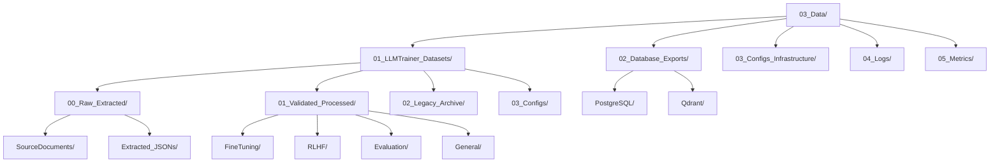

# 📊 Mapa de Datos - Información y Datasets del Ecosistema

## 🎯 Propósito

Este mapa permite a la IA navegar eficientemente por los **archivos de datos, datasets de entrenamiento y configuraciones** del Dungeon Life Ecosystem, basado en el análisis detallado del archivo `03_Data/03_Data.txt` y la estructura real de datos existente.

## 🏗️ Arquitectura General de Datos

### Estructura Jerárquica de Datos



## 📋 Organización por Pipeline de Procesamiento

### 01_LLMTrainer_Datasets - Datasets para IA

**Basado en análisis de `03_Data/03_Data.txt`:**

```yaml
llm_trainer_datasets:
  flujo_procesamiento:
    raw_extracted:
      descripcion: "Datos iniciales extraídos directamente de documentos fuente"
      ubicacion: "03_Data/01_LLMTrainer_Datasets/00_Raw_Extracted/"
      subcarpetas:
        source_documents:
          descripcion: "Copias de documentos fuente originales"
          ejemplos: "guiones, PDFs de lore, documentos markdown"
          ubicacion: "SourceDocuments/"
        extracted_jsons:
          descripcion: "Datos semi-estructurados después de extracción/parseo"
          ejemplos: "JSONs con metadatos extraídos, texto procesado"
          ubicacion: "Extracted_JSONs/"

    validated_processed:
      descripcion: "Datasets que han pasado por limpieza, validación y procesamiento"
      ubicacion: "03_Data/01_LLMTrainer_Datasets/01_Validated_Processed/"
      subcarpetas:
        fine_tuning:
          descripcion: "Datasets formateados para fine-tuning de LLMs"
          formato: ".jsonl"
          ejemplos: "pares de prompt-respuesta, conversaciones estructuradas"
          ubicacion: "FineTuning/"
        rlhf:
          descripcion: "Datasets para Reinforcement Learning from Human Feedback"
          formato: ".jsonl con rankings humanos"
          ejemplos: "respuestas rankeadas por calidad"
          ubicacion: "RLHF/"
        evaluation:
          descripcion: "Datasets para evaluar rendimiento de modelos"
          formato: ".jsonl con métricas de evaluación"
          ejemplos: "benchmarks, test sets"
          ubicacion: "Evaluation/"
        general:
          descripcion: "Otros datasets procesados"
          formato: ".jsonl u otros formatos"
          ubicacion: "General/"

    legacy_archive:
      descripcion: "Versiones antiguas de datasets para referencia histórica"
      ubicacion: "03_Data/01_LLMTrainer_Datasets/02_Legacy_Archive/"
      mantenimiento: "Solo para auditoría y recuperación histórica"

    configs:
      descripcion: "Configuraciones de pipelines de procesamiento"
      ubicacion: "03_Data/01_LLMTrainer_Datasets/03_Configs/"
      ejemplos: "reglas de extracción, parámetros de generación"

  algoritmos_navegacion:
    buscar_datasets_entrenamiento: |
      1. Identificar tipo de entrenamiento (fine-tuning, RLHF, evaluation)
      2. Buscar en 01_Validated_Processed/[Tipo_Correspondiente]/
      3. Verificar formato requerido (.jsonl para mayoría de casos)
      4. Validar completitud y calidad de datos
      5. Revisar configuraciones de procesamiento en 03_Configs/

    crear_nuevo_dataset: |
      1. Determinar tipo de dataset según uso (narrativo, técnico, artístico)
      2. Crear estructura en ubicación correspondiente
      3. Aplicar formato estándar según tipo de entrenamiento
      4. Generar configuraciones de procesamiento
      5. Validar calidad antes de usar en entrenamiento
```

### 02_Database_Exports - Backups y Exports

```yaml
database_exports:
  postgresql:
    descripcion: "Exports de base de datos relacional PostgreSQL"
    ubicacion: "03_Data/02_Database_Exports/PostgreSQL/"
    formatos:
      - "SQL dumps": "Backups completos de esquema y datos"
      - "CSV exports": "Tablas específicas exportadas a CSV"
      - "Backups binarios": "Backups comprimidos de PostgreSQL"
    ejemplos:
      - "full_backup_2025_01_08.sql"
      - "characters_table_export.csv"
      - "postgres_backup_2025_01_08.dump"

  qdrant:
    descripcion: "Exports de base de datos vectorial Qdrant"
    ubicacion: "03_Data/02_Database_Exports/Qdrant/"
    formatos:
      - "Snapshots": "Snapshots completos de colecciones vectoriales"
      - "JSON exports": "Exports de vectores y metadatos"
      - "Collection backups": "Backups de colecciones específicas"
    ejemplos:
      - "qdrant_snapshot_2025_01_08.snapshot"
      - "character_embeddings_export.json"

  algoritmos_gestion:
    crear_backup: |
      1. Determinar tipo de base de datos (PostgreSQL o Qdrant)
      2. Seleccionar formato de export apropiado
      3. Ejecutar proceso de backup según herramienta específica
      4. Verificar integridad del backup creado
      5. Registrar backup en sistema de logs

    restaurar_datos: |
      1. Identificar backup específico requerido
      2. Verificar compatibilidad de versiones
      3. Ejecutar proceso de restauración
      4. Validar integridad de datos restaurados
      5. Actualizar referencias en sistemas dependientes
```

### 03_Configs_Infrastructure - Configuraciones de Infraestructura

```yaml
configs_infrastructure:
  descripcion: "Configuraciones relacionadas con infraestructura de datos"
  ubicacion: "03_Data/03_Configs_Infrastructure/"
  categorias:
    database_configs:
      descripcion: "Configuraciones de servidores de base de datos"
      ejemplos: "postgresql.conf, connection_strings.env"
    deployment_configs:
      descripcion: "Configuraciones de despliegue"
      ejemplos: "docker-compose.yml, kubernetes_configs/"
    monitoring_configs:
      descripcion: "Configuraciones de monitoreo"
      ejemplos: "logging.conf, metrics_collection.yml"
    integration_configs:
      descripcion: "Configuraciones de integración con servicios externos"
      ejemplos: "api_keys.env, external_services.json"

  algoritmos_consulta:
    buscar_configuracion: |
      1. Identificar tipo de configuración requerida
      2. Buscar en categoría correspondiente
      3. Verificar versión y ambiente (dev/staging/prod)
      4. Validar formato y completitud
      5. Aplicar configuración según ambiente
```

## 🧠 Algoritmos de Navegación por Datos

### Consulta de Datasets por Tipo

```python
def find_dataset_location(dataset_type, training_type=None, properties=None):
    """Encontrar ubicación de datasets según tipo y uso"""

    # 1. Mapear tipo de dataset a ubicación
    type_mapping = {
        "narrativo": "NarrativeDatasets",
        "tecnico": "TechnicalDatasets",
        "artistico": "ArtisticDatasets",
        "cross_domain": "CrossDomainDatasets"
    }

    dataset_category = type_mapping.get(dataset_type, "General")

    # 2. Determinar subcarpeta según uso de entrenamiento
    if training_type == "fine_tuning":
        target_folder = "FineTuning"
    elif training_type == "rlhf":
        target_folder = "RLHF"
    elif training_type == "evaluation":
        target_folder = "Evaluation"
    else:
        target_folder = "General"

    # 3. Construir ruta completa
    base_path = f"03_Data/01_LLMTrainer_Datasets/01_Validated_Processed/{target_folder}/"

    return {
        "ruta_base": base_path,
        "categoria_esperada": dataset_category,
        "formato_requerido": ".jsonl",
        "validacion_estructura": True
    }
```

### Creación de Nuevos Datasets

```python
def create_dataset_structure(dataset_name, dataset_type, source_documents, training_config):
    """Crear estructura para nuevo dataset de entrenamiento"""

    # 1. Crear carpeta en Raw_Extracted para fuentes originales
    raw_folder = f"03_Data/01_LLMTrainer_Datasets/00_Raw_Extracted/SourceDocuments/{dataset_name}/"

    # 2. Crear carpeta en Validated_Processed según tipo de entrenamiento
    processed_folder = f"03_Data/01_LLMTrainer_Datasets/01_Validated_Processed/{training_config['tipo']}/{dataset_name}/"

    # 3. Copiar documentos fuente a ubicación raw
    source_files = []
    for doc in source_documents:
        source_files.append(f"{raw_folder}{doc['nombre_archivo']}")

    # 4. Crear configuración de procesamiento
    config_file = f"03_Data/01_LLMTrainer_Datasets/03_Configs/{dataset_name}_processing.json"

    return {
        "carpeta_raw": raw_folder,
        "carpeta_procesada": processed_folder,
        "archivos_fuente": source_files,
        "archivo_configuracion": config_file,
        "siguiente_paso": "Ejecutar pipeline de procesamiento de datos"
    }
```

### Gestión de Exports de Base de Datos

```python
def manage_database_export(database_type, export_type, entity_filter=None):
    """Gestionar exports de bases de datos"""

    # 1. Determinar ubicación según tipo de BD
    if database_type == "postgresql":
        base_location = "03_Data/02_Database_Exports/PostgreSQL/"
        export_formats = ["sql", "csv", "dump"]
    elif database_type == "qdrant":
        base_location = "03_Data/02_Database_Exports/Qdrant/"
        export_formats = ["snapshot", "json"]
    else:
        return {"error": "Tipo de base de datos no soportado"}

    # 2. Aplicar filtros si especificados
    if entity_filter:
        filter_suffix = f"_filtered_{entity_filter}"
    else:
        filter_suffix = "_complete"

    # 3. Generar nombre de archivo con timestamp
    timestamp = datetime.now().strftime("%Y_%m_%d")
    filename = f"{export_type}_export_{timestamp}{filter_suffix}"

    return {
        "ubicacion_base": base_location,
        "nombre_archivo": f"{filename}.{export_formats[0]}",
        "tipo_export": export_type,
        "filtros_aplicados": entity_filter,
        "requiere_verificacion": True
    }
```

## 🎯 Ejemplos Prácticos de Navegación

### Consulta: "Necesito datasets de entrenamiento para diálogos de personajes"

```markdown
**Ruta de navegación basada en estructura real:**

1. **📁 Ubicación datasets narrativos**:
   - `03_Data/01_LLMTrainer_Datasets/01_Validated_Processed/FineTuning/`
   - Buscar en subcarpeta `NarrativeDatasets/CharacterDialogues/`

2. **💻 Archivos fuente originales**:
   - `03_Data/01_LLMTrainer_Datasets/00_Raw_Extracted/SourceDocuments/`
   - Documentos de diálogos fuente de personajes

3. **⚙️ Configuraciones de procesamiento**:
   - `03_Data/01_LLMTrainer_Datasets/03_Configs/`
   - Reglas específicas para extracción de diálogos

4. **📊 Datasets procesados**:
   - Formato: `.jsonl` con pares prompt-respuesta
   - Ubicación: `FineTuning/[Nombre_Dataset]_Dialogues.jsonl`

5. **✅ Validación**:
   - Verificar calidad de datos procesados
   - Revisar métricas de evaluación si aplica
```

### Consulta: "Crear dataset para nueva ubicación Eldoria"

```markdown
**Ruta de creación basada en estructura real:**

1. **📝 Recopilar documentos fuente**:
   - Documentación FES: `02_Entidades/DLE_500_LOC_Eldoria.md`
   - Descripciones narrativas: `01_Universo_y_Reglas/WLD_101_Eldoria.md`
   - Assets relacionados: `02_ContentAssets/01_Entities/Locations/Eldoria/`

2. **🏗️ Crear estructura de dataset**:
   - Carpeta raw: `03_Data/01_LLMTrainer_Datasets/00_Raw_Extracted/SourceDocuments/Eldoria_Dataset/`
   - Archivos fuente: `eldoria_fes.md`, `eldoria_lore.md`, `eldoria_assets.json`

3. **⚙️ Procesar datos**:
   - Aplicar reglas de extracción específicas para ubicaciones
   - Generar formato .jsonl para entrenamiento
   - Crear configuración: `03_Data/01_LLMTrainer_Datasets/03_Configs/eldoria_processing.json`

4. **📊 Generar datasets específicos**:
   - Fine-tuning: `03_Data/01_LLMTrainer_Datasets/01_Validated_Processed/FineTuning/Eldoria_Location_Training.jsonl`
   - World building: `03_Data/01_LLMTrainer_Datasets/01_Validated_Processed/General/Eldoria_WorldBuilding.jsonl`

5. **💾 Crear backups**:
   - Export de datos relacionados con Eldoria desde PostgreSQL
   - Ubicación: `03_Data/02_Database_Exports/PostgreSQL/eldoria_export_2025_01_08.sql`
```

## 📋 Organización por Tipo de Datos

### Datasets por Dominio de Conocimiento

```yaml
datasets_por_dominio:
  narrative_datasets:
    descripcion: "Datos relacionados con narrativa y lore"
    ubicacion_base: "03_Data/01_LLMTrainer_Datasets/01_Validated_Processed/FineTuning/NarrativeDatasets/"
    subcarpetas:
      character_dialogues:
        descripcion: "Diálogos y conversaciones de personajes"
        ejemplos: "CharacterProfiles/", "DialogueTrees/", "PersonalityData/"
      story_arcs:
        descripcion: "Arcos narrativos y estructura de historias"
        ejemplos: "StoryArcs/", "PlotPoints/", "NarrativeBeats/"
      world_building:
        descripcion: "Construcción de mundo y descripciones ambientales"
        ejemplos: "WorldBuilding/", "GeographyData/", "AtmosphereData/"

  technical_datasets:
    descripcion: "Datos relacionados con sistemas técnicos y mecánicas"
    ubicacion_base: "03_Data/01_LLMTrainer_Datasets/01_Validated_Processed/FineTuning/TechnicalDatasets/"
    subcarpetas:
      game_mechanics:
        descripcion: "Mecánicas de juego y reglas del sistema"
        ejemplos: "GameMechanics/", "BalanceData/", "SystemRules/"
      character_systems:
        descripcion: "Sistemas de personajes y progresión"
        ejemplos: "CharacterSystems/", "SkillTrees/", "ProgressionData/"

  artistic_datasets:
    descripcion: "Datos relacionados con arte y estilo visual"
    ubicacion_base: "03_Data/01_LLMTrainer_Datasets/01_Validated_Processed/General/ArtisticDatasets/"
    subcarpetas:
      style_references:
        descripcion: "Referencias de estilo artístico"
        ejemplos: "StyleReferences/", "ColorPalettes/", "CompositionRules/"
      visual_elements:
        descripcion: "Elementos visuales y descripciones estéticas"
        ejemplos: "VisualElements/", "MoodBoards/", "StyleGuides/"

  cross_domain_datasets:
    descripcion: "Datasets que combinan múltiples dominios"
    ubicacion_base: "03_Data/01_LLMTrainer_Datasets/01_Validated_Processed/General/CrossDomainDatasets/"
    subcarpetas:
      entity_relationships:
        descripcion: "Relaciones entre diferentes entidades"
        ejemplos: "EntityRelationships/", "CharacterLocationLinks/"
      conflict_patterns:
        descripcion: "Patrones de conflicto y resolución"
        ejemplos: "ConflictPatterns/", "ResolutionStrategies/"
      evolution_data:
        descripcion: "Datos de evolución y cambio de entidades"
        ejemplos: "EvolutionData/", "GrowthPatterns/"
```

### Configuraciones de Infraestructura

```yaml
infrastructure_configs:
  database_configs:
    descripcion: "Configuraciones de bases de datos"
    ubicacion: "03_Data/03_Configs_Infrastructure/DatabaseConfigs/"
    ambientes:
      development: "Configuración para ambiente de desarrollo"
      staging: "Configuración para ambiente de staging"
      production: "Configuración para ambiente de producción"
    ejemplos:
      - "development/postgresql.conf"
      - "production/connection_strings.env"

  deployment_configs:
    descripcion: "Configuraciones de despliegue"
    ubicacion: "03_Data/03_Configs_Infrastructure/DeploymentConfigs/"
    tipos:
      docker: "Configuraciones Docker y docker-compose"
      kubernetes: "Configuraciones de Kubernetes"
      cloud: "Configuraciones específicas de proveedores cloud"

  monitoring_configs:
    descripcion: "Configuraciones de monitoreo y logging"
    ubicacion: "03_Data/03_Configs_Infrastructure/MonitoringConfigs/"
    tipos:
      logging: "Configuración de sistemas de logs"
      metrics: "Configuración de recolección de métricas"
      alerts: "Configuración de alertas y notificaciones"
```

## 🔗 Integración con Sistemas de IA

### Pipeline de Procesamiento de Datos

```yaml
pipeline_datos_ia:
  etapas_completas:
    - "Extracción": "Extraer datos de documentos fuente originales"
    - "Limpieza": "Limpiar y normalizar datos extraídos"
    - "Validación": "Validar calidad y completitud de datos"
    - "Formateo": "Formatear según tipo de entrenamiento requerido"
    - "Enriquecimiento": "Agregar metadatos y referencias cruzadas"
    - "Export": "Exportar en formato requerido para entrenamiento"

  herramientas_integradas:
    document_processors:
      descripcion: "Procesadores para diferentes tipos de documento"
      tipos: ["markdown", "pdf", "json", "yaml", "txt"]

    data_validators:
      descripcion: "Validadores de calidad de datos"
      criterios: ["completitud", "consistencia", "formato", "relevancia"]

    format_converters:
      descripcion: "Convertidores a formatos de entrenamiento"
      formatos_output: [".jsonl", ".json", ".csv", ".parquet"]
```

## 📋 Validación y Mantenimiento

### Criterios de Calidad de Datos

- ✅ **Completitud**: Todos los campos requeridos presentes
- ✅ **Consistencia**: Formato uniforme en todos los registros
- ✅ **Relevancia**: Datos pertinentes al dominio de entrenamiento
- ✅ **Trazabilidad**: Origen de datos claramente documentado

### Mantenimiento de Datos

- 🔄 **Limpieza periódica** de datasets obsoletos
- 🔄 **Validación automática** de nuevos datos procesados
- 🔄 **Optimización** de formatos para entrenamiento eficiente
- 🔄 **Backup automático** de datasets críticos

---

**Este mapa de datos evoluciona con el proyecto. Última actualización basada en análisis detallado del archivo `03_Data/03_Data.txt` y estructura real de datos existente.**