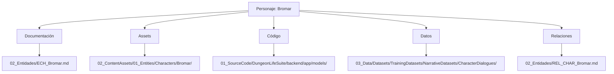

# 👤 Mapa de Entidades - Personajes del Dungeon Life Ecosystem

## 🎯 Propósito

Este mapa permite a la IA navegar eficientemente por toda la información relacionada con **personajes** en el Dungeon Life Ecosystem, basado en el análisis detallado del archivo `02_SourceArt/01_Entities/entities.txt.txt` y la estructura real de personajes existente.

## 🏗️ Estructura General de Personajes

### Ubicaciones Estándar para Personajes



### Estructura Interna Estándar por Personaje

**Basado en análisis de `entities.txt.txt`:**

```yaml
estructura_personaje_estandar:
  documentacion:
    descripcion: "Documentación principal del personaje"
    ubicacion: "02_Entidades/ECH_[Nombre].md"
    formato: "Markdown con metadatos FES"
    contenido: "Características, historia, personalidad, relaciones"

  assets:
    descripcion: "Todos los activos visuales y de audio del personaje"
    ubicacion: "02_ContentAssets/01_Entities/Characters/[Nombre]/"
    estructura_interna:
      concept_art:
        descripcion: "Arte conceptual específico del personaje"
        ubicacion: "00_ConceptArt/"
        ejemplos: "[Nombre]_Concept_Sheet.png", "[Nombre]_Turnaround.jpg"
      native_source_files:
        descripcion: "Archivos fuente editables de software de arte"
        ubicacion: "01_NativeSourceFiles/"
        subcarpetas:
          modeling: "Archivos fuente de modelado (.blend)"
          sculpting: "Archivos fuente de escultura (.ztl)"
          texturing: "Archivos fuente de texturizado (.spp)"
        ejemplos: "[Nombre]_Model.blend", "[Nombre]_Sculpt.ztl", "[Nombre]_Textures.spp"
      exported_game_ready:
        descripcion: "Assets exportados listos para motor de juego"
        ubicacion: "02_ExportedGameReady/"
        subcarpetas:
          meshes: "Mallas 3D exportadas (.fbx)"
          textures: "Texturas exportadas (.png, .tga)"
          materials: "Configuraciones de materiales"
          animations: "Animaciones exportadas (.fbx)"
        ejemplos: "SK_[Nombre].fbx", "T_[Nombre]_Body_BC.png", "Anim_[Nombre]_Walk.fbx"
      final_renders:
        descripcion: "Renders de presentación y marketing"
        ubicacion: "03_FinalRenders/"
        ejemplos: "[Nombre]_Showcase_Render.png"
      audio:
        descripcion: "Audio específico del personaje"
        ubicacion: "04_Audio/"
        ejemplos: "Voice_[Nombre]_Grunt.wav", "SFX_[Nombre]_Actions/"
      two_d:
        descripcion: "Arte 2D específico del personaje"
        ubicacion: "05_2D/"
        ejemplos: "[Nombre]_Portrait.png", "[Nombre]_Icon.png"

  codigo:
    descripcion: "Implementación técnica del personaje"
    ubicacion: "01_SourceCode/DungeonLifeSuite/backend/app/models/"
    ejemplos: "character_[nombre].py", "character_service.py"

  datos:
    descripcion: "Datasets de entrenamiento relacionados con el personaje"
    ubicacion: "03_Data/Datasets/TrainingDatasets/NarrativeDatasets/CharacterDialogues/"
    ejemplos: "[Nombre]/CharacterProfiles/", "[Nombre]/DialogueTrees/"

  relaciones:
    descripcion: "Relaciones del personaje con otras entidades"
    ubicacion: "02_Entidades/REL_CHAR_[Nombre].md"
    ejemplos: "REL_CHAR_Bromar.md"
```

## 🎨 Assets Específicos por Tipo de Personaje

### Personajes Jugadores (Player Characters)

```yaml
player_characters:
  estructura_especifica:
    - "Player/[Nombre]/": "Carpeta específica para personajes jugables"
    - "PlayerModels/": "Modelos optimizados para personaje principal"
    - "PlayerAnimations/": "Animaciones específicas de jugador"
    - "PlayerAudio/": "Voces y sonidos del jugador"

  ejemplos_reales:
    juan:
      ubicacion: "02_ContentAssets/01_Entities/Characters/Player/Juan/"
      archivos_esperados:
        - "00_ConceptArt/Juan_Player_Concept.png"
        - "01_NativeSourceFiles/Modeling/Juan_Player_Model.blend"
        - "02_ExportedGameReady/Meshes/PP_Juan.fbx"  # PP = Player Protagonist
        - "02_ExportedGameReady/Animations/Anim_Juan_Player_Actions.fbx"
        - "04_Audio/Voice_Juan_Player_Dialogue.wav"
        - "05_2D/Juan_Player_Portrait.png"
```

### NPCs (Non-Player Characters)

```yaml
npcs:
  estructura_especifica:
    - "NPCs/[Nombre]/": "Carpeta específica para NPCs"
    - "NPCModels/": "Modelos optimizados para NPCs"
    - "NPCAnimations/": "Animaciones específicas de NPC"
    - "NPCDialogues/": "Árboles de diálogo específicos"

  ejemplos_reales:
    bromar:
      ubicacion: "02_ContentAssets/01_Entities/Characters/NPCs/Bromar/"
      archivos_esperados:
        - "00_ConceptArt/Bromar_Concept_Sheet.png"
        - "01_NativeSourceFiles/Modeling/Bromar_Model.blend"
        - "01_NativeSourceFiles/Sculpting/Bromar_Sculpt.ztl"
        - "01_NativeSourceFiles/Texturing/Bromar_Textures.spp"
        - "02_ExportedGameReady/Meshes/SK_Bromar.fbx"
        - "02_ExportedGameReady/Textures/T_Bromar_Body_BC.png"
        - "02_ExportedGameReady/Animations/Anim_Bromar_Run.fbx"
        - "03_FinalRenders/Bromar_Showcase_Render.png"
        - "04_Audio/Voice_Bromar_Grunt.wav"
        - "05_2D/Bromar_Portrait.png"

    aelina:
      ubicacion: "02_ContentAssets/01_Entities/Characters/NPCs/Aelina/"
      archivos_esperados:
        - "00_ConceptArt/Aelina_Concept_Sheet.png"
        - "01_NativeSourceFiles/Modeling/Aelina_Model.blend"
        - "02_ExportedGameReady/Meshes/SK_Aelina.fbx"
        - "04_Audio/Voice_Aelina_Dialogue.wav"
        - "05_2D/Aelina_Portrait.png"
```

### Criaturas y Enemigos (Creatures)

```yaml
creatures:
  estructura_especifica:
    - "Creatures/[Nombre]/": "Carpeta específica para criaturas"
    - "CreatureModels/": "Modelos optimizados para criaturas"
    - "CreatureAnimations/": "Animaciones específicas de criatura"
    - "CreatureAudio/": "Sonidos de criatura"

  ejemplos_esperados:
    dragon:
      ubicacion: "02_ContentAssets/01_Entities/Characters/Creatures/Dragon/"
      archivos_esperados:
        - "00_ConceptArt/Dragon_Concept_MultipleViews.png"
        - "01_NativeSourceFiles/Modeling/Dragon_Base_Model.blend"
        - "01_NativeSourceFiles/Sculpting/Dragon_HighDetail.ztl"
        - "02_ExportedGameReady/Meshes/SK_Dragon.fbx"
        - "02_ExportedGameReady/Animations/Anim_Dragon_Fly.fbx"
        - "04_Audio/SFX_Dragon_Roar.wav"
```

## 🧠 Algoritmos de Navegación por Personajes

### Consulta de Información de Personaje

```python
def get_character_information(character_name, information_type=None):
    """Obtener información completa de un personaje"""

    # 1. Construir rutas estándar para el personaje
    character_routes = {
        "documentacion": f"02_Entidades/ECH_{character_name}.md",
        "assets": f"02_ContentAssets/01_Entities/Characters/{character_name}/",
        "codigo": f"01_SourceCode/DungeonLifeSuite/backend/app/models/character_{character_name.lower()}.py",
        "datos": f"03_Data/Datasets/TrainingDatasets/NarrativeDatasets/CharacterDialogues/{character_name}/",
        "relaciones": f"02_Entidades/REL_CHAR_{character_name}.md"
    }

    # 2. Si se especifica tipo de información, filtrar resultados
    if information_type:
        if information_type == "visual":
            return {
                "concept_art": f"{character_routes['assets']}00_ConceptArt/",
                "modelos_3d": f"{character_routes['assets']}02_ExportedGameReady/Meshes/",
                "texturas": f"{character_routes['assets']}02_ExportedGameReady/Textures/",
                "portraits": f"{character_routes['assets']}05_2D/"
            }
        elif information_type == "audio":
            return {
                "voz": f"{character_routes['assets']}04_Audio/Voice_{character_name}_*.wav",
                "sfx": f"{character_routes['assets']}04_Audio/SFX_{character_name}_*.wav"
            }
        elif information_type == "dialogos":
            return {
                "datasets": f"{character_routes['datos']}DialogueTrees/",
                "perfiles": f"{character_routes['datos']}CharacterProfiles/"
            }

    # 3. Determinar tipo de importancia en el relato
    character_importance_type = determine_narrative_importance(character_name)

    # 4. Retornar información completa si no se especifica tipo
    return {
        "documentacion": character_routes["documentacion"],
        "assets_completos": character_routes["assets"],
        "implementacion_tecnica": character_routes["codigo"],
        "datasets_entrenamiento": character_routes["datos"],
        "relaciones": character_routes["relaciones"],
        "tipo_importancia_relato": character_importance_type,
        "directorio_principal": character_importance_type.get("directorio_busqueda", "Characters/NPCs/"),
        "sugerencia_navegacion": "Consultar documentación principal primero, luego assets específicos según necesidad"
    }
```

### Creación de Nuevo Personaje

```python
def create_character_structure(character_name, character_type, properties):
    """Crear estructura completa para nuevo personaje"""

    # 1. Determinar subcarpeta según tipo de personaje
    type_folders = {
        "player": "Player",
        "npc": "NPCs",
        "creature": "Creatures"
    }

    character_folder = type_folders.get(character_type, "NPCs")

    # 2. Crear estructura de documentación
    docs_structure = [
        f"02_Entidades/ECH_{character_name}.md",
        f"02_Entidades/REL_CHAR_{character_name}.md"
    ]

    # 3. Crear estructura de assets
    assets_structure = f"02_ContentAssets/01_Entities/Characters/{character_folder}/{character_name}/"

    assets_subfolders = [
        f"{assets_structure}00_ConceptArt/",
        f"{assets_structure}01_NativeSourceFiles/Modeling/",
        f"{assets_structure}01_NativeSourceFiles/Sculpting/",
        f"{assets_structure}01_NativeSourceFiles/Texturing/",
        f"{assets_structure}02_ExportedGameReady/Meshes/",
        f"{assets_structure}02_ExportedGameReady/Textures/",
        f"{assets_structure}02_ExportedGameReady/Animations/",
        f"{assets_structure}03_FinalRenders/",
        f"{assets_structure}04_Audio/",
        f"{assets_structure}05_2D/"
    ]

    # 4. Crear estructura de código
    code_structure = f"01_SourceCode/DungeonLifeSuite/backend/app/models/character_{character_name.lower()}.py"

    # 5. Crear estructura de datos
    data_structure = f"03_Data/Datasets/TrainingDatasets/NarrativeDatasets/CharacterDialogues/{character_name}/"

    data_subfolders = [
        f"{data_structure}CharacterProfiles/",
        f"{data_structure}DialogueTrees/",
        f"{data_structure}PersonalityData/"
    ]

    return {
        "documentacion": docs_structure,
        "carpeta_assets": assets_structure,
        "subcarpetas_assets": assets_subfolders,
        "archivo_codigo": code_structure,
        "carpeta_datos": data_structure,
        "subcarpetas_datos": data_subfolders,
        "archivos_requeridos": [
            f"{assets_structure}00_ConceptArt/{character_name}_Concept_Sheet.png",
            f"{assets_structure}01_NativeSourceFiles/Modeling/{character_name}_Model.blend",
            f"{assets_structure}02_ExportedGameReady/Meshes/SK_{character_name}.fbx",
            f"{assets_structure}05_2D/{character_name}_Portrait.png"
        ],
        "siguiente_paso": "Crear contenido inicial en documentación FES"
    }
```

### Determinación de Importancia en el Relato

```python
def determine_narrative_importance(character_name):
    """Determinar el tipo de importancia narrativa de un personaje"""

    # Patrones de nombres que indican importancia narrativa
    narrative_patterns = {
        "protagonista": {
            "palabras_clave": ["juan", "protagonista", "main", "hero"],
            "descripcion": "Personajes principales de la historia",
            "directorio_busqueda": "Characters/Player/",
            "prioridad_assets": "Máxima - protagonista absoluto"
        },
        "aliado_jugable": {
            "palabras_clave": ["elena", "aliado", "companion", "sidekick"],
            "descripcion": "Personajes secundarios jugables o compañeros",
            "directorio_busqueda": "Characters/Player/",
            "prioridad_assets": "Alta - impacto significativo en narrativa"
        },
        "npc_principal": {
            "palabras_clave": ["bromar", "aelina", "mentor", "leader", "important"],
            "descripcion": "NPCs centrales para la trama y mundo",
            "directorio_busqueda": "Characters/NPCs/",
            "prioridad_assets": "Media-alta - importancia narrativa"
        },
        "npc_secundario": {
            "palabras_clave": ["merchant", "guard", "villager", "citizen"],
            "descripcion": "NPCs con rol específico pero limitado",
            "directorio_busqueda": "Characters/NPCs/",
            "prioridad_assets": "Media - funcionalidad específica"
        },
        "enemigo": {
            "palabras_clave": ["villain", "boss", "enemy", "antagonist", "dragon"],
            "descripcion": "Antagonistas y criaturas hostiles",
            "directorio_busqueda": "Characters/Creatures/",
            "prioridad_assets": "Alta - impacto en gameplay"
        },
        "story_mode": {
            "palabras_clave": ["event", "special", "temporal", "seasonal"],
            "descripcion": "Personajes exclusivos de modo historia o eventos especiales",
            "directorio_busqueda": "Characters/StoryMode/",
            "prioridad_assets": "Variable según evento"
        }
    }

    # Buscar coincidencias con palabras clave
    character_lower = character_name.lower()

    for importance_type, pattern_info in narrative_patterns.items():
        if any(keyword in character_lower for keyword in pattern_info["palabras_clave"]):
            return {
                "tipo": importance_type,
                "descripcion": pattern_info["descripcion"],
                "directorio_busqueda": pattern_info["directorio_busqueda"],
                "prioridad_assets": pattern_info["prioridad_assets"]
            }

    # Si no hay coincidencia, asumir NPC secundario por defecto
    return {
        "tipo": "npc_secundario",
        "descripcion": "NPC con rol específico pero limitado",
        "directorio_busqueda": "Characters/NPCs/",
        "prioridad_assets": "Media - funcionalidad específica"
    }
```

## 🎯 Ejemplos Prácticos de Navegación

### Consulta: "Estado completo del personaje Bromar"

```markdown
**Ruta de navegación basada en estructura real:**

1. **📖 Documentación Principal**:
   - Ubicación: `02_Entidades/ECH_Bromar.md`
   - Información FES completa del personaje
   - Características, historia, personalidad

2. **🤝 Relaciones del Personaje**:
   - Ubicación: `02_Entidades/REL_CHAR_Bromar.md`
   - Conexiones con otros personajes
   - Relaciones con ubicaciones y facciones

3. **🎨 Assets Visuales**:
   - **Concept Art**: `02_ContentAssets/01_Entities/Characters/NPCs/Bromar/00_ConceptArt/Bromar_Concept_Sheet.png`
   - **Modelos Fuente**:
     - Modelado: `01_NativeSourceFiles/Modeling/Bromar_Model.blend`
     - Escultura: `01_NativeSourceFiles/Sculpting/Bromar_Sculpt.ztl`
     - Texturizado: `01_NativeSourceFiles/Texturing/Bromar_Textures.spp`
   - **Assets Game-Ready**:
     - Mesh: `02_ExportedGameReady/Meshes/SK_Bromar.fbx`
     - Texturas: `02_ExportedGameReady/Textures/T_Bromar_Body_BC.png`
     - Animaciones: `02_ExportedGameReady/Animations/Anim_Bromar_Run.fbx`
   - **Renders Finales**: `03_FinalRenders/Bromar_Showcase_Render.png`
   - **Audio**: `04_Audio/Voice_Bromar_Grunt.wav`
   - **Arte 2D**: `05_2D/Bromar_Portrait.png`

4. **💻 Implementación Técnica**:
   - Modelo datos: `01_SourceCode/DungeonLifeSuite/backend/app/models/character_bromar.py`
   - Servicios: `01_SourceCode/DungeonLifeSuite/backend/app/services/character_service.py`

5. **📊 Datasets de Entrenamiento**:
   - Perfiles: `03_Data/Datasets/TrainingDatasets/NarrativeDatasets/CharacterDialogues/Bromar/CharacterProfiles/`
   - Diálogos: `03_Data/Datasets/TrainingDatasets/NarrativeDatasets/CharacterDialogues/Bromar/DialogueTrees/`
   - Personalidad: `03_Data/Datasets/TrainingDatasets/NarrativeDatasets/CharacterDialogues/Bromar/PersonalityData/`

6. **⚔️ Equipment Específico**:
   - Documentación: `02_Entidades/ITM_Equipo_Bromar.md`
   - Assets: `02_ContentAssets/01_Entities/Items/Equipment/Bromar/`
```

### Consulta: "Crear nuevo personaje Elena como NPC"

```markdown
**Ruta de creación basada en estructura real:**

1. **📝 Crear Documentación**:
   - Documento FES: `02_Entidades/ECH_Elena.md`
   - Relaciones: `02_Entidades/REL_CHAR_Elena.md`

2. **🎨 Crear Estructura de Assets**:
   - **Carpeta base**: `02_ContentAssets/01_Entities/Characters/NPCs/Elena/`
   - **Concept Art**: `00_ConceptArt/Elena_Concept_Sheet.png`
   - **Archivos fuente**:
     - Modelado: `01_NativeSourceFiles/Modeling/Elena_Model.blend`
     - Texturizado: `01_NativeSourceFiles/Texturing/Elena_Textures.spp`
   - **Assets game-ready**:
     - Mesh: `02_ExportedGameReady/Meshes/SK_Elena.fbx`
     - Texturas: `02_ExportedGameReady/Textures/T_Elena_Body_BC.png`
     - Animaciones: `02_ExportedGameReady/Animations/Anim_Elena_Idle.fbx`
   - **Audio**: `04_Audio/Voice_Elena_Dialogue.wav`
   - **Arte 2D**: `05_2D/Elena_Portrait.png`

3. **💻 Crear Modelo de Datos**:
   - Archivo: `01_SourceCode/DungeonLifeSuite/backend/app/models/character_elena.py`

4. **📚 Crear Datasets de Entrenamiento**:
   - Carpeta base: `03_Data/Datasets/TrainingDatasets/NarrativeDatasets/CharacterDialogues/Elena/`
   - Perfiles: `CharacterProfiles/Elena_Profile.json`
   - Diálogos: `DialogueTrees/Elena_DialogueTree.json`
   - Personalidad: `PersonalityData/Elena_Personality.json`

5. **🔗 Crear Conexiones**:
   - Relacionar con ubicación de origen
   - Conectar con quests relacionados
   - Vincular con otros personajes (amigos, enemigos, familia)

6. **✅ Validación Final**:
    - Verificar que todos los componentes estén creados
    - Validar referencias cruzadas
    - Confirmar integración con sistemas existentes
```

### Consulta: "Crear nuevo personaje usando tipos de importancia narrativa"

```markdown
**Ejemplo práctico de uso del sistema de tipos narrativos:**

**Consulta IA:** "Crear personaje 'Rey Eldoria' como antagonista principal"

**Procesamiento automático:**
1. **Análisis semántico**: Detecta palabras clave "Rey Eldoria" + "antagonista"
2. **Determinación de tipo**: Clasificado como "enemigo" por palabras clave
3. **Asignación automática**:
   - Tipo: "enemigo"
   - Directorio: "Characters/Creatures/" o "Characters/NPCs/"
   - Prioridad: "Alta - impacto en gameplay"
   - Características: "Modelo optimizado para combate, animaciones de ataque"

**Ruta de creación generada automáticamente:**
1. **📝 Documentación**: `02_Entidades/ECH_Rey_Eldoria.md`
2. **🎨 Assets**: `02_ContentAssets/01_Entities/Characters/Creatures/Rey_Eldoria/`
3. **💻 Código**: `01_SourceCode/DungeonLifeSuite/backend/app/models/character_rey_eldoria.py`
4. **📚 Datos**: `03_Data/Datasets/TrainingDatasets/NarrativeDatasets/CharacterDialogues/Rey_Eldoria/`
5. **🤝 Relaciones**: `02_Entidades/REL_CHAR_Rey_Eldoria.md` (como antagonista)

**Optimizaciones automáticas aplicadas:**
- Assets optimizados para combate y jefes
- Sistema de IA específico para comportamiento antagonista
- Diálogos preparados para rol de villano
- Conexiones automáticas con ubicación "Eldoria"
```

## 📋 Organización por Características del Personaje

### Por Tipo de Personaje

```yaml
personajes_por_tipo:
  protagonistas:
    descripcion: "Personajes principales de la historia"
    ejemplos: "Juan, ECH_Juan"
    estructura: "Characters/Player/[Nombre]/"
    caracteristicas: "Modelo alta calidad, animaciones complejas, voz completa"

  npcs_aliados:
    descripcion: "Personajes no jugables que ayudan al jugador"
    ejemplos: "Bromar, Aelina"
    estructura: "Characters/NPCs/[Nombre]/"
    caracteristicas: "Modelo calidad media, diálogos complejos, relaciones profundas"

  npcs_neutrales:
    descripcion: "Personajes con los que se puede interactuar ocasionalmente"
    ejemplos: "Mercaderes, guardias, aldeanos"
    estructura: "Characters/NPCs/[Nombre]/"
    caracteristicas: "Modelo básico reutilizable, diálogos simples"

  enemigos:
    descripcion: "Personajes antagonistas y criaturas"
    ejemplos: "Criaturas, villanos"
    estructura: "Characters/Creatures/[Nombre]/"
    caracteristicas: "Modelo optimizado para combate, animaciones de ataque"
```

### Por Complejidad de Assets

```yaml
personajes_por_complejidad:
  alta_complejidad:
    descripcion: "Personajes con assets muy detallados"
    criterios: "Protagonistas, NPCs principales, criaturas únicas"
    assets_requeridos:
      - "Concept art detallado con múltiples vistas"
      - "Modelado high-poly con sculpting detallado"
      - "Texturizado PBR completo (BC, N, ORM, etc.)"
      - "Animaciones múltiples y complejas"
      - "Audio de voz completo"
      - "Múltiples renders de presentación"

  media_complejidad:
    descripcion: "Personajes con assets moderadamente detallados"
    criterios: "NPCs secundarios, criaturas comunes"
    assets_requeridos:
      - "Concept art básico"
      - "Modelado mid-poly"
      - "Texturizado básico PBR"
      - "Animaciones esenciales"
      - "Audio básico"

  baja_complejidad:
    descripcion: "Personajes con assets simples"
    criterios: "NPCs genéricos, extras"
    assets_requeridos:
      - "Concept art mínimo"
      - "Modelo low-poly reutilizable"
      - "Texturas básicas"
      - "Animaciones básicas o compartidas"
      - "Sin audio específico"
```

### Por Importancia en el Relato

```yaml
tipos_importancia_relato:
 protagonista:
   descripcion: "Personajes principales de la historia"
   ejemplos: "Juan, ECH_Juan"
   estructura: "Characters/Player/[Nombre]/"
   caracteristicas: "Modelo alta calidad, animaciones complejas, voz completa"
   prioridad_assets: "Máxima - protagonista absoluto"
   directorio_busqueda: "Characters/Player/"

 aliado_jugable:
   descripcion: "Personajes secundarios jugables o compañeros"
   ejemplos: "Elena, aliados temporales"
   estructura: "Characters/Player/[Nombre]/"
   caracteristicas: "Modelo alta calidad, diálogos complejos, habilidades únicas"
   prioridad_assets: "Alta - impacto significativo en narrativa"
   directorio_busqueda: "Characters/Player/"

 npc_principal:
   descripcion: "NPCs centrales para la trama y mundo"
   ejemplos: "Bromar, Aelina, líderes de facción"
   estructura: "Characters/NPCs/[Nombre]/"
   caracteristicas: "Modelo calidad media-alta, diálogos complejos, relaciones profundas"
   prioridad_assets: "Media-alta - importancia narrativa"
   directorio_busqueda: "Characters/NPCs/"

 npc_secundario:
   descripcion: "NPCs con rol específico pero limitado"
   ejemplos: "Mercaderes, guardias, aldeanos con diálogo"
   estructura: "Characters/NPCs/[Nombre]/"
   caracteristicas: "Modelo básico reutilizable, diálogos simples pero funcionales"
   prioridad_assets: "Media - funcionalidad específica"
   directorio_busqueda: "Characters/NPCs/"

 enemigo:
   descripcion: "Antagonistas y criaturas hostiles"
   ejemplos: "Villanos principales, jefes, criaturas únicas"
   estructura: "Characters/Creatures/[Nombre]/ o Characters/NPCs/[Nombre]/"
   caracteristicas: "Modelo optimizado para combate, animaciones de ataque, IA específica"
   prioridad_assets: "Alta - impacto en gameplay"
   directorio_busqueda: "Characters/Creatures/ o Characters/NPCs/"

 story_mode:
   descripcion: "Personajes exclusivos de modo historia o eventos especiales"
   ejemplos: "NPCs de eventos temporales, personajes de campañas específicas"
   estructura: "Characters/StoryMode/[Nombre]/"
   caracteristicas: "Assets específicos del evento, duración limitada, diálogos únicos"
   prioridad_assets: "Variable según evento"
   directorio_busqueda: "Characters/StoryMode/"
```

## 🔗 Sistema de Referencias Cruzadas

### Relaciones entre Personajes

```yaml
sistema_relaciones:
  tipos_relacion:
    familiares:
      descripcion: "Relaciones de sangre o matrimonio"
      ejemplos: "ECH_Juan (padre) -> ECH_Elena (hija)"
      documentacion: "REL_CHAR_[Nombre]_Family.md"

    aliados:
      descripcion: "Relaciones de amistad o alianza"
      ejemplos: "ECH_Bromar (mentor) -> ECH_Juan (aprendiz)"
      documentacion: "REL_CHAR_[Nombre]_Allies.md"

    antagonistas:
      descripcion: "Relaciones de enemistad o rivalidad"
      ejemplos: "ECH_Villano (enemigo) -> ECH_Juan (objetivo)"
      documentacion: "REL_CHAR_[Nombre]_Enemies.md"

    facciones:
      descripcion: "Pertenencia a grupos o facciones"
      ejemplos: "ECH_Bromar (miembro) -> EFAC_ElderTown (facción)"
      documentacion: "REL_CHAR_[Nombre]_Factions.md"
```

## 📋 Validación y Mantenimiento

### Criterios de Completitud para Personajes

- ✅ **Documentación FES completa** con todas las propiedades requeridas
- ✅ **Assets visuales básicos** (concept art, modelo 3D, texturas)
- ✅ **Implementación técnica** en código backend
- ✅ **Datasets de entrenamiento** para diálogos y personalidad
- ✅ **Sistema de relaciones** documentado y conectado

### Mantenimiento de Personajes

- 🔄 **Actualización periódica** de documentación FES
- 🔄 **Optimización continua** de assets según performance
- 🔄 **Expansión de diálogos** según interacciones nuevas
- 🔄 **Validación de referencias** cruzadas con otras entidades

---

**Este mapa de entidades personajes evoluciona con el proyecto. Última actualización basada en análisis detallado del archivo `02_SourceArt/01_Entities/entities.txt.txt` y estructura real de personajes existente.**