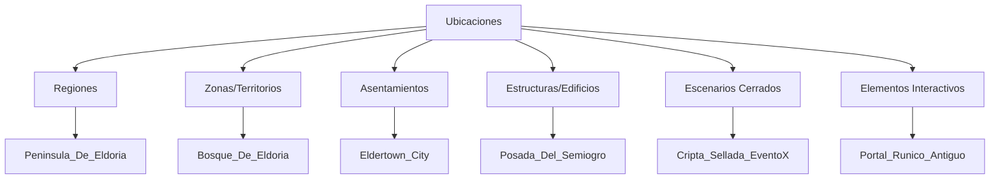

# 🗺️ Mapa de Entidades - Ubicaciones del Dungeon Life Ecosystem

## 🎯 Propósito

Este mapa permite a la IA navegar eficientemente por toda la información relacionada con **ubicaciones** en el Dungeon Life Ecosystem, basado en el análisis detallado del archivo `02_SourceArt/01_Entities/Locations_And_Environments/Locations_and_environments.txt.txt` y la estructura real de ubicaciones existente.

## 🏗️ Jerarquía Geográfica de Ubicaciones

### Niveles de Organización Territorial



### Especificaciones por Nivel Jerárquico

#### 🌍 Nivel 1: Regiones (Regions)
**Descripción:** Assets de gran escala que definen regiones enteras

```yaml
regiones:
  descripcion: "Áreas geográficas amplias con identidad propia"
  ejemplos: "Peninsula_De_Eldoria", "Montanas_Gelidas"
  ubicacion_assets: "02_ContentAssets/01_Entities/Locations_And_Environments/Regions/[Nombre]/"
  contenido_tipico:
    - "00_ConceptArt/": "Mapas conceptuales de la región, moodboards regionales"
    - "01_NativeSourceFiles/WorldMap_Assets/": "Texturas para mapas de mundo, modelos de hitos lejanos"
    - "02_ExportedGameReady/WorldMap/": "Assets de mapa exportados"
  escala: "Muy alta - afecta múltiples zonas"
  reutilizacion: "Baja - específica de cada región"
```

#### 🏞️ Nivel 2: Zonas/Territorios (Zones_Or_Territories)
**Descripción:** Áreas con biomas específicos que definen colecciones de assets

```yaml
zonas_territorios:
  descripcion: "Biomas y territorios con características ambientales únicas"
  ejemplos: "Bosque_De_Eldoria", "Desierto_De_Fuego", "Montanas_Gelidas"
  ubicacion_assets: "02_ContentAssets/01_Entities/Locations_And_Environments/Zones_Or_Territories/[Nombre]/"
  contenido_tipico:
    - "00_ConceptArt/": "Conceptos del bioma, paletas de colores, flora/fauna típica"
    - "01_NativeSourceFiles/":
      - "Flora_Forest/": "Árboles, arbustos, plantas específicas del bioma"
      - "Rocks_And_Terrain_[Bioma]/": "Rocas, elementos de terreno, texturas de suelo"
      - "Ambient_Creatures_[Bioma]/": "Pequeñas criaturas ambientales"
    - "02_ExportedGameReady/":
      - "Flora/": "Vegetación para sistema de foliage"
      - "Rocks/": "Elementos de terreno"
  escala: "Alta - reutilizable dentro del bioma"
  reutilizacion: "Alta - assets compartidos dentro del bioma"
```

#### 🏘️ Nivel 3: Asentamientos (Settlements)
**Descripción:** Ciudades, pueblos, aldeas con arquitectura característica

```yaml
asentamientos:
  descripcion: "Poblaciones organizadas con arquitectura y cultura específica"
  ejemplos: "Eldertown_City", "Puerto_Enano_Town", "Aldea_Forestal"
  ubicacion_assets: "02_ContentAssets/01_Entities/Locations_And_Environments/Settlements/[Nombre]/"
  contenido_tipico:
    - "00_ConceptArt/": "Vistas de la ciudad, diseños arquitectónicos clave"
    - "01_NativeSourceFiles/":
      - "Architecture_[Nombre]/": "Kits modulares de edificios específicos"
      - "Props_Urban_[Nombre]/": "Props únicos del asentamiento"
      - "Decals_And_Signage_[Nombre]/": "Texturas para detalles ambientales"
    - "02_ExportedGameReady/":
      - "Architecture/": "Meshes modulares listos para Unreal"
      - "Props_Urban/": "Props optimizados"
      - "Decals/": "Texturas para detalles ambientales"
  escala: "Media - específica del asentamiento pero reutilizable"
  reutilizacion: "Media - arquitectura similar entre asentamientos del mismo estilo"
```

#### 🏛️ Nivel 4: Estructuras/Edificios (Structures_And_Buildings)
**Descripción:** Edificios individuales importantes con identidad propia

```yaml
estructuras_edificios:
  descripcion: "Construcciones específicas con propósito y diseño único"
  ejemplos: "Posada_Del_Semiogro", "Torre_Del_Mago_Gris", "Templo_Antiguo"
  ubicacion_assets: "02_ContentAssets/01_Entities/Locations_And_Environments/Structures_And_Buildings/[Nombre]/"
  contenido_tipico:
    - "00_ConceptArt/": "Diseño interior y exterior específico"
    - "01_NativeSourceFiles/":
      - "Exterior_Model_[Nombre].blend": "Modelo exterior del edificio"
      - "Interior_Kit_[Nombre]/": "Módulos para interiores"
      - "Props_[Nombre]/": "Objetos específicos del lugar"
    - "02_ExportedGameReady/":
      - "Exterior/": "Modelo exterior optimizado"
      - "Interior_Modules/": "Kits interiores para Unreal"
      - "Props_[Nombre]/": "Props específicos"
  escala: "Baja - específica del edificio"
  reutilizacion: "Baja - diseño único por edificio"
```

#### 🚪 Nivel 5: Escenarios Cerrados (Closed_Scenarios_And_Rooms)
**Descripción:** Espacios interiores pequeños y autocontenidos

```yaml
escenarios_cerrados:
  descripcion: "Habitaciones o áreas pequeñas para eventos específicos"
  ejemplos: "Cripta_Sellada_EventoX", "Cuarto_Alquimista_NPC_Z", "Sala_Del_Tesoro"
  ubicacion_assets: "02_ContentAssets/01_Entities/Locations_And_Environments/Closed_Scenarios_And_Rooms/[Nombre]/"
  contenido_tipico:
    - "00_ConceptArt/": "Diseño del espacio contenido"
    - "01_NativeSourceFiles/":
      - "Modular_[Nombre]_Pieces/": "Piezas modulares para construir el escenario"
      - "Props_[Nombre]/": "Objetos específicos del escenario"
    - "02_ExportedGameReady/":
      - "Modules/": "Piezas modulares listas para Unreal"
      - "Props/": "Props específicos del escenario"
  escala: "Muy baja - específica del escenario"
  reutilizacion: "Variable - algunos módulos pueden reutilizarse"
```

#### ✨ Nivel 6: Elementos Interactivos (Interactive_Elements_And_Landmarks)
**Descripción:** Puntos de interés y elementos interactivos específicos

```yaml
elementos_interactivos:
  descripcion: "Landmarks y elementos interactivos singulares"
  ejemplos: "Portal_Runico_Antiguo", "Altar_Abandonado_En_Bosque", "Estatua_Misteriosa"
  ubicacion_assets: "02_ContentAssets/01_Entities/Locations_And_Environments/Interactive_Elements_And_Landmarks/[Nombre]/"
  contenido_tipico:
    - "00_ConceptArt/": "Diseño del elemento interactivo"
    - "01_NativeSourceFiles/":
      - "[Nombre]Model_[Tipo].blend": "Modelo fuente del elemento"
    - "02_ExportedGameReady/":
      - "Meshes/": "Modelo optimizado para interacción"
  escala: "Mínima - elemento único"
  reutilizacion: "Muy baja - generalmente único"
```

## 🧠 Algoritmos de Navegación por Ubicaciones

### Consulta de Información de Ubicación

```python
def get_location_information(location_name, information_type=None):
    """Obtener información completa de una ubicación"""

    # 1. Determinar nivel jerárquico de la ubicación
    location_hierarchy = determine_location_hierarchy(location_name)

    # 2. Construir rutas según jerarquía
    if location_hierarchy == "region":
        base_path = "02_ContentAssets/01_Entities/Locations_And_Environments/Regions/"
    elif location_hierarchy == "zone":
        base_path = "02_ContentAssets/01_Entities/Locations_And_Environments/Zones_Or_Territories/"
    elif location_hierarchy == "settlement":
        base_path = "02_ContentAssets/01_Entities/Locations_And_Environments/Settlements/"
    elif location_hierarchy == "structure":
        base_path = "02_ContentAssets/01_Entities/Locations_And_Environments/Structures_And_Buildings/"
    elif location_hierarchy == "scenario":
        base_path = "02_ContentAssets/01_Entities/Locations_And_Environments/Closed_Scenarios_And_Rooms/"
    else:  # interactive_element
        base_path = "02_ContentAssets/01_Entities/Locations_And_Environments/Interactive_Elements_And_Landmarks/"

    # 3. Construir rutas específicas
    location_routes = {
        "documentacion": f"02_Entidades/ELOC_{location_name}.md",
        "assets": f"{base_path}{location_name}/",
        "codigo": f"01_SourceCode/DungeonLifeSuite/backend/app/models/location_{location_name.lower()}.py",
        "datos": f"03_Data/Datasets/TrainingDatasets/NarrativeDatasets/WorldBuilding/{location_name}/",
        "relaciones": f"02_Entidades/REL_LOC_{location_name}.md"
    }

    # 4. Filtrar por tipo de información si especificado
    if information_type == "visual":
        return {
            "concept_art": f"{location_routes['assets']}00_ConceptArt/",
            "modelos_3d": f"{location_routes['assets']}02_ExportedGameReady/",
            "texturas": f"{location_routes['assets']}02_ExportedGameReady/"
        }
    elif information_type == "arquitectura":
        return {
            "modelos_exterior": f"{location_routes['assets']}01_NativeSourceFiles/Exterior_Model_*.blend",
            "kits_interior": f"{location_routes['assets']}01_NativeSourceFiles/Interior_Kit_*/",
            "meshes_listos": f"{location_routes['assets']}02_ExportedGameReady/Exterior/"
        }

    return location_routes
```

### Creación de Nueva Ubicación

```python
def create_location_structure(location_name, location_type, properties):
    """Crear estructura completa para nueva ubicación"""

    # 1. Determinar nivel jerárquico y carpeta correspondiente
    hierarchy_folders = {
        "region": "Regions",
        "zone": "Zones_Or_Territories",
        "settlement": "Settlements",
        "structure": "Structures_And_Buildings",
        "scenario": "Closed_Scenarios_And_Rooms",
        "interactive": "Interactive_Elements_And_Landmarks"
    }

    location_folder = hierarchy_folders.get(location_type, "Structures_And_Buildings")

    # 2. Crear estructura de documentación
    docs_structure = [
        f"02_Entidades/ELOC_{location_name}.md",
        f"02_Entidades/REL_LOC_{location_name}.md"
    ]

    # 3. Crear estructura de assets
    assets_base = f"02_ContentAssets/01_Entities/Locations_And_Environments/{location_folder}/{location_name}/"

    # 4. Determinar estructura específica según tipo
    if location_type in ["region", "zone"]:
        assets_subfolders = [
            f"{assets_base}00_ConceptArt/",
            f"{assets_base}01_NativeSourceFiles/WorldMap_Assets/",
            f"{assets_base}02_ExportedGameReady/WorldMap/"
        ]
    elif location_type == "settlement":
        assets_subfolders = [
            f"{assets_base}00_ConceptArt/",
            f"{assets_base}01_NativeSourceFiles/Architecture_{location_name}/",
            f"{assets_base}01_NativeSourceFiles/Props_Urban_{location_name}/",
            f"{assets_base}02_ExportedGameReady/Architecture/",
            f"{assets_base}02_ExportedGameReady/Props_Urban/"
        ]
    elif location_type == "structure":
        assets_subfolders = [
            f"{assets_base}00_ConceptArt/",
            f"{assets_base}01_NativeSourceFiles/Exterior_Model_{location_name}.blend",
            f"{assets_base}01_NativeSourceFiles/Interior_Kit_{location_name}/",
            f"{assets_base}01_NativeSourceFiles/Props_{location_name}/",
            f"{assets_base}02_ExportedGameReady/Exterior/",
            f"{assets_base}02_ExportedGameReady/Interior_Modules/",
            f"{assets_base}02_ExportedGameReady/Props_{location_name}/"
        ]
    else:  # scenario o interactive
        assets_subfolders = [
            f"{assets_base}00_ConceptArt/",
            f"{assets_base}01_NativeSourceFiles/Modular_{location_name}_Pieces/",
            f"{assets_base}02_ExportedGameReady/Modules/"
        ]

    return {
        "tipo_ubicacion": location_type,
        "carpeta_jerarquia": location_folder,
        "documentacion": docs_structure,
        "carpeta_assets": assets_base,
        "subcarpetas_assets": assets_subfolders,
        "archivos_requeridos": get_required_files_for_location(location_name, location_type),
        "siguiente_paso": "Crear concept art inicial de la ubicación"
    }
```

## 🎯 Ejemplos Prácticos de Navegación

### Consulta: "Estado completo de la ubicación Eldertown"

```markdown
**Ruta de navegación basada en estructura real:**

1. **📖 Documentación Principal**:
   - Ubicación: `02_Entidades/ELOC_Eldertown.md`
   - Información FES completa de la ubicación
   - Características geográficas, historia, habitantes

2. **🤝 Relaciones de la Ubicación**:
   - Ubicación: `02_Entidades/REL_LOC_Eldertown.md`
   - Conexiones con otras ubicaciones
   - Relaciones con personajes y facciones

3. **🎨 Assets de Ciudad**:
   - **Concept Art**: `02_ContentAssets/01_Entities/Locations_And_Environments/Settlements/Eldertown_City/00_ConceptArt/`
     - Vistas generales de la ciudad
     - Diseños arquitectónicos clave
   - **Archivos Fuente**:
     - Arquitectura: `01_NativeSourceFiles/Architecture_Eldertown/`
       - `House_Kit_A/`: Kits modulares de edificios
       - `Wall_City_Segment.blend`: Segmentos de muralla
     - Props urbanos: `01_NativeSourceFiles/Props_Urban_Eldertown/`
       - `StreetLamp_StyleEldertown.spp`: Farolas específicas
     - Señalización: `01_NativeSourceFiles/Decals_And_Signage_Eldertown/`
   - **Assets Game-Ready**:
     - Arquitectura: `02_ExportedGameReady/Architecture/`
       - Meshes modulares listos para construcción en Unreal
     - Props urbanos: `02_ExportedGameReady/Props_Urban/`
     - Detalles ambientales: `02_ExportedGameReady/Decals/`

4. **💻 Implementación Técnica**:
   - Modelo datos: `01_SourceCode/DungeonLifeSuite/backend/app/models/location_eldertown.py`
   - Servicios: `01_SourceCode/DungeonLifeSuite/backend/app/services/location_service.py`

5. **📊 Datasets de Entrenamiento**:
   - Descripciones: `03_Data/Datasets/TrainingDatasets/NarrativeDatasets/WorldBuilding/Eldertown/LocationDescriptions/`
   - Geografía: `03_Data/Datasets/TrainingDatasets/NarrativeDatasets/WorldBuilding/Eldertown/GeographyData/`
   - Atmósfera: `03_Data/Datasets/TrainingDatasets/NarrativeDatasets/WorldBuilding/Eldertown/AtmosphereData/`

6. **🔗 Conexiones con Entidades**:
   - Personajes residentes: `02_Entidades/REL_CHAR_*_Eldertown.md`
   - Quests en ubicación: `02_Entidades/EQUE_*_Eldertown.md`
   - Facciones presentes: `02_Entidades/EFAC_*_Eldertown.md`
```

### Consulta: "Crear nueva ubicación Bosque Encantado como zona"

```markdown
**Ruta de creación basada en estructura real:**

1. **📝 Crear Documentación**:
   - Documento FES: `02_Entidades/ELOC_Bosque_Encantado.md`
   - Relaciones: `02_Entidades/REL_LOC_Bosque_Encantado.md`

2. **🎨 Crear Estructura de Assets**:
   - **Carpeta base**: `02_ContentAssets/01_Entities/Locations_And_Environments/Zones_Or_Territories/Bosque_Encantado/`
   - **Concept Art**: `00_ConceptArt/Bosque_Encantado_Moodboard.png`
   - **Archivos Fuente**:
     - Flora: `01_NativeSourceFiles/Flora_Forest/OakTree_BosqueEncantado/`
     - Terreno: `01_NativeSourceFiles/Rocks_And_Terrain_Forest/`
     - Criaturas: `01_NativeSourceFiles/Ambient_Creatures_Forest/`
   - **Assets Game-Ready**:
     - Vegetación: `02_ExportedGameReady/Flora/`
     - Elementos terreno: `02_ExportedGameReady/Rocks/`

3. **💻 Crear Modelo de Datos**:
   - Archivo: `01_SourceCode/DungeonLifeSuite/backend/app/models/location_bosque_encantado.py`

4. **📚 Crear Datasets de Entrenamiento**:
   - Carpeta base: `03_Data/Datasets/TrainingDatasets/NarrativeDatasets/WorldBuilding/Bosque_Encantado/`
   - Descripciones: `LocationDescriptions/Bosque_Encantado_Desc.json`
   - Geografía: `GeographyData/Bosque_Encantado_Geo.json`
   - Atmósfera: `AtmosphereData/Bosque_Encantado_Atmo.json`

5. **🔗 Crear Conexiones**:
   - Relacionar con regiones adyacentes
   - Conectar con personajes que habitan el bosque
   - Vincular con quests que ocurren en la zona

6. **✅ Validación Final**:
   - Verificar coherencia con bioma forestal
   - Validar reutilización de assets estándar de bosque
   - Confirmar integración con sistema de zonas
```

## 📋 Organización por Características Ambientales

### Por Bioma Ambiental

```yaml
ubicaciones_por_bioma:
  bosques:
    descripcion: "Ubicaciones con características forestales"
    ejemplos: "Bosque_De_Eldoria", "Bosque_Encantado"
    assets_caracteristicos:
      - "Flora_Forest/": "Árboles, arbustos, plantas forestales"
      - "Rocks_And_Terrain_Forest/": "Rocas cubiertas de musgo, suelo forestal"
      - "Ambient_Creatures_Forest/": "Animales y criaturas forestales"
    atmosfera: "Oscura, misteriosa, viva"

  desiertos:
    descripcion: "Ubicaciones con características desérticas"
    ejemplos: "Desierto_De_Fuego", "Dunas_Arenosas"
    assets_caracteristicos:
      - "Rocks_And_Terrain_Desert/": "Arena, rocas desérticas"
      - "Flora_Desert/": "Plantas desérticas resistentes"
    atmosfera: "Árida, calurosa, hostil"

  montanas:
    descripcion: "Ubicaciones con características montañosas"
    ejemplos: "Montanas_Gelidas", "Picos_Altivos"
    assets_caracteristicos:
      - "Rocks_And_Terrain_Mountain/": "Rocas montañosas, nieve, hielo"
      - "Flora_Mountain/": "Vegetación de alta montaña"
    atmosfera: "Fría, imponente, aislada"

  urbanos:
    descripcion: "Ubicaciones con características urbanas"
    ejemplos: "Eldertown_City", "Puerto_Enano_Town"
    assets_caracteristicos:
      - "Architecture_[Ciudad]/": "Kits arquitectónicos específicos"
      - "Props_Urban_[Ciudad]/": "Mobiliario urbano característico"
      - "Decals_And_Signage_[Ciudad]/": "Señalización y detalles urbanos"
    atmosfera: "Civilizada, bulliciosa, organizada"
```

### Por Función Ludica

```yaml
ubicaciones_por_funcion:
  exploracion:
    descripcion: "Ubicaciones diseñadas para exploración libre"
    ejemplos: "Bosque_De_Eldoria", "Montanas_Gelidas"
    caracteristicas: "Mundo abierto, múltiples caminos, descubrimientos"

  combate:
    descripcion: "Ubicaciones diseñadas para encuentros de combate"
    ejemplos: "Cripta_Sellada_EventoX", "Arena_De_Duelos"
    caracteristicas: "Espacios cerrados, enemigos específicos, objetivos claros"

  social:
    descripcion: "Ubicaciones diseñadas para interacción social"
    ejemplos: "Posada_Del_Semiogro", "Plaza_Central_Eldertown"
    caracteristicas: "NPCs amigables, diálogos, comercio"

  narrativa:
    descripcion: "Ubicaciones diseñadas para avanzar la historia"
    ejemplos: "Templo_Antiguo", "Portal_Runico_Antiguo"
    caracteristicas: "Eventos scripted, cinemáticas, puntos de decisión"

  hub:
    descripcion: "Ubicaciones centrales que conectan otras áreas"
    ejemplos: "Eldertown_City", "Encrucijada_De_Caminos"
    caracteristicas: "Múltiples salidas, servicios, punto de retorno"
```

## 🔗 Sistema de Referencias Cruzadas

### Relaciones entre Ubicaciones

```yaml
sistema_relaciones_ubicaciones:
  tipos_conexion:
    geografica_adyacente:
      descripcion: "Ubicaciones físicamente cercanas"
      ejemplos: "Bosque_De_Eldoria → Eldertown_City (frontera directa)"
      navegacion: "Caminos visibles, transiciones naturales"

    conexion_magica:
      descripcion: "Ubicaciones conectadas por magia o portales"
      ejemplos: "Portal_Runico_Antiguo → Dimension_Pocket"
      navegacion: "Teletransportación, portales activables"

    conexion_narrativa:
      descripcion: "Ubicaciones conectadas por historia o quests"
      ejemplos: "Cripta_Sellada_EventoX → Templo_Antiguo (historia compartida)"
      navegacion: "A través de quests, no conexión física directa"

  elementos_conexion:
    caminos_fisicos:
      descripcion: "Caminos visibles entre ubicaciones"
      assets: "Caminos modelados, puentes, senderos"

    portales_magicos:
      descripcion: "Portales que conectan ubicaciones distantes"
      assets: "Estructuras portal, efectos visuales"

    transportes:
      descripcion: "Medios de transporte entre ubicaciones"
      assets: "Carretas, barcos, monturas"
```

## 📋 Validación y Mantenimiento

### Criterios de Completitud para Ubicaciones

- ✅ **Documentación FES completa** con propiedades geográficas y ambientales
- ✅ **Assets básicos** según nivel jerárquico (concept art, modelos principales)
- ✅ **Implementación técnica** en código backend
- ✅ **Datasets de entrenamiento** para descripciones ambientales
- ✅ **Sistema de conexiones** con otras ubicaciones

### Mantenimiento de Ubicaciones

- 🔄 **Actualización periódica** de documentación según cambios ambientales
- 🔄 **Optimización continua** de assets según performance requerida
- 🔄 **Expansión de conexiones** según nuevas ubicaciones agregadas
- 🔄 **Validación de referencias** cruzadas con entidades relacionadas

---

**Este mapa de entidades ubicaciones evoluciona con el proyecto. Última actualización basada en análisis detallado del archivo `02_SourceArt/01_Entities/Locations_And_Environments/Locations_and_environments.txt.txt` y estructura real de ubicaciones existente.**