# 🎒 Mapa de Entidades - Items del Dungeon Life Ecosystem

## 🎯 Propósito

Este mapa permite a la IA navegar eficientemente por toda la información relacionada con **items y objetos** en el Dungeon Life Ecosystem, basado en el análisis detallado del archivo `02_SourceArt/01_Entities/Items_And_Equipment/items.txt.txt` y la estructura real de items existente.

## 🏗️ Organización por Categoría Funcional

### Jerarquía de Items por Función

```mermaid
graph TB
    A[Items] --> B[Weapons]
    A --> C[Armor_And_Clothing]
    A --> D[Consumables]
    A --> E[Key_Items]
    A --> F[Crafting_Resources]
    A --> G[Accessories]
    A --> H[Books_Documents]

    B --> I[Melee]
    B --> J[Ranged]
    B --> K[Magical_Implements]

    C --> L[ArmorSets_Heavy]
    C --> M[ArmorSets_Medium]
    C --> N[ArmorSets_Light]
    C --> O[Shields]
    C --> P[Civilian_Clothing]

    D --> Q[Potions]
    D --> R[Food_Drink]
    D --> S[Scrolls_Glyphs]
    D --> T[Poisons_Grenades]

    E --> U[Quest_Specific]
    E --> V[Puzzle_Components]
    E --> W[Narrative_Triggers]

    F --> X[Ores_Ingots]
    F --> Y[Leathers_Hides]
    F --> Z[Herbs_Plants]
    F --> AA[Gemstones]
    F --> AB[Monster_Parts]

    G --> AC[Rings]
    G --> AD[Amulets]
    G --> AE[Capes_Cloaks]
    G --> AF[Trinkets]

    H --> AG[Lore_Books]
    H --> AH[Notes_Letters]
    H --> AI[Maps]
```



### Especificaciones por Categoría Funcional

#### ⚔️ Armas (Weapons)

```yaml
armas:
  descripcion: "Objetos diseñados para combate y daño"
  ubicacion_base: "02_ContentAssets/01_Entities/Items_And_Equipment/Weapons/"
  subcategorias:
    melee:
      descripcion: "Armas de combate cuerpo a cuerpo"
      ejemplos: "EspadaLarga_Hierro_Comun", "HachaCombate_Orco_PocoComun"
      estructura: "Melee/[Tipo]/[Nombre_Item]/"
      assets_tipicos:
        - "00_ConceptArt/[Nombre]_Weapon_Concept.png"
        - "01_NativeSourceFiles/Modeling/[Nombre]_Model.blend"
        - "02_ExportedGameReady/Meshes/SM_[Nombre].fbx"
        - "02_ExportedGameReady/Textures/T_[Nombre]_BC.png"
        - "05_2D/[Nombre]_Icon.png"

    ranged:
      descripcion: "Armas de combate a distancia"
      ejemplos: "ArcoLargo_Elfico_Raro_Fuego"
      estructura: "Ranged/[Tipo]/[Nombre_Item]/"
      assets_tipicos:
        - "Modelo con animaciones de disparo"
        - "Proyectiles si aplica"
        - "Efectos visuales de impacto"

    magical_implements:
      descripcion: "Armas mágicas y objetos de poder"
      ejemplos: "Baculo_Archimago_Legendario_Eter"
      estructura: "Magical_Implements/[Tipo]/[Nombre_Item]/"
      assets_tipicos:
        - "Efectos visuales mágicos"
        - "Partículas y animaciones especiales"
        - "Audio de magia"

  convenciones_nomenclatura:
    formato: "TipoBase_MaterialDescriptor_Rareza_EfectoElementalOPrincipal"
    ejemplos:
      - "EspadaLarga_AceroElfico_Epica_FiloArdiente"
      - "ArcoLargo_Elfico_Raro_Fuego"
      - "Baculo_Archimago_Legendario_Eter"
```

#### 🛡️ Armaduras y Ropa (Armor_And_Clothing)

```yaml
armaduras_ropa:
  descripcion: "Objetos diseñados para protección y apariencia"
  ubicacion_base: "02_ContentAssets/01_Entities/Items_And_Equipment/Armor_And_Clothing/"
  tipos:
    armor_sets_heavy:
      descripcion: "Armaduras pesadas metálicas"
      ejemplos: "PlateArmor_KnightsOfSol_FullSet_Epico"
      estructura: "[Tipo]/[Nombre_Set]/Helmet/", "[Tipo]/[Nombre_Set]/Chestpiece/"
      assets_tipicos:
        - "Múltiples piezas modulares"
        - "Texturas metálicas PBR"
        - "Física de armadura pesada"

    armor_sets_medium:
      descripcion: "Armaduras medias (cuero, malla)"
      ejemplos: "LeatherArmor_Ranger_FullSet_Raro"
      estructura: "[Tipo]/[Nombre_Set]/[Pieza]/"
      assets_tipicos:
        - "Materiales flexibles"
        - "Texturas de cuero y tela"
        - "Física de movilidad media"

    armor_sets_light:
      descripcion: "Armaduras ligeras y túnicas"
      ejemplos: "Robes_Sorcerer_Apprentice_Comun"
      estructura: "[Tipo]/[Nombre_Set]/[Pieza]/"
      assets_tipicos:
        - "Telas fluidas"
        - "Efectos mágicos si aplica"
        - "Física de movilidad alta"

    shields:
      descripcion: "Escudos y protecciones"
      ejemplos: "EscudoTorre_Hierro_PocoComun"
      estructura: "Shields/[Nombre_Item]/"
      assets_tipicos:
        - "Modelo con física de bloqueo"
        - "Texturas con emblemas"

    civilian_clothing:
      descripcion: "Ropa no de combate"
      ejemplos: "Vestimenta_Mercader_Eldertown"
      estructura: "Civilian_Clothing_And_Outfits/[Nombre_Item]/"
      assets_tipicos:
        - "Modelos simples reutilizables"
        - "Texturas variadas por cultura"
```

#### 🧪 Consumibles (Consumables)

```yaml
consumibles:
  descripcion: "Objetos diseñados para uso único o limitado"
  ubicacion_base: "02_ContentAssets/01_Entities/Items_And_Equipment/Consumables/"
  tipos:
    potions:
      descripcion: "Pociones y elixires"
      ejemplos: "Pocion_Salud_Menor_Comun", "Pocion_Mana_Mayor_Rara"
      estructura: "Potions/[Nombre_Item]/"
      assets_tipicos:
        - "Modelo de botella genérico"
        - "Textura de líquido específica"
        - "Efectos visuales de consumo"
        - "Icono 2D detallado"

    food_drink:
      descripcion: "Comida y bebida"
      ejemplos: "Pan_Viajero_Comun"
      estructura: "Food_And_Drink/[Nombre_Item]/"
      assets_tipicos:
        - "Modelo 3D simple"
        - "Icono 2D apetitoso"

    scrolls_glyphs:
      descripcion: "Pergaminos y glifos mágicos"
      ejemplos: "Pergamino_BolaDeFuego_PocoComun"
      estructura: "Scrolls_And_Glyphs/[Nombre_Item]/"
      assets_tipicos:
        - "Modelo de pergamino desplegado"
        - "Efectos de magia al usar"

    poisons_grenades:
      descripcion: "Objetos ofensivos consumibles"
      ejemplos: "BombaHumo_Distraccion_Comun"
      estructura: "Poisons_And_Grenades/[Nombre_Item]/"
      assets_tipicos:
        - "Modelo con animación de lanzamiento"
        - "Efectos de área de impacto"
```

#### 🔑 Items Clave (Key_Items)

```yaml
items_clave:
  descripcion: "Objetos especiales para progresión narrativa"
  ubicacion_base: "02_ContentAssets/01_Entities/Items_And_Equipment/Key_Items/"
  tipos:
    quest_specific:
      descripcion: "Items específicos de misiones"
      ejemplos: "LlaveTemploAntiguo_MisionPrincipal03"
      estructura: "Quest_Specific_Keys/[Nombre_Item]/"
      assets_tipicos:
        - "Modelo único para la misión"
        - "Animación específica de uso"

    puzzle_components:
      descripcion: "Componentes para resolución de puzzles"
      ejemplos: "Fragmento_Orbe_PuzzleCripta"
      estructura: "Puzzle_Components/[Nombre_Item]/"
      assets_tipicos:
        - "Modelo que encaja con otros"
        - "Efectos de combinación"

    narrative_triggers:
      descripcion: "Items que disparan eventos narrativos"
      ejemplos: "DiarioAntiguo_LoreRevelador_Unico"
      estructura: "Narrative_Triggers_Physical/[Nombre_Item]/"
      assets_tipicos:
        - "Modelo de libro o documento"
        - "Animación de lectura"
```

## 🧠 Algoritmos de Navegación por Items

### Consulta de Información de Item

```python
def get_item_information(item_name, information_type=None):
    """Obtener información completa de un item"""

    # 1. Determinar categoría funcional del item
    item_category = determine_item_category(item_name)

    # 2. Construir ruta base según categoría
    category_paths = {
        "weapon": "02_ContentAssets/01_Entities/Items_And_Equipment/Weapons/",
        "armor": "02_ContentAssets/01_Entities/Items_And_Equipment/Armor_And_Clothing/",
        "consumable": "02_ContentAssets/01_Entities/Items_And_Equipment/Consumables/",
        "key_item": "02_ContentAssets/01_Entities/Items_And_Equipment/Key_Items/",
        "resource": "02_ContentAssets/01_Entities/Items_And_Equipment/Crafting_And_Misc_Resources/",
        "accessory": "02_ContentAssets/01_Entities/Items_And_Equipment/Accessories_And_Trinkets/",
        "book": "02_ContentAssets/01_Entities/Items_And_Equipment/Books_And_Documents_Readable/"
    }

    base_path = category_paths.get(item_category, "Items_And_Equipment/")

    # 3. Construir rutas específicas
    item_routes = {
        "documentacion": f"02_Entidades/EITM_{item_name}.md",
        "assets": f"{base_path}{item_name}/",
        "codigo": f"01_SourceCode/DungeonLifeSuite/backend/app/models/item_{item_name.lower()}.py",
        "datos": f"03_Data/Datasets/TrainingDatasets/TechnicalDatasets/GameMechanics/{item_name}/",
        "relaciones": f"02_Entidades/REL_ITM_{item_name}.md"
    }

    # 4. Filtrar por tipo de información si especificado
    if information_type == "visual":
        return {
            "concept_art": f"{item_routes['assets']}00_ConceptArt/",
            "modelo_3d": f"{item_routes['assets']}02_ExportedGameReady/Meshes/",
            "texturas": f"{item_routes['assets']}02_ExportedGameReady/Textures/",
            "icono": f"{item_routes['assets']}05_2D/"
        }
    elif information_type == "mecanicas":
        return {
            "datos_balance": f"{item_routes['datos']}BalanceData/",
            "implementacion": item_routes["codigo"],
            "mecanicas_relacionadas": f"04_Game_Design/Bloque_2_Mecanicas_{item_name}.md"
        }

    return item_routes
```

### Creación de Nuevo Item

```python
def create_item_structure(item_name, item_category, properties):
    """Crear estructura completa para nuevo item"""

    # 1. Determinar subcarpeta según categoría
    category_folders = {
        "weapon": "Weapons",
        "armor": "Armor_And_Clothing",
        "consumable": "Consumables",
        "key_item": "Key_Items",
        "resource": "Crafting_And_Misc_Resources",
        "accessory": "Accessories_And_Trinkets",
        "book": "Books_And_Documents_Readable"
    }

    category_folder = category_folders.get(item_category, "Items_And_Equipment")

    # 2. Determinar subcategoria específica
    subcategory = determine_item_subcategory(item_name, properties)

    # 3. Crear estructura de documentación
    docs_structure = [
        f"02_Entidades/EITM_{item_name}.md",
        f"02_Entidades/REL_ITM_{item_name}.md"
    ]

    # 4. Crear estructura de assets
    assets_base = f"02_ContentAssets/01_Entities/Items_And_Equipment/{category_folder}/{subcategory}/{item_name}/"

    # 5. Estructura estándar para items
    assets_subfolders = [
        f"{assets_base}00_ConceptArt/",
        f"{assets_base}01_NativeSourceFiles/Modeling/",
        f"{assets_base}01_NativeSourceFiles/Texturing/",
        f"{assets_base}02_ExportedGameReady/Meshes/",
        f"{assets_base}02_ExportedGameReady/Textures/",
        f"{assets_base}03_FinalRenders/",
        f"{assets_base}05_2D/"
    ]

    # 6. Agregar carpetas específicas según categoría
    if item_category == "weapon":
        assets_subfolders.extend([
            f"{assets_base}02_ExportedGameReady/Animations/",
            f"{assets_base}04_Audio/"
        ])
    elif item_category == "armor" and "set" in item_name.lower():
        # Para sets de armadura, crear subcarpetas por pieza
        armor_pieces = ["Helmet", "Chestpiece", "Gauntlets", "Leggings", "Boots"]
        for piece in armor_pieces:
            assets_subfolders.append(f"{assets_base}{piece}/")

    return {
        "categoria_item": item_category,
        "subcategoria": subcategory,
        "carpeta_categoria": category_folder,
        "documentacion": docs_structure,
        "carpeta_assets": assets_base,
        "subcarpetas_assets": assets_subfolders,
        "archivos_requeridos": get_required_files_for_item(item_name, item_category),
        "siguiente_paso": "Crear concept art del item"
    }
```

## 🎯 Ejemplos Prácticos de Navegación

### Consulta: "Estado completo del item EspadaLarga_Hierro_Comun"

```markdown
**Ruta de navegación basada en estructura real:**

1. **📖 Documentación Principal**:
   - Ubicación: `02_Entidades/EITM_EspadaLarga_Hierro_Comun.md`
   - Información FES completa del arma
   - Estadísticas, historia, propiedades

2. **🤝 Relaciones del Item**:
   - Ubicación: `02_Entidades/REL_ITM_EspadaLarga_Hierro_Comun.md`
   - Conexiones con personajes que la usan
   - Relaciones con mecánicas de combate

3. **🎨 Assets del Arma**:
   - **Concept Art**: `02_ContentAssets/01_Entities/Items_And_Equipment/Weapons/Melee/Swords/EspadaLarga_Hierro_Comun/00_ConceptArt/`
     - Diseños de la espada desde múltiples ángulos
   - **Archivos Fuente**:
     - Modelado: `01_NativeSourceFiles/Modeling/EspadaLarga_Hierro_Comun_Model.blend`
     - Texturizado: `01_NativeSourceFiles/Texturing/EspadaLarga_Hierro_Comun_Textures.spp`
   - **Assets Game-Ready**:
     - Mesh: `02_ExportedGameReady/Meshes/SM_EspadaLarga_Hierro_Comun.fbx`
     - Texturas: `02_ExportedGameReady/Textures/T_EspadaLarga_Hierro_Comun_BC.png`
     - Animaciones: `02_ExportedGameReady/Animations/Anim_EspadaLarga_Attack.fbx`
   - **Renders Finales**: `03_FinalRenders/EspadaLarga_Hierro_Comun_Showcase.png`
   - **Audio**: `04_Audio/SFX_EspadaLarga_Swing.wav`
   - **Icono 2D**: `05_2D/EspadaLarga_Hierro_Comun_Icon.png`

4. **💻 Implementación Técnica**:
   - Modelo datos: `01_SourceCode/DungeonLifeSuite/backend/app/models/item_espada_larga_hierro_comun.py`
   - Balance: `04_Game_Design/Bloque_3_Sistemas_Progresion/WeaponBalance_EspadaLarga.md`

5. **📊 Datasets de Entrenamiento**:
   - Mecánicas: `03_Data/Datasets/TrainingDatasets/TechnicalDatasets/GameMechanics/EspadaLarga_Hierro_Comun/BalanceData/`
   - Uso narrativo: `03_Data/Datasets/TrainingDatasets/NarrativeDatasets/Items/EspadaLarga_Hierro_Comun/`

6. **🔗 Conexiones con Entidades**:
   - Personajes que usan: `02_Entidades/REL_CHAR_*_EspadaLarga_Hierro_Comun.md`
   - Ubicaciones donde se encuentra: `02_Entidades/REL_LOC_*_EspadaLarga_Hierro_Comun.md`
   - Quests relacionadas: `02_Entidades/EQUE_*_EspadaLarga_Hierro_Comun.md`
```

### Consulta: "Crear nuevo item Pocion_Salud_Mayor_Rara"

```markdown
**Ruta de creación basada en estructura real:**

1. **📝 Crear Documentación**:
   - Documento FES: `02_Entidades/EITM_Pocion_Salud_Mayor_Rara.md`
   - Relaciones: `02_Entidades/REL_ITM_Pocion_Salud_Mayor_Rara.md`

2. **🎨 Crear Estructura de Assets**:
   - **Carpeta base**: `02_ContentAssets/01_Entities/Items_And_Equipment/Consumables/Potions/Pocion_Salud_Mayor_Rara/`
   - **Concept Art**: `00_ConceptArt/Pocion_Salud_Mayor_Concept.png`
   - **Archivos Fuente**:
     - Modelado: `01_NativeSourceFiles/Modeling/Pocion_Bottle_Model.blend` (reutilizar modelo genérico)
     - Texturizado: `01_NativeSourceFiles/Texturing/Pocion_Salud_Mayor_Liquid.spp`
   - **Assets Game-Ready**:
     - Mesh: `02_ExportedGameReady/Meshes/SM_Pocion_Bottle.fbx` (reutilizar)
     - Texturas: `02_ExportedGameReady/Textures/T_Pocion_Salud_Mayor_Liquid.png`
     - Materiales: `02_ExportedGameReady/Materials/M_Pocion_Salud_Mayor.mat`
   - **Efectos visuales**: `02_ExportedGameReady/VFX_Sources/Pocion_Heal_Effect.png`
   - **Renders**: `03_FinalRenders/Pocion_Salud_Mayor_Catalog.png`
   - **Icono 2D**: `05_2D/Pocion_Salud_Mayor_Icon.png`

3. **💻 Crear Modelo de Datos**:
   - Archivo: `01_SourceCode/DungeonLifeSuite/backend/app/models/item_pocion_salud_mayor_rara.py`

4. **📚 Crear Datasets de Entrenamiento**:
   - Carpeta base: `03_Data/Datasets/TrainingDatasets/TechnicalDatasets/GameMechanics/Pocion_Salud_Mayor_Rara/`
   - Balance: `BalanceData/Pocion_Heal_Balance.json`
   - Efectos: `MechanicInteractions/Pocion_Heal_Effects.json`

5. **🔗 Crear Conexiones**:
   - Relacionar con sistema de salud
   - Conectar con ubicaciones donde se encuentra
   - Vincular con NPCs que la venden o crean

6. **✅ Validación Final**:
   - Verificar fórmula de curación balanceada
   - Validar efectos visuales de consumo
   - Confirmar integración con inventario
```

## 📋 Organización por Características del Item

### Por Rareza

```yaml
items_por_rareza:
  comun:
    descripcion: "Items básicos y fáciles de obtener"
    ejemplos: "EspadaLarga_Hierro_Comun", "Pocion_Salud_Menor_Comun"
    caracteristicas:
      - "Modelos simples y optimizados"
      - "Texturas básicas"
      - "Sin efectos especiales complejos"
      - "Fácil de reemplazar"

  poco_comun:
    descripcion: "Items intermedios con características especiales"
    ejemplos: "HachaCombate_Orco_PocoComun", "EscudoTorre_Hierro_PocoComun"
    caracteristicas:
      - "Modelos más detallados"
      - "Texturas con materiales específicos"
      - "Algunos efectos visuales menores"
      - "Valor intermedio en economía"

  raro:
    descripcion: "Items avanzados con propiedades únicas"
    ejemplos: "ArcoLargo_Elfico_Raro_Fuego", "Pocion_Mana_Mayor_Rara"
    caracteristicas:
      - "Modelos high-poly detallados"
      - "Texturas PBR completas"
      - "Efectos visuales notables"
      - "Valor alto en economía"
      - "Historia o lore específico"

  epico:
    descripcion: "Items excepcionales con poder significativo"
    ejemplos: "Baculo_Archimago_Legendario_Eter", "PlateArmor_KnightsOfSol_FullSet_Epico"
    caracteristicas:
      - "Modelos extremadamente detallados"
      - "Texturas y materiales premium"
      - "Efectos visuales espectaculares"
      - "Mecánicas únicas o exclusivas"
      - "Lore rico y profundo"

  legendario:
    descripcion: "Items únicos con poder extraordinario"
    ejemplos: "Espada_Maestra_De_Leyenda", "Armadura_Dios_Antiguo"
    caracteristicas:
      - "Modelos de máxima calidad"
      - "Efectos visuales cinematicos"
      - "Historia legendaria"
      - "Únicos en el juego"
```

### Por Afinidad Elemental

```yaml
items_por_elemento:
  fuego:
    descripcion: "Items con poder o temática de fuego"
    ejemplos: "ArcoLargo_Elfico_Raro_Fuego", "Espada_Flamigera_Epica"
    caracteristicas:
      - "Texturas con colores cálidos (rojo, naranja, amarillo)"
      - "Efectos de partículas de fuego"
      - "Daño de tipo fuego"
      - "Resistencia al frío"

  agua:
    descripcion: "Items con poder o temática de agua"
    ejemplos: "Tridente_Reina_Lagos_Raro", "Amuleto_Mareas_Antiguo"
    caracteristicas:
      - "Texturas con colores fríos (azul, verde agua)"
      - "Efectos de partículas líquidas"
      - "Daño de tipo agua"
      - "Resistencia al fuego"

  aire:
    descripcion: "Items con poder o temática de aire"
    ejemplos: "Arco_Viento_Celestial_Epico", "Capa_Tormentas_Legendario"
    caracteristicas:
      - "Texturas con colores claros (blanco, gris, celeste)"
      - "Efectos de partículas de viento"
      - "Daño de tipo aire"
      - "Efectos de movilidad"

  tierra:
    descripcion: "Items con poder o temática de tierra"
    ejemplos: "Martillo_Terremoto_Raro", "Armadura_Piedra_Antigua"
    caracteristicas:
      - "Texturas con colores terrosos (marrón, verde, gris)"
      - "Efectos de partículas de tierra"
      - "Daño de tipo tierra"
      - "Efectos defensivos"

  magia_pura:
    descripcion: "Items con poder mágico sin elemento específico"
    ejemplos: "Baculo_Archimago_Legendario_Eter", "Orbe_Conocimiento_Infinito"
    caracteristicas:
      - "Texturas con colores mágicos (púrpura, blanco brillante)"
      - "Efectos de partículas mágicas"
      - "Poderes versátiles"
      - "Efectos luminosos"
```

## 🔗 Sistema de Referencias Cruzadas

### Relaciones entre Items y Otras Entidades

```yaml
sistema_relaciones_items:
  items_con_personajes:
    equipamiento:
      descripcion: "Items que pueden ser equipados por personajes"
      ejemplos: "EspadaLarga_Hierro_Comun → ECH_Bromar (arma principal)"
      documentacion: "REL_CHAR_[Personaje]_Equipment.md"

    uso:
      descripcion: "Items que son usados por personajes en historia"
      ejemplos: "Pocion_Salud_Mayor_Rara → ECH_Juan (usada en combate)"
      documentacion: "REL_CHAR_[Personaje]_Items.md"

    creacion:
      descripcion: "Items creados por personajes (artesanos, alquimistas)"
      ejemplos: "Espada_Elfica_Rara → ECH_Herrero_Elfico (creador)"
      documentacion: "REL_CHAR_[Personaje]_Creations.md"

  items_con_ubicaciones:
    origen:
      descripcion: "Items que provienen de ubicaciones específicas"
      ejemplos: "LlaveTemploAntiguo_MisionPrincipal03 → ELOC_Templo_Antiguo"
      documentacion: "REL_LOC_[Ubicacion]_Items.md"

    loot:
      descripcion: "Items que se pueden encontrar en ubicaciones"
      ejemplos: "EspadaLarga_Hierro_Comun → ELOC_Cripta_Sellada_EventoX"
      documentacion: "REL_LOC_[Ubicacion]_Loot.md"

  items_con_quests:
    objetivo:
      descripcion: "Items que son objetivo de quests"
      ejemplos: "DiarioAntiguo_LoreRevelador_Unico → EQUE_Buscar_Diario_Antiguo"
      documentacion: "REL_QUE_[Quest]_Items.md"

    recompensa:
      descripcion: "Items que se obtienen como recompensa de quests"
      ejemplos: "Armadura_Heroe_Legendario → EQUE_Derrotar_Dragon_Ultimo"
      documentacion: "REL_QUE_[Quest]_Rewards.md"

    herramienta:
      descripcion: "Items necesarios para completar quests"
      ejemplos: "Llave_Magica_Rara → EQUE_Abrir_Portal_Antiguo"
      documentacion: "REL_QUE_[Quest]_Tools.md"
```

## 📋 Validación y Mantenimiento

### Criterios de Completitud para Items

- ✅ **Documentación FES completa** con todas las propiedades del item
- ✅ **Assets visuales básicos** (concept art, modelo 3D, icono)
- ✅ **Implementación técnica** en código backend
- ✅ **Balance mecánico** documentado y validado
- ✅ **Sistema de relaciones** con otras entidades

### Mantenimiento de Items

- 🔄 **Actualización periódica** de documentación según cambios de balance
- 🔄 **Optimización continua** de assets según performance
- 🔄 **Validación de economía** y progresión del item
- 🔄 **Actualización de referencias** cruzadas con entidades relacionadas

---

**Este mapa de entidades items evoluciona con el proyecto. Última actualización basada en análisis detallado del archivo `02_SourceArt/01_Entities/Items_And_Equipment/items.txt.txt` y estructura real de items existente.**