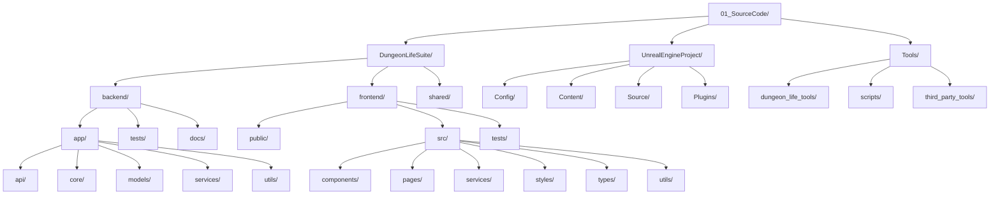

# 💻 Mapa de Código Fuente - Arquitectura Técnica del Ecosistema

## 🎯 Propósito

Este mapa permite a la IA navegar eficientemente por el **código fuente** del Dungeon Life Ecosystem, basado en el análisis de la estructura general del proyecto y las convenciones de desarrollo establecidas.

## 🏗️ Arquitectura General de Código Fuente

### Estructura Jerárquica de Código



## 📋 Organización por Componente Principal

### DungeonLifeSuite - Backend y Frontend

#### Backend (Python/FastAPI)

**Ubicación:** `01_SourceCode/DungeonLifeSuite/backend/`

```yaml
backend:
  descripcion: "API Backend desarrollada en Python con FastAPI"
  estructura_principal:
    app:
      descripcion: "Aplicación principal del backend"
      subcarpetas:
        api:
          descripcion: "Endpoints de API REST"
          ejemplos: "routers/characters.py", "routers/locations.py"
          patrones: "CRUD estándar + operaciones específicas"
        core:
          descripcion: "Lógica core del sistema"
          ejemplos: "config.py", "database.py", "security.py"
        models:
          descripcion: "Modelos de datos y entidades"
          ejemplos: "character.py", "location.py", "item.py"
          patrones: "Modelos SQLAlchemy + Pydantic"
        services:
          descripcion: "Servicios de negocio"
          ejemplos: "character_service.py", "game_service.py"
          patrones: "Lógica de negocio separada de API"
        utils:
          descripcion: "Utilidades y helpers"
          ejemplos: "helpers.py", "constants.py", "validators.py"

    tests:
      descripcion: "Tests del backend"
      tipos: "unitarios", "integración", "e2e"
      estructura: "tests/[componente]/[funcionalidad]_test.py"

    docs:
      descripcion: "Documentación específica del backend"
      ejemplos: "API_docs.md", "deployment_guide.md"

  archivos_configuracion:
    - "requirements.txt": "Dependencias Python"
    - "Dockerfile": "Configuración Docker"
    - "README.md": "Documentación del componente"

  algoritmos_navegacion:
    buscar_endpoint: |
      1. Identificar entidad relacionada (personaje, ubicación, item)
      2. Buscar en app/api/routers/[entidad].py
      3. Verificar operaciones disponibles (GET, POST, PUT, DELETE)
      4. Revisar modelos en app/models/[entidad].py
      5. Consultar servicios en app/services/[entidad]_service.py

    crear_nueva_entidad: |
      1. Crear modelo en app/models/[nueva_entidad].py
      2. Crear servicio en app/services/[nueva_entidad]_service.py
      3. Crear router en app/api/routers/[nueva_entidad].py
      4. Agregar rutas al archivo principal app/api/__init__.py
      5. Crear tests correspondientes en tests/
```

#### Frontend (React/TypeScript)

**Ubicación:** `01_SourceCode/DungeonLifeSuite/frontend/`

```yaml
frontend:
  descripcion: "Aplicación Frontend desarrollada en React con TypeScript"
  estructura_principal:
    public:
      descripcion: "Archivos públicos estáticos"
      ejemplos: "index.html", "favicon.ico", "assets/"

    src:
      descripcion: "Código fuente de la aplicación"
      subcarpetas:
        components:
          descripcion: "Componentes React reutilizables"
          ejemplos: "CharacterCard.tsx", "LocationMap.tsx"
          patrones: "Componentes funcionales con TypeScript"
        pages:
          descripcion: "Páginas de la aplicación"
          ejemplos: "CharactersPage.tsx", "GamePage.tsx"
        services:
          descripcion: "Servicios para comunicación con APIs"
          ejemplos: "apiService.ts", "characterService.ts"
        styles:
          descripcion: "Estilos y temas"
          ejemplos: "global.css", "themes/", "components/"
        types:
          descripcion: "Definiciones TypeScript"
          ejemplos: "character.ts", "location.ts", "api.ts"
        utils:
          descripcion: "Utilidades y helpers"
          ejemplos: "helpers.ts", "constants.ts"

    tests:
      descripcion: "Tests del frontend"
      tipos: "unitarios de componentes", "integración"

  archivos_configuracion:
    - "package.json": "Dependencias Node.js"
    - "tsconfig.json": "Configuración TypeScript"
    - "README.md": "Documentación del componente"

  algoritmos_navegacion:
    buscar_componente: |
      1. Identificar funcionalidad requerida
      2. Buscar componente relacionado en src/components/
      3. Verificar tipos en src/types/
      4. Revisar estilos en src/styles/
      5. Consultar servicios en src/services/

    crear_nueva_interfaz: |
      1. Definir tipos en src/types/[nueva_entidad].ts
      2. Crear servicio en src/services/[nueva_entidad]Service.ts
      3. Crear componente en src/components/[NuevaEntidad]Card.tsx
      4. Crear página si aplica en src/pages/[NuevaEntidad]Page.tsx
      5. Agregar estilos en src/styles/
```

#### Shared (Código Compartido)

**Ubicación:** `01_SourceCode/DungeonLifeSuite/shared/`

```yaml
shared:
  descripcion: "Código compartido entre backend y frontend"
  subcarpetas:
    types:
      descripcion: "Tipos comunes utilizados en ambos lados"
      ejemplos: "apiResponses.ts", "commonTypes.ts"
    constants:
      descripcion: "Constantes compartidas"
      ejemplos: "gameConstants.ts", "apiEndpoints.ts"
    utils:
      descripcion: "Utilidades compartidas"
      ejemplos: "validators.ts", "formatters.ts"
```

### UnrealEngineProject - Proyecto de Juego

**Ubicación:** `01_SourceCode/UnrealEngineProject/`

```yaml
unreal_project:
  descripcion: "Proyecto de juego desarrollado en Unreal Engine"
  estructura_principal:
    config:
      descripcion: "Configuraciones de Unreal Engine"
      archivos:
        - "DefaultEngine.ini": "Configuración del engine"
        - "DefaultGame.ini": "Configuración del juego"
        - "DefaultInput.ini": "Configuración de input"

    content:
      descripcion: "Assets del proyecto Unreal"
      subcarpetas:
        blueprints:
          descripcion: "Blueprints del juego"
          ejemplos: "Character_BP.uasset", "GameMode_BP.uasset"
        materials:
          descripcion: "Materiales del juego"
          ejemplos: "Character_Material.uasset"
        meshes:
          descripcion: "Modelos 3D"
          ejemplos: "Character_Mesh.uasset"
        textures:
          descripcion: "Texturas del juego"
          ejemplos: "Character_Texture.uasset"
        audio:
          descripcion: "Assets de audio"
          ejemplos: "Character_Sounds.uasset"
        animations:
          descripcion: "Animaciones del juego"
          ejemplos: "Character_Animations.uasset"
        maps:
          descripcion: "Mapas y niveles"
          ejemplos: "MainLevel.umap"

    source:
      descripcion: "Código C++ personalizado"
      subcarpetas:
        dungeonlife:
          descripcion: "Módulo principal del proyecto"
          archivos: "Classes/", "Private/", "Public/"
        thirdparty:
          descripcion: "Código de terceros integrado"

    plugins:
      descripcion: "Plugins de Unreal Engine"
      subcarpetas:
        dungeonlifeplugin:
          descripcion: "Plugin personalizado del proyecto"
        marketplaceplugins:
          descripcion: "Plugins comerciales adquiridos"

  algoritmos_navegacion:
    buscar_asset_unreal: |
      1. Identificar tipo de asset (blueprint, material, mesh, etc.)
      2. Buscar en Content/[Tipo_Correspondiente]/
      3. Verificar implementación en Source/ si aplica
      4. Revisar configuración en Config/

    integrar_nuevo_asset: |
      1. Importar asset desde 02_ContentAssets/02_ExportedGameReady/
      2. Crear blueprint correspondiente si aplica
      3. Configurar materiales y texturas
      4. Crear lógica de interacción si aplica
      5. Probar integración en mapa de prueba
```

### Tools - Herramientas de Desarrollo

**Ubicación:** `01_SourceCode/Tools/`

```yaml
tools:
  descripcion: "Herramientas auxiliares para desarrollo"
  estructura_principal:
    dungeon_life_tools:
      descripcion: "Herramientas específicas del proyecto"
      subcarpetas:
        asset_processor:
          descripcion: "Procesador de assets"
          ejemplos: "mesh_optimizer.py", "texture_processor.py"
        documentation_generator:
          descripcion: "Generador de documentación"
          ejemplos: "doc_generator.py", "api_docs_generator.py"
        validation_tools:
          descripcion: "Herramientas de validación"
          ejemplos: "asset_validator.py", "data_validator.py"
        integration_tools:
          descripcion: "Herramientas de integración"
          ejemplos: "unreal_importer.py", "api_tester.py"

    scripts:
      descripcion: "Scripts de utilidad"
      subcarpetas:
        build_scripts:
          descripcion: "Scripts de construcción"
          ejemplos: "build_backend.py", "build_frontend.py"
        deployment_scripts:
          descripcion: "Scripts de despliegue"
          ejemplos: "deploy_to_server.py", "docker_deploy.py"
        maintenance_scripts:
          descripcion: "Scripts de mantenimiento"
          ejemplos: "database_backup.py", "cleanup_temp_files.py"
        utility_scripts:
          descripcion: "Scripts diversos"
          ejemplos: "generate_test_data.py", "format_code.py"

    third_party_tools:
      descripcion: "Herramientas de terceros modificadas"
      subcarpetas:
        modified_tools:
          descripcion: "Herramientas modificadas para el proyecto"
        integration_wrappers:
          descripcion: "Wrappers de integración con herramientas externas"
```

## 🧠 Algoritmos de Navegación por Código

### Consulta de Implementación Técnica

```python
def find_code_implementation(entity_name, implementation_type=None):
    """Encontrar implementación técnica de una entidad"""

    # 1. Determinar rutas estándar según tipo de implementación
    implementation_routes = {
        "backend_model": f"01_SourceCode/DungeonLifeSuite/backend/app/models/{entity_name.lower()}.py",
        "backend_service": f"01_SourceCode/DungeonLifeSuite/backend/app/services/{entity_name.lower()}_service.py",
        "backend_router": f"01_SourceCode/DungeonLifeSuite/backend/app/api/routers/{entity_name.lower()}.py",
        "frontend_component": f"01_SourceCode/DungeonLifeSuite/frontend/src/components/{entity_name}Card.tsx",
        "frontend_service": f"01_SourceCode/DungeonLifeSuite/frontend/src/services/{entity_name.lower()}Service.ts",
        "frontend_page": f"01_SourceCode/DungeonLifeSuite/frontend/src/pages/{entity_name}Page.tsx",
        "unreal_blueprint": f"01_SourceCode/UnrealEngineProject/Content/Blueprints/{entity_name}_BP.uasset",
        "unreal_code": f"01_SourceCode/UnrealEngineProject/Source/DungeonLife/Classes/{entity_name}.h"
    }

    # 2. Si se especifica tipo, filtrar resultados
    if implementation_type:
        specific_route = implementation_routes.get(f"{implementation_type}_model") or \
                        implementation_routes.get(f"{implementation_type}_service") or \
                        implementation_routes.get(f"{implementation_type}_component") or \
                        implementation_routes.get(f"{implementation_type}_blueprint")
        return {
            "tipo_implementacion": implementation_type,
            "archivo_principal": specific_route,
            "archivos_relacionados": get_related_files(specific_route),
            "tests_ubicacion": get_test_location(implementation_type, entity_name)
        }

    # 3. Retornar información completa si no se especifica tipo
    return {
        "backend": {
            "modelo": implementation_routes["backend_model"],
            "servicio": implementation_routes["backend_service"],
            "router": implementation_routes["backend_router"]
        },
        "frontend": {
            "componente": implementation_routes["frontend_component"],
            "servicio": implementation_routes["frontend_service"],
            "pagina": implementation_routes["frontend_page"]
        },
        "unreal": {
            "blueprint": implementation_routes["unreal_blueprint"],
            "codigo": implementation_routes["unreal_code"]
        },
        "tests": {
            "backend": f"01_SourceCode/DungeonLifeSuite/backend/tests/test_{entity_name.lower()}.py",
            "frontend": f"01_SourceCode/DungeonLifeSuite/frontend/tests/{entity_name}.test.tsx"
        }
    }
```

### Creación de Nueva Implementación

```python
def create_code_structure(entity_name, entity_type, implementation_requirements):
    """Crear estructura de código para nueva entidad"""

    # 1. Crear modelos de backend
    backend_files = [
        f"01_SourceCode/DungeonLifeSuite/backend/app/models/{entity_name.lower()}.py",
        f"01_SourceCode/DungeonLifeSuite/backend/app/services/{entity_name.lower()}_service.py",
        f"01_SourceCode/DungeonLifeSuite/backend/app/api/routers/{entity_name.lower()}.py"
    ]

    # 2. Crear componentes de frontend
    frontend_files = [
        f"01_SourceCode/DungeonLifeSuite/frontend/src/types/{entity_name.lower()}.ts",
        f"01_SourceCode/DungeonLifeSuite/frontend/src/services/{entity_name.lower()}Service.ts",
        f"01_SourceCode/DungeonLifeSuite/frontend/src/components/{entity_name}Card.tsx",
        f"01_SourceCode/DungeonLifeSuite/frontend/src/pages/{entity_name}Page.tsx"
    ]

    # 3. Crear assets de Unreal si aplica
    unreal_files = []
    if implementation_requirements.get("unreal_integration"):
        unreal_files = [
            f"01_SourceCode/UnrealEngineProject/Content/Blueprints/{entity_name}_BP.uasset",
            f"01_SourceCode/UnrealEngineProject/Source/DungeonLife/Classes/{entity_name}.h",
            f"01_SourceCode/UnrealEngineProject/Source/DungeonLife/Private/{entity_name}.cpp"
        ]

    # 4. Crear tests correspondientes
    test_files = [
        f"01_SourceCode/DungeonLifeSuite/backend/tests/test_{entity_name.lower()}.py",
        f"01_SourceCode/DungeonLifeSuite/frontend/tests/{entity_name}.test.tsx"
    ]

    return {
        "backend": backend_files,
        "frontend": frontend_files,
        "unreal": unreal_files,
        "tests": test_files,
        "archivos_requeridos": get_required_code_files(entity_name, entity_type),
        "siguiente_paso": "Implementar modelo de datos en backend"
    }
```

## 🎯 Ejemplos Prácticos de Navegación

### Consulta: "Implementación técnica del personaje Bromar"

```markdown
**Ruta de navegación basada en estructura real:**

1. **💻 Backend (Python/FastAPI)**:
   - **Modelo de datos**: `01_SourceCode/DungeonLifeSuite/backend/app/models/character_bromar.py`
     - Definición de esquema de personaje
     - Relaciones con otras entidades
   - **Servicio de negocio**: `01_SourceCode/DungeonLifeSuite/backend/app/services/character_bromar_service.py`
     - Lógica específica de personaje
     - Operaciones CRUD especializadas
   - **API Router**: `01_SourceCode/DungeonLifeSuite/backend/app/api/routers/character_bromar.py`
     - Endpoints específicos: `/api/v1/characters/bromar/`
     - Operaciones: GET, PUT, DELETE específicas

2. **🎨 Frontend (React/TypeScript)**:
   - **Tipos**: `01_SourceCode/DungeonLifeSuite/frontend/src/types/character_bromar.ts`
     - Interfaces TypeScript específicas
   - **Servicio API**: `01_SourceCode/DungeonLifeSuite/frontend/src/services/characterBromarService.ts`
     - Comunicación con backend
   - **Componente**: `01_SourceCode/DungeonLifeSuite/frontend/src/components/CharacterBromarCard.tsx`
     - Visualización específica del personaje
   - **Página**: `01_SourceCode/DungeonLifeSuite/frontend/src/pages/CharacterBromarPage.tsx`
     - Página dedicada si aplica

3. **🎮 Unreal Engine**:
   - **Blueprint**: `01_SourceCode/UnrealEngineProject/Content/Blueprints/Character_Bromar_BP.uasset`
     - Lógica de personaje en juego
   - **Código C++**: `01_SourceCode/UnrealEngineProject/Source/DungeonLife/Classes/Character_Bromar.h/.cpp`
     - Implementación nativa si requiere performance

4. **🧪 Tests**:
   - **Backend**: `01_SourceCode/DungeonLifeSuite/backend/tests/test_character_bromar.py`
   - **Frontend**: `01_SourceCode/DungeonLifeSuite/frontend/tests/CharacterBromar.test.tsx`

5. **🔗 Integración con Assets**:
   - Modelos 3D importados desde `02_ContentAssets/01_Entities/Characters/Bromar/02_ExportedGameReady/`
   - Texturas aplicadas automáticamente
   - Animaciones configuradas en blueprint
```

### Consulta: "Crear implementación técnica para nueva ubicación Eldoria"

```markdown
**Ruta de creación basada en estructura real:**

1. **💻 Crear Backend**:
   - **Modelo de datos**: `01_SourceCode/DungeonLifeSuite/backend/app/models/location_eldoria.py`
     - Esquema SQLAlchemy para ubicación
     - Relaciones con personajes, items, quests
   - **Servicio de negocio**: `01_SourceCode/DungeonLifeSuite/backend/app/services/location_eldoria_service.py`
     - Lógica específica de ubicación
     - Operaciones de conexión entre áreas
   - **API Router**: `01_SourceCode/DungeonLifeSuite/backend/app/api/routers/location_eldoria.py`
     - Endpoints: `/api/v1/locations/eldoria/`
     - Operaciones específicas de ubicación

2. **🎨 Crear Frontend**:
   - **Tipos**: `01_SourceCode/DungeonLifeSuite/frontend/src/types/location_eldoria.ts`
   - **Servicio API**: `01_SourceCode/DungeonLifeSuite/frontend/src/services/locationEldoriaService.ts`
   - **Componente mapa**: `01_SourceCode/DungeonLifeSuite/frontend/src/components/LocationEldoriaMap.tsx`
   - **Página ubicación**: `01_SourceCode/DungeonLifeSuite/frontend/src/pages/LocationEldoriaPage.tsx`

3. **🎮 Crear Unreal Engine**:
   - **Blueprint mapa**: `01_SourceCode/UnrealEngineProject/Content/Blueprints/Location_Eldoria_BP.uasset`
   - **Código C++**: `01_SourceCode/UnrealEngineProject/Source/DungeonLife/Classes/Location_Eldoria.h/.cpp`
   - **Assets importados** desde `02_ContentAssets/01_Entities/Locations/Eldoria/02_ExportedGameReady/`

4. **🧪 Crear Tests**:
   - **Backend**: `01_SourceCode/DungeonLifeSuite/backend/tests/test_location_eldoria.py`
   - **Frontend**: `01_SourceCode/DungeonLifeSuite/frontend/tests/LocationEldoria.test.tsx`

5. **🔗 Crear Integraciones**:
   - Conectar con personajes que habitan Eldoria
   - Vincular con quests que ocurren en la ubicación
   - Relacionar con items encontrados en el lugar

6. **✅ Validación Final**:
   - Verificar funcionamiento de APIs
   - Probar integración frontend-backend
   - Validar importación correcta en Unreal
```

## 📋 Organización por Patrón Arquitectónico

### Arquitectura por Capas

```yaml
arquitectura_capas:
  presentacion:
    descripcion: "Capa de presentación e interfaz de usuario"
    componentes:
      frontend: "React/TypeScript components y páginas"
      unreal: "Blueprints y UI de Unreal Engine"
    responsabilidad: "Interacción con usuario y visualización"

  negocio:
    descripcion: "Capa de lógica de negocio"
    componentes:
      backend_services: "Servicios Python de lógica de negocio"
      unreal_game_logic: "Blueprints de lógica de juego"
    responsabilidad: "Reglas de negocio y procesamiento"

  datos:
    descripcion: "Capa de acceso a datos"
    componentes:
      backend_models: "Modelos SQLAlchemy y consultas"
      unreal_data_tables: "DataTables de Unreal"
    responsabilidad: "Persistencia y recuperación de datos"

  integracion:
    descripcion: "Capa de integración entre sistemas"
    componentes:
      api_routers: "Endpoints FastAPI"
      unreal_api_calls: "Comunicación con backend"
    responsabilidad: "Comunicación entre frontend, backend y Unreal"
```

### Patrones de Diseño Utilizados

```yaml
patrones_diseno:
  mvc_backend:
    descripcion: "Modelo-Vista-Controlador en backend"
    modelo: "app/models/[entidad].py"
    vista: "app/api/routers/[entidad].py (serialización)"
    controlador: "app/services/[entidad]_service.py"

  component_based_frontend:
    descripcion: "Componentes reutilizables en React"
    componentes_atomicos: "src/components/ui/[componente].tsx"
    componentes_compuestos: "src/components/[entidad]/[componente].tsx"
    servicios: "src/services/[entidad]Service.ts"

  blueprint_unreal:
    descripcion: "Blueprints modulares en Unreal"
    game_mode: "Content/Blueprints/GameMode_BP.uasset"
    player_controller: "Content/Blueprints/PlayerController_BP.uasset"
    entity_blueprints: "Content/Blueprints/[Entidad]_BP.uasset"
```

## 🔗 Sistema de Referencias Cruzadas

### Integración entre Componentes

```yaml
sistema_referencias_codigo:
  backend_frontend:
    descripcion: "Comunicación entre backend y frontend"
    tipos:
      api_calls:
        descripcion: "Llamadas API desde frontend a backend"
        ejemplos: "characterService.getCharacter() → GET /api/v1/characters/"
      data_synchronization:
        descripcion: "Sincronización de datos entre capas"
        ejemplos: "WebSocket para actualizaciones en tiempo real"

  backend_unreal:
    descripcion: "Integración entre backend y Unreal Engine"
    tipos:
      data_import:
        descripcion: "Importación de datos desde backend a Unreal"
        ejemplos: "DataTables generadas desde modelos backend"
      api_queries:
        descripcion: "Consultas desde Unreal al backend"
        ejemplos: "HTTP requests desde Blueprints"

  frontend_unreal:
    descripcion: "Comunicación entre frontend y Unreal (menos común)"
    tipos:
      save_data:
        descripcion: "Guardar datos desde Unreal en backend vía frontend"
        ejemplos: "Progreso de juego sincronizado"
```

## 📋 Validación y Mantenimiento

### Criterios de Calidad de Código

- ✅ **Separación de responsabilidades** clara entre capas
- ✅ **Tests cobertura** adecuada para cada componente
- ✅ **Documentación** de APIs y componentes públicos
- ✅ **Convenciones de nomenclatura** consistentes
- ✅ **Integración** correcta entre componentes

### Mantenimiento de Código

- 🔄 **Actualización periódica** de dependencias
- 🔄 **Refactoring** según evolución de arquitectura
- 🔄 **Optimización** de performance crítica
- 🔄 **Validación** de integración entre componentes

---

**Este mapa de código fuente evoluciona con el proyecto. Última actualización basada en análisis de estructura general del proyecto y convenciones de desarrollo establecidas.**